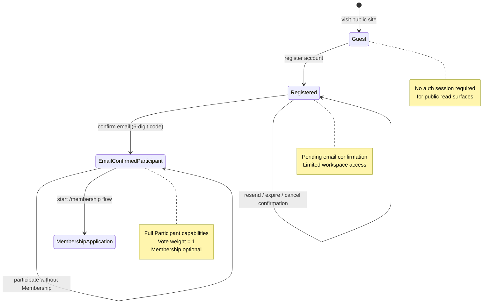
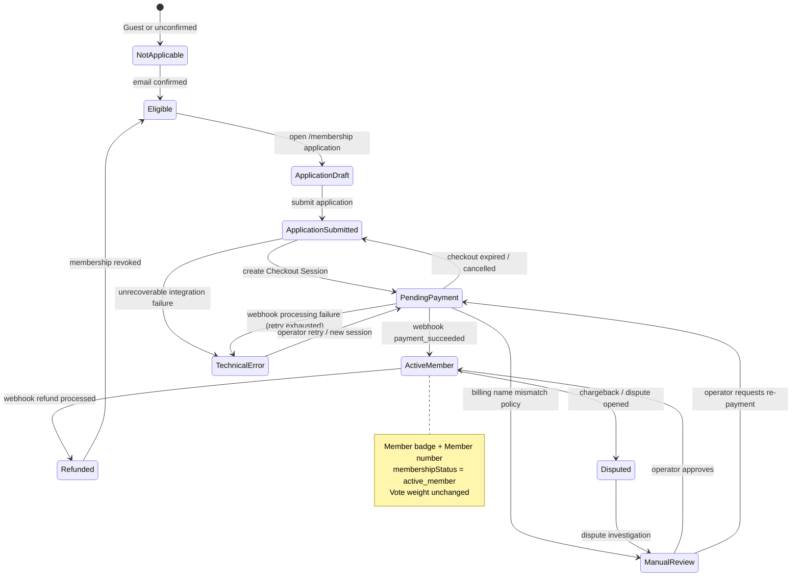
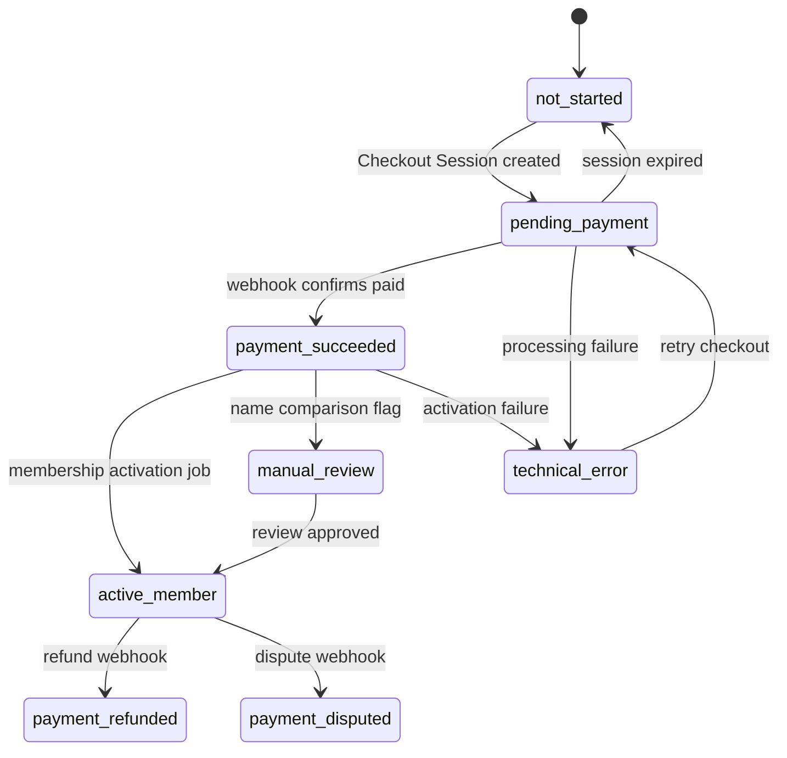

# Humanity Union Membership Architecture

Architecture and domain briefing for voluntary **Humanity Union Membership** and the one-time **Membership Contribution**. This document is the blueprint for future implementation.

**Status:** Architecture only — no Stripe SDK, no payment UI, no webhook code, no authentication changes.

---

## Mission

Humanity Union Membership is a **voluntary status** available to any **Email-Confirmed Participant**. It represents a participant who has completed the Membership process and whose one-time Membership Contribution has been successfully confirmed.

Membership is **not**:

- identity verification
- government identification
- legal citizenship proof
- KYC
- a voting privilege or vote-weight multiplier

Membership **is**:

- a civic affiliation signal chosen by the participant
- a confirmed one-time financial contribution to support platform operations
- a basis for Member badge, Member number, and statistical cohort labeling

**Membership never changes vote weight.** One account = one vote. Member and Participant votes have identical weight.

---

## Definitions

| Term                                          | Meaning                                                                                                                                                                                                                             |
| --------------------------------------------- | ----------------------------------------------------------------------------------------------------------------------------------------------------------------------------------------------------------------------------------- |
| **Guest**                                     | Unauthenticated visitor; may read public civic content per platform policy.                                                                                                                                                         |
| **Registered account**                        | Auth user created via registration; may be email-unconfirmed.                                                                                                                                                                       |
| **Participant**                               | Registered account with confirmed email (`emailVerificationStatus = verified`). Default civic participation category for voting and statistics when Membership is not active.                                                       |
| **Humanity Union Member** (Membership status) | Participant who completed Membership application, accepted conditions, and has a **confirmed** Membership Contribution. Distinct from moderator/admin roles.                                                                        |
| **Member record** (`memberId`)                | Existing civic profile entity linked to `userId`. Created at registration for all accounts. **Not** synonymous with Humanity Union Membership status — every registered user has a Member record; only some hold active Membership. |
| **Auth User** (`userId`)                      | Authentication entity: credentials, sessions, email verification, security settings. Membership does not modify auth mechanics.                                                                                                     |
| **Membership Application**                    | Lightweight intent record capturing country, terms acceptance, and application timestamps. No identity documents.                                                                                                                   |
| **Membership Contribution**                   | One-time payment record (`purpose: membership`) confirmed via Stripe webhook.                                                                                                                                                       |
| **Member Number**                             | Public-safe, immutable identifier assigned on activation (e.g. `HU-2026-7F3K92`). Not used for authentication.                                                                                                                      |
| **Support Platform contribution**             | Separate payment flow (`purpose: support_platform`); may be one-time or recurring; never activates Membership.                                                                                                                      |

### Terminology guardrails

Use **Membership**, **Member badge**, **Member number**, **Membership Contribution**.

Do **not** use Membership language for:

- registration email confirmation (see [REGISTRATION_EMAIL_CONFIRMATION.md](./REGISTRATION_EMAIL_CONFIRMATION.md))
- optional email two-step login (see [OPTIONAL_EMAIL_TWO_STEP_LOGIN.md](./OPTIONAL_EMAIL_TWO_STEP_LOGIN.md))
- identity verification or KYC (future separate capability if ever introduced)

---

## Core principles

1. Every registered account begins civic participation as a **Participant** (once email is confirmed).
2. Membership is **optional**.
3. Membership requires: confirmed email → completed application → accepted conditions → successful one-time contribution (webhook-confirmed).
4. Membership does **not** increase civic authority, vote weight, or governance power.
5. Statistics may distinguish **Members** vs **Participants** for transparency; labels must never imply weighted votes.

---

## Participant lifecycle

High-level journey from anonymous visitor to Email-Confirmed Participant. Authentication and email confirmation are **existing** capabilities; this diagram shows where Membership attaches later.



### Transition table — Participant states

| From                        | Event                       | To                              | Guards             | Side effects                                                           |
| --------------------------- | --------------------------- | ------------------------------- | ------------------ | ---------------------------------------------------------------------- |
| —                           | First visit                 | **Guest**                       | —                  | Public content only                                                    |
| Guest                       | `POST /auth/register`       | **Registered**                  | Valid registration | Auth user + Member record created; email confirmation required         |
| Registered                  | Email confirmation succeeds | **Email-Confirmed Participant** | Valid 6-digit code | `emailVerificationStatus = verified`; welcome email                    |
| Registered                  | Login before confirm        | **Registered** (pending path)   | Valid password     | Pending confirmation session; no full tokens until confirmed           |
| Email-Confirmed Participant | —                           | —                               | —                  | May vote, create initiatives, etc.; cohort = Participant in statistics |

**Out of scope for Participant lifecycle:** Membership payment, badge assignment, Member number.

---

## Membership lifecycle

Membership is a **status overlay** on an Email-Confirmed Participant, backed by application and contribution records.



### Membership status enum (domain)

| Status                  | Description                                       | Public widget label               |
| ----------------------- | ------------------------------------------------- | --------------------------------- |
| `not_applicable`        | Guest or unconfirmed email                        | — (prompt to register / confirm)  |
| `eligible`              | Confirmed email; no active application in flight  | **Participant**                   |
| `application_draft`     | Application started, not submitted                | **Participant**                   |
| `application_submitted` | Application saved; payment not started            | **Participant**                   |
| `pending_payment`       | Stripe Checkout Session created; awaiting payment | **Participant** (payment pending) |
| `manual_review`         | Operator review (name comparison or anomaly)      | **Participant** (under review)    |
| `active_member`         | Contribution confirmed; Member number assigned    | **Member**                        |
| `payment_refunded`      | Refund processed; membership revoked              | **Participant**                   |
| `payment_disputed`      | Dispute/chargeback open                           | **Participant** (disputed)        |
| `technical_error`       | Integration failure; membership not activated     | **Participant** (contact support) |

### Transition table — Membership

| From                    | Event                                              | To                      | Authority        | Notes                                                |
| ----------------------- | -------------------------------------------------- | ----------------------- | ---------------- | ---------------------------------------------------- |
| `not_applicable`        | Email confirmed                                    | `eligible`              | System           | Automatic                                            |
| `eligible`              | User opens application                             | `application_draft`     | User             | Client-side or server draft                          |
| `application_draft`     | Submit application + accept checkboxes             | `application_submitted` | User             | Store terms version                                  |
| `application_submitted` | Server creates Checkout Session                    | `pending_payment`       | System           | Store `checkoutSessionId`                            |
| `pending_payment`       | Stripe webhook `checkout.session.completed` + paid | `active_member`         | **Webhook only** | Assign Member number; never trust success page alone |
| `pending_payment`       | Session expired / user cancelled                   | `application_submitted` | System           | Allow new session                                    |
| `pending_payment`       | Name comparison → review policy                    | `manual_review`         | System           | Optional signal only                                 |
| `manual_review`         | Operator approve                                   | `active_member`         | Admin (future)   | Audit log required                                   |
| `active_member`         | Refund webhook                                     | `payment_refunded`      | Webhook          | Revoke badge; retain audit                           |
| `active_member`         | Dispute opened                                     | `payment_disputed`      | Webhook          | May suspend badge display                            |
| `*`                     | Unrecoverable error                                | `technical_error`       | System           | Alert ops; no silent activation                      |

---

## Payment lifecycle

Payment state is tracked on **MembershipContribution**, separate from Membership application status but coupled through transitions above.



### Payment status enum

| Status              | Meaning                                                                |
| ------------------- | ---------------------------------------------------------------------- |
| `not_started`       | No Checkout Session yet                                                |
| `pending_payment`   | Session open; awaiting customer completion                             |
| `payment_succeeded` | Stripe reports successful payment; activation pending or complete      |
| `manual_review`     | Held for operator review before activation                             |
| `active_member`     | Contribution linked to active Membership (mirror of membership status) |
| `payment_refunded`  | Money returned; membership revoked                                     |
| `payment_disputed`  | Chargeback/dispute in progress                                         |
| `technical_error`   | Webhook or activation error; requires intervention                     |

### Webhook as source of truth

| Source                              | May activate Membership?            |
| ----------------------------------- | ----------------------------------- |
| Stripe webhook (verified signature) | **Yes**                             |
| Checkout success redirect page      | **No** — display confirmation only  |
| Client-side JS callback             | **No**                              |
| Admin manual override               | **Yes** (future dashboard; audited) |

---

## Membership domain model

### Aggregate: Membership

Represents the participant's Membership relationship with Humanity Union.

```typescript
// Architecture types — not implemented in this task

interface Membership {
  membershipId: string; // UUID, primary key
  userId: string; // FK → auth_users (immutable)
  memberId: string; // FK → member record (immutable)
  status: MembershipStatus;
  memberNumber: string | null; // Immutable once assigned; e.g. HU-2026-7F3K92
  memberSince: string | null; // ISO timestamp of activation
  countryCode: string; // ISO 3166-1 alpha-2 from application
  termsVersionAccepted: string; // e.g. "membership-terms-2026-06-01"
  termsAcceptedAt: string;
  applicationSubmittedAt: string | null;
  activatedAt: string | null;
  revokedAt: string | null;
  revokeReason: "refund" | "dispute" | "admin" | null;
  billingNameComparison: BillingNameComparison | null;
  latestContributionId: string | null; // FK → membership_contributions
  createdAt: string;
  updatedAt: string;
}

type MembershipStatus =
  | "not_applicable"
  | "eligible"
  | "application_draft"
  | "application_submitted"
  | "pending_payment"
  | "manual_review"
  | "active_member"
  | "payment_refunded"
  | "payment_disputed"
  | "technical_error";

interface BillingNameComparison {
  result: "matched" | "not_matched" | "unavailable" | "manual_review";
  profileDisplayNameNormalized: string;
  stripeBillingNameNormalized: string | null;
  comparedAt: string;
  /** Explicit: NOT identity verification */
  disclaimer: "display_name_comparison_only";
}
```

### Aggregate: MembershipContribution

One record per Checkout Session / payment attempt for Membership.

```typescript
interface MembershipContribution {
  contributionId: string;
  membershipId: string;
  userId: string; // Denormalized for indexed queries; immutable

  purpose: "membership"; // Never "support_platform"
  status: ContributionPaymentStatus;

  amountCents: number;
  currency: string; // e.g. "usd", "eur"

  stripeCheckoutSessionId: string | null;
  stripePaymentIntentId: string | null;
  stripeChargeId: string | null;
  stripeCustomerId: string | null; // Optional; Stripe-managed

  paidAt: string | null;
  refundedAt: string | null;

  webhookProcessingStatus: "pending" | "processed" | "failed" | "ignored_duplicate";
  lastStripeEventId: string | null;

  createdAt: string;
  updatedAt: string;
}

type ContributionPaymentStatus =
  | "not_started"
  | "pending_payment"
  | "payment_succeeded"
  | "manual_review"
  | "active_member"
  | "payment_refunded"
  | "payment_disputed"
  | "technical_error";
```

### Aggregate: MembershipWebhookEvent

Append-only audit log for Stripe events related to Membership.

```typescript
interface MembershipWebhookEvent {
  webhookEventRecordId: string;
  stripeEventId: string; // Unique; idempotency key
  stripeEventType: string; // e.g. checkout.session.completed
  stripeApiVersion: string | null;
  livemode: boolean;

  membershipId: string | null;
  contributionId: string | null;
  userId: string | null;

  payloadHash: string; // SHA-256 of raw body for audit
  processingStatus: "received" | "processed" | "failed" | "ignored_duplicate";
  processingError: string | null;
  receivedAt: string;
  processedAt: string | null;
}
```

**Never store:** card number, expiry, CVC, bank account numbers, payment method secrets, full Stripe PaymentMethod objects.

---

## MongoDB architecture

### Collections

| Collection                  | Purpose                                                                      |
| --------------------------- | ---------------------------------------------------------------------------- |
| `memberships`               | Current Membership status per user (1:1 with auth user for active lifecycle) |
| `membership_contributions`  | Payment attempts and confirmed contributions                                 |
| `membership_webhook_events` | Idempotent Stripe webhook audit log                                          |

### Relationships

```
auth_users (userId)
    │
    ├── 1:1 ── member record (memberId)     [existing — registration]
    │
    └── 1:1 ── memberships (membershipId)   [new — optional overlay]

memberships
    └── 1:N ── membership_contributions

membership_webhook_events
    └── N:1 ── membership_contributions (optional link after processing)
```

Authentication remains unchanged: JWT/session continues to reference `userId` and `memberId`. Membership status is loaded from `memberships` when needed for UI, badges, and statistics — **not** embedded in JWT claims initially (avoids stale token issues; optional short-lived cache).

### Indexes

**memberships**

| Index          | Fields                                | Purpose                        |
| -------------- | ------------------------------------- | ------------------------------ |
| Unique user    | `{ userId: 1 }`                       | One membership record per user |
| Member number  | `{ memberNumber: 1 }` unique, sparse  | Lookup by public number        |
| Status         | `{ status: 1, updatedAt: -1 }`        | Admin search, cohort counts    |
| Active members | `{ status: 1 }` where `active_member` | Statistics aggregation         |

**membership_contributions**

| Index                   | Fields                                  | Purpose                    |
| ----------------------- | --------------------------------------- | -------------------------- |
| Unique checkout session | `{ stripeCheckoutSessionId: 1 }` sparse | Webhook routing            |
| Unique payment intent   | `{ stripePaymentIntentId: 1 }` sparse   | Refund/dispute correlation |
| By membership           | `{ membershipId: 1, createdAt: -1 }`    | History                    |
| By user                 | `{ userId: 1, createdAt: -1 }`          | Support queries            |

**membership_webhook_events**

| Index               | Fields                                   | Purpose             |
| ------------------- | ---------------------------------------- | ------------------- |
| Unique Stripe event | `{ stripeEventId: 1 }`                   | Idempotency         |
| Processing queue    | `{ processingStatus: 1, receivedAt: 1 }` | Retry failed events |

### Immutable fields

Once set, never mutate:

- `membershipId`, `userId`, `memberId`
- `memberNumber` (after assignment)
- `memberSince` / `activatedAt`
- `termsVersionAccepted`, `termsAcceptedAt`
- `stripeCheckoutSessionId`, `stripePaymentIntentId` on contribution records
- Raw webhook `stripeEventId`

Status transitions append audit via `updatedAt` and webhook event log; do not overwrite historical contribution rows — create adjustment records for refunds.

### Audit fields

All aggregates: `createdAt`, `updatedAt`. Webhook events: `receivedAt`, `processedAt`. Membership: `revokedAt`, `revokeReason`. Contributions: `paidAt`, `refundedAt`.

---

## Member number generation

**Format:** `HU-{YEAR}-{PUBLIC_SUFFIX}`

Example: `HU-2026-7F3K92`

| Rule           | Detail                                                                                              |
| -------------- | --------------------------------------------------------------------------------------------------- |
| Prefix         | `HU-` fixed                                                                                         |
| Year           | UTC year at assignment                                                                              |
| Suffix         | 6+ alphanumeric, uppercase, cryptographically random; exclude ambiguous chars (0/O, 1/I/L) optional |
| Assignment     | Only on transition to `active_member`                                                               |
| Uniqueness     | Enforced by unique index; retry on collision                                                        |
| Manual entry   | Never allowed                                                                                       |
| Authentication | Never used as login factor or API secret                                                            |
| Display        | Profile, Membership widget, optional public badge                                                   |

---

## Future Stripe architecture

### Checkout Session creation (server-only)

```
Participant (authenticated, email confirmed)
    → POST /api/v1/membership/application/submit
    → POST /api/v1/membership/checkout/create
    → Server creates Stripe Checkout Session
    → Returns session URL to client
    → Client redirects to Stripe Hosted Checkout
```

**Session configuration (architecture):**

| Setting          | Value                                                                             |
| ---------------- | --------------------------------------------------------------------------------- |
| Mode             | `payment` (one-time)                                                              |
| Purpose metadata | `membership`                                                                      |
| Success URL      | `/membership/complete?session_id={CHECKOUT_SESSION_ID}` (display only)            |
| Cancel URL       | `/membership?cancelled=1`                                                         |
| Customer email   | Pre-filled from auth user (read-only on application)                              |
| Metadata         | `membershipApplicationId`, `internalUserId`, `membershipId`, `purpose=membership` |

**Metadata policy:** Internal identifiers only. No passport data, no full billing address in metadata.

### Webhook endpoint (future)

`POST /api/v1/webhooks/stripe/membership`

| Event                        | Action                                                    |
| ---------------------------- | --------------------------------------------------------- |
| `checkout.session.completed` | Verify paid; record contribution; run activation pipeline |
| `checkout.session.expired`   | Reset to `application_submitted`                          |
| `charge.refunded`            | Revoke membership; update contribution                    |
| `charge.dispute.created`     | Set `payment_disputed`; flag for review                   |

Processing steps:

1. Verify Stripe signature
2. Insert `membership_webhook_events` (idempotent on `stripeEventId`)
3. Load contribution by `checkoutSessionId`
4. Update payment status
5. If paid → assign Member number → `active_member`
6. Optional billing name comparison (non-blocking or review-trigger per policy)
7. Mark webhook processed

### Name comparison (optional confidence signal)

Compare normalized **Profile Display Name** with **billing name** from Stripe Checkout (`customer_details.name` or PaymentIntent receipt fields when available).

| Result          | Action                                                     |
| --------------- | ---------------------------------------------------------- |
| `matched`       | Proceed to activation                                      |
| `not_matched`   | Policy: activate with flag **or** route to `manual_review` |
| `unavailable`   | Proceed; store `unavailable`                               |
| `manual_review` | Hold activation pending operator                           |

**Required disclaimer (UI + docs):** Display-name comparison is **not** identity verification. Humanity Union Membership must never claim government-level identity verification.

---

## Support Platform (separate flow)

| Dimension            | Membership Contribution    | Support Platform                          |
| -------------------- | -------------------------- | ----------------------------------------- |
| Purpose metadata     | `membership`               | `support_platform`                        |
| Recurrence           | One-time only              | One-time or recurring                     |
| Activates Membership | Yes (when confirmed)       | **Never**                                 |
| Changes vote weight  | No                         | No                                        |
| Collections          | `membership_contributions` | Future `support_contributions` (separate) |
| Checkout branding    | Membership terms           | Support / donation copy                   |
| Statistics           | Member cohort              | Support revenue metrics (aggregate)       |

No shared Checkout Session between flows. Shared Stripe account acceptable; separate products/prices and webhook routing by metadata `purpose`.

---

## Page architecture: `/membership`

Public page with authenticated sections. No payment implementation in this task.

### Layout sections

| Section                           | Content                                                                                |
| --------------------------------- | -------------------------------------------------------------------------------------- |
| **Hero**                          | Mission statement; voluntary Membership; not identity verification                     |
| **Meaning of Membership**         | What Membership represents; relationship to Participant status                         |
| **Benefits**                      | Badge, Member number, statistics inclusion, future internal programs (conditional)     |
| **What Membership does NOT mean** | No extra vote weight; not KYC; not moderator/admin rights; not institution appointment |
| **Membership Contribution**       | One-time contribution explanation; future Stripe Checkout; amount TBD by governance    |
| **FAQ**                           | Common questions on payment, privacy, refunds, vs Support Platform                     |
| **Become a Member**               | CTA → application flow (requires sign-in + confirmed email)                            |
| **Status widget**                 | See below; visible when authenticated                                                  |

### Routes (future)

| Route                  | Purpose                                                 |
| ---------------------- | ------------------------------------------------------- |
| `/membership`          | Marketing + status widget                               |
| `/membership/apply`    | Application form                                        |
| `/membership/complete` | Post-Checkout return (informational; webhook activates) |
| `/account`             | Link to Membership status (optional cross-link)         |

### Membership Status Widget

Displayed for authenticated users on `/membership` (and optionally `/account`).

| Field          | Participant                                          | Member                                                 |
| -------------- | ---------------------------------------------------- | ------------------------------------------------------ |
| Current Status | **Participant**                                      | **Member**                                             |
| Member Number  | —                                                    | `HU-2026-7F3K92`                                       |
| Member Since   | —                                                    | ISO date (display localized)                           |
| Contribution   | —                                                    | **Confirmed** (or Pending / Under review states)       |
| Explanation    | "You may participate fully. Membership is optional." | "Membership confirmed. Your vote weight is unchanged." |

Unconfirmed email: widget shows prompt to confirm email before applying.

---

## Membership application (lightweight)

No biography, identity documents, passport, driver's licence, or stored banking information.

| Field        | Type                 | Notes                                                                                          |
| ------------ | -------------------- | ---------------------------------------------------------------------------------------------- |
| Display Name | Confirmation display | Pre-filled from profile; user confirms accuracy                                                |
| Email        | Read-only            | From auth user                                                                                 |
| Country      | Select               | ISO country; required                                                                          |
| Checkbox 1   | Required             | "I understand the meaning of Humanity Union Membership."                                       |
| Checkbox 2   | Required             | "I understand that Membership does not increase voting power."                                 |
| Checkbox 3   | Required             | "I understand that Humanity Union stores only the information necessary to manage Membership." |

Submit creates/updates `memberships` → `application_submitted` with `termsVersionAccepted`.

---

## Statistics architecture

### Collective Decision results widget (voting transparency)

Extend transparent decision results projection with **participation cohort breakdown** alongside existing verified/unverified counts.

```
Total participation: 1,240
  Members:           412
  Participants:      828

Membership status does not change vote weight.
This result is a statistical indicator of civic support.
```

| Metric                  | Definition                                                    |
| ----------------------- | ------------------------------------------------------------- |
| **Total participation** | Unique voters in this decision (existing)                     |
| **Members**             | Voters with `memberships.status = active_member` at vote time |
| **Participants**        | Voters without active Membership at vote time                 |
| **Vote weight**         | Always 1 per account regardless of cohort                     |

Snapshot cohort at **vote cast time** (store `membershipCohort: "member" | "participant"` on vote record — future implementation detail) to prevent retroactive relabeling if user becomes Member later.

### Platform statistics (home widget)

Future optional fields on `PlatformStatisticsCounts`:

| Field                           | Definition                           |
| ------------------------------- | ------------------------------------ |
| `confirmedParticipants`         | Auth users with verified email       |
| `humanityUnionMembers`          | `memberships.status = active_member` |
| `membershipApplicationsPending` | Internal/admin metric; not public    |

Existing `users` and `activeMembers` metrics retain current meanings per [PLATFORM_STATISTICS_FOUNDATION.md](./PLATFORM_STATISTICS_FOUNDATION.md) until a migration plan renames for clarity.

---

## Privacy and data retention

### Store

- Member Number, Membership status, contribution confirmation timestamps
- Stripe identifiers (Event ID, Checkout Session ID, Payment Intent ID)
- Amount, currency, payment status
- Application country, terms version accepted
- Billing name comparison **result** (not full payment method)

### Do not store

- Card number, expiry, CVC
- Bank account details
- Payment method secrets
- Government ID images or numbers
- Full Stripe customer PII beyond what Stripe retains

### Retention policy (architecture)

| Data                 | Retention                                                  |
| -------------------- | ---------------------------------------------------------- |
| Active membership    | Indefinite while account active                            |
| Webhook events       | ≥ 7 years for financial audit (configurable)               |
| Revoked membership   | Status + audit retained; badge removed from public display |
| Contribution records | Retained for audit; linked to Stripe dashboard             |

GDPR/export: Member export includes Membership status and contribution confirmation dates, not card data.

---

## Future administration (not implemented)

Prepare for:

| Capability                  | Data sources                                            |
| --------------------------- | ------------------------------------------------------- |
| Membership review dashboard | `memberships`, `manual_review` queue                    |
| Webhook log viewer          | `membership_webhook_events`                             |
| Membership search           | Indexes on `userId`, `memberNumber`, `status`           |
| Member export               | `memberships` + auth user + profile (policy-controlled) |
| Refund review               | `membership_contributions`, Stripe dashboard link       |

All admin actions require authenticated admin role (existing `admin` auth role), audit log entry, and no ability to view raw card data.

---

## Future implementation roadmap

| Phase                         | Scope                                                                      | Depends on                |
| ----------------------------- | -------------------------------------------------------------------------- | ------------------------- |
| **M1 — Domain & persistence** | Mongo collections, repositories, status machine, Member number generator   | TASK-089 approval         |
| **M2 — Application API**      | Submit application, eligibility guards (email confirmed), terms versioning | M1                        |
| **M3 — Stripe Checkout**      | Session creation, env config, redirect URLs                                | M2, Stripe account        |
| **M4 — Webhooks**             | Signature verification, idempotency, activation pipeline                   | M3                        |
| **M5 — `/membership` UI**     | Page sections, status widget, application form                             | M2                        |
| **M6 — Badge & profile**      | Member badge on public profile; Member number display                      | M4                        |
| **M7 — Statistics**           | Cohort breakdown on decision results; platform counts                      | M4, vote record extension |
| **M8 — Admin tools**          | Review dashboard, webhook viewer, export                                   | M4                        |
| **M9 — Support Platform**     | Separate Checkout + webhooks (`purpose: support_platform`)                 | M4 patterns               |
| **M10 — Verification gate**   | `verify:membership-e2e` with Stripe test mode mocks                        | M4                        |

**Explicitly later:** recurring Membership billing, tax receipts, international tax/VAT automation, mobile wallet payments.

---

## Open questions

| #   | Question                                   | Recommendation                                                              |
| --- | ------------------------------------------ | --------------------------------------------------------------------------- |
| 1   | **Membership contribution amount**         | Fixed global amount vs regional pricing vs governance-set price table       |
| 2   | **Currency**                               | Single currency (USD) vs multi-currency Checkout prices                     |
| 3   | **Name mismatch policy**                   | Auto-activate with flag vs mandatory manual review                          |
| 4   | **Refund policy**                          | Full refund window; automatic revocation vs grace period                    |
| 5   | **Re-application after refund**            | Allow new contribution immediately vs cooldown                              |
| 6   | **Member number on refund**                | Retire number permanently vs allow reuse                                    |
| 7   | **Cohort snapshot on votes**               | Store on vote record vs compute from historical membership table            |
| 8   | **JWT membership claim**                   | Avoid in v1; load from DB to prevent stale badge after refund               |
| 9   | **Terms versioning**                       | Require re-acceptance on material terms change for new applications only    |
| 10  | **Existing `activeMembers` metric naming** | Rename to avoid confusion with Humanity Union Membership                    |
| 11  | **Member record `verificationLevel`**      | Do not conflate email verification with Membership; keep separate fields    |
| 12  | **Stripe Customer reuse**                  | Create Customer per user for future Support Platform vs guest Checkout only |

---

## Related documents

- [MEMBER_SPECIFICATION.md](./MEMBER_SPECIFICATION.md) — civic Member record (distinct from Membership status)
- [REGISTRATION_EMAIL_CONFIRMATION.md](./REGISTRATION_EMAIL_CONFIRMATION.md) — email confirmation prerequisite
- [OPTIONAL_EMAIL_TWO_STEP_LOGIN.md](./OPTIONAL_EMAIL_TWO_STEP_LOGIN.md) — login security (unrelated)
- [PLATFORM_STATISTICS_FOUNDATION.md](./PLATFORM_STATISTICS_FOUNDATION.md) — aggregate statistics
- [VERIFICATION_ARCHITECTURE.md](./VERIFICATION_ARCHITECTURE.md) — future `verify:membership` gate placement

---

## Document status

**Architecture briefing complete.** Ready for governance review and phased implementation (M1+). No code, Stripe SDK, payment UI, webhooks, or authentication changes in this task.
