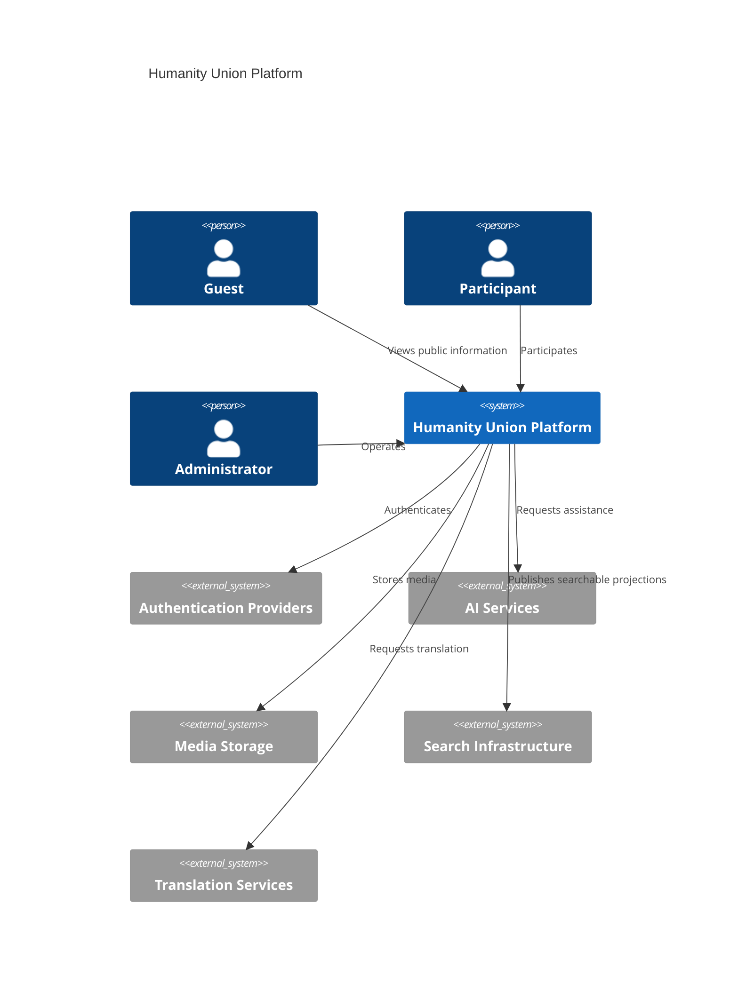
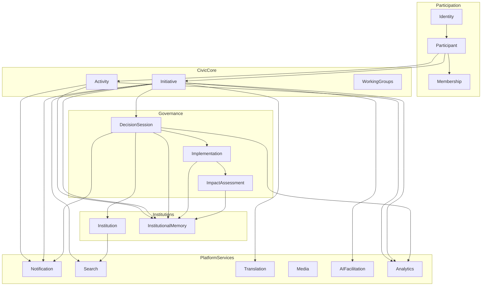
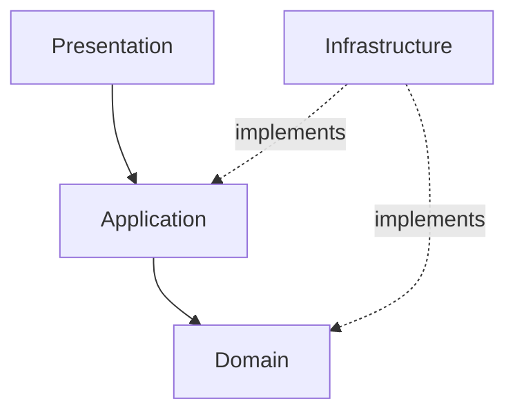
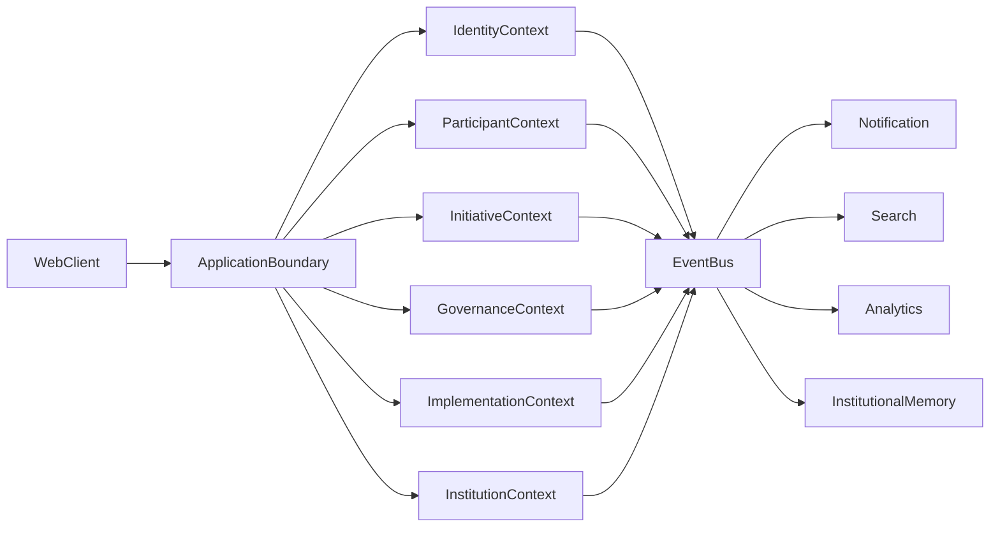

# Humanity Union System Architecture

## Version 2.0

### Normative Engineering Architecture for the Humanity Union Platform

---

# Document Purpose

This document defines the **normative engineering architecture** of the Humanity Union Platform.

It translates the validated **Blueprint**, the canonical **Ubiquitous Language**, and the **Domain Model** into a coherent software architecture suitable for implementation using **Domain-Driven Design (DDD)**, **Clean Architecture**, and **Event-Driven Architecture** where appropriate.

This document establishes:

- system boundaries;
- bounded contexts;
- aggregate ownership boundaries;
- architectural responsibilities;
- interaction patterns;
- engineering constraints;
- layering principles;
- governance of software architecture.

This document **does not redefine** the Humanity Union Blueprint.

This document **does not introduce new civic concepts**.

Canonical terminology is governed by:

- `00_UBIQUITOUS_LANGUAGE.md`

Canonical domain structure is governed by:

- `02_DOMAIN_MODEL.md`

Canonical Domain Event names, ownership, lifecycle status, versions, and aliases are governed exclusively by:

- `CANONICAL_EVENT_CATALOGUE.md`

Implementation technologies—including programming languages, frameworks, databases, infrastructure providers, cloud platforms, REST APIs, GraphQL schemas, deployment pipelines, and storage engines—are intentionally **out of scope**.

This document defines **architecture**, not implementation.

---

## Architecture Authority

Engineering architecture follows the following order of authority:

1. Humanity Union Blueprint
2. Ubiquitous Language
3. Domain Model
4. System Architecture
5. Canonical Event Catalogue
6. Architecture Decision Records (ADR)
7. Validation Documents

Lower-level engineering documents shall not contradict higher-level architectural authority.

---

**Status:** Normative Engineering Architecture

**Version:** 2.0

**Scope:** Software architecture, bounded contexts, engineering boundaries, interactions, responsibilities, and implementation principles.

---

## Related Normative Documents

- `00_UBIQUITOUS_LANGUAGE.md`
- `02_DOMAIN_MODEL.md`
- `CANONICAL_EVENT_CATALOGUE.md`
- `11_APPLICATION_WORKFLOWS.md`
- `ENGINEERING_MANIFESTO.md`
- `ARCHITECTURE_DECISION_RECORDS.md`
- `ARCHITECTURE_VALIDATION_SCENARIOS.md`
- `ENGINEERING_RELEASE_READINESS_REVIEW.md`

---

# Table of Contents

1. Architectural Principles

2. System Context

3. System Overview

4. Core Bounded Contexts

5. System Layers

6. Domain Ownership

7. Communication Principles

8. Event-Driven Architecture

9. Cross-Cutting Services

10. AI Architecture Position

11. Data Ownership

12. Scalability Principles

13. Security Principles

14. Traceability

15. Observability

16. Resilience

17. Architectural Constraints

18. Extensibility

19. Engineering Governance

20. Architecture Diagrams

21. Related Documents

22. Guiding Principle

23. Architecture Verification

---

# 1. Architectural Principles

The Humanity Union Platform shall be implemented using **Domain-Driven Design**, **Clean Architecture**, and **Event-Driven Architecture**, while preserving the authority of the Blueprint and the integrity of the canonical Domain Model.

Software architecture exists to faithfully implement civic architecture—not to redefine it.

| Principle | Engineering Meaning |
|------------|---------------------|
| **Participant-first architecture** | Every architectural decision ultimately serves meaningful civic participation rather than operator convenience. |
| **Blueprint authority** | The Blueprint remains the highest source of civic architecture. Engineering may optimize implementation but never redefine civic meaning. |
| **Domain Model authority** | Aggregate ownership, invariants, lifecycle boundaries, and relationships are governed by the canonical Domain Model. |
| **Ubiquitous Language** | Every engineering artifact uses canonical terminology defined in the Ubiquitous Language. |
| **DDD boundaries** | Each bounded context owns its business rules, aggregates, persistence, and invariants. |
| **Single ownership** | Every business rule has exactly one authoritative owner. |
| **Explicit lifecycle** | Every governed lifecycle is visible, deterministic, and owned by its Aggregate Root. |
| **Event-driven communication** | Significant business state changes are represented by immutable Domain Events. |
| **Application orchestration** | Multi-context workflows are coordinated by the Application Layer rather than direct Aggregate interaction. |
| **Loose coupling** | Contexts communicate through commands, queries, published interfaces, and Domain Events. Internal implementation is never exposed. |
| **High cohesion** | Business rules remain inside the owning bounded context. |
| **Clean Architecture** | Dependencies always point toward the Domain Layer. Infrastructure depends on the Domain—not vice versa. |
| **Institutional Memory** | Civic reasoning, alternatives, corrections, and dissent remain permanently traceable. |
| **Transparency** | Civic processes remain inspectable unless explicitly restricted by governance rules. |
| **Traceability** | Important civic actions remain historically attributable through Activities, Domain Events, and Institutional Memory. |
| **Accountability** | Authority always follows explicit governance responsibility. |
| **Human authority** | Civic authority belongs only to governed human processes—not software. |
| **AI advisory role only** | Artificial Intelligence may assist participants but shall never create authority, approve decisions, or modify governance autonomously. |
| **Correction without erasure** | Historical records evolve through append-only corrections rather than destructive replacement. |
| **Extensibility** | Future evolution shall preserve architectural consistency through bounded contexts, Domain Events, and ADR governance. |

---

## Architectural Philosophy

The platform is designed around civic collaboration rather than administrative workflow.

Engineering therefore models:

- participants rather than users;
- initiatives rather than tickets;
- governed decision-making rather than workflow automation;
- institutional learning rather than simple historical logging.

The software architecture reflects civic reality instead of imposing technical convenience upon it.

---

# 2. System Context

The Humanity Union Platform is a digital civic infrastructure enabling Participants to collaborate, analyze problems, develop proposals, organize collective initiatives, conduct governed decision-making, coordinate institutions, implement approved outcomes, evaluate societal impact, and preserve institutional learning.

The platform provides infrastructure for civic participation.

It does not replace:

- national constitutions;
- courts;
- governments;
- legal jurisdictions;
- democratic institutions outside the Humanity Union Blueprint.

Instead, it provides an independent civic governance environment defined by the Humanity Union constitutional framework.

---

## Primary Actors

| Actor | Role |
|--------|------|
| **Guest** | Unauthenticated observer of authorized public information. |
| **Participant** | Authenticated civic actor participating according to identity, verification, Membership, and governance rules. |
| **Institution** | Recognized organizational structure operating within an approved mandate. |
| **Working Group** | Temporary collaborative structure focused on achieving a defined objective. |
| **AI Services** | External advisory intelligence providing non-authoritative assistance. |
| **Translation Services** | External multilingual rendering services. |
| **Notification Services** | Delivery of responsibility-based notifications. |
| **Authentication Providers** | External identity authentication and verification providers. |
| **Media Storage** | External storage and retrieval of civic media assets. |
| **Search Infrastructure** | Discovery and indexing of authorized public content. |
| **Administrators** | Infrastructure operators responsible for platform operations but possessing no civic authority. |
| **External Integrations** | Approved external systems communicating through governed integration boundaries. |

---

## System Boundary

The Humanity Union Platform governs only those civic processes explicitly defined by the Humanity Union Blueprint.

Everything outside this scope remains external.

Examples include:

- national legal systems;
- governmental agencies;
- commercial software;
- social media platforms;
- external AI providers;
- external identity providers.

These systems may integrate with the platform but never become authoritative owners of Humanity Union domain concepts.

---

# 3. System Overview

The Humanity Union Platform is organized as a collection of **independent bounded contexts**, each responsible for a specific part of the civic domain.

Each bounded context:

- owns its Aggregate Roots;
- owns its invariants;
- owns its persistence;
- owns its lifecycle transitions;
- owns its Domain Events;
- exposes explicit commands, queries, and published interfaces;
- hides internal implementation details.

No bounded context directly modifies another bounded context's internal state.

Cross-context collaboration occurs exclusively through:

- Commands;
- Queries;
- Domain Events;
- Application-layer orchestration.

---

## High-Level Civic Lifecycle

At the highest architectural level, civic participation follows the canonical domain lifecycle:

```text
Participant
        │
        ▼
Initiative
        │
        ▼
Collaborative Analysis
        │
        ▼
Proposal Evolution
        │
        ▼
Proposal
        │
        ▼
Petition
        │
        ▼
Decision Session
        │
        ▼
Collective Decision
        │
        ▼
Implementation
        │
        ▼
Impact Assessment
        │
        ▼
Institutional Memory
```

This lifecycle is conceptual.

Its implementation is distributed across multiple bounded contexts coordinated through Application Services and Domain Events.

---

## Architectural Organization

The platform is organized into several cooperating architectural domains:

- Identity and Participation
- Civic Core
- Governance
- Institutional Domain
- Platform Services

Each architectural domain contains one or more bounded contexts.

No architectural domain owns another.

Instead, cooperation occurs through explicit contracts defined by the System Architecture.

---

## Context Interaction Rules

Every bounded context follows the same architectural rules.

### Owns

- Aggregates
- Entities
- Value Objects
- Domain Policies
- Domain Services
- Domain Events
- Business invariants

### Publishes

- Commands
- Queries
- Domain Events

### Consumes

- Commands addressed to itself
- Published events from other contexts
- Read models through approved interfaces

### Never

- modifies another context's persistence;
- bypasses Aggregate invariants;
- publishes another context's events;
- exposes internal repositories;
- depends directly on another context's implementation.

---

**End of Part 1/6**

**Next:** **Part 2/6 — Core Bounded Contexts (Identity, Participant, Membership, Activity, Initiative)**.

# 4. Core Bounded Contexts

The Humanity Union Platform is partitioned into **Bounded Contexts**, each representing an independent business domain with explicit ownership.

Every bounded context:

- owns its Aggregate Roots;
- owns its business invariants;
- owns its persistence;
- owns its Domain Events;
- owns its public interfaces;
- owns its lifecycle rules.

No bounded context directly modifies another bounded context.

---

# 4.1 Identity Context

| Field | Description |
|--------|-------------|
| **Purpose** | Authenticate and verify Participants while remaining independent from civic authority. |
| **Responsibilities** | Authentication, identity verification, credentials, account lifecycle, security policies. |
| **Aggregate Root** | Identity |
| **Owned Domain Objects** | Identity, IdentityVerification, Credential, AuthenticationSession |
| **Published Events** | `ParticipantRegistered`, `ParticipantAuthenticated`, `ParticipantVerified`, `IdentityVerificationRevoked` |
| **Consumed Events** | None |
| **Dependencies** | Authentication Providers, Verification Providers |

---

### Identity Context Principles

Identity proves **who a Participant is**.

Identity **does not** determine:

- Membership;
- civic authority;
- voting rights;
- institutional authority;
- permissions outside authentication.

Identity verification is a prerequisite for certain civic actions, but verification alone never grants governance authority.

---

# 4.2 Participant Context

| Field | Description |
|--------|-------------|
| **Purpose** | Represent civic actors and their long-term participation within the Humanity Union ecosystem. |
| **Responsibilities** | Participant profile, civic identity, public profile, participation preferences, responsibility profile. |
| **Aggregate Root** | Participant |
| **Owned Domain Objects** | Participant, ParticipantProfile, ResponsibilityProfile, CivicPreferences |
| **Published Events** | `ParticipantCreated`, `ParticipantUpdated`, `ParticipantProfilePublished` |
| **Consumed Events** | `ParticipantRegistered`, `ParticipantVerified` |
| **Dependencies** | Identity |

---

## Participant Responsibilities

Participant represents the universal civic actor.

Every civic interaction originates from a Participant.

Participant owns:

- public profile;
- civic preferences;
- participation settings;
- notification preferences;
- visibility configuration;
- responsibility profile.

Participant does **not** own Membership.

---

# 4.3 Membership Context

| Field | Description |
|--------|-------------|
| **Purpose** | Govern membership status independently from identity and participation. |
| **Responsibilities** | Membership lifecycle, eligibility, activation, suspension, expiration, governance eligibility. |
| **Aggregate Root** | Membership |
| **Owned Domain Objects** | Membership, MembershipStatus, MembershipEligibility |
| **Published Events** | `MembershipGranted`, `MembershipActivated`, `MembershipSuspended`, `MembershipExpired`, `MembershipRevoked` |
| **Consumed Events** | `ParticipantVerified` |
| **Dependencies** | Identity, Participant |

---

## Membership Principles

Membership is **not** identity.

Membership is **not** authentication.

Membership is **not** participation.

Membership is a governed civic relationship between a Participant and Humanity Union.

A Participant may exist without Membership.

Membership may change without changing Participant identity.

---

## Membership Lifecycle

```text
Requested
      │
      ▼
Verified
      │
      ▼
Granted
      │
      ▼
Active
      │
      ├────────► Suspended
      │               │
      │               ▼
      │          Reinstated
      │
      ▼
Expired
```

Membership transitions remain governed by Membership rules only.

---

# 4.4 Activity Context

| Field | Description |
|--------|-------------|
| **Purpose** | Preserve an immutable civic participation ledger representing meaningful civic actions. |
| **Responsibilities** | Civic activity history, participation records, accountability, append-only history, activity visibility. |
| **Aggregate Root** | Activity |
| **Owned Domain Objects** | Activity, ActivityRecord, ActivityCategory |
| **Published Events** | `ActivityCreated`, `ActivityPublished`, `ActivityCorrected` |
| **Consumed Events** | Significant civic Domain Events from all bounded contexts |
| **Dependencies** | All civic contexts (events only) |

---

## Activity Principles

Activity is **not** a workflow engine.

Activity is **not** Institutional Memory.

Activity is **not** an audit log.

Instead, Activity provides a civic participation history that answers:

- Who participated?
- What civic action occurred?
- When did it occur?
- Which domain object did it concern?

Activity records are append-only.

Corrections never erase history.

---

## Activity Ownership

Activity owns only civic participation records.

Business decisions remain owned by their originating bounded contexts.

Activity never becomes the authoritative owner of:

- Proposals;
- Decisions;
- Institutions;
- Membership;
- Initiatives.

---

# 4.5 Initiative Context

The Initiative Context represents the **core civic collaboration domain** of the Humanity Union Platform.

It owns the complete lifecycle from idea formation through Proposal development and Petition support.

---

| Field | Description |
|--------|-------------|
| **Purpose** | Coordinate civic collaboration leading toward governed decision-making. |
| **Responsibilities** | Initiative lifecycle, Collaborative Analysis, Proposal Evolution, Proposal creation, Petition management, Collective Signals. |
| **Aggregate Root** | Initiative |
| **Owned Domain Objects** | Initiative, CollaborativeAnalysis, ProposalEvolution, Proposal, Petition, CollectiveSignal |
| **Published Events** | `InitiativeCreated`, `CollaborativeAnalysisStarted`, `ContributionAdded`, `EvidenceAdded`, `ProposalSubmitted`, `PetitionOpened`, `PetitionClosed`, `CollectiveSignalRecorded` |
| **Consumed Events** | `ParticipantVerified`, `MembershipActivated` |
| **Dependencies** | Participant, Membership, Activity |

---

## Initiative Aggregate

The Initiative Aggregate owns:

```text
Initiative
│
├── Collaborative Analysis
│
├── Proposal Evolution
│
├── Proposal
│
├── Petition
│
└── Collective Signal
```

These are **not separate bounded contexts**.

They are domain concepts governed by the Initiative Aggregate.

---

## Initiative Responsibilities

The Initiative Aggregate is responsible for:

- creating civic initiatives;
- coordinating collaborative analysis;
- collecting evidence;
- organizing contributions;
- managing proposal evolution;
- publishing proposals;
- opening petitions;
- collecting civic support;
- recording collective signals.

It is **not** responsible for:

- formal collective decisions;
- institutional governance;
- implementation;
- impact assessment.

Those belong to independent bounded contexts.

---

## Initiative Lifecycle

```text
Initiative
      │
      ▼
Collaborative Analysis
      │
      ▼
Proposal Evolution
      │
      ▼
Proposal
      │
      ▼
Petition
```

The lifecycle ends when governance begins.

Decision-making occurs in the Governance Context.

---

## Collaborative Analysis

Collaborative Analysis exists to improve understanding before proposals are submitted.

It owns:

- Contributions;
- Questions;
- Evidence;
- Suggestions;
- Discussion Threads;
- Knowledge Organization.

Collaborative Analysis never creates authoritative civic outcomes.

---

## Proposal Evolution

Proposal Evolution manages iterative refinement.

It supports:

- revisions;
- alternative drafts;
- collaborative improvements;
- evidence integration;
- consensus building.

Proposal Evolution ends when a Proposal is formally submitted.

---

## Petition

A Petition represents organized civic support for a Proposal.

A Petition:

- belongs to exactly one Initiative;
- references exactly one Proposal;
- records support;
- records withdrawal;
- never creates authority by itself.

Petitions provide civic legitimacy—not formal decisions.

---

## Collective Signals

Collective Signals capture lightweight civic sentiment.

Examples include:

- support;
- concern;
- priority;
- urgency;
- interest.

Collective Signals inform future collaboration but never replace governed decision-making.

---

**End of Part 2/6**

**Next:** **Part 3/6 — Remaining Bounded Contexts (Working Groups, Governance, Implementation, Impact Assessment, Institution, Institutional Memory, Platform Services).**

# 4.6 Working Groups Context

The Working Groups Context provides structured collaboration for Participants working toward a defined civic objective.

Working Groups coordinate people.

They do **not** own civic authority.

---

| Field | Description |
|--------|-------------|
| **Purpose** | Organize collaborative work around Initiatives, Institutions, and implementation activities. |
| **Responsibilities** | Working Group lifecycle, membership, objectives, assignments, coordination, internal collaboration. |
| **Aggregate Root** | WorkingGroup |
| **Owned Domain Objects** | WorkingGroup, WorkingGroupMember, WorkingGroupRole, WorkingGroupObjective |
| **Published Events** | `WorkingGroupCreated`, `WorkingGroupJoined`, `WorkingGroupRoleAssigned`, `WorkingGroupClosed` |
| **Consumed Events** | `InitiativeCreated`, `MembershipActivated`, `InstitutionCreated` |
| **Dependencies** | Initiative, Participant, Membership, Institution |

---

## Working Group Principles

Working Groups coordinate collaboration.

Working Groups do **not**:

- approve Proposals;
- approve Institutions;
- produce Collective Decisions;
- change governance.

They facilitate execution of work authorized elsewhere.

---

## Working Group Lifecycle

```text
Created
    │
    ▼
Recruiting
    │
    ▼
Active
    │
    ▼
Completed
    │
    ▼
Archived
```

---

# 4.7 Governance Context

The Governance Context owns formal civic decision-making.

No other bounded context may create authoritative collective outcomes.

---

| Field | Description |
|--------|-------------|
| **Purpose** | Govern formal collective decision-making. |
| **Responsibilities** | Decision Sessions, voting processes, decision validation, collective outcomes, governance rules. |
| **Aggregate Root** | DecisionSession |
| **Owned Domain Objects** | DecisionSession, CollectiveDecision, DecisionResult, VotingConfiguration |
| **Published Events** | `DecisionSessionStarted`, `VotingOpened`, `VotingClosed`, `CollectiveDecisionReached`, `DecisionPublished` |
| **Consumed Events** | `PetitionOpened`, `PetitionClosed`, `MembershipActivated` |
| **Dependencies** | Initiative, Membership |

---

## Governance Principles

Governance owns:

- Decision Sessions;
- voting;
- quorum validation;
- governance procedures;
- Collective Decisions.

Governance does **not**:

- create Initiatives;
- modify Proposals;
- manage Institutions;
- perform Implementation.

---

## Decision Session Aggregate

```text
Decision Session
        │
        └── Collective Decision
```

The Collective Decision cannot exist independently.

It always belongs to exactly one Decision Session.

---

## Governance Lifecycle

```text
Decision Session
        │
        ▼
Voting
        │
        ▼
Validation
        │
        ▼
Collective Decision
        │
        ▼
Publication
```

---

# 4.8 Implementation Context

Implementation transforms approved Collective Decisions into coordinated action.

---

| Field | Description |
|--------|-------------|
| **Purpose** | Coordinate execution of approved Collective Decisions. |
| **Responsibilities** | Implementation planning, execution tracking, milestone management, completion reporting. |
| **Aggregate Root** | Implementation |
| **Owned Domain Objects** | Implementation, ImplementationPlan, Milestone, ProgressReport |
| **Published Events** | `ImplementationStarted`, `MilestoneCompleted`, `ImplementationCompleted`, `ImplementationCancelled` |
| **Consumed Events** | `CollectiveDecisionReached` |
| **Dependencies** | Governance |

---

## Implementation Principles

Implementation executes.

Implementation does **not**:

- reinterpret Decisions;
- change governance;
- approve new authority.

Implementation follows authorized Collective Decisions.

---

## Implementation Lifecycle

```text
Planned
    │
    ▼
Started
    │
    ▼
In Progress
    │
    ▼
Completed
```

---

# 4.9 Impact Assessment Context

Impact Assessment evaluates outcomes after implementation.

It never modifies historical decisions.

---

| Field | Description |
|--------|-------------|
| **Purpose** | Measure civic outcomes and societal impact. |
| **Responsibilities** | Evaluation, indicators, evidence collection, effectiveness reporting, recommendations. |
| **Aggregate Root** | ImpactAssessment |
| **Owned Domain Objects** | ImpactAssessment, OutcomeIndicator, AssessmentReport |
| **Published Events** | `ImpactAssessmentStarted`, `ImpactAssessmentCompleted`, `ImpactReportPublished` |
| **Consumed Events** | `ImplementationCompleted` |
| **Dependencies** | Implementation |

---

## Impact Assessment Principles

Impact Assessment provides learning.

It does **not**:

- invalidate Decisions;
- rewrite history;
- modify Institutional Memory.

Assessment informs future Initiatives.

---

# 4.10 Institution Context

The Institution Context governs recognized Humanity Union institutions.

Institutions represent long-term organizational structures.

---

| Field | Description |
|--------|-------------|
| **Purpose** | Govern institutional creation, evolution, review, and retirement. |
| **Responsibilities** | Formation, Founding Mandate, institutional lifecycle, reviews, retirement. |
| **Aggregate Root** | Institution |
| **Owned Domain Objects** | Institution, FoundingMandate, InstitutionReview, InstitutionalPosition |
| **Published Events** | `InstitutionCreated`, `InstitutionReviewed`, `InstitutionUpdated`, `InstitutionRetired` |
| **Consumed Events** | `CollectiveDecisionReached` |
| **Dependencies** | Governance |

---

## Institution Principles

Institution creation requires:

- an approved Collective Decision;
- a valid Founding Mandate;
- compliance with Blueprint governance.

Institutions are authoritative organizational structures.

They are not temporary collaboration groups.

---

## Institution Lifecycle

```text
Proposed
    │
    ▼
Authorized
    │
    ▼
Established
    │
    ▼
Operational
    │
    ▼
Reviewed
    │
    ▼
Retired
```

---

# 4.11 Institutional Memory Context

Institutional Memory preserves long-term civic knowledge.

It exists independently from Activity.

---

| Field | Description |
|--------|-------------|
| **Purpose** | Preserve institutional reasoning, historical knowledge, alternatives, dissent, and corrections. |
| **Responsibilities** | Historical preservation, append-only corrections, institutional learning, knowledge continuity. |
| **Aggregate Root** | InstitutionalMemory |
| **Owned Domain Objects** | InstitutionalMemoryRecord, InstitutionalPosition, MemoryCorrection |
| **Published Events** | `InstitutionalMemoryAppended`, `InstitutionalMemoryCorrected` |
| **Consumed Events** | Major Domain Events across all bounded contexts |
| **Dependencies** | Event Bus (events only) |

---

## Institutional Memory Principles

Institutional Memory stores:

- historical reasoning;
- alternative approaches;
- dissenting opinions;
- institutional conclusions;
- lessons learned;
- corrections.

Institutional Memory does **not** replace:

- Activity;
- Audit;
- technical logging.

---

# 4.12 Platform Services

Platform Services provide technical capabilities shared across the platform.

They are **supporting contexts**.

They never become authoritative owners of civic concepts.

---

| Context | Purpose |
|---------|---------|
| **Notification** | Responsibility-based notification delivery |
| **Search** | Discovery and indexing of public civic information |
| **Media** | Management of civic media assets |
| **Translation** | Multilingual content support with canonical source preservation |
| **AI Facilitation** | Advisory intelligence, summarization, evidence organization, pattern detection |
| **Analytics** | Platform metrics and civic process observation |

---

## Platform Service Principles

Platform Services:

- support domain contexts;
- consume Domain Events;
- expose technical services;
- maintain projections where appropriate.

Platform Services never:

- own civic authority;
- create Collective Decisions;
- change Aggregate state;
- bypass bounded contexts.

---

## Supporting Context Relationships

```text
                Domain Events
                      │
                      ▼
          +------------------------+
          | Platform Services       |
          +------------------------+
          | Notification           |
          | Search                |
          | Translation           |
          | Media                 |
          | AI Facilitation       |
          | Analytics             |
          +------------------------+
```

Platform Services remain replaceable without changing the core civic domain.

---

## End of Section 4

The Humanity Union Platform is composed of independent bounded contexts with clearly defined responsibilities, ownership, Aggregate Roots, and interaction boundaries.

Subsequent sections define how these contexts communicate, preserve consistency, and cooperate within the overall system architecture.

---

**End of Part 3/6**

**Next:** **Part 4/6 — Sections 5–14 (System Layers, Domain Ownership, Communication Principles, Event-Driven Architecture, Cross-Cutting Services, AI Architecture, Data Ownership, Scalability, Security, Traceability).**

# 5. System Layers

The Humanity Union Platform follows the principles of **Clean Architecture**, ensuring that business rules remain independent from frameworks, infrastructure, and user interfaces.

Every layer has a clearly defined responsibility.

Dependencies always point toward the Domain.

---

| Layer | Responsibility | Contains |
|--------|----------------|----------|
| **Presentation** | Human interaction, public interfaces, accessibility, localization | Web Client, Public Portal, Administrative UI |
| **Application** | Use-case orchestration, authorization, transaction boundaries | Application Services, Command Handlers, Query Handlers |
| **Domain** | Business rules, Aggregates, Domain Services, Domain Events | All Bounded Contexts |
| **Infrastructure** | Persistence, messaging, external adapters, technical integrations | Databases, Event Bus, AI adapters, Translation adapters, Storage |

---

## Dependency Rule

The Domain Layer never depends on:

- Infrastructure;
- Presentation;
- Frameworks;
- Databases;
- External APIs.

Instead:

Infrastructure implements interfaces defined by the Domain and Application Layers.

---

## Layer Responsibilities

### Presentation Layer

Responsible for:

- user interaction;
- accessibility;
- rendering;
- localization;
- input validation;
- API presentation.

Presentation contains **no business rules**.

---

### Application Layer

Responsible for:

- orchestration;
- transaction boundaries;
- command execution;
- authorization;
- workflow coordination.

Application coordinates.

It does not own business invariants.

---

### Domain Layer

Responsible for:

- Aggregates;
- Entities;
- Value Objects;
- Domain Policies;
- Domain Services;
- Domain Events;
- invariants.

The Domain Layer is the authoritative implementation of business behavior.

---

### Infrastructure Layer

Responsible for:

- persistence;
- messaging;
- authentication providers;
- AI integration;
- search infrastructure;
- storage;
- monitoring;
- deployment concerns.

Infrastructure is replaceable.

---

# 6. Domain Ownership

Every business concept has exactly one authoritative owner.

Ownership is never shared.

---

## Ownership Rules

| Rule | Description |
|------|-------------|
| **Single writer** | Only the owning bounded context may change Aggregate state. |
| **Explicit authority** | Aggregate ownership is defined in the Domain Model. |
| **No shared persistence** | Contexts never modify another context's storage. |
| **No hidden ownership** | Every business rule belongs to one bounded context. |
| **Explicit contracts** | Communication occurs through commands, queries, and Domain Events. |

---

## Aggregate Ownership

Only the owning Aggregate may:

- validate invariants;
- change lifecycle;
- emit authoritative Domain Events;
- reject invalid commands.

---

## Cross-Context Cooperation

Contexts cooperate through:

- Commands;
- Queries;
- Domain Events;
- Application orchestration.

Contexts never:

- share repositories;
- modify foreign Aggregates;
- bypass validation.

---

# 7. Communication Principles

The platform uses explicit communication patterns.

Business behavior remains deterministic and observable.

---

| Pattern | Purpose |
|---------|----------|
| **Command** | Request state change in owning Aggregate |
| **Query** | Read published information |
| **Domain Event** | Publish immutable business facts |
| **Application Service** | Coordinate multi-context workflows |
| **Integration Event** | Communicate with external systems |

---

## Commands

Commands express intent.

Examples:

- Create Initiative
- Submit Proposal
- Open Petition
- Start Decision Session
- Start Implementation

Commands may fail.

Commands never guarantee success.

---

## Queries

Queries:

- never change state;
- have no side effects;
- return published information only.

---

## Domain Events

Domain Events represent completed business facts.

Examples:

- InitiativeCreated
- ProposalSubmitted
- PetitionOpened
- CollectiveDecisionReached
- ImplementationCompleted

Events are immutable.

Events describe the past.

---

## Application Services

Application Services coordinate multiple bounded contexts.

Example:

Decision approved

↓

Application Service

↓

Start Implementation

↓

Publish notifications

↓

Update projections

The orchestration belongs to the Application Layer—not to Aggregates.

---

# 8. Event-Driven Architecture

Significant business changes become immutable Domain Events.

This enables:

- loose coupling;
- traceability;
- scalability;
- replayable projections;
- institutional learning.

---

## Event Principles

Every Domain Event:

- has exactly one owner;
- represents a completed fact;
- cannot be modified;
- is immutable;
- is versioned.

---

## Domain Event Lifecycle

```text
Command
    │
    ▼
Aggregate Validation
    │
    ▼
State Change
    │
    ▼
Domain Event
    │
    ▼
Event Bus
    │
    ▼
Consumers
```

---

## Event Consumers

Consumers may include:

- Notification
- Search
- Analytics
- Institutional Memory
- AI Facilitation
- Translation

Consumers never modify the originating Aggregate.

---

## Event Ownership

Each Domain Event belongs to exactly one bounded context.

No context publishes another context's events.

Canonical event names are governed by:

`CANONICAL_EVENT_CATALOGUE.md`

---

# 9. Cross-Cutting Services

Cross-cutting services provide shared technical capabilities.

They never own civic authority.

---

| Service | Responsibility |
|----------|----------------|
| Authentication | Identity verification |
| Authorization | Access control |
| Notification | Responsibility-based alerts |
| Translation | Multilingual rendering |
| Search | Discovery |
| Media | File storage |
| Logging | Technical diagnostics |
| Monitoring | Infrastructure health |
| Audit | Technical compliance |
| AI | Advisory assistance |

---

## Cross-Cutting Principles

Cross-cutting services:

- support business processes;
- consume events;
- expose technical interfaces.

They never:

- approve civic decisions;
- change Aggregate state;
- define governance.

---

# 10. AI Architecture Position

Artificial Intelligence is an advisory capability.

It is never an authoritative civic actor.

---

## AI Responsibilities

AI may:

- summarize;
- organize evidence;
- identify patterns;
- improve discoverability;
- assist Participants;
- assist Working Groups.

---

## AI Restrictions

AI shall never:

- create Collective Decisions;
- approve Institutions;
- define governance;
- override Participants;
- modify historical records.

---

## AI Boundary

AI outputs are:

- advisory;
- reviewable;
- attributable;
- correctable.

Every AI-generated result remains subject to human review.

---

# 11. Data Ownership

Persistence follows bounded context ownership.

---

## Data Principles

| Principle | Description |
|-----------|-------------|
| Context-owned persistence | Every bounded context owns its own data. |
| No shared business schema | Business ownership never spans databases. |
| Eventual consistency | Read models may lag authoritative state. |
| Immutable history | Corrections preserve historical traceability. |

---

## Read Models

Read models include:

- Search
- Notifications
- Analytics
- Dashboards

Read models never become authoritative.

---

# 12. Scalability Principles

The architecture supports long-term growth.

---

## Scalability Objectives

- independent deployment;
- horizontal scaling;
- asynchronous processing;
- event-driven projections;
- replaceable infrastructure;
- modular evolution.

---

## Scaling Rules

Business logic scales by bounded context.

Infrastructure scales independently from Domain logic.

---

# 13. Security Principles

Security protects Participants without weakening civic transparency.

---

## Security Objectives

- least privilege;
- defense in depth;
- explicit authorization;
- traceability;
- accountability;
- privacy.

---

## Security Principles

Identity is independent from Membership.

Verification is independent from authority.

Authorization follows governance.

Sensitive information remains protected.

Public civic records remain transparent where governance permits.

---

# 14. Traceability

Every significant civic action must remain historically attributable.

---

## Traceability Includes

Every significant record references:

- Participant;
- Time;
- Aggregate;
- Context;
- Related identifiers;
- Domain Events;
- Institutional Memory where applicable.

---

## Traceability Principles

Traceability is provided collectively by:

- Activity;
- Domain Events;
- Institutional Memory;
- Aggregate histories.

Technical logs are **not** a replacement for civic traceability.

---

## End of Part 4/6

The preceding sections establish the architectural foundations governing system structure, ownership, communication, security, and accountability.

The remaining sections define operational resilience, governance constraints, architectural diagrams, and document verification.

---

**Next:** **Part 5/6 — Sections 15–20 (Observability, Resilience, Architectural Constraints, Extensibility, Engineering Governance, and all Architecture Diagrams).**

# 15. Observability

Observability enables operators and engineers to understand the operational health of the Humanity Union Platform without becoming part of the civic domain itself.

Operational observability is distinct from civic accountability.

Institutional Memory, Activity, and Domain Events remain the authoritative mechanisms for civic traceability.

---

## Observability Categories

| Category | Purpose |
|----------|---------|
| **Logging** | Technical diagnostics and error investigation |
| **Metrics** | Performance, throughput, latency, resource utilization |
| **Distributed Tracing** | Correlate requests and workflows across services |
| **Health Monitoring** | Availability and readiness of platform components |
| **Business Monitoring** | Non-authoritative civic process metrics |
| **Audit Monitoring** | Security, authentication, authorization and compliance |

---

## Observability Principles

Observability:

- supports operations;
- improves reliability;
- enables incident investigation;
- assists performance optimization.

Observability never:

- replaces Activity;
- replaces Institutional Memory;
- replaces Domain Events;
- defines civic truth.

---

# 16. Resilience

The platform shall tolerate infrastructure failures while preserving business correctness.

Resilience protects platform availability—not business authority.

---

## Resilience Principles

| Principle | Description |
|-----------|-------------|
| **Retry Strategies** | Safe retry for transient failures |
| **Idempotency** | Duplicate commands and events remain safe |
| **Failure Isolation** | Failures remain contained within their bounded context |
| **Graceful Degradation** | Core civic functionality remains available when supporting services fail |
| **Event Replay** | Read models and projections can be rebuilt from Domain Events |
| **Recovery** | Services recover without violating business invariants |
| **Dead Letter Handling** | Failed asynchronous messages remain inspectable and recoverable |
| **Outbox Consistency** | State changes and event publication remain transactionally coordinated |

---

## Resilience Objectives

Failures in:

- Analytics;
- Search;
- AI;
- Translation;
- Notification;

shall never prevent:

- Initiative creation;
- Proposal submission;
- Decision Sessions;
- Collective Decisions;
- Implementation.

Core civic processes remain the highest operational priority.

---

# 17. Architectural Constraints

Architectural constraints preserve long-term consistency across the platform.

Every implementation must comply with these rules.

---

| Constraint | Enforcement |
|------------|-------------|
| **No duplicated business logic** | Business rules exist in one owning bounded context |
| **No cross-context persistence** | Contexts never write another context's storage |
| **No hidden lifecycle transitions** | Significant lifecycle changes emit canonical Domain Events |
| **No implicit state mutation** | Aggregates change only through explicit Commands |
| **No Proposal outside Initiative** | Every Proposal belongs to exactly one Initiative |
| **No Petition without Proposal** | Petitions reference one Proposal within one Initiative |
| **No Collective Decision outside Decision Session** | Collective Decisions exist only inside their owning Aggregate |
| **No Institution without governed authorization** | Institution creation requires an approved Collective Decision and Founding Mandate |
| **No Membership implied by authentication** | Authentication never automatically creates Membership |
| **No AI authority** | AI remains advisory only |
| **No erased civic history** | Corrections append or supersede historical records rather than overwrite them |

---

# 18. Extensibility

The Humanity Union Platform is designed for continuous evolution while preserving architectural integrity.

New bounded contexts may be introduced only when justified by:

- Blueprint evolution;
- validated domain analysis;
- Architecture Decision Records;
- approved governance processes.

---

## Extensibility Rules

| Rule | Requirement |
|------|-------------|
| **Blueprint Alignment** | New contexts must support the Humanity Union Blueprint |
| **Domain Model Alignment** | Aggregate ownership must first be defined in `02_DOMAIN_MODEL.md` |
| **Ubiquitous Language** | New terminology must first appear in `00_UBIQUITOUS_LANGUAGE.md` |
| **Canonical Event Alignment** | New Domain Events must be registered in `CANONICAL_EVENT_CATALOGUE.md` |
| **ADR Requirement** | Significant architectural decisions require Architecture Decision Records |
| **Backward Compatibility** | Published contracts remain versioned and stable |
| **Loose Coupling** | Prefer Domain Events over synchronous dependencies |

---

# 19. Engineering Governance

Software architecture evolves through governed engineering processes.

No implementation may redefine the civic architecture established by higher-level documents.

---

## Architectural Authority

| Source | Governs |
|--------|----------|
| **Blueprint** | Civic architecture, governance principles, institutional purpose |
| **Ubiquitous Language** | Canonical terminology |
| **Domain Model** | Aggregates, Entities, Value Objects, ownership, invariants |
| **System Architecture** | Bounded Contexts, architectural boundaries, interaction rules |
| **Canonical Event Catalogue** | Domain Event ownership and vocabulary |
| **Architecture Decision Records** | Engineering decisions and exceptions |
| **Validation Documents** | Evidence supporting architectural correctness |

---

## Governance Principles

Architectural conflicts shall be resolved by the governing document responsible for the disputed concern.

Examples:

- terminology → Ubiquitous Language;
- Aggregate ownership → Domain Model;
- event names → Canonical Event Catalogue;
- civic meaning → Blueprint;
- implementation structure → System Architecture.

Implementation shall never resolve architectural conflicts independently.

---

# 20. Architecture Diagrams

The following diagrams provide conceptual views of the architecture.

They illustrate responsibilities and relationships rather than implementation details.

---

# 20.1 System Context Diagram



---

# 20.2 Bounded Context Map



---

# 20.3 Layered Architecture



---

# 20.4 Domain Event Flow

```mermaid
sequenceDiagram

actor Participant

participant Initiative
participant Governance
participant Implementation
participant EventBus
participant InstitutionalMemory
participant Notification

Participant->>Initiative: Create Initiative
Initiative-->>EventBus: InitiativeCreated

Participant->>Initiative: Submit Proposal
Initiative-->>EventBus: ProposalSubmitted

Participant->>Governance: Start Decision Session
Governance-->>EventBus: DecisionSessionStarted

Governance-->>EventBus: CollectiveDecisionReached

Participant->>Implementation: Start Implementation
Implementation-->>EventBus: ImplementationStarted

EventBus-->>InstitutionalMemory: Preserve history
EventBus-->>Notification: Notify Participants
```

---

# 20.5 High-Level Component Interaction



---

**End of Part 5/6**

**Next:** **Part 6/6 — Related Documents, Guiding Principle, Architecture Verification, Final Metadata and Version 2.0.**

# 21. Related Documents

The following documents collectively define the engineering architecture of the Humanity Union Platform.

No implementation document may contradict these normative sources.

---

## 21.1 Normative Engineering Documents

### Core Architecture

- `00_UBIQUITOUS_LANGUAGE.md`
- `01_SYSTEM_ARCHITECTURE.md`
- `02_DOMAIN_MODEL.md`
- `CANONICAL_EVENT_CATALOGUE.md`

---

### Application Layer

- `11_APPLICATION_WORKFLOWS.md`
- `API_ARCHITECTURE.md`
- `PERMISSIONS_AND_AUTHORIZATION.md`

---

### Infrastructure

- `DATABASE_STRATEGY.md`
- `EVENT_ARCHITECTURE.md`
- `DEPLOYMENT_ARCHITECTURE.md`
- `OBSERVABILITY_GUIDE.md`

---

### Governance

- `ARCHITECTURE_DECISION_RECORDS.md`
- `ENGINEERING_MANIFESTO.md`
- `ENGINEERING_RELEASE_READINESS_REVIEW.md`

---

### Validation

- `ARCHITECTURE_VALIDATION_SCENARIOS.md`
- `SCENARIO_PLAYBOOK.md`
- `ARCHITECTURE_VALIDATION_LOG.md`

---

### Blueprint

- `00_BLUEPRINT_INDEX.md`
- Humanity Union Constitution
- Charter of Ethical Technology
- Information Architecture
- Activity Engine
- Institution Architecture
- Governance Architecture
- Event Architecture

The Blueprint remains the highest source of civic authority.

---

# 22. Guiding Principle

The software architecture exists to faithfully implement the Humanity Union Blueprint through the canonical:

- Ubiquitous Language;
- Domain Model;
- System Architecture;
- Canonical Event Catalogue.

Engineering may improve:

- implementation;
- performance;
- scalability;
- maintainability;
- deployment.

Engineering shall never redefine:

- civic meaning;
- governance authority;
- Aggregate ownership;
- institutional responsibility;
- canonical terminology.

The architecture serves the civic domain.

The civic domain never serves the software.

---

# 23. Architecture Verification

Every major architectural revision shall satisfy the following verification checklist before implementation.

---

## 23.1 Domain Verification

| Requirement | Status |
|-------------|--------|
| Every Aggregate has one owner | ✓ |
| Aggregate ownership matches Domain Model | ✓ |
| Every bounded context has explicit responsibility | ✓ |
| Aggregate invariants are owned by one context | ✓ |
| Domain concepts follow Ubiquitous Language | ✓ |
| No duplicate business concepts exist | ✓ |

---

## 23.2 Communication Verification

| Requirement | Status |
|-------------|--------|
| Commands target one Aggregate | ✓ |
| Queries are read-only | ✓ |
| Domain Events represent completed facts | ✓ |
| Event ownership is unique | ✓ |
| Cross-context interaction uses contracts | ✓ |
| Application Layer performs orchestration | ✓ |

---

## 23.3 Governance Verification

| Requirement | Status |
|-------------|--------|
| AI possesses no civic authority | ✓ |
| Membership remains separate from Identity | ✓ |
| Collective Decisions exist only within Decision Sessions | ✓ |
| Institutions require governed authorization | ✓ |
| Governance rules remain explicit | ✓ |

---

## 23.4 Data Verification

| Requirement | Status |
|-------------|--------|
| Context-owned persistence | ✓ |
| No shared business database | ✓ |
| Read models are non-authoritative | ✓ |
| Event replay supports projections | ✓ |
| Historical correction remains append-only | ✓ |

---

## 23.5 Architectural Verification

| Requirement | Status |
|-------------|--------|
| Clean Architecture dependency rule preserved | ✓ |
| Domain remains framework independent | ✓ |
| Platform Services remain supporting contexts | ✓ |
| Bounded Contexts remain loosely coupled | ✓ |
| Domain ownership preserved | ✓ |

---

## 23.6 Traceability Verification

| Requirement | Status |
|-------------|--------|
| Activities remain attributable | ✓ |
| Domain Events remain immutable | ✓ |
| Institutional Memory preserves reasoning | ✓ |
| Civic history is never silently erased | ✓ |
| Major lifecycle transitions remain observable | ✓ |

---

## 23.7 Extensibility Verification

| Requirement | Status |
|-------------|--------|
| New terminology added to Ubiquitous Language first | ✓ |
| Aggregate changes reflected in Domain Model | ✓ |
| New events registered in Canonical Event Catalogue | ✓ |
| ADR created for architectural changes | ✓ |
| Backward compatibility preserved | ✓ |

---

# 24. Architectural Compliance

Every engineering artifact produced for the Humanity Union Platform shall comply with this architecture.

Compliance includes:

- source code;
- APIs;
- databases;
- messaging;
- infrastructure;
- documentation;
- testing;
- deployment.

Architectural compliance is mandatory.

---

## Non-Compliant Changes

The following require formal architectural review before implementation:

- creation of a new bounded context;
- changes to Aggregate ownership;
- changes to Domain Event ownership;
- lifecycle modifications;
- governance modifications;
- institutional authority changes;
- introduction of new domain terminology;
- modification of canonical identifiers.

These changes require an Architecture Decision Record (ADR).

---

# 25. Future Evolution

Future versions of this document may introduce:

- additional bounded contexts;
- refined Aggregate structures;
- improved interaction patterns;
- expanded event catalogues;
- infrastructure guidance.

Future evolution shall preserve:

- backward compatibility where practical;
- Domain integrity;
- Blueprint authority;
- Ubiquitous Language consistency;
- Aggregate ownership;
- engineering transparency.

---

# 26. Final Statement

The Humanity Union Platform is designed as a long-lived civic system.

Its architecture prioritizes:

- clarity;
- accountability;
- transparency;
- extensibility;
- institutional continuity;
- civic responsibility.

Software exists to support civic collaboration.

Technology must remain subordinate to the constitutional principles of Humanity Union.

Every architectural decision shall strengthen:

- trust;
- participation;
- governance;
- institutional learning;
- collective responsibility.

---

# Document Metadata

**Document**

System Architecture

---

**Version**

2.0

---

**Status**

Normative Engineering Architecture

---

**Scope**

Defines the complete engineering architecture of the Humanity Union Platform, including:

- Bounded Contexts;
- Aggregate ownership;
- architectural boundaries;
- communication patterns;
- event-driven principles;
- system layering;
- governance constraints;
- engineering compliance.

---

**Normative Authority**

This document is authoritative for:

- engineering architecture;
- bounded context boundaries;
- architectural ownership;
- interaction patterns.

Normative terminology is governed by:

- `00_UBIQUITOUS_LANGUAGE.md`

Normative domain structure is governed by:

- `02_DOMAIN_MODEL.md`

Normative event vocabulary is governed by:

- `CANONICAL_EVENT_CATALOGUE.md`

---

**Approved By**

Humanity Union Engineering Governance

---

**Supersedes**

System Architecture Version 1.x

---

**Document Classification**

Normative Engineering Standard

---

**End of Document**