# Humanity Union Domain Model

## Version 2.0

### Normative Domain-Driven Design Model for the Humanity Union Platform

---

# Document Purpose

The Domain Model defines the **business concepts** implemented by the Humanity Union Platform.

Technology must adapt to the domain. The domain must **never** adapt to implementation convenience.

This document is the authoritative engineering reference for bounded domains, Aggregate Roots, Entities, Value Objects, Domain Services, Factories, Repositories, Policies, Specifications, Domain Events, aggregate boundaries, business invariants, ownership rules, lifecycle transitions, and cross-domain interactions.

Terminology conforms to [00_UBIQUITOUS_LANGUAGE.md](./00_UBIQUITOUS_LANGUAGE.md). Boundaries align with [01_SYSTEM_ARCHITECTURE.md](./01_SYSTEM_ARCHITECTURE.md).

**Domain Event authority:** Canonical Domain Event names, event ownership, event status, event versions, and deprecated aliases are governed exclusively by [CANONICAL_EVENT_CATALOGUE.md](./CANONICAL_EVENT_CATALOGUE.md). This document explains aggregate behaviour; it does not maintain a competing event catalogue.

Database schemas, REST endpoints, GraphQL, programming languages, frameworks, deployment topology, and persistence technologies are **out of scope**.

---

**Status:** Normative Engineering Document  
**Scope:** Complete DDD model for Humanity Union core and platform domains  
**Version:** 2.0  
**Supersedes:** Version 1.0  
**Related Documents:** [CANONICAL_EVENT_CATALOGUE.md](./CANONICAL_EVENT_CATALOGUE.md), [00_UBIQUITOUS_LANGUAGE.md](./00_UBIQUITOUS_LANGUAGE.md), [01_SYSTEM_ARCHITECTURE.md](./01_SYSTEM_ARCHITECTURE.md), [11_APPLICATION_WORKFLOWS.md](./11_APPLICATION_WORKFLOWS.md), [Architecture Decision Records](../architecture/ARCHITECTURE_DECISION_RECORDS.md), [ENGINEERING_RELEASE_READINESS_REVIEW_v1.0.md](./ENGINEERING_RELEASE_READINESS_REVIEW_v1.0) *(audit source)*

---

# Table of Contents

1. [Domain Modelling Principles](#1-domain-modelling-principles)
2. [Domain Overview](#2-domain-overview)
3. [Aggregate Roots](#3-aggregate-roots)
4. [Entities](#4-entities)
5. [Value Objects](#5-value-objects)
6. [Domain Services](#6-domain-services)
7. [Factories](#7-factories)
8. [Repositories](#8-repositories)
9. [Domain Policies](#9-domain-policies)
10. [Specifications](#10-specifications)
11. [Business Invariants](#11-business-invariants)
12. [Aggregate Relationships](#12-aggregate-relationships)
13. [Lifecycles](#13-lifecycles)
14. [Domain Events](#14-domain-events)
15. [Consistency Boundaries](#15-consistency-boundaries)
16. [Cross-Domain Interactions](#16-cross-domain-interactions)
17. [AI Domain Position](#17-ai-domain-position)
18. [Domain Diagrams](#18-domain-diagrams)
19. [Anti-Patterns](#19-anti-patterns)
20. [Related Documents](#20-related-documents)
21. [Guiding Principle](#21-guiding-principle)
22. [Domain Model Verification](#22-domain-model-verification)

---

# 1. Domain Modelling Principles

| Principle | Meaning |
|---|---|
| **Domain-first design** | Model civic reality from the Blueprint before technical structure |
| **Initiative-centered civic model** | Initiative is the central civic lifecycle Aggregate Root |
| **Rich domain model** | Behaviour and rules live on domain objects—not only in application services |
| **Behaviour belongs to the domain** | State transitions enforce invariants inside aggregates |
| **No anemic domain model** | Aggregates are not passive data containers |
| **Explicit business invariants** | Rules are documented and enforced at aggregate boundaries |
| **Aggregate consistency** | One transaction modifies one aggregate; cross-aggregate consistency is eventual |
| **Encapsulation** | Internal Entities are accessed only through Aggregate Roots |
| **Event-driven behaviour** | Significant state changes publish Domain Events |
| **Human civic authority** | AI may assist but cannot own or exercise civic authority |
| **Historical integrity** | Activity and Institutional Memory preserve append-only civic history |
| **Participant universality** | Participant is the universal actor; Membership is optional and separate |

Reference: ADR-002 (Activity), ADR-003 (Collaborative Analysis and Decision), ADR-004 (Institution), ADR-005 (AI), ADR-006 (Memory), ADR-007 (Working Group), and later Initiative-centered architecture decisions.

---

# 2. Domain Overview

The platform decomposes into bounded domains aligned with the System Architecture and the accepted Initiative Lifecycle.

## 2.1 Bounded Domains

| Domain | Primary Aggregate Roots | Domain Purpose |
|---|---|---|
| **Identity** | Session *(supporting)* | Authentication, access, and identity verification |
| **Participant** | Participant, Workspace | Universal civic actor, profile, civic responsibility, personal operational space |
| **Membership** | Membership | Optional membership status and its independent lifecycle |
| **Initiative** | Initiative | Central civic lifecycle from origin through archive |
| **Decision** | DecisionSession | Governed human decision process and resulting Collective Decision |
| **Implementation** | Implementation, ImpactAssessment | Execution and consequence evaluation |
| **Activity** | Activity | Immutable historical ledger of meaningful civic events |
| **Working Groups** | WorkingGroup, AllyRelationship | Temporary and bounded collaboration |
| **Institution** | Institution | Continuing civic responsibility within an authorized mandate |
| **Institutional Memory** | InstitutionalMemoryRecord | Preservation of reasoning, alternatives, dissent, decisions, and outcomes |
| **Governance** | GovernanceRelationship | Inter-institutional responsibility boundaries and coordination |
| **Notification** | Notification | Responsibility-based alerting derived from civic events |
| **Media** | MediaAsset | Civic media metadata and publication state |
| **Translation** | TranslationVariant | Localized rendering linked to authoritative content |
| **AI Facilitation** | FacilitationOutput | Explicitly advisory analysis and facilitation support |
| **Search** | SearchDocument *(projection)* | Searchable read models |
| **Analytics** | MetricSnapshot *(projection)* | Event-derived analytics and reporting |

## 2.2 Canonical Civic Lifecycle

```text
Initiative
↓
Collaborative Analysis
↓
Proposal Evolution
↓
Petition
↓
Decision Session
↓
Collective Decision
↓
Implementation
↓
Impact
↓
Archive
```

This lifecycle does **not** mean that every stage is a separate Aggregate Root.

- `Initiative` is the central Aggregate Root.
- `CollaborativeAnalysis`, `Proposal`, and `Petition` are internal Entities owned by Initiative.
- `DecisionSession` is a separate Aggregate Root and consistency boundary.
- `CollectiveDecision` is an authoritative Entity owned by DecisionSession.
- `Implementation` is a separate Aggregate Root.
- `ImpactAssessment` is a separate Aggregate Root.
- `Activity` records historical facts but does not govern lifecycle progression.
- `InstitutionalMemoryRecord` preserves durable civic and institutional reasoning.

## 2.3 Universal Actor Model

```text
Participant = universal actor
Membership = optional status
Member = Participant with active Membership
```

Every Member is a Participant.  
Not every Participant is a Member.

---

# 3. Aggregate Roots

Each Aggregate Root is the **only entry point** for mutating its consistency boundary.

---

## Participant

| Field | Description |
|---|---|
| **Purpose** | Represent the universal civic actor on the platform |
| **Responsibilities** | Participant existence, profile, Civic Responsibility Profile, Social Activity Plan |
| **Business Invariants** | A Participant must have a stable identity reference; Membership is not required |
| **Lifecycle** | Registered → Active → Suspended → Closed |
| **Owned Entities** | Profile, CivicResponsibilityProfile, SocialActivityPlan |
| **Owned Value Objects** | ParticipantId, VerificationStatus *(reference)*, ParticipationEligibility |
| **Published Events** | `ParticipantRegistered`, `ParticipantProfileUpdated`, `ResponsibilityProfileUpdated`, `ParticipantSuspended`, `ParticipantClosed` |

**Bounded Context:** Participant

**Identity context distinction:** authentication and identity verification belong to Identity, not Participant.

---

## Membership

| Field | Description |
|---|---|
| **Purpose** | Represent optional formal membership independently from Participant identity |
| **Responsibilities** | Membership activation, status, term, benefits, suspension, termination |
| **Business Invariants** | References exactly one Participant; Membership is not required for Participant existence |
| **Lifecycle** | Pending → Active → Suspended → Expired / Terminated |
| **Owned Entities** | MembershipTerm, MembershipBenefitAssignment |
| **Owned Value Objects** | MembershipId, ParticipantId, MembershipStatus, MembershipPeriod |
| **Published Events** | `MembershipRequested`, `MembershipActivated`, `MembershipSuspended`, `MembershipExpired`, `MembershipTerminated` |

**Bounded Context:** Membership

---

## Workspace

| Field | Description |
|---|---|
| **Purpose** | Private operational civic environment for one Participant |
| **Responsibilities** | Personal workflow state, inbox preferences, dashboard configuration |
| **Business Invariants** | One Workspace per Participant; private by default |
| **Lifecycle** | Active → Archived |
| **Owned Entities** | WorkspacePanel *(conceptual grouping)* |
| **Owned Value Objects** | WorkspaceId, ParticipantId, InboxPreferences |
| **Published Events** | `WorkspaceInitialized`, `WorkspacePreferencesUpdated`, `WorkspaceArchived` |

**Bounded Context:** Participant

**UI distinction:** Civic Dashboard is the user-facing interface over Workspace; it is not a separate Aggregate Root.

---

## Initiative

| Field | Description |
|---|---|
| **Purpose** | Govern the full civic lifecycle of an issue, need, opportunity, or proposed change |
| **Responsibilities** | Origin, scope, Collaborative Analysis, Proposal Evolution, Petition stage, readiness transitions, archive |
| **Business Invariants** | Every Initiative has traceable origin; internal lifecycle stages cannot be mutated outside Initiative |
| **Lifecycle** | Draft → Analysis → ProposalEvolution → Petition → ReadyForDecision → InDecision → InImplementation → ImpactReview → Archived / Closed |
| **Owned Entities** | CollaborativeAnalysis, Contribution, Evidence, ConsensusSummary, CollectiveSignal, Proposal, ProposalRevision, ProposalSupport, ProposalObjection, CoSponsorship, Petition, PetitionSignature, PetitionObjection, ArchiveRecord |
| **Owned Value Objects** | InitiativeId, InitiativeOrigin, InitiativeScope, InitiativeStatus, ParticipantId, GeoRegion, AffectedCommunityReference |
| **Published Events** | `InitiativeCreated`, `InitiativeOpenedForAnalysis`, `CollectiveSignalRecorded`, `ProposalEvolved`, `PetitionOpened`, `PetitionClosed`, `InitiativeReadyForDecision`, `InitiativeAdvancedToDecision`, `InitiativeArchived`, `InitiativeClosed` |

**Bounded Context:** Initiative

### Initiative ownership boundary

The following are **not** independent Aggregate Roots:

- CollaborativeAnalysis;
- Proposal;
- Petition;
- CollectiveSignal.

They are mutated only through Initiative behaviour.

---

## Activity

| Field | Description |
|---|---|
| **Purpose** | Immutable historical record of meaningful civic participation and domain facts |
| **Responsibilities** | Trace anchor, event visibility, append-only correction, historical closure |
| **Business Invariants** | Activity is not workflow, authority, Notification, Proposal, Petition, or Decision |
| **Lifecycle** | Created → Open → Revised *(append)* → Closed → Archived |
| **Owned Entities** | ActivityCorrection |
| **Owned Value Objects** | ActivityId, Visibility, CivicContext, Timestamp, ParticipantId, SourceEventReference |
| **Published Events** | `ActivityCreated`, `ActivityRevised`, `ActivityClosed`, `ActivityArchived` |

**Bounded Context:** Activity

Activity records history. It does not advance Initiative lifecycle and is not the originator of civic authority.

---

## DecisionSession

| Field | Description |
|---|---|
| **Purpose** | Govern a formal human decision process for an Initiative |
| **Responsibilities** | Session opening, eligibility, alternatives, deliberation boundary, voting or consensus procedure, closure, result issuance |
| **Business Invariants** | References one Initiative; human authority required; AI cannot decide; outcome is immutable once issued except through governed reconsideration |
| **Lifecycle** | Scheduled → Open → Deliberating → Deciding → Closed → Reconsidered / Archived |
| **Owned Entities** | DecisionAlternative, DecisionParticipation, VoteRecord, ConsensusRecord, CollectiveDecision, DecisionCondition, DecisionAuditRecord |
| **Owned Value Objects** | DecisionSessionId, InitiativeId, DecisionMethod, DecisionOutcome, DecisionAuthorityReference, AuditReference |
| **Published Events** | `DecisionSessionScheduled`, `DecisionSessionOpened`, `DecisionParticipationRecorded`, `CollectiveDecisionIssued`, `DecisionSessionClosed`, `DecisionReconsiderationRequested` |

**Bounded Context:** Decision

---

## Implementation

| Field | Description |
|---|---|
| **Purpose** | Traceable execution of an authorized Collective Decision |
| **Responsibilities** | Planning, task assignment, participation commitments, progress, suspension, completion |
| **Business Invariants** | Must reference an authoritative Collective Decision; cannot start from AI output or popularity alone |
| **Lifecycle** | NotStarted → Active → Suspended → Completed / Terminated |
| **Owned Entities** | ImplementationTask, ParticipationCommitment, ImplementationMilestone |
| **Owned Value Objects** | ImplementationId, CollectiveDecisionId, InitiativeId, ImplementationStatus |
| **Published Events** | `ImplementationPlanned`, `ImplementationStarted`, `ImplementationSuspended`, `ImplementationResumed`, `ImplementationCompleted`, `ImplementationTerminated` |

**Bounded Context:** Implementation

---

## ImpactAssessment

| Field | Description |
|---|---|
| **Purpose** | Evaluate outcomes and consequences of Implementation |
| **Responsibilities** | Document benefits, harms, distributional effects, assumptions, evidence, and follow-up needs |
| **Business Invariants** | Linked to one Implementation; findings may trigger reconsideration but never automatic reversal |
| **Lifecycle** | Draft → InProgress → Published → Superseded |
| **Owned Entities** | ImpactFinding, ImpactEvidence, ImpactRecommendation |
| **Owned Value Objects** | ImpactAssessmentId, ImplementationId, InitiativeId, ImpactLevel, TimeRange, QualitativeEvidence |
| **Published Events** | `ImpactAssessmentStarted`, `ImpactFindingRecorded`, `ImpactAssessmentPublished`, `ImpactReconsiderationRecommended` |

**Bounded Context:** Implementation

---

## WorkingGroup

| Field | Description |
|---|---|
| **Purpose** | Temporary objective-based collaboration |
| **Responsibilities** | Objective binding, participant coordination, work products, closure |
| **Business Invariants** | Must have a defined objective; is not an Institution; cannot claim institutional authority |
| **Lifecycle** | Forming → Active → Completing → Closed |
| **Owned Entities** | WorkingGroupParticipant, WorkingGroupReport |
| **Owned Value Objects** | WorkingGroupId, Objective, TimeRange, InitiativeId |
| **Published Events** | `WorkingGroupCreated`, `WorkingGroupActivated`, `WorkingGroupClosed` |

**Bounded Context:** Working Groups

---

## AllyRelationship

| Field | Description |
|---|---|
| **Purpose** | Bounded collaboration between two Participants |
| **Responsibilities** | Request, acceptance, decline, collaboration boundaries, termination |
| **Business Invariants** | Requires mutual consent; rejection must not expose private data |
| **Lifecycle** | Requested → Accepted / Declined → Ended |
| **Owned Entities** | — |
| **Owned Value Objects** | AllyRelationshipId, ParticipantIdPair, CollaborationBoundary |
| **Published Events** | `AllyRelationshipRequested`, `AllyRelationshipAccepted`, `AllyRelationshipDeclined`, `AllyRelationshipEnded` |

**Bounded Context:** Working Groups

---

## Institution

| Field | Description |
|---|---|
| **Purpose** | Represent formally recognized continuing civic responsibility within an authorized mandate |
| **Responsibilities** | Mandate enforcement, provisional status, review, suspension, transformation, closure |
| **Business Invariants** | Has Founding Mandate; provisional by default; cannot self-expand mandate |
| **Lifecycle** | Proposed → Provisional → UnderReview → Active / Suspended / Transformed / Closed |
| **Owned Entities** | FoundingMandate, InstitutionReview, InstitutionalParticipant, MandateAmendmentRecord |
| **Owned Value Objects** | InstitutionId, MandateScope, ReviewCondition, ClosureCondition, InitiativeId |
| **Published Events** | `InstitutionProposed`, `InstitutionCreated`, `InstitutionReviewed`, `InstitutionSuspended`, `InstitutionTransformed`, `InstitutionClosed` |

**Bounded Context:** Institution

---

## InstitutionalMemoryRecord

| Field | Description |
|---|---|
| **Purpose** | Preserve reasoning, alternatives, dissent, decisions, and outcomes |
| **Business Invariants** | Append-only; correction without erasure; dissent is preserved |
| **Lifecycle** | Appended → Corrected *(append correction)* → Superseded *(version chain)* |
| **Owned Entities** | MemoryCorrection, InstitutionalPosition |
| **Owned Value Objects** | MemoryRecordId, SourceReference, RevisionNumber, Timestamp |
| **Published Events** | `InstitutionalMemoryAppended`, `InstitutionalMemoryCorrected`, `InstitutionalMemorySuperseded` |

**Bounded Context:** Institutional Memory

---

## GovernanceRelationship

| Field | Description |
|---|---|
| **Purpose** | Model inter-institutional coordination and responsibility boundaries |
| **Business Invariants** | No single institution owns the entire governance graph |
| **Lifecycle** | Defined → Active → Revised → Retired |
| **Owned Entities** | ResponsibilityBoundary |
| **Owned Value Objects** | GovernanceRelationshipId, InstitutionIdPair, CoordinationRule |
| **Published Events** | `ResponsibilityBoundaryDefined`, `GovernanceRelationshipRevised`, `GovernanceConflictIdentified`, `GovernanceRelationshipRetired` |

**Bounded Context:** Governance

---

## Notification

| Field | Description |
|---|---|
| **Purpose** | Responsibility-based alert derived from Domain Events |
| **Business Invariants** | Not an Activity; not authoritative civic truth |
| **Lifecycle** | Pending → Delivered → Read → Archived |
| **Owned Entities** | — |
| **Owned Value Objects** | NotificationId, ParticipantId, SourceEventReference, ResponsibilityMatch |
| **Published Events** | `NotificationDelivered`, `NotificationRead`, `NotificationArchived` |

**Bounded Context:** Notification

---

## MediaAsset

| Field | Description |
|---|---|
| **Purpose** | Civic media resource metadata and publication state |
| **Lifecycle** | Draft → Published → Archived |
| **Owned Entities** | — |
| **Owned Value Objects** | MediaAssetId, TrustedSourceReference, Visibility |
| **Published Events** | `MediaAssetPublished`, `MediaAssetArchived` |

**Bounded Context:** Media

---

## TranslationVariant

| Field | Description |
|---|---|
| **Purpose** | Locale rendering linked to original civic content |
| **Business Invariants** | Must reference original; does not replace authoritative meaning |
| **Lifecycle** | Draft → Published → Corrected → Superseded |
| **Owned Entities** | — |
| **Owned Value Objects** | TranslationVariantId, OriginalContentReference, Language, Locale |
| **Published Events** | `TranslationPublished`, `TranslationCorrected`, `TranslationSuperseded` |

**Bounded Context:** Translation

---

## FacilitationOutput

| Field | Description |
|---|---|
| **Purpose** | Advisory AI-produced analysis, explicitly non-authoritative |
| **Business Invariants** | Never a Decision; never Participant support; never civic authority; always labelled advisory |
| **Lifecycle** | Produced → Corrected → Superseded |
| **Owned Entities** | — |
| **Owned Value Objects** | FacilitationOutputId, SourceMaterialReference, UncertaintyMarker |
| **Published Events** | `FacilitationOutputProduced`, `FacilitationOutputCorrected`, `FacilitationOutputSuperseded` |

**Bounded Context:** AI Facilitation

---

# 4. Entities

Entities have identity within an Aggregate. **Every Entity belongs to exactly one Aggregate Root.**

| Entity | Aggregate Root | Description |
|---|---|---|
| **Profile** | Participant | Public/private Participant presentation |
| **CivicResponsibilityProfile** | Participant | Private declared civic scope and priorities |
| **SocialActivityPlan** | Participant | Participation intent and notification scope |
| **MembershipTerm** | Membership | Time-bounded membership validity |
| **MembershipBenefitAssignment** | Membership | Membership-related benefit record |
| **WorkspacePanel** | Workspace | Conceptual private dashboard grouping |
| **CollaborativeAnalysis** | Initiative | Structured collective examination of the Initiative |
| **Contribution** | Initiative | Typed deliberative unit |
| **Evidence** | Initiative | Source-backed support, contradiction, or context |
| **ConsensusSummary** | Initiative | Non-authoritative summary of convergence and dissent |
| **CollectiveSignal** | Initiative | Structured collective indication requiring civic attention |
| **Proposal** | Initiative | Current structured proposal within Proposal Evolution |
| **ProposalRevision** | Initiative | Versioned proposal content snapshot |
| **ProposalSupport** | Initiative | Attributed support with optional reasoning |
| **ProposalObjection** | Initiative | Attributed objection with reasoning |
| **CoSponsorship** | Initiative | Shared proposal development responsibility |
| **Petition** | Initiative | Formal support-gathering stage within the Initiative |
| **PetitionSignature** | Initiative | Attributed petition support |
| **PetitionObjection** | Initiative | Structured objection preserved with the Petition |
| **ArchiveRecord** | Initiative | Final archival summary and references |
| **DecisionAlternative** | DecisionSession | Option evaluated during the session |
| **DecisionParticipation** | DecisionSession | Participant eligibility and participation record |
| **VoteRecord** | DecisionSession | Immutable voting record when voting applies |
| **ConsensusRecord** | DecisionSession | Consensus determination when consensus applies |
| **CollectiveDecision** | DecisionSession | Authoritative human outcome |
| **DecisionCondition** | DecisionSession | Conditional terms attached to the outcome |
| **DecisionAuditRecord** | DecisionSession | Procedure and authority audit trail |
| **ImplementationTask** | Implementation | Assigned implementation work unit |
| **ParticipationCommitment** | Implementation | Declared voluntary contribution |
| **ImplementationMilestone** | Implementation | Governed progress checkpoint |
| **ImpactFinding** | ImpactAssessment | Documented impact observation |
| **ImpactEvidence** | ImpactAssessment | Evidence supporting an impact finding |
| **ImpactRecommendation** | ImpactAssessment | Recommended follow-up without automatic authority |
| **FoundingMandate** | Institution | Authorized scope for a provisional institution |
| **InstitutionReview** | Institution | Periodic or conditional evaluation record |
| **InstitutionalParticipant** | Institution | Responsibility assignment within mandate |
| **MandateAmendmentRecord** | Institution | Governed mandate change history |
| **InstitutionalPosition** | InstitutionalMemoryRecord | Versioned institutional statement |
| **MemoryCorrection** | InstitutionalMemoryRecord | Append-only correction metadata |
| **ResponsibilityBoundary** | GovernanceRelationship | Defined responsibility limit between institutions |
| **WorkingGroupParticipant** | WorkingGroup | Participant responsibility within the objective |
| **WorkingGroupReport** | WorkingGroup | Closure output and findings |
| **ActivityCorrection** | Activity | Append-only correction to an Activity record |

---

# 5. Value Objects

Value Objects are **immutable** and defined by their attributes.

| Value Object | Used In | Description |
|---|---|---|
| **ParticipantId** | Participant-related aggregates | Stable universal actor identifier |
| **MembershipId** | Membership, Participant references | Stable membership identifier |
| **WorkspaceId** | Workspace | Stable workspace identifier |
| **InitiativeId** | Initiative and downstream aggregates | Stable Initiative identifier |
| **ActivityId** | Activity and historical references | Stable Activity identifier |
| **DecisionSessionId** | DecisionSession | Stable Decision Session identifier |
| **CollectiveDecisionId** | DecisionSession, Implementation | Stable authoritative outcome identifier |
| **ImplementationId** | Implementation, ImpactAssessment | Stable implementation identifier |
| **ImpactAssessmentId** | ImpactAssessment | Stable impact-assessment identifier |
| **InstitutionId** | Institution, Governance | Stable institution identifier |
| **WorkingGroupId** | WorkingGroup | Stable Working Group identifier |
| **VerificationStatus** | Participant, Identity | Identity trust level |
| **ParticipationEligibility** | Participant, DecisionSession | Eligibility to perform a governed action |
| **MembershipStatus** | Membership | Current optional membership status |
| **MembershipPeriod** | Membership | Membership validity period |
| **Visibility** | Activity, Initiative, Media | Public, restricted, or private visibility |
| **Language** | Initiative, Translation | Content language |
| **Locale** | TranslationVariant | Locale-specific rendering |
| **GeoRegion** | Initiative, Activity, Institution | Regional civic scope |
| **TimeRange** | WorkingGroup, Review, Implementation | Bounded time period |
| **ImpactLevel** | ImpactAssessment | Severity or magnitude classification |
| **AuditReference** | DecisionSession, Institution | Trace to review authority or procedure |
| **RevisionNumber** | Proposal, Memory | Monotonic version indicator |
| **CivicContext** | Activity | Domain or topic classification |
| **MandateScope** | Institution | Authorized responsibility boundary |
| **AffectedCommunityReference** | Initiative | Identified affected community |
| **CollaborationBoundary** | AllyRelationship | Limits of collaboration |
| **Objective** | WorkingGroup | Defined collaborative goal |
| **InitiativeOrigin** | Initiative | Traceable origin of the civic issue or need |
| **InitiativeScope** | Initiative | Explicit scope and exclusions |
| **InitiativeStatus** | Initiative | Current lifecycle state |
| **DecisionMethod** | DecisionSession | Voting, consensus, qualified majority, or other governed method |
| **DecisionOutcome** | DecisionSession | Approved, rejected, conditioned, returned, or other governed result |
| **DecisionAuthorityReference** | DecisionSession | Human authority basis |
| **OriginalContentReference** | TranslationVariant | Link to authoritative source text |
| **ResponsibilityMatch** | Notification | Why the Participant received the alert |
| **SourceEventReference** | Activity, Notification | Reference to a canonical Domain Event |
| **UncertaintyMarker** | FacilitationOutput | Explicit AI uncertainty representation |

**Not core domain Value Objects:** feed ordering scores, recommendation scores, ranking weights, and similar derived metrics belong to read models or projections.

---

# 6. Domain Services

Domain Services contain behaviour that does not naturally belong to one Entity but still represents domain logic—not application orchestration.

| Domain Service | Responsibility | Cross-Aggregate |
|---|---|---|
| **InitiativeReadinessEvaluation** | Determine whether an Initiative is ready to advance to Decision Session | Initiative + policy references |
| **CollaborativeAnalysisMaturityEvaluation** | Evaluate whether analysis has sufficient contributions, evidence, dissent preservation, and summaries | Initiative internal model |
| **PetitionReadinessEvaluation** | Determine whether a Petition may open or close under Initiative rules | Initiative internal model |
| **DecisionConsistencyValidation** | Verify that a Collective Decision remains within Initiative scope and applicable standards | DecisionSession + Initiative refs |
| **InstitutionReviewScheduling** | Compute review timing from Founding Mandate conditions | Institution |
| **ImpactAssessmentCoordination** | Structure impact assessment against Collective Decision assumptions | ImpactAssessment + Implementation + Decision refs |
| **VerificationAssessment** | Evaluate verification status against participation rules | Participant + Identity refs |
| **MembershipEligibilityAssessment** | Evaluate eligibility for Membership lifecycle transitions | Participant + Membership refs |
| **TranslationIntegrityCheck** | Validate that a locale variant preserves authoritative linkage | Translation |
| **NotificationResponsibilityRouting** | Match events to Participant responsibility profiles | Notification + Participant query |
| **FacilitationRequestCoordination** | Prepare bounded advisory AI input | AI Facilitation + source refs |

Domain Services **must not** approve civic outcomes, issue Collective Decisions, advance an Initiative without Aggregate authorization, create or expand institutional mandates, mutate more than one Aggregate in one transaction, or convert AI output into authority.

---

# 7. Factories

Factories encapsulate complex Aggregate creation and enforce invariants at birth.

| Factory | Creates | Enforces |
|---|---|---|
| **ParticipantFactory** | Participant | Stable identity reference and valid initial profile |
| **MembershipFactory** | Membership | Valid Participant reference and allowed initial status |
| **WorkspaceFactory** | Workspace | One Workspace per Participant |
| **InitiativeFactory** | Initiative | Traceable origin, scope, initiator eligibility, initial lifecycle state |
| **ActivityFactory** | Activity | Valid source event, civic context, visibility |
| **DecisionSessionFactory** | DecisionSession | Valid Initiative reference, decision authority, method, eligibility rules |
| **ImplementationFactory** | Implementation | Authoritative Collective Decision reference |
| **ImpactAssessmentFactory** | ImpactAssessment | Valid Implementation reference and assessment scope |
| **InstitutionFactory** | Institution | Founding Mandate, provisional status, minimum standards |
| **WorkingGroupFactory** | WorkingGroup | Non-empty objective and temporary scope |
| **InstitutionalMemoryRecordFactory** | InstitutionalMemoryRecord | Source references and immutable append semantics |
| **NotificationFactory** | Notification | Source event and responsibility match |
| **TranslationVariantFactory** | TranslationVariant | Valid authoritative source linkage |
| **FacilitationOutputFactory** | FacilitationOutput | Advisory label, source scope, uncertainty marker |

Internal Initiative Entities are created through Initiative methods or internal factories not exposed as repositories.

---

# 8. Repositories

Repositories provide **Aggregate persistence abstraction**.

| Rule | Description |
|---|---|
| **Aggregate Roots only** | Repositories return and persist Aggregate Roots—not internal Entities in isolation |
| **One repository per Aggregate Root** | One persistence abstraction per Aggregate |
| **No cross-aggregate queries in domain** | Cross-context reads use application queries or read models |
| **Identity-based retrieval** | `getById(ParticipantId)`, `getById(InitiativeId)` |
| **No leaked internals** | Consumers cannot persist Proposal, Petition, Contribution, or CollectiveDecision independently of their owner |

Conceptual repositories:

`ParticipantRepository`, `MembershipRepository`, `WorkspaceRepository`, `InitiativeRepository`, `ActivityRepository`, `DecisionSessionRepository`, `ImplementationRepository`, `ImpactAssessmentRepository`, `InstitutionRepository`, `WorkingGroupRepository`, `AllyRelationshipRepository`, `InstitutionalMemoryRecordRepository`, `GovernanceRelationshipRepository`, `NotificationRepository`, `MediaAssetRepository`, `TranslationVariantRepository`, `FacilitationOutputRepository`.

There is no `ProposalRepository`, `PetitionRepository`, `CollaborativeAnalysisRepository`, `CollectiveSignalRepository`, or `CollectiveDecisionRepository`.

---

# 9. Domain Policies

Policies encode pluggable domain rules evaluated against Aggregates and Specifications.

| Policy | Governs |
|---|---|
| **ParticipationPolicy** | Who may contribute to Collaborative Analysis, Initiative stages, Working Groups, and Decision Sessions |
| **MembershipPolicy** | Membership eligibility, activation, suspension, expiration, and termination |
| **VisibilityPolicy** | Public Record, restricted information, and private information boundaries |
| **InitiativePolicy** | Initiative creation, scope, lifecycle advancement, closure, and archive |
| **CollaborativeAnalysisPolicy** | Contribution, evidence, dissent preservation, consensus summaries, and collective signals |
| **ProposalEvolutionPolicy** | Proposal revision, co-sponsorship, support, objection, and readiness |
| **PetitionPolicy** | Petition opening, signature eligibility, objection preservation, and closure |
| **DecisionPolicy** | Session procedure, authority, eligibility, method, quorum, and outcome validity |
| **ImplementationPolicy** | Valid start, suspension, resumption, and completion |
| **ImpactPolicy** | Impact evidence, findings, publication, and reconsideration recommendations |
| **InstitutionFormationPolicy** | Provisional creation, mandate narrowness, anti-capture |
| **ReviewPolicy** | Mandatory Initiative, Institution, and decision reconsideration triggers |
| **AiUsagePolicy** | Advisory-only outputs and prohibition of authority encoding |
| **GovernancePolicy** | Inter-institutional boundaries and coordination |

Policies are domain concepts. Enforcement occurs inside Aggregates and Domain Services.

---

# 10. Specifications

Specifications are reusable composable business rules for validation and authorization.

| Specification | Returns true when |
|---|---|
| **CanCreateActivity** | Participant is authenticated, eligible, and source event is valid |
| **CanCreateInitiative** | Participant is eligible and origin/scope requirements are met |
| **CanStartCollaborativeAnalysis** | Initiative exists and may enter Analysis |
| **CanContributeToAnalysis** | Participant is eligible under ParticipationPolicy |
| **CanRecordEvidence** | Evidence source and provenance requirements are met |
| **CanRecordCollectiveSignal** | Signal arises from Collaborative Analysis and is non-authoritative |
| **CanEvolveProposal** | Initiative is in Proposal Evolution and revision rules are met |
| **CanOpenPetition** | Proposal readiness and PetitionPolicy requirements are satisfied |
| **CanSignPetition** | Participant is eligible and duplicate support is prevented |
| **CanAdvanceInitiativeToDecision** | Initiative readiness, scope, and audit requirements are met |
| **CanOpenDecisionSession** | Initiative reference, authority, method, and participation rules are valid |
| **CanParticipateInDecision** | Human Participant is eligible under session rules |
| **CanIssueCollectiveDecision** | Governed procedure is complete and human authority is present |
| **CanImplementDecision** | Collective Decision authorizes implementation and is not suspended |
| **CanPublishImpactAssessment** | Required findings and evidence are complete |
| **CanJoinWorkingGroup** | Participant is eligible and group accepts participants |
| **CanReviewInstitution** | Review condition is triggered |
| **CanExpandMandate** | Governed Initiative and Collective Decision authorize amendment |
| **CanArchiveActivity** | Governed lifecycle condition is satisfied |
| **CanPublishTranslation** | Original reference is valid and integrity check passed |
| **CanAppendMemory** | Source event or governed record is valid |
| **CanActivateMembership** | Participant and Membership satisfy MembershipPolicy |

Specifications compose. Example:

```text
CanAdvanceInitiativeToDecision
=
InitiativeScopeComplete
AND CollaborativeAnalysisMature
AND ProposalEvolutionComplete
AND PetitionRequirementsSatisfied
AND NotAiActor
```

---

# 11. Business Invariants

| Invariant | Enforcement |
|---|---|
| Every **Initiative** has a traceable civic origin | Initiative |
| Every **CollaborativeAnalysis** belongs to exactly one Initiative | Initiative |
| Every **Proposal** belongs to exactly one Initiative | Initiative |
| Every **Petition** belongs to exactly one Initiative | Initiative |
| Every **DecisionSession** references exactly one Initiative | DecisionSession |
| Every **CollectiveDecision** belongs to exactly one DecisionSession | DecisionSession |
| Every **Implementation** references an authoritative Collective Decision | Implementation |
| Every **ImpactAssessment** references one Implementation | ImpactAssessment |
| Every **Institution** has traceable formation origin and Founding Mandate | Institution |
| **Participant** existence does not require Membership | Participant / Membership |
| **Membership** cannot replace Participant identity | Membership |
| **AI never owns, issues, approves, or rejects civic decisions** | DecisionSession and AiUsagePolicy |
| **Activity** is immutable except append-only correction | Activity |
| **Activity** does not govern Initiative workflow | Activity |
| **Working Group** cannot exist without a defined Objective | WorkingGroup |
| **Working Group** is not an Institution | Separate Aggregates |
| **Institutional Memory** never erases prior records | InstitutionalMemoryRecord |
| **Support** is not **Evidence** | Initiative Entities |
| **Collective Signal** is not Proposal, Petition, or Decision | Initiative |
| **Popularity** is not legitimacy | DecisionPolicy |
| **Consensus Summary** is non-authoritative and preserves dissent | Initiative |
| **Proposal** and **Petition** cannot be mutated outside Initiative | Initiative |
| **Collective Decision** cannot be mutated outside DecisionSession | DecisionSession |
| **Institution** cannot self-expand its mandate | Institution |
| AI output cannot directly mutate any core civic Aggregate | AiUsagePolicy |

---

# 12. Aggregate Relationships

| Relationship | Meaning | Example |
|---|---|---|
| **Ownership** | Child Entity lifecycle is bound to Aggregate Root | Proposal owned by Initiative |
| **Reference** | Stable ID to another Aggregate without ownership | DecisionSession references InitiativeId |
| **Composition** | Part cannot exist outside parent | FoundingMandate composed in Institution |
| **Association** | Aggregates relate without containment | GovernanceRelationship links two InstitutionIds |
| **Dependency** | One Aggregate requires another to exist first | Implementation depends on CollectiveDecision existence |

**Rule:** References use IDs only. No Aggregate holds a mutable reference to another Aggregate’s internal Entity.

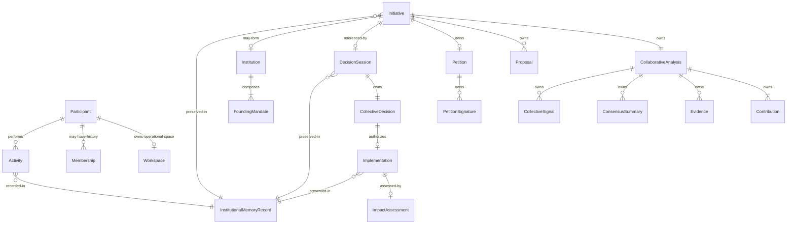

---

# 13. Lifecycles

## Participant

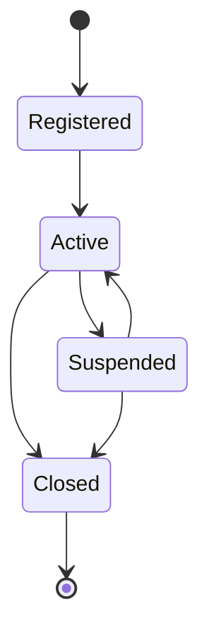

## Membership

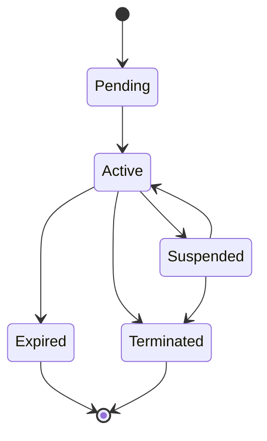

## Initiative

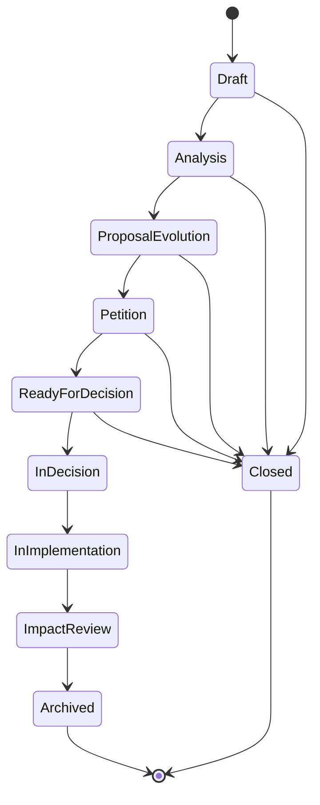

## Collaborative Analysis

Collaborative Analysis is an Entity lifecycle inside Initiative.

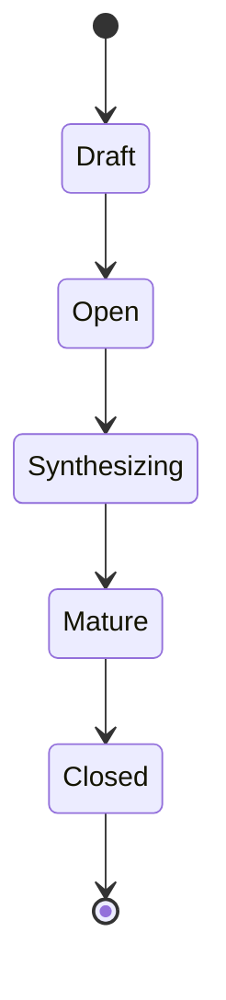

## Proposal Evolution

Proposal is an Entity lifecycle inside Initiative.

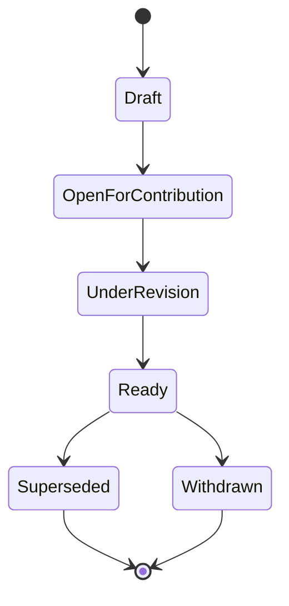

## Petition

Petition is an Entity lifecycle inside Initiative.

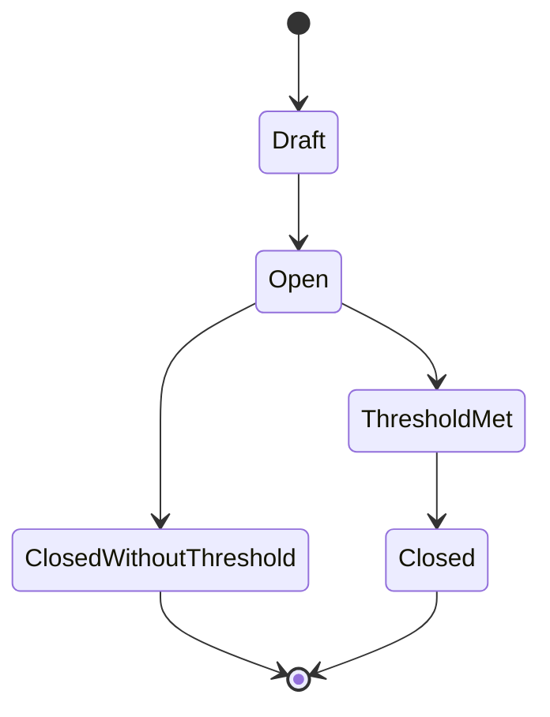

## Decision Session

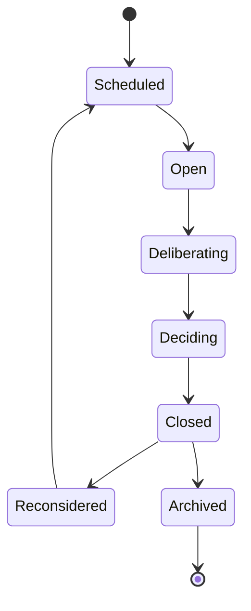

## Implementation

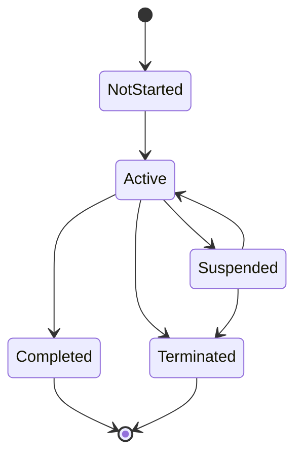

## Impact Assessment

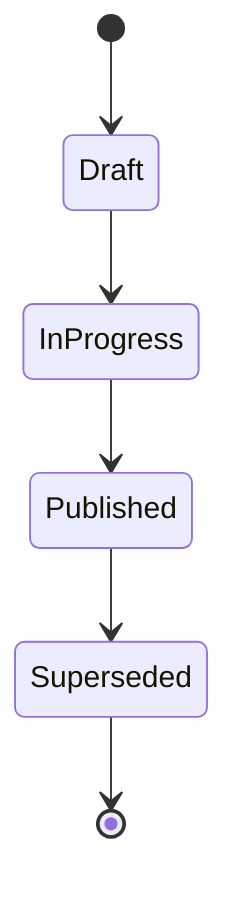

## Activity

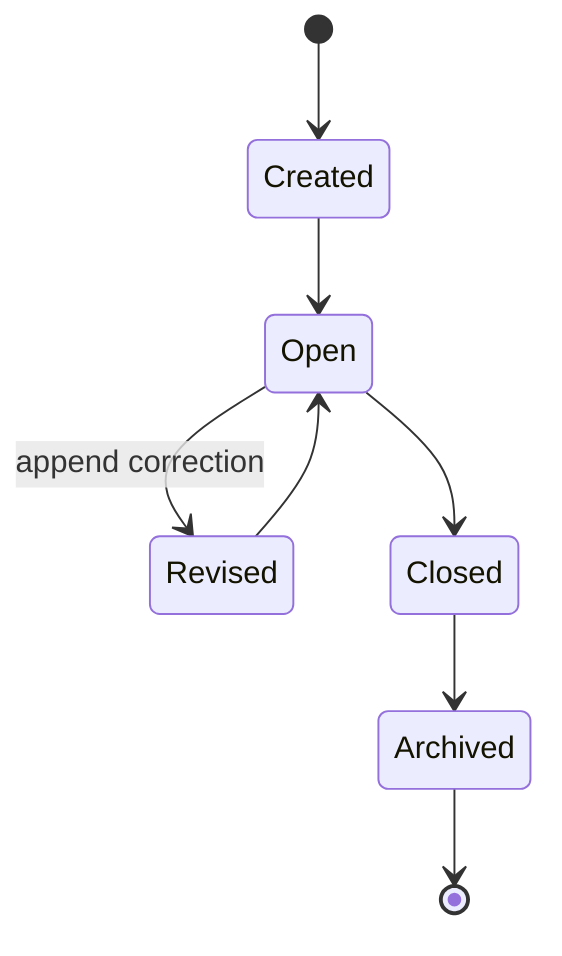

## Institution

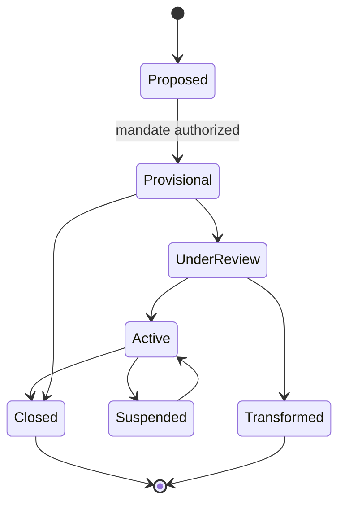

## Working Group

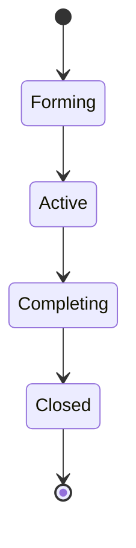

---

# 14. Domain Events

Canonical events are past tense and immutable. The authoritative catalogue is [CANONICAL_EVENT_CATALOGUE.md](./CANONICAL_EVENT_CATALOGUE.md).

The table below is an illustrative subset for Aggregate behaviour only.

| Event | Aggregate | Significance |
|---|---|---|
| `ParticipantRegistered` | Participant | Participant existence established |
| `ParticipantProfileUpdated` | Participant | Profile changed |
| `ResponsibilityProfileUpdated` | Participant | Civic responsibility configuration changed |
| `ParticipantSuspended` | Participant | Participation suspended |
| `MembershipRequested` | Membership | Optional membership lifecycle began |
| `MembershipActivated` | Membership | Membership became active |
| `WorkspaceInitialized` | Workspace | Private operational space created |
| `InitiativeCreated` | Initiative | Civic lifecycle began |
| `InitiativeOpenedForAnalysis` | Initiative | Collaborative Analysis began |
| `CollectiveSignalRecorded` | Initiative | Non-authoritative collective signal recorded |
| `ProposalEvolved` | Initiative | Proposal revision became current |
| `PetitionOpened` | Initiative | Petition stage began |
| `PetitionClosed` | Initiative | Petition stage ended |
| `InitiativeReadyForDecision` | Initiative | Initiative met readiness conditions |
| `InitiativeAdvancedToDecision` | Initiative | Decision context handoff authorized |
| `DecisionSessionScheduled` | DecisionSession | Formal decision process scheduled |
| `DecisionSessionOpened` | DecisionSession | Formal human process began |
| `CollectiveDecisionIssued` | DecisionSession | Authoritative outcome issued |
| `DecisionSessionClosed` | DecisionSession | Session completed |
| `ImplementationStarted` | Implementation | Authorized execution began |
| `ImplementationCompleted` | Implementation | Execution completed |
| `ImpactAssessmentPublished` | ImpactAssessment | Consequences documented |
| `ActivityCreated` | Activity | Historical trace began |
| `ActivityRevised` | Activity | Append-only correction added |
| `InstitutionCreated` | Institution | Provisional institution established |
| `InstitutionReviewed` | Institution | Review completed |
| `InstitutionClosed` | Institution | Institution terminated; history preserved |
| `InstitutionalMemoryAppended` | InstitutionalMemoryRecord | Reasoning preserved |
| `WorkingGroupCreated` | WorkingGroup | Temporary collaboration began |
| `FacilitationOutputProduced` | FacilitationOutput | Advisory AI output produced |

Events are facts. They do not command other Aggregates.

---

# 15. Consistency Boundaries

| Boundary | Rule |
|---|---|
| **Transactional consistency** | One Aggregate modified per transaction |
| **Aggregate boundary** | Invariants are enforced within one Aggregate load |
| **Cross-aggregate consistency** | Eventual via Domain Events and application orchestration |
| **Read models** | Search, Inbox, Analytics, Dashboard, and recommendations are eventually consistent projections |
| **Initiative boundary** | Proposal, Petition, Collaborative Analysis, and Collective Signals mutate only through Initiative |
| **Decision boundary** | Decision participation and Collective Decision mutate only through DecisionSession |
| **Implementation boundary** | Implementation progress mutates only through Implementation |
| **Historical boundary** | Activity and Institutional Memory preserve append-only historical integrity |

Example:

```text
CollectiveDecisionIssued
↓
Application orchestration
↓
StartImplementationCommand
↓
Implementation.start(collectiveDecisionId)
```

The DecisionSession Aggregate does not directly mutate Implementation.

---

# 16. Cross-Domain Interactions

| Pattern | Usage |
|---|---|
| **Command** | Application sends `AdvanceInitiativeToDecisionCommand` to Initiative |
| **Query** | Application queries Participant and read models for eligibility and responsibility routing |
| **Reference** | DecisionSession holds `InitiativeId`, not Initiative Entity |
| **Event** | `CollectiveDecisionIssued` is consumed to prepare Implementation |
| **Projection** | Activity, Search, Inbox, Analytics, and Dashboard update from Domain Events |

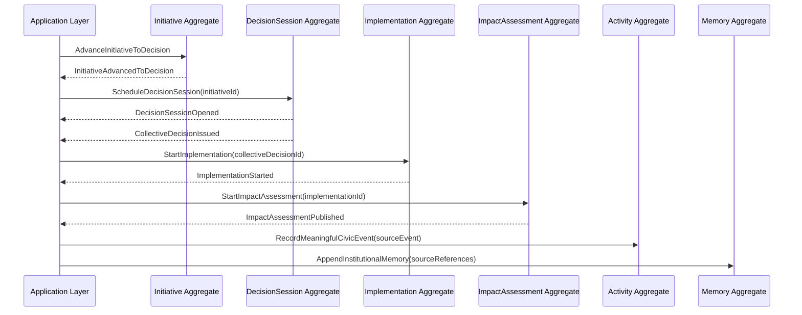

Cross-domain orchestration belongs to the Application Layer. Domain objects do not directly call one another across Aggregate boundaries.

---

# 17. AI Domain Position

| Rule | Description |
|---|---|
| **Outside core civic authority** | FacilitationOutput is advisory |
| **No direct Aggregate mutation** | AI cannot call lifecycle or authority methods on core Aggregates |
| **AI assists; humans decide** | AI may summarize, compare, classify, and facilitate; authorized human Participants decide |
| **Correctable outputs** | Corrections preserve prior output visibility |
| **Policy enforcement** | AiUsagePolicy rejects authority-encoding outputs |
| **Explicit uncertainty** | AI outputs include uncertainty and source boundaries |
| **No synthetic participation** | AI output is never Participant support, objection, signature, vote, or consensus |

AI cannot advance Initiative lifecycle, open or close a Decision Session, issue a Collective Decision, sign a Petition, record Participant support or objection, approve Implementation, create or expand institutional authority, erase dissent, or convert popularity into legitimacy.

AI Facilitation is a **supporting subdomain**, not part of the civic authority core.

---

# 18. Domain Diagrams

## 18.1 Aggregate Map

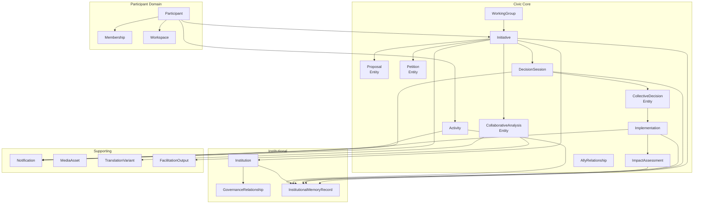

## 18.2 Context Relationships

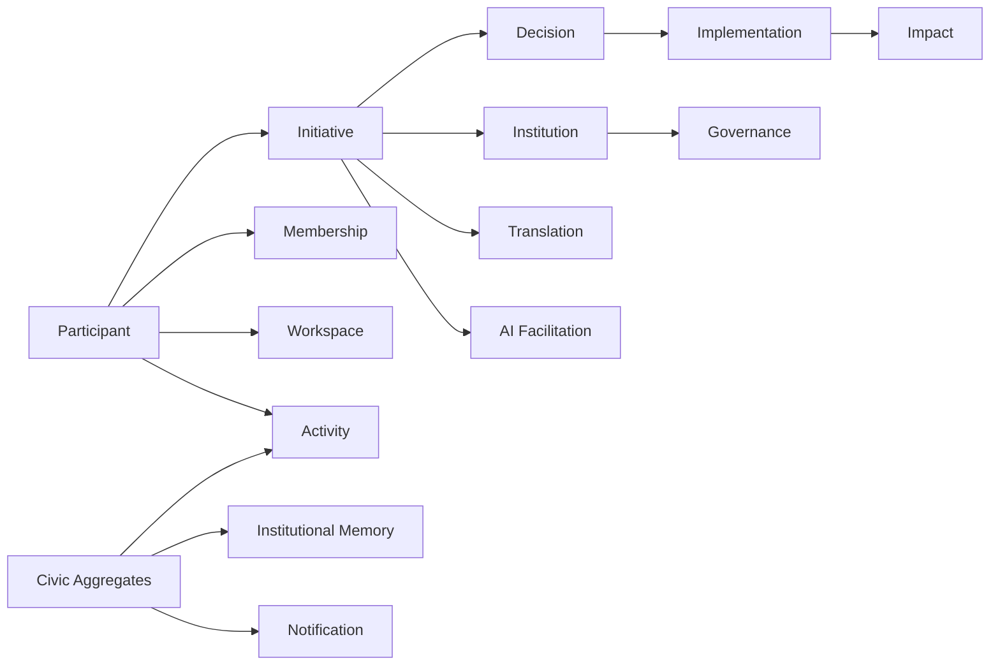

## 18.3 Initiative Internal Model

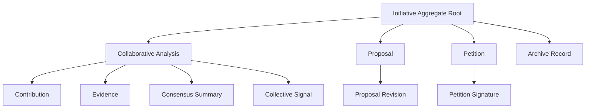

---

# 19. Anti-Patterns

| Anti-Pattern | Why Forbidden |
|---|---|
| **God Aggregate** | Violates consistency boundaries and hides ownership |
| **Initiative as God Aggregate** | Initiative is central but does not own DecisionSession, Implementation, ImpactAssessment, or Activity |
| **Shared mutable state** | Causes cross-context corruption |
| **Cross-context Entity ownership** | Two contexts must not mutate the same Entity |
| **Anemic domain model** | Rules leak to Application Layer and invariants are lost |
| **AI-controlled business rules** | Violates the human-authority boundary |
| **Duplicated business logic** | Same invariant diverges across contexts |
| **Repository returning internal Entities** | Breaks Aggregate encapsulation |
| **Direct Proposal mutation** | Proposal is owned by Initiative |
| **Direct Petition mutation** | Petition is owned by Initiative |
| **Direct CollectiveDecision mutation** | CollectiveDecision is owned by DecisionSession |
| **Decision Session embedded in Initiative** | Violates the accepted independent consistency boundary |
| **Activity as workflow engine** | Activity records history but does not govern lifecycle |
| **Collective Signal as authority** | Signal informs analysis but is not Proposal, Petition, or Decision |
| **Membership as universal participation requirement** | Participant is the universal actor |
| **Popularity as legitimacy** | Support counts do not automatically authorize action |
| **Decision from AI summary** | AI output is non-authoritative |
| **Erasing dissent through summaries** | Consensus summaries must preserve unresolved disagreement |

---

# 20. Related Documents

| Document | Relationship |
|---|---|
| [CANONICAL_EVENT_CATALOGUE.md](./CANONICAL_EVENT_CATALOGUE.md) | Authoritative Domain Event vocabulary and ownership |
| [00_UBIQUITOUS_LANGUAGE.md](./00_UBIQUITOUS_LANGUAGE.md) | Canonical terminology |
| [01_SYSTEM_ARCHITECTURE.md](./01_SYSTEM_ARCHITECTURE.md) | Bounded contexts and ownership |
| [03_INFORMATION_ARCHITECTURE.md](../blueprint/03_INFORMATION_ARCHITECTURE.md) | Platform spaces, domains, services, and navigation |
| [05_ACTIVITY_ENGINE_SPECIFICATION.md](../blueprint/05_ACTIVITY_ENGINE_SPECIFICATION.md) | Activity as immutable civic event ledger |
| [06_DISCUSSION_AND_COLLABORATION_MODEL.md](../blueprint/06_DISCUSSION_AND_COLLABORATION_MODEL.md) | Collaborative Analysis model |
| [12_DECISION_LIFECYCLE_ARCHITECTURE.md](../blueprint/12_DECISION_LIFECYCLE_ARCHITECTURE.md) | Decision Session and Collective Decision |
| [17_PROPOSAL_FRAMEWORK.md](../blueprint/17_PROPOSAL_FRAMEWORK.md) | Proposal Evolution and Petition |
| [18_HUMANITY_UNION_CORE_COLLABORATION_ARCHITECTURE.md](../blueprint/18_HUMANITY_UNION_CORE_COLLABORATION_ARCHITECTURE.md) | Initiative-centered collaboration architecture |
| [11_APPLICATION_WORKFLOWS.md](./11_APPLICATION_WORKFLOWS.md) | Cross-context orchestration |
| [ARCHITECTURE_VALIDATION_SCENARIOS.md](../validation/ARCHITECTURE_VALIDATION_SCENARIOS.md) | Behaviour validation |
| [ARCHITECTURE_DECISION_RECORDS.md](../architecture/ARCHITECTURE_DECISION_RECORDS.md) | Architecture decisions |
| [ENGINEERING_RELEASE_READINESS_REVIEW_v1.0.md](./ENGINEERING_RELEASE_READINESS_REVIEW_v1.0.md) | Release audit *(non-normative)* |

---

# 21. Guiding Principle

The Domain Model expresses the **civic reality** of Humanity Union.

Software components, databases, APIs, and infrastructure exist only to faithfully implement this model.

Initiative is the center of civic lifecycle.  
Participant is the universal actor.  
Membership is optional.  
Human authority is non-delegable to AI.  
Activity preserves history without governing workflow.

---

# 22. Domain Model Verification

| # | Verification | Status |
|---|---|---|
| 1 | Every Aggregate Root has clear ownership | ✓ Verified within this document |
| 2 | Every Entity belongs to exactly one Aggregate Root | ✓ Verified within this document |
| 3 | Every Value Object is immutable | ✓ Verified within this document |
| 4 | Every business invariant is explicit | ✓ Verified within this document |
| 5 | Domain Services contain domain logic, not orchestration | ✓ Verified within this document |
| 6 | Aggregate boundaries prevent inconsistent state | ✓ Verified within this document |
| 7 | Initiative is central without becoming a God Aggregate | ✓ Verified within this document |
| 8 | DecisionSession is an independent consistency boundary | ✓ Verified within this document |
| 9 | Proposal and Petition are internal Initiative Entities | ✓ Verified within this document |
| 10 | Membership is an independent optional Aggregate Root | ✓ Verified within this document |
| 11 | Activity is historical and not a workflow owner | ✓ Verified within this document |
| 12 | AI remains outside civic authority | ✓ Verified within this document |
| 13 | No new unsupported civic authority concept introduced | ✓ Verified within this document |
| 14 | Consistency with Ubiquitous Language | Pending synchronization audit |
| 15 | Consistency with System Architecture | Pending synchronization audit |
| 16 | Consistency with Canonical Event Catalogue | Pending synchronization audit |
| 17 | Consistency with Application Workflows | Pending synchronization audit |

---

**Document:** Humanity Union Domain Model  
**Version:** 2.0  
**Status:** Normative Engineering Document  
**Aggregate Roots:** 17 authoritative roots across core and supporting domains  
**Central Aggregate Root:** Initiative  
**Universal Actor:** Participant  
**Optional Status Aggregate:** Membership  
**Next Documents:** Ubiquitous Language synchronization, System Architecture synchronization, Canonical Event Catalogue synchronization, Application Workflow synchronization, API mapping, persistence mapping per Aggregate Root
