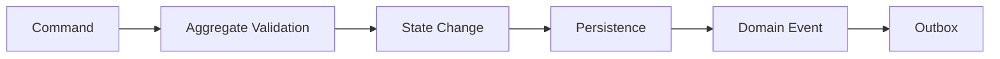
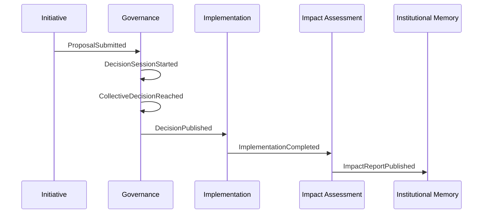

# Humanity Union Canonical Event Catalogue

## Version 2.0

### Single Authoritative Source for Domain Event Vocabulary

---

# Executive Summary

This document is the **normative single source of truth** for all **Domain Events** within the Humanity Union engineering architecture.

Every Domain Event defined here represents a completed business fact expressed in the Humanity Union Ubiquitous Language.

This catalogue establishes:

- the canonical names of all Domain Events;
- ownership of every Domain Event;
- Aggregate publication rules;
- event semantics;
- event lifecycle responsibilities;
- cross-context event consistency;
- engineering governance for event evolution.

No engineering document may redefine, rename, duplicate, or reinterpret any Domain Event defined within this catalogue.

All engineering artifacts—including the Domain Model, System Architecture, Application Workflows, APIs, databases, integration architecture, search, notifications, AI facilitation, and deployment—must reference this document instead of defining independent event vocabularies.

Commands express **intent**.

Domain Events express **completed business facts**.

---

## Status

Normative Engineering Standard

---

## Scope

This document defines:

- canonical Domain Event names;
- event ownership;
- Aggregate publication rules;
- event semantics;
- lifecycle responsibilities;
- event versioning;
- deprecation policy;
- engineering reference rules.

This catalogue does **not** define:

- commands;
- API contracts;
- transport protocols;
- event serialization;
- message brokers;
- infrastructure technologies;
- cloud providers;
- programming languages.

---

## Architectural Authority

This document is authoritative for:

- Domain Event vocabulary;
- Domain Event ownership;
- Aggregate publication rules;
- event naming;
- event lifecycle semantics.

Higher-level architectural authority remains:

1. Humanity Union Blueprint
2. Humanity Union Constitution
3. Charter of Ethical Technology
4. Ubiquitous Language
5. Domain Model

This catalogue derives all event definitions from those governing documents.

---

## Related Normative Documents

- `00_UBIQUITOUS_LANGUAGE.md`
- `01_SYSTEM_ARCHITECTURE.md`
- `02_DOMAIN_MODEL.md`
- `11_APPLICATION_WORKFLOWS.md`
- `EVENT_ARCHITECTURE.md`
- `API_ARCHITECTURE.md`
- `DATABASE_STRATEGY.md`
- `PERMISSIONS_AND_AUTHORIZATION.md`

---

# Table of Contents

1. Executive Summary
2. Document Purpose
3. Event Naming Principles
4. Event Classification
5. Canonical Domain Events — Master Index
6. Identity Context Events
7. Participant Context Events
8. Membership Context Events
9. Activity Context Events
10. Initiative Context Events
11. Working Groups Context Events
12. Governance Context Events
13. Implementation Context Events
14. Impact Assessment Context Events
15. Institution Context Events
16. Institutional Memory Context Events
17. Platform Services Events
18. Event Ownership
19. Event Versioning
20. Event Traceability
21. Engineering References
22. Architecture Diagrams
23. Anti-Patterns
24. Related Documents
25. Guiding Principle
26. Catalogue Verification
27. Document Metadata

---

# 1. Document Purpose

Every Domain Event has:

- exactly one canonical name;
- exactly one owning Aggregate;
- exactly one owning Bounded Context;
- exactly one business meaning.

Every Domain Event represents a business fact that has already occurred.

Events are immutable.

Events describe history.

Events never describe future intentions.

Commands request change.

Aggregates decide.

Domain Events record completed outcomes.

---

## Purpose of the Catalogue

This catalogue exists to ensure that every engineering team uses exactly the same event vocabulary.

The catalogue provides:

- semantic consistency;
- architectural consistency;
- implementation consistency;
- long-term maintainability;
- interoperability across bounded contexts.

Every engineering document shall reference this catalogue rather than redefining event names.

---

## Catalogue Responsibilities

This document defines:

- canonical Domain Event names;
- ownership rules;
- publication rules;
- event semantics;
- lifecycle notes;
- deprecation rules;
- versioning rules.

This document intentionally excludes:

- implementation details;
- infrastructure concerns;
- transport mechanisms;
- payload serialization;
- cloud infrastructure.

---

# 2. Event Naming Principles

Domain Events shall follow a single consistent naming convention.

---

## Naming Rules

| Principle | Rule |
|-----------|------|
| **Past Tense** | Events describe completed business facts (`ProposalSubmitted`) |
| **Business Language** | Event names use Humanity Union Ubiquitous Language |
| **Technology Independent** | No infrastructure terminology appears in event names |
| **Stable Vocabulary** | Existing event names never change meaning |
| **Immutable Meaning** | One event represents one business fact |
| **Single Responsibility** | Each event represents one completed outcome |
| **Aggregate Ownership** | Every event belongs to one Aggregate only |
| **Context Ownership** | Every event belongs to one Bounded Context only |

---

## Event Naming Pattern

Canonical naming convention:

```text
AggregateConcept + PastTenseVerb
```

Examples:

```text
ParticipantRegistered

MembershipActivated

InitiativeCreated

CollaborativeAnalysisStarted

ProposalSubmitted

PetitionOpened

DecisionSessionStarted

CollectiveDecisionReached

ImplementationCompleted

InstitutionCreated
```

---

## Forbidden Naming

The following patterns are prohibited:

```text
CreateProposalEvent

ProposalHandler

ProposalMessage

ProposalDTO

KafkaProposalSubmitted

ProposalPayload

WillApproveDecision

ApproveDecisionEvent
```

Events never describe:

- commands;
- handlers;
- DTOs;
- infrastructure;
- messaging;
- future intentions.

---

# 3. Event Classification

The Humanity Union Platform distinguishes several categories of events.

Only Domain Events are normatively defined in this catalogue.

---

## Event Categories

| Category | Purpose | Defined Here |
|----------|---------|--------------|
| **Domain Events** | Immutable business facts | ✓ Yes |
| **Integration Events** | External communication contracts | Reference only |
| **System Events** | Infrastructure and operational events | No |
| **Application Events** | Internal orchestration events | No |
| **Audit Events** | Security and compliance logging | No |

---

## Domain Events

Domain Events:

- originate from Aggregates;
- represent completed business facts;
- are immutable;
- are versioned;
- become part of institutional history.

Examples:

- InitiativeCreated
- ProposalSubmitted
- PetitionOpened
- CollectiveDecisionReached
- InstitutionCreated

---

## Integration Events

Integration Events:

- are derived from Domain Events;
- communicate with external systems;
- may evolve independently;
- never redefine business meaning.

Example:

```text
integration.initiative.created.v1
```

---

## System Events

System Events describe technical infrastructure.

Examples include:

- deployment completed;
- database backup completed;
- search index rebuilt;
- service restarted.

These are not civic business events.

---

## Application Events

Application Events coordinate workflows.

They exist only within the Application Layer.

They never replace Domain Events.

---

## Audit Events

Audit Events support:

- security;
- compliance;
- forensic investigation.

Audit Events are not business facts.

---

# 4. Domain Event Principles

Every Domain Event follows the same architectural rules.

---

## Event Lifecycle

```text
Command
      │
      ▼
Aggregate Validation
      │
      ▼
Business State Change
      │
      ▼
Domain Event Raised
      │
      ▼
Persisted
      │
      ▼
Published
      │
      ▼
Consumed
```

---

## Domain Event Rules

Every Domain Event:

- is immutable;
- has one owner;
- represents one business fact;
- is raised after successful Aggregate validation;
- is published after state persistence;
- may be consumed by many bounded contexts.

---

## Architectural Constraints

A Domain Event:

- cannot be raised directly by the UI;
- cannot be published by another bounded context;
- cannot bypass Aggregate invariants;
- cannot change after publication;
- cannot have multiple owners.

Only the owning Aggregate may publish its Domain Events.

---

## Relationship to the Domain Model

Every Domain Event originates from exactly one Aggregate Root defined in:

`02_DOMAIN_MODEL.md`

Every event belongs to exactly one Bounded Context defined in:

`01_SYSTEM_ARCHITECTURE.md`

The Ubiquitous Language governs every event name.

No event may introduce terminology absent from the Ubiquitous Language.

---

**End of Part 1/6**

**Next:** **Part 2/6 — Canonical Domain Events Master Index, Identity Context, Participant Context, Membership Context, and Activity Context.**

# 5. Canonical Domain Events — Master Index

The following table defines the complete canonical set of Domain Events currently recognized by the Humanity Union Platform.

Every event:

- has exactly one owning Aggregate;
- belongs to exactly one Bounded Context;
- represents exactly one completed business fact;
- follows the Humanity Union Ubiquitous Language.

---

## Master Index

| # | Canonical Event Name | Bounded Context | Aggregate | Status | Version |
|---|----------------------|-----------------|-----------|--------|---------|
| 1 | `ParticipantRegistered` | Identity | Identity | Active | 2.0 |
| 2 | `ParticipantAuthenticated` | Identity | Identity | Active | 2.0 |
| 3 | `ParticipantVerified` | Identity | IdentityVerification | Active | 2.0 |
| 4 | `IdentityVerificationRevoked` | Identity | IdentityVerification | Active | 2.0 |
| 5 | `ParticipantCreated` | Participant | Participant | Active | 2.0 |
| 6 | `ParticipantUpdated` | Participant | Participant | Active | 2.0 |
| 7 | `ParticipantProfilePublished` | Participant | Participant | Active | 2.0 |
| 8 | `MembershipGranted` | Membership | Membership | Active | 2.0 |
| 9 | `MembershipActivated` | Membership | Membership | Active | 2.0 |
| 10 | `MembershipSuspended` | Membership | Membership | Active | 2.0 |
| 11 | `MembershipExpired` | Membership | Membership | Active | 2.0 |
| 12 | `MembershipRevoked` | Membership | Active | 2.0 |
| 13 | `ActivityCreated` | Activity | Activity | Active | 2.0 |
| 14 | `ActivityPublished` | Activity | Activity | Active | 2.0 |
| 15 | `ActivityCorrected` | Activity | Activity | Active | 2.0 |
| 16 | `InitiativeCreated` | Initiative | Initiative | Active | 2.0 |
| 17 | `CollaborativeAnalysisStarted` | Initiative | Initiative | Active | 2.0 |
| 18 | `ContributionAdded` | Initiative | Initiative | Active | 2.0 |
| 19 | `EvidenceAdded` | Initiative | Initiative | Active | 2.0 |
| 20 | `ProposalSubmitted` | Initiative | Initiative | Active | 2.0 |
| 21 | `PetitionOpened` | Initiative | Initiative | Active | 2.0 |
| 22 | `PetitionClosed` | Initiative | Initiative | Active | 2.0 |
| 23 | `CollectiveSignalRecorded` | Initiative | Initiative | Active | 2.0 |
| 24 | `WorkingGroupCreated` | Working Groups | WorkingGroup | Active | 2.0 |
| 25 | `WorkingGroupJoined` | Working Groups | WorkingGroup | Active | 2.0 |
| 26 | `WorkingGroupRoleAssigned` | Working Groups | WorkingGroup | Active | 2.0 |
| 27 | `WorkingGroupClosed` | Working Groups | WorkingGroup | Active | 2.0 |
| 28 | `DecisionSessionStarted` | Governance | DecisionSession | Active | 2.0 |
| 29 | `VotingOpened` | Governance | DecisionSession | Active | 2.0 |
| 30 | `VotingClosed` | Governance | DecisionSession | Active | 2.0 |
| 31 | `CollectiveDecisionReached` | Governance | DecisionSession | Active | 2.0 |
| 32 | `DecisionPublished` | Governance | DecisionSession | Active | 2.0 |
| 33 | `ImplementationStarted` | Implementation | Implementation | Active | 2.0 |
| 34 | `MilestoneCompleted` | Implementation | Implementation | Active | 2.0 |
| 35 | `ImplementationCompleted` | Implementation | Implementation | Active | 2.0 |
| 36 | `ImplementationCancelled` | Implementation | Implementation | Active | 2.0 |
| 37 | `ImpactAssessmentStarted` | Impact Assessment | ImpactAssessment | Active | 2.0 |
| 38 | `ImpactAssessmentCompleted` | Impact Assessment | ImpactAssessment | Active | 2.0 |
| 39 | `ImpactReportPublished` | Impact Assessment | ImpactAssessment | Active | 2.0 |
| 40 | `InstitutionCreated` | Institution | Institution | Active | 2.0 |
| 41 | `InstitutionReviewed` | Institution | Institution | Active | 2.0 |
| 42 | `InstitutionUpdated` | Institution | Institution | Active | 2.0 |
| 43 | `InstitutionRetired` | Institution | Institution | Active | 2.0 |
| 44 | `InstitutionalMemoryAppended` | Institutional Memory | InstitutionalMemory | Active | 2.0 |
| 45 | `InstitutionalMemoryCorrected` | Institutional Memory | InstitutionalMemory | Active | 2.0 |
| 46 | `NotificationDelivered` | Notification | Notification | Active | 2.0 |
| 47 | `NotificationRead` | Notification | Notification | Active | 2.0 |
| 48 | `TranslationPublished` | Translation | TranslationVariant | Active | 2.0 |
| 49 | `TranslationCorrected` | Translation | TranslationVariant | Active | 2.0 |
| 50 | `MediaAssetPublished` | Media | MediaAsset | Active | 2.0 |
| 51 | `MediaAssetArchived` | Media | MediaAsset | Active | 2.0 |
| 52 | `FacilitationOutputProduced` | AI Facilitation | FacilitationOutput | Active | 2.0 |
| 53 | `FacilitationOutputCorrected` | AI Facilitation | FacilitationOutput | Active | 2.0 |

---

# 6. Identity Context Events

The Identity Context owns authentication and identity verification.

It does **not** own civic authority, Membership, or participation rights.

---

| Canonical Event Name | Aggregate | Business Meaning | Typical Consumers | Lifecycle Notes | Status | Version |
|----------------------|-----------|------------------|-------------------|-----------------|--------|---------|
| `ParticipantRegistered` | Identity | Identity successfully created | Participant, Membership | Beginning of identity lifecycle | Active | 2.0 |
| `ParticipantAuthenticated` | Identity | Authentication completed successfully | Application Services | Authentication only—not authorization | Active | 2.0 |
| `ParticipantVerified` | IdentityVerification | Identity verification completed | Membership, Initiative | Enables governed participation | Active | 2.0 |
| `IdentityVerificationRevoked` | IdentityVerification | Verification withdrawn | Membership, Governance | Identity remains; verification changes | Active | 2.0 |

---

## Identity Principles

Identity events:

- prove identity;
- establish authentication;
- establish verification status.

Identity events never:

- grant Membership;
- grant governance authority;
- grant voting rights.

---

# 7. Participant Context Events

The Participant Context owns the long-term civic representation of every participant.

---

| Canonical Event Name | Aggregate | Business Meaning | Typical Consumers | Lifecycle Notes | Status | Version |
|----------------------|-----------|------------------|-------------------|-----------------|--------|---------|
| `ParticipantCreated` | Participant | Civic participant established | Activity, Initiative | Initial civic profile created | Active | 2.0 |
| `ParticipantUpdated` | Participant | Participant information updated | Search, Notification | Public profile changes | Active | 2.0 |
| `ParticipantProfilePublished` | Participant | Public profile published | Search | Public visibility established | Active | 2.0 |

---

## Participant Principles

Participant events represent civic identity.

Participant events never:

- activate Membership;
- approve governance;
- modify Institutions.

---

# 8. Membership Context Events

Membership governs the civic relationship between a Participant and Humanity Union.

---

| Canonical Event Name | Aggregate | Business Meaning | Typical Consumers | Lifecycle Notes | Status | Version |
|----------------------|-----------|------------------|-------------------|-----------------|--------|---------|
| `MembershipGranted` | Membership | Membership approved | Initiative, Governance | Awaiting activation | Active | 2.0 |
| `MembershipActivated` | Membership | Membership becomes active | Initiative, Working Groups | Full civic participation enabled | Active | 2.0 |
| `MembershipSuspended` | Membership | Membership temporarily suspended | Governance, Notification | Identity remains unchanged | Active | 2.0 |
| `MembershipExpired` | Membership | Membership term completed | Governance | Renewable according to policy | Active | 2.0 |
| `MembershipRevoked` | Membership | Membership permanently removed | Governance, Notification | Historical record preserved | Active | 2.0 |

---

## Membership Principles

Membership events govern participation eligibility.

Membership is independent from:

- authentication;
- identity;
- public profile.

---

# 9. Activity Context Events

Activity records meaningful civic participation.

Activity preserves historical accountability.

---

| Canonical Event Name | Aggregate | Business Meaning | Typical Consumers | Lifecycle Notes | Status | Version |
|----------------------|-----------|------------------|-------------------|-----------------|--------|---------|
| `ActivityCreated` | Activity | Civic activity recorded | Initiative, Institutional Memory | Initial participation record | Active | 2.0 |
| `ActivityPublished` | Activity | Activity becomes publicly visible | Search, Analytics | Visibility may follow governance policy | Active | 2.0 |
| `ActivityCorrected` | Activity | Append-only correction applied | Institutional Memory, Audit | Original history preserved | Active | 2.0 |

---

## Activity Principles

Activity events:

- document participation;
- preserve accountability;
- support transparency.

Activity events never:

- change governance;
- modify Decisions;
- rewrite history.

Corrections are always append-only.

---

## Event Ownership Summary (Part 2)

| Bounded Context | Aggregate | Canonical Events |
|-----------------|-----------|------------------|
| Identity | Identity | ParticipantRegistered, ParticipantAuthenticated |
| Identity | IdentityVerification | ParticipantVerified, IdentityVerificationRevoked |
| Participant | Participant | ParticipantCreated, ParticipantUpdated, ParticipantProfilePublished |
| Membership | Membership | MembershipGranted, MembershipActivated, MembershipSuspended, MembershipExpired, MembershipRevoked |
| Activity | Activity | ActivityCreated, ActivityPublished, ActivityCorrected |

---

**End of Part 2/6**

**Next:** **Part 3/6 — Initiative Context, Working Groups Context, Governance Context, Implementation Context, and Impact Assessment Context.**

# 10. Initiative Context Events

The Initiative Context is the core civic collaboration domain of the Humanity Union Platform.

It owns the complete lifecycle from the creation of an Initiative through collaborative analysis, proposal development, petitions, and collective civic signals.

Formal governance begins only after the Initiative lifecycle reaches the Governance Context.

---

| Canonical Event Name | Aggregate | Business Meaning | Typical Consumers | Lifecycle Notes | Status | Version |
|----------------------|-----------|------------------|-------------------|-----------------|--------|---------|
| `InitiativeCreated` | Initiative | New Initiative established | Activity, Working Groups, Search | Beginning of Initiative lifecycle | Active | 2.0 |
| `CollaborativeAnalysisStarted` | Initiative | Structured collaborative analysis initiated | AI Facilitation, Search, Notification | Opens evidence gathering | Active | 2.0 |
| `ContributionAdded` | Initiative | Participant contribution recorded | Activity, AI Facilitation | Includes suggestions, comments and structured contributions | Active | 2.0 |
| `EvidenceAdded` | Initiative | Supporting evidence attached | AI Facilitation, Search | Evidence becomes part of collaborative analysis | Active | 2.0 |
| `ProposalSubmitted` | Initiative | Proposal formally submitted | Governance | Proposal becomes eligible for governance review | Active | 2.0 |
| `PetitionOpened` | Initiative | Petition opened for civic support | Notification, Search | Begins support collection | Active | 2.0 |
| `PetitionClosed` | Initiative | Petition completed | Governance | Final support recorded | Active | 2.0 |
| `CollectiveSignalRecorded` | Initiative | Civic signal recorded | Analytics, AI Facilitation | Represents non-binding civic sentiment | Active | 2.0 |

---

## Initiative Event Lifecycle

```text
InitiativeCreated
        │
        ▼
CollaborativeAnalysisStarted
        │
        ▼
ContributionAdded
        │
        ▼
EvidenceAdded
        │
        ▼
ProposalSubmitted
        │
        ▼
PetitionOpened
        │
        ▼
PetitionClosed
```

Formal governance begins after the Initiative lifecycle completes.

---

## Initiative Principles

Initiative events:

- coordinate civic collaboration;
- organize evidence;
- support proposal evolution;
- collect civic support.

Initiative events never:

- approve Decisions;
- create Institutions;
- execute Implementation.

Those responsibilities belong to independent bounded contexts.

---

# 11. Working Groups Context Events

Working Groups coordinate Participants collaborating toward shared civic objectives.

Working Groups facilitate collaboration but possess no governing authority.

---

| Canonical Event Name | Aggregate | Business Meaning | Typical Consumers | Lifecycle Notes | Status | Version |
|----------------------|-----------|------------------|-------------------|-----------------|--------|---------|
| `WorkingGroupCreated` | WorkingGroup | Working Group established | Notification, Search | Group created around an Initiative or Institution | Active | 2.0 |
| `WorkingGroupJoined` | WorkingGroup | Participant joined Working Group | Activity | Membership recorded | Active | 2.0 |
| `WorkingGroupRoleAssigned` | WorkingGroup | Working Group role assigned | Notification | Coordinator or responsibility assignment | Active | 2.0 |
| `WorkingGroupClosed` | WorkingGroup | Working Group completed | Institutional Memory | Collaboration history preserved | Active | 2.0 |

---

## Working Group Principles

Working Group events:

- coordinate collaboration;
- assign responsibilities;
- preserve participation history.

Working Groups never:

- publish Collective Decisions;
- modify governance;
- authorize Institutions.

---

# 12. Governance Context Events

The Governance Context owns every authoritative collective decision.

No other bounded context may publish governance outcomes.

---

| Canonical Event Name | Aggregate | Business Meaning | Typical Consumers | Lifecycle Notes | Status | Version |
|----------------------|-----------|------------------|-------------------|-----------------|--------|---------|
| `DecisionSessionStarted` | DecisionSession | Formal decision process initiated | Notification | Governance process begins | Active | 2.0 |
| `VotingOpened` | DecisionSession | Voting officially opened | Notification | Eligible Participants may vote | Active | 2.0 |
| `VotingClosed` | DecisionSession | Voting completed | Governance Services | Vote collection finished | Active | 2.0 |
| `CollectiveDecisionReached` | DecisionSession | Collective Decision approved according to governance rules | Implementation, Institution | Primary governance outcome | Active | 2.0 |
| `DecisionPublished` | DecisionSession | Final decision published | Search, Institutional Memory | Official public publication | Active | 2.0 |

---

## Governance Event Lifecycle

```text
DecisionSessionStarted
        │
        ▼
VotingOpened
        │
        ▼
VotingClosed
        │
        ▼
CollectiveDecisionReached
        │
        ▼
DecisionPublished
```

---

## Governance Principles

Governance events:

- represent human collective authority;
- follow approved governance procedures;
- establish official civic outcomes.

Governance events never:

- originate from AI;
- originate from Participants directly;
- bypass Decision Sessions.

---

# 13. Implementation Context Events

Implementation coordinates execution of approved Collective Decisions.

Execution begins only after governance authorization.

---

| Canonical Event Name | Aggregate | Business Meaning | Typical Consumers | Lifecycle Notes | Status | Version |
|----------------------|-----------|------------------|-------------------|-----------------|--------|---------|
| `ImplementationStarted` | Implementation | Authorized implementation initiated | Activity, Notification | Requires published Collective Decision | Active | 2.0 |
| `MilestoneCompleted` | Implementation | Planned milestone completed | Notification, Analytics | Intermediate execution progress | Active | 2.0 |
| `ImplementationCompleted` | Implementation | Execution successfully completed | Impact Assessment, Institutional Memory | Operational work finished | Active | 2.0 |
| `ImplementationCancelled` | Implementation | Implementation terminated | Institutional Memory | Historical record preserved | Active | 2.0 |

---

## Implementation Principles

Implementation events:

- execute approved Decisions;
- coordinate operational work;
- report execution progress.

Implementation events never:

- reinterpret governance;
- create new Decisions;
- authorize Institutions.

---

# 14. Impact Assessment Context Events

Impact Assessment evaluates the outcomes of completed implementations.

Assessment provides institutional learning rather than governance.

---

| Canonical Event Name | Aggregate | Business Meaning | Typical Consumers | Lifecycle Notes | Status | Version |
|----------------------|-----------|------------------|-------------------|-----------------|--------|---------|
| `ImpactAssessmentStarted` | ImpactAssessment | Evaluation process initiated | Analytics | Begins after Implementation completion | Active | 2.0 |
| `ImpactAssessmentCompleted` | ImpactAssessment | Assessment finalized | Institutional Memory | Evaluation completed | Active | 2.0 |
| `ImpactReportPublished` | ImpactAssessment | Assessment results published | Search, Notification | Public report available | Active | 2.0 |

---

## Impact Assessment Lifecycle

```text
ImplementationCompleted
        │
        ▼
ImpactAssessmentStarted
        │
        ▼
ImpactAssessmentCompleted
        │
        ▼
ImpactReportPublished
```

---

## Impact Assessment Principles

Impact Assessment events:

- measure effectiveness;
- preserve institutional learning;
- support future Initiatives.

Impact Assessment events never:

- modify historical Decisions;
- invalidate governance;
- rewrite Implementation history.

---

# Event Ownership Summary (Part 3)

| Bounded Context | Aggregate | Canonical Events |
|-----------------|-----------|------------------|
| Initiative | Initiative | InitiativeCreated, CollaborativeAnalysisStarted, ContributionAdded, EvidenceAdded, ProposalSubmitted, PetitionOpened, PetitionClosed, CollectiveSignalRecorded |
| Working Groups | WorkingGroup | WorkingGroupCreated, WorkingGroupJoined, WorkingGroupRoleAssigned, WorkingGroupClosed |
| Governance | DecisionSession | DecisionSessionStarted, VotingOpened, VotingClosed, CollectiveDecisionReached, DecisionPublished |
| Implementation | Implementation | ImplementationStarted, MilestoneCompleted, ImplementationCompleted, ImplementationCancelled |
| Impact Assessment | ImpactAssessment | ImpactAssessmentStarted, ImpactAssessmentCompleted, ImpactReportPublished |

---

**End of Part 3/6**

**Next:** **Part 4/6 — Institution Context, Institutional Memory Context, Notification, Translation, Media, and AI Facilitation Events.**

# 15. Institution Context Events

The Institution Context governs the lifecycle of formal Humanity Union institutions.

Institutions represent permanent organizational structures established through governed processes.

Institutions derive their authority from Collective Decisions and the Humanity Union Constitution.

---

| Canonical Event Name | Aggregate | Business Meaning | Typical Consumers | Lifecycle Notes | Status | Version |
|----------------------|-----------|------------------|-------------------|-----------------|--------|---------|
| `InstitutionCreated` | Institution | Institution officially established | Notification, Search, Institutional Memory | Beginning of institutional lifecycle | Active | 2.0 |
| `InstitutionReviewed` | Institution | Formal institutional review completed | Governance, Institutional Memory | Scheduled or extraordinary review | Active | 2.0 |
| `InstitutionUpdated` | Institution | Governed institutional structure updated | Search, Notification | Changes approved through governance | Active | 2.0 |
| `InstitutionRetired` | Institution | Institution permanently retired | Institutional Memory | Historical record preserved indefinitely | Active | 2.0 |

---

## Institution Event Lifecycle

```text
InstitutionCreated
        │
        ▼
InstitutionReviewed
        │
        ▼
InstitutionUpdated
        │
        ▼
InstitutionRetired
```

---

## Institution Principles

Institution events:

- govern organizational structures;
- preserve institutional continuity;
- maintain constitutional accountability.

Institution events never:

- create Participants;
- approve Collective Decisions;
- execute Implementations.

Institutions evolve only through governed constitutional procedures.

---

# 16. Institutional Memory Context Events

Institutional Memory preserves the permanent historical record of Humanity Union.

It provides long-term organizational knowledge while preserving complete historical integrity.

Institutional Memory is append-only.

Historical records are never deleted.

---

| Canonical Event Name | Aggregate | Business Meaning | Typical Consumers | Lifecycle Notes | Status | Version |
|----------------------|-----------|------------------|-------------------|-----------------|--------|---------|
| `InstitutionalMemoryAppended` | InstitutionalMemory | New institutional knowledge permanently recorded | Search, AI Facilitation, Audit | Permanent historical record | Active | 2.0 |
| `InstitutionalMemoryCorrected` | InstitutionalMemory | Correction appended without altering previous history | Audit, Search | Original records remain intact | Active | 2.0 |

---

## Institutional Memory Principles

Institutional Memory:

- preserves organizational learning;
- protects historical integrity;
- supports transparency;
- enables long-term civic accountability.

Institutional Memory never:

- deletes history;
- rewrites previous events;
- modifies Aggregate state.

Corrections are always additive.

---

# 17. Platform Services Events

Platform Services support the Humanity Union Platform but never exercise civic authority.

They react to Domain Events published by business Aggregates.

Platform Services are divided into:

- Notification
- Translation
- Media
- AI Facilitation

---

# 17.1 Notification Events

Notifications communicate information to Participants.

Notifications never represent business authority.

---

| Canonical Event Name | Aggregate | Business Meaning | Typical Consumers | Lifecycle Notes | Status | Version |
|----------------------|-----------|------------------|-------------------|-----------------|--------|---------|
| `NotificationDelivered` | Notification | Notification successfully delivered | Analytics, Audit | Derived from business events | Active | 2.0 |
| `NotificationRead` | Notification | Participant viewed notification | Analytics | Reading does not imply action | Active | 2.0 |

---

## Notification Principles

Notification events:

- communicate information;
- support participant awareness;
- record delivery status.

Notification events never:

- approve governance;
- change Membership;
- modify Domain state.

---

# 17.2 Translation Events

Translation provides multilingual access while preserving authoritative meaning.

Translations never replace the original content.

---

| Canonical Event Name | Aggregate | Business Meaning | Typical Consumers | Lifecycle Notes | Status | Version |
|----------------------|-----------|------------------|-------------------|-----------------|--------|---------|
| `TranslationPublished` | TranslationVariant | Localized version published | Search, Notification | Linked to authoritative original | Active | 2.0 |
| `TranslationCorrected` | TranslationVariant | Translation corrected | Search | Original language preserved | Active | 2.0 |

---

## Translation Principles

Translations:

- improve accessibility;
- preserve semantic integrity;
- maintain linkage to authoritative content.

Translation events never:

- alter governance;
- replace original records;
- redefine business meaning.

---

# 17.3 Media Events

Media provides visual and multimedia resources supporting civic participation.

Media metadata belongs to the domain.

Binary files remain infrastructure concerns.

---

| Canonical Event Name | Aggregate | Business Meaning | Typical Consumers | Lifecycle Notes | Status | Version |
|----------------------|-----------|------------------|-------------------|-----------------|--------|---------|
| `MediaAssetPublished` | MediaAsset | Media resource published | Search, Activity | Metadata becomes available | Active | 2.0 |
| `MediaAssetArchived` | MediaAsset | Media resource archived | Search | Historical metadata preserved | Active | 2.0 |

---

## Media Principles

Media events:

- publish civic media;
- preserve discoverability;
- support public participation.

Media events never:

- create business authority;
- influence governance;
- alter institutional history.

---

# 17.4 AI Facilitation Events

Artificial Intelligence provides advisory assistance only.

AI never exercises civic authority.

AI never creates governance outcomes.

AI never publishes constitutional decisions.

---

| Canonical Event Name | Aggregate | Business Meaning | Typical Consumers | Lifecycle Notes | Status | Version |
|----------------------|-----------|------------------|-------------------|-----------------|--------|---------|
| `FacilitationOutputProduced` | FacilitationOutput | Advisory recommendation generated | Participant UI, Audit | Informational only | Active | 2.0 |
| `FacilitationOutputCorrected` | FacilitationOutput | Advisory output corrected | Audit | Original recommendation retained | Active | 2.0 |

---

## AI Facilitation Principles

AI may:

- summarize discussions;
- organize evidence;
- identify similar initiatives;
- assist Participants;
- recommend improvements.

AI may never:

- approve Proposals;
- approve Petitions;
- approve Collective Decisions;
- authorize Implementations;
- create Institutions;
- modify Institutional Memory.

Human governance remains the sole source of civic authority.

---

# Platform Services Architecture

```text
Business Aggregates
        │
        ▼
Domain Events
        │
        ▼
────────────────────────────────────
Platform Services
────────────────────────────────────
        │
        ├── Notification
        │
        ├── Translation
        │
        ├── Media
        │
        └── AI Facilitation
```

Platform Services consume Domain Events.

They never become owners of business processes.

---

# Event Ownership Summary (Part 4)

| Bounded Context | Aggregate | Canonical Events |
|-----------------|-----------|------------------|
| Institution | Institution | InstitutionCreated, InstitutionReviewed, InstitutionUpdated, InstitutionRetired |
| Institutional Memory | InstitutionalMemory | InstitutionalMemoryAppended, InstitutionalMemoryCorrected |
| Notification | Notification | NotificationDelivered, NotificationRead |
| Translation | TranslationVariant | TranslationPublished, TranslationCorrected |
| Media | MediaAsset | MediaAssetPublished, MediaAssetArchived |
| AI Facilitation | FacilitationOutput | FacilitationOutputProduced, FacilitationOutputCorrected |

---

## Cross-Context Authority Boundary

The Humanity Union architecture distinguishes between authoritative Domain Events and supporting Platform Service Events.

```text
Business Contexts
        │
        ▼
Domain Events
        │
        ▼
Platform Services
        │
        ▼
Participant Experience
```

Business authority always remains within the business bounded contexts.

Platform Services only observe, enrich, communicate, and assist.

---

**End of Part 4/6**

**Next:** **Part 5/6 — Event Ownership, Event Versioning, Event Traceability, Engineering References, Architecture Diagrams, and Anti-Patterns.**

# 18. Event Ownership

Every Domain Event has exactly one owner.

Ownership is determined by the Aggregate that successfully completed the business transaction resulting in the event.

Only the owning Aggregate may publish its Domain Events.

Consumers may react to Domain Events but may never redefine, republish, or reinterpret them.

---

## Ownership Rules

| Rule | Description |
|------|-------------|
| **Single Owner** | Every Domain Event belongs to exactly one Aggregate Root |
| **Single Context** | Every Domain Event belongs to exactly one Bounded Context |
| **Aggregate Authority** | Only the owning Aggregate may publish the event |
| **Immutable Ownership** | Event ownership never changes during the lifetime of the platform |
| **Consumers Never Publish** | Subscribers consume events but never republish them as business facts |
| **No UI Publication** | User interfaces never create Domain Events directly |
| **No Cross-Context Publication** | One Bounded Context cannot publish another Context's events |

---

## Event Ownership Summary

| Bounded Context | Aggregate Root | Published Domain Events |
|-----------------|----------------|--------------------------|
| Identity | Identity | ParticipantRegistered, ParticipantAuthenticated |
| Identity | IdentityVerification | ParticipantVerified, IdentityVerificationRevoked |
| Participant | Participant | ParticipantCreated, ParticipantUpdated, ParticipantProfilePublished |
| Membership | Membership | MembershipGranted, MembershipActivated, MembershipSuspended, MembershipExpired, MembershipRevoked |
| Activity | Activity | ActivityCreated, ActivityPublished, ActivityCorrected |
| Initiative | Initiative | InitiativeCreated, CollaborativeAnalysisStarted, ContributionAdded, EvidenceAdded, ProposalSubmitted, PetitionOpened, PetitionClosed, CollectiveSignalRecorded |
| Working Groups | WorkingGroup | WorkingGroupCreated, WorkingGroupJoined, WorkingGroupRoleAssigned, WorkingGroupClosed |
| Governance | DecisionSession | DecisionSessionStarted, VotingOpened, VotingClosed, CollectiveDecisionReached, DecisionPublished |
| Implementation | Implementation | ImplementationStarted, MilestoneCompleted, ImplementationCompleted, ImplementationCancelled |
| Impact Assessment | ImpactAssessment | ImpactAssessmentStarted, ImpactAssessmentCompleted, ImpactReportPublished |
| Institution | Institution | InstitutionCreated, InstitutionReviewed, InstitutionUpdated, InstitutionRetired |
| Institutional Memory | InstitutionalMemory | InstitutionalMemoryAppended, InstitutionalMemoryCorrected |
| Notification | Notification | NotificationDelivered, NotificationRead |
| Translation | TranslationVariant | TranslationPublished, TranslationCorrected |
| Media | MediaAsset | MediaAssetPublished, MediaAssetArchived |
| AI Facilitation | FacilitationOutput | FacilitationOutputProduced, FacilitationOutputCorrected |

---

## Aggregate Publication Rule

A Domain Event may be published only after:

1. Aggregate invariants are satisfied.
2. Business state has been successfully changed.
3. Transaction has been committed.
4. Event has been persisted.
5. Publication has been scheduled.

The publication sequence is therefore:

```text
Command

↓

Aggregate

↓

Invariant Validation

↓

State Change

↓

Commit

↓

Domain Event

↓

Outbox

↓

Publication
```

---

# 19. Event Versioning

The Humanity Union Platform is expected to evolve over many years.

Domain Events therefore require controlled evolution without compromising historical consistency.

---

## Versioning Principles

| Principle | Description |
|-----------|-------------|
| **Immutable Meaning** | Existing event meaning never changes |
| **Backward Compatibility** | Minor versions may add optional metadata only |
| **Breaking Changes** | Require new catalogue version |
| **No Silent Renaming** | Existing event names are permanent |
| **Schema Evolution** | Payload evolves independently of business meaning |

---

## Catalogue Version

This document defines:

```text
Canonical Event Catalogue

Version 2.0
```

The catalogue version reflects the authoritative business vocabulary.

---

## Event Schema Version

Every published event should contain:

```text
schemaVersion
```

Example

```json
{
    "eventName": "InitiativeCreated",
    "schemaVersion": "2.0"
}
```

Schema version affects payload structure only.

It never changes business semantics.

---

## Version Evolution Rules

| Change | Allowed |
|---------|----------|
| Add optional field | ✓ |
| Add metadata | ✓ |
| Improve documentation | ✓ |
| Rename event | ✗ |
| Change business meaning | ✗ |
| Change Aggregate ownership | ✗ |
| Change Bounded Context | ✗ |

---

# 20. Event Traceability

Every Domain Event must be traceable throughout the architecture.

Events connect every layer of the platform while preserving business integrity.

---

## Traceability Chain

```text
Participant

↓

Command

↓

Aggregate

↓

Domain Event

↓

Integration Event

↓

Consumers

↓

Institutional Memory
```

---

## Traceability Relationships

| Concern | Relationship |
|----------|--------------|
| Aggregate | Raises Domain Event |
| Integration | Maps Domain Event externally |
| Notification | Reacts to Domain Event |
| Search | Updates projections |
| Analytics | Builds reports |
| AI Facilitation | Produces advisory outputs |
| Institutional Memory | Preserves historical facts |
| Audit | Records execution history |

---

## Correlation Metadata

Every Domain Event should support the following metadata.

| Field | Purpose |
|--------|---------|
| EventId | Globally unique event identifier |
| AggregateId | Aggregate Root identifier |
| AggregateVersion | Optimistic concurrency version |
| CorrelationId | Links complete business workflow |
| CausationId | Parent event identifier |
| OccurredAt | UTC timestamp |
| PublishedAt | Publication timestamp |
| SchemaVersion | Payload version |

---

# 21. Engineering References

This catalogue is the authoritative reference for all Domain Events.

Engineering documents shall reference this catalogue instead of defining independent vocabularies.

---

## Reference Rule

Every engineering document must use:

```markdown
Domain Events conform to
CANONICAL_EVENT_CATALOGUE.md
```

No document may redefine:

- event names;
- Aggregate ownership;
- event semantics;
- lifecycle terminology.

---

## Documents Required to Conform

| Document | Dependency |
|----------|------------|
| 00_UBIQUITOUS_LANGUAGE.md | Event terminology |
| 01_SYSTEM_ARCHITECTURE.md | Bounded Context ownership |
| 02_DOMAIN_MODEL.md | Aggregate ownership |
| API Architecture | Commands and integration |
| Database Strategy | Persistence |
| Event Architecture | Publication |
| Permission Model | Authorization reactions |
| Search Architecture | Projections |
| Notification Architecture | Notification derivation |
| AI Integration | Advisory event boundaries |
| Application Workflows | Business lifecycle |

---

# 22. Architecture Diagrams

---

## 22.1 Aggregate → Domain Event



---

## 22.2 Domain Event Lifecycle

```mermaid
flowchart TB

Command

↓

Aggregate

↓

Business Rules

↓

State Updated

↓

Domain Event Raised

↓

Persisted

↓

Published
```

---

## 22.3 Cross-Context Flow



---

## 22.4 Platform Services

```mermaid
flowchart LR

Business

↓

Domain Events

↓

Notification

Translation

Media

AI Facilitation
```

Platform Services consume Domain Events.

They never own business authority.

---

# 23. Anti-Patterns

The following architectural practices are prohibited.

---

## Forbidden Practices

| Anti-Pattern | Reason |
|--------------|--------|
| Renaming canonical events | Breaks architectural consistency |
| Duplicate event names | Ambiguous business meaning |
| Technology-specific event names | Couples business to infrastructure |
| Multiple Aggregate owners | Violates DDD |
| Multiple Context owners | Violates bounded contexts |
| Commands named as events | Blurs business semantics |
| Future-tense events | Events describe completed facts |
| UI publishing Domain Events | Breaks Aggregate authority |
| AI publishing governance events | Violates constitutional authority |
| Modifying historical events | Breaks immutable history |
| Deleting Domain Events | Violates auditability |

---

## Examples of Forbidden Names

```text
CreateProposalEvent

ApproveDecision

WillStartVoting

KafkaProposalSubmitted

ProposalDTO

ProposalMessage

DecisionHandler

InstitutionCommand
```

---

## Approved Examples

```text
ProposalSubmitted

VotingOpened

CollectiveDecisionReached

InstitutionCreated

ImplementationCompleted

ImpactReportPublished
```

---

## Architectural Principle

A Domain Event is a historical business fact.

It is not:

- a request;
- an API;
- a message format;
- a notification;
- a database record;
- a UI action.

Its purpose is to preserve the truth of the business domain.

---

**End of Part 5/6**

**Next:** **Part 6/6 — Related Documents, Guiding Principle, Catalogue Verification, Document Metadata, Final Statement.**

# 24. Related Documents

The Canonical Event Catalogue is one of the core normative engineering standards of the Humanity Union Platform.

It defines the authoritative vocabulary for every Domain Event used throughout the platform.

Every related engineering document must remain fully synchronized with this catalogue.

---

## Core Architecture Documents

| Document | Responsibility |
|----------|----------------|
| `00_UBIQUITOUS_LANGUAGE.md` | Defines the common business language used by all engineering artifacts. |
| `01_SYSTEM_ARCHITECTURE.md` | Defines Bounded Contexts and their responsibilities. |
| `02_DOMAIN_MODEL.md` | Defines Aggregates, Entities, Value Objects, and lifecycle rules. |
| `03_APPLICATION_ARCHITECTURE.md` | Defines application services, commands, queries, and orchestration. |
| `04_DATABASE_STRATEGY.md` | Defines persistence, projections, repositories, and storage strategy. |
| `05_EVENT_ARCHITECTURE.md` | Defines publication, integration, outbox, and event delivery mechanisms. |
| `06_PERMISSION_MODEL.md` | Defines authorization, governance permissions, and policy enforcement. |
| `07_NOTIFICATION_ARCHITECTURE.md` | Defines notification derivation from Domain Events. |
| `08_SEARCH_ARCHITECTURE.md` | Defines search indexing and projection strategy. |
| `09_AI_INTEGRATION.md` | Defines AI boundaries, advisory services, and facilitation rules. |
| `10_DEPLOYMENT_ARCHITECTURE.md` | Defines deployment topology and operational architecture. |

---

## Supporting Governance Documents

| Document | Responsibility |
|----------|----------------|
| `ARCHITECTURE_DECISION_RECORDS.md` | Records architectural decisions affecting Domain Events. |
| `ARCHITECTURE_VALIDATION_SCENARIOS.md` | Validates architectural behaviour and business workflows. |
| `ENGINEERING_CONSISTENCY_REVIEW.md` | Reviews engineering consistency across the platform. |
| Humanity Union Blueprint | Defines overall platform vision. |
| Humanity Union Constitution | Defines constitutional governance. |
| Charter of Ethical Technology | Defines ethical engineering principles. |

---

## Dependency Hierarchy

```text
Blueprint
        │
        ▼
Constitution
        │
        ▼
Charter of Ethical Technology
        │
        ▼
Ubiquitous Language
        │
        ▼
System Architecture
        │
        ▼
Domain Model
        │
        ▼
Canonical Event Catalogue
        │
        ▼
Application Architecture
        │
        ▼
Infrastructure
```

The Canonical Event Catalogue derives its terminology from the Ubiquitous Language and its ownership model from the Domain Model.

---

# 25. Guiding Principle

Every completed business fact has exactly one canonical Domain Event.

Every Domain Event has:

- one canonical name;
- one business meaning;
- one Aggregate owner;
- one Bounded Context;
- one publication authority.

Every engineering document shall reference this catalogue rather than redefining event vocabulary.

Consistency of Domain Events preserves:

- architectural integrity;
- business consistency;
- interoperability;
- maintainability;
- long-term institutional knowledge.

---

## Engineering Philosophy

Business language is more durable than technology.

Infrastructure evolves.

Programming languages evolve.

Frameworks evolve.

Databases evolve.

Cloud providers evolve.

The Humanity Union business domain endures.

The Domain Event vocabulary therefore remains stable and independent of implementation technologies.

---

## Architectural Principles

The Humanity Union Platform follows these principles:

- Domain-Driven Design
- Event-Driven Architecture
- Clean Architecture
- Hexagonal Architecture
- CQRS where appropriate
- Event Sourcing compatibility
- Append-only historical integrity
- Constitutional governance
- Human-centered decision making

Every Domain Event defined in this catalogue supports these principles.

---

# 26. Catalogue Verification

The following verification checklist confirms the integrity and completeness of Version 2.0.

---

## Domain Event Verification

| # | Verification | Status |
|---|--------------|--------|
| 1 | Every Domain Event has exactly one canonical name | ✓ Verified |
| 2 | Every Domain Event belongs to one Aggregate | ✓ Verified |
| 3 | Every Domain Event belongs to one Bounded Context | ✓ Verified |
| 4 | Every Aggregate publishes only its own events | ✓ Verified |
| 5 | All event names follow Ubiquitous Language | ✓ Verified |
| 6 | Event naming uses completed business facts | ✓ Verified |
| 7 | Commands and Domain Events are clearly separated | ✓ Verified |
| 8 | Domain Events remain technology independent | ✓ Verified |
| 9 | Platform Services never own business authority | ✓ Verified |
| 10 | AI publishes advisory events only | ✓ Verified |
| 11 | Historical integrity is preserved | ✓ Verified |
| 12 | Event ownership is unambiguous | ✓ Verified |
| 13 | Event versioning rules are defined | ✓ Verified |
| 14 | Event traceability is defined | ✓ Verified |
| 15 | Anti-patterns are documented | ✓ Verified |

---

## Architectural Consistency Verification

| Architecture Artifact | Alignment |
|------------------------|-----------|
| Ubiquitous Language | ✓ |
| System Architecture | ✓ |
| Domain Model | ✓ |
| Application Architecture | ✓ |
| Database Strategy | ✓ |
| Event Architecture | ✓ |
| Permission Model | ✓ |
| Search Architecture | ✓ |
| Notification Architecture | ✓ |
| AI Integration | ✓ |

---

## Business Consistency Verification

The catalogue verifies that:

- every completed business fact has one canonical representation;
- every Aggregate publishes authoritative business events;
- every Bounded Context owns its own vocabulary;
- every historical record remains immutable;
- every governance action originates from authorized human processes.

---

# 27. Future Evolution

Version 2.0 establishes the canonical Domain Event vocabulary for the Humanity Union Platform.

Future versions may introduce:

- new Domain Events;
- new Bounded Contexts;
- new Aggregates;
- additional metadata;
- expanded governance capabilities.

Future versions shall **never**:

- silently rename existing Domain Events;
- change the meaning of existing Domain Events;
- move event ownership between Aggregates;
- redefine established business terminology.

Breaking changes require:

1. Architecture Decision Record (ADR);
2. Domain Model update;
3. System Architecture update;
4. Canonical Event Catalogue version increment.

---

# 28. Document Metadata

| Property | Value |
|-----------|-------|
| **Document** | Humanity Union Canonical Event Catalogue |
| **Version** | 2.0 |
| **Status** | Normative Engineering Standard |
| **Authority** | Single Source of Truth for Domain Events |
| **Classification** | Engineering Architecture |
| **Scope** | Domain Event Vocabulary, Ownership, Lifecycle, Versioning |
| **Primary Audience** | Architects, Backend Engineers, Frontend Engineers, QA Engineers, DevOps Engineers, AI Engineers |
| **Dependencies** | Ubiquitous Language, System Architecture, Domain Model |
| **Language** | English |
| **Approval** | Humanity Union Engineering Governance |

---

# Final Statement

The Humanity Union Canonical Event Catalogue establishes a single, authoritative vocabulary for every Domain Event within the platform.

It ensures that every business fact is represented consistently across all bounded contexts, aggregates, services, integrations, and engineering artifacts.

By separating business language from implementation technology, the catalogue protects the long-term integrity of the Humanity Union Platform while allowing the underlying technical ecosystem to evolve.

All future engineering work shall conform to this catalogue.

Changes to the Domain Event vocabulary require formal architectural governance through the Architecture Decision Record (ADR) process and the publication of a new catalogue version.

---

**Document:** Humanity Union Canonical Event Catalogue

**Version:** 2.0

**Status:** Normative Engineering Standard

**Authority:** Single Source of Truth for Domain Events

**Domain Events:** 53 Canonical Events

**Bounded Contexts:** 16

**Aggregate Roots:** 16

**Next Recommended Engineering Document:** `03_APPLICATION_ARCHITECTURE.md`