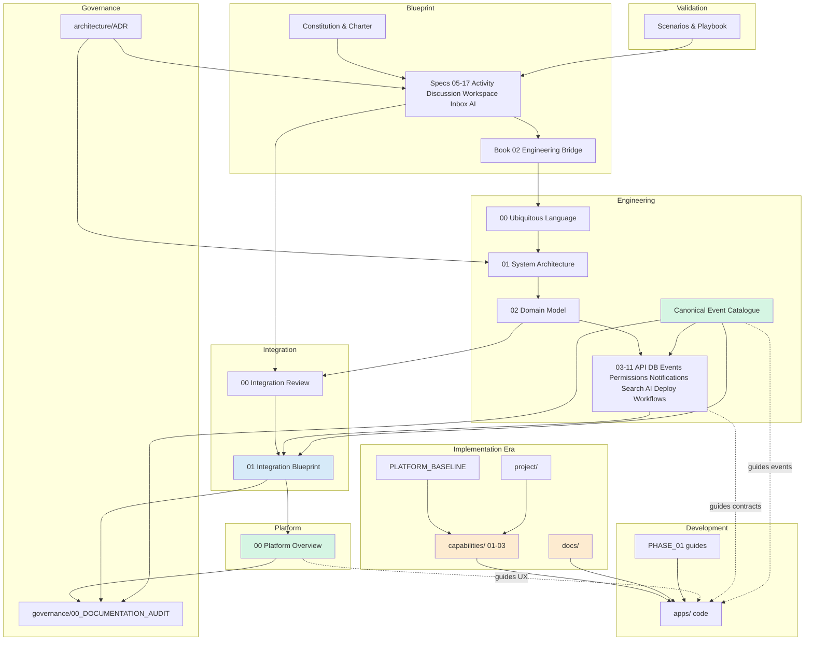

# Humanity Union Documentation Audit

## Version 1.0

### Official Documentation Registry and Pre-Implementation Review

---

# Document Purpose

Humanity Union has reached a major architectural milestone. The platform now includes Blueprint, Engineering, Integration, and Platform documentation layers — all reviewed and aligned around an Activity-centered vision compatible with approved engineering architecture.

**This document does not rewrite, edit, or modify any existing document.**

It is the **official documentation registry** — a complete inventory, consistency review, and maintenance roadmap before implementation begins.

**Audit date:** 2026-07-21  
**Scope:** All 346 Markdown documents in the repository (excluding `node_modules`, build artifacts)  
**Authority hierarchy for implementation:** Blueprint → Engineering `00`–`11` → Canonical Event Catalogue → Integration → Platform Overview → ADR → Validation

---

# Section 1 — Document Inventory

## 1.1 Documentation Layers

Humanity Union documentation is organized into **eight layers**. Higher layers govern lower layers when conflicts arise.

| Layer | Folder(s) | Documents | Role |
|-------|-----------|-----------|------|
| **L0 — Governance** | `/governance` | 1 (+ this audit) | Documentation registry, maintenance policy |
| **L1 — Blueprint** | `/blueprint` | 31 | Civic product and behavioral specification |
| **L2 — Engineering** | `/engineering` | 33 | Normative implementation architecture |
| **L3 — Integration** | `/integration` | 2 | Activity-centered integration analysis and blueprint |
| **L4 — Platform** | `/platform` | 1 | Official human-readable product overview |
| **L5 — ADR & Validation** | `/architecture`, `/validation` | 4 | Decisions and scenario validation |
| **L6 — Capability implementation** | `/capabilities` | 159 | Epic-level implementation specifications (Capabilities 01–03 era) |
| **L7 — Project & docs** | `/project`, `/docs`, root `*.md` | 109 | Journals, foundations, runbooks, legacy baselines |
| **L8 — Code-adjacent** | `/apps` | 7 | Module-level README files |

**Total:** 346 Markdown documents

---

## 1.2 Normative Core — Detailed Inventory (49 ACTIVE documents)

These documents define the approved platform architecture after Activity-centered integration.

### Blueprint — Foundation (Book 01)

| Document | Purpose | Description | Role | Dependencies | Related |
|----------|---------|-------------|------|--------------|---------|
| `Book_01_Foundation/00_BLUEPRINT_INDEX.md` | Index | Entry point to Blueprint books | Navigation | — | All Blueprint |
| `01_CONSTITUTION.md` | Governance | Platform constitutional principles | Authority | — | Charter, Engineering Manifesto |
| `02_CHARTER_OF_ETHICAL_TECHNOLOGY.md` | Ethics | Technology ethics and AI boundaries | Authority | Constitution | ADR-005, `09_AI` |
| `03_INFORMATION_ARCHITECTURE.md` | IA | Information structure and civic responsibility | Specification | Constitution | `00` UL, Workspace |
| `04_LIVINGi_PLATFORM_BLUEPRINT.md` | Vision | Living platform vision | Specification | Foundation | Platform Overview |
| `05_PLATFORM_SERVICES.md` | Services | Cross-cutting platform services | Specification | Foundation | Engineering cross-cutting |
| `06_HUMAN_JOURNEYS.md` | UX journeys | Human journey maps | Specification | Foundation | Platform §3, Integration |
| `07_DATABASE_BLUEPRINT.md` | Persistence philosophy | Blueprint persistence principles | Specification | Foundation | `04_DATABASE` |
| `08_EVENT_ARCHITECTURE.md` | Events philosophy | Event-driven civic memory | Specification | Foundation | `05_EVENT`, Catalogue |
| `09_INTENTION_ARCHITECTURE.md` | Intent | Commands vs outcomes | Specification | Foundation | Catalogue, `03_API` |
| `10_PLATFORM_CONTRACT.md` | Contracts | Platform-wide contract principles | Specification | Foundation | `03_API` |

### Blueprint — Civic Specifications (05–17)

| Document | Purpose | Description | Role | Dependencies | Related |
|----------|---------|-------------|------|--------------|---------|
| `05_ACTIVITY_ENGINE_SPECIFICATION.md` | Activity | Universal civic trace anchor | **Core** | ADR-002 | All collaboration specs |
| `06_DISCUSSION_AND_COLLABORATION_MODEL.md` | Discussion | Universal deliberation framework | **Core** | Activity Engine | `02` Discussion aggregate |
| `07_ALLIES_NETWORK_ARCHITECTURE.md` | Allies | Trusted collaboration relationships | Specification | Discussion, Activity | Working Groups |
| `08_WORKING_GROUPS_ARCHITECTURE.md` | Working Groups | Temporary objective teams | Specification | Activity, Discussion | Institutions |
| `09_WORKSPACE_ARCHITECTURE.md` | Workspace | Member operational environment | Specification | Activity Engine | Platform §9 |
| `10_ACTIVITY_INBOX_ARCHITECTURE.md` | Activity Inbox | Attention management system | Specification | Activity Engine | `07_NOTIFICATION` |
| `11_AI_FACILITATOR_ARCHITECTURE.md` | AI | Advisory facilitation | Specification | Charter, ADR-005 | `09_AI` |
| `12_DECISION_LIFECYCLE_ARCHITECTURE.md` | Decision | Governed decision processes | Specification | Proposal Framework | `06_PERMISSION` |
| `13_INSTITUTIONAL_MEMORY_ARCHITECTURE.md` | Memory | Reasoning preservation | Specification | ADR-006 | Memory aggregate |
| `14_GOVERNANCE_INTEGRATION_ARCHITECTURE.md` | Governance | Cross-institution coordination | Specification | Institution | Governance aggregate |
| `15_INSTITUTION_FORMATION_ARCHITECTURE.md` | Institution | Institution lifecycle | Specification | ADR-004 | Institution aggregate |
| `16_INSTITUTION_FOUNDATION_STANDARD.md` | Institution standard | Founding standards | Specification | 15 | Institution |
| `17_PROPOSAL_AND_MEMBER_SIGNAL_FRAMEWORK.md` | Proposal | Signals and formal proposals | Specification | Discussion | Proposal aggregate |

### Blueprint — Engineering Book (Book 02)

| Document | Purpose | Description | Role | Dependencies | Related |
|----------|---------|-------------|------|--------------|---------|
| `Book_02_Engineering/11_ENGINEERING_ARCHITECTURE.md` | Engineering overview | Blueprint engineering layer | Bridge | Book 01 | `01_SYSTEM` |
| `12_PLATFORM_API_SPECIFICATION.md` | API philosophy | Blueprint API principles | Bridge | 11 | `03_API` |
| `13_DATA_MODEL.md` | Data philosophy | Blueprint data model principles | Bridge | 11 | `02_DOMAIN` |
| `14_HUMAN_EXPERIENCE_SYSTEM.md` | HX system | Experience architecture | Bridge | 06 Human Journeys | Platform |
| `15_DEVELOPMENT_STANDARDS.md` | Standards | Development standards | Bridge | 11 | Phase guides |

### Engineering Architecture (`00`–`11`)

| Document | Purpose | Description | Role | Dependencies | Related |
|----------|---------|-------------|------|--------------|---------|
| `00_UBIQUITOUS_LANGUAGE.md` | Vocabulary | Canonical domain terms | **Normative** | Blueprint | Catalogue (events) |
| `01_SYSTEM_ARCHITECTURE.md` | System | Bounded contexts and layers | **Normative** | `00` | Blueprint 05–17 |
| `02_DOMAIN_MODEL.md` | Domain | Aggregates, invariants, events | **Normative** | `01`, Catalogue | Blueprint |
| `03_API_ARCHITECTURE.md` | API | Commands, queries, contracts | **Normative** | `02` | Catalogue |
| `04_DATABASE_STRATEGY.md` | Persistence | Ownership, projections | **Normative** | `02`, `03` | Blueprint 07 |
| `05_EVENT_ARCHITECTURE.md` | Events | Event lifecycle and rules | **Normative** | Catalogue | Blueprint 08 |
| `06_PERMISSION_MODEL.md` | Authorization | Policies and lifecycle permissions | **Normative** | `02` | Decision, AI |
| `07_NOTIFICATION_ARCHITECTURE.md` | Notifications | Delivery architecture | **Normative** | Blueprint 10 | Inbox |
| `08_SEARCH_ARCHITECTURE.md` | Search | Discovery projections | **Normative** | `04` | Public experience |
| `09_AI_INTEGRATION.md` | AI | AI boundaries and integration | **Normative** | ADR-005 | Blueprint 11 |
| `10_DEPLOYMENT_ARCHITECTURE.md` | Deployment | Deployment units and DR | **Normative** | `01` | Operations |
| `11_APPLICATION_WORKFLOWS.md` | Workflows | Cross-context choreography | **Normative** | Catalogue | Integration |
| `CANONICAL_EVENT_CATALOGUE.md` | Events SOT | 50 domain events, ownership | **Normative** | `02`, `05` | All event consumers |
| `ENGINEERING_MANIFESTO.md` | Principles | Engineering principles | **Normative** | Blueprint | ADR |

### Integration & Platform

| Document | Purpose | Description | Role | Dependencies | Related |
|----------|---------|-------------|------|--------------|---------|
| `integration/00_ACTIVITY_ARCHITECTURE_INTEGRATION_REVIEW.md` | Integration audit | Compatibility analysis | **Integration authority** | Engineering, Blueprint | Integration Blueprint |
| `integration/01_ACTIVITY_INTEGRATION_BLUEPRINT.md` | Integration blueprint | UX/architecture bridge | **Integration authority** | Integration Review | Platform Overview |
| `platform/00_PLATFORM_OVERVIEW.md` | Product overview | Official platform description | **Product authority** | Integration Blueprint | All stakeholders |

### ADR & Validation

| Document | Purpose | Description | Role | Dependencies | Related |
|----------|---------|-------------|------|--------------|---------|
| `architecture/ARCHITECTURE_DECISION_RECORDS.md` | ADR registry | Accepted architectural decisions | **Governance** | Blueprint | Engineering |
| `validation/ARCHITECTURE_VALIDATION_SCENARIOS.md` | Scenarios | Validation scenario catalog | **Validation** | Blueprint | Playbook |
| `validation/SCENARIO_PLAYBOOK.md` | Playbook | Scenario execution guide | **Validation** | Scenarios | — |

---

## 1.3 Audit & Historical Records — Detailed Inventory (14 REFERENCE documents)

| Document | Folder | Purpose | Status rationale |
|----------|--------|---------|------------------|
| `ENGINEERING_RELEASE_READINESS_REVIEW_v1.0.md` | engineering | Final engineering audit (89/100) | Historical audit record; non-normative |
| `ENGINEERING_DOCUMENTATION_ALIGNMENT_REPORT_v1.0.md` | engineering | Post-alignment audit | Historical audit record |
| `ENGINEERING_ARCHITECTURE_CONSISTENCY_REVIEW.md` | engineering | Pre-Catalogue consistency review | Superseded partially by Catalogue + alignment |
| `validation/reports/ARCHITECTURE_VALIDATION_LOG.md` | validation | Validation execution log | Operational log |
| `blueprint/BLUEPRINT_CHANGELOG.md` | blueprint | Blueprint change history | Change log |
| `blueprint/ARCHITECTURE_AUDIT.md` | blueprint | Earlier blueprint audit | Historical audit |
| `apps/api/src/*/README.md` (5 files) | apps | Code module orientation | Code-adjacent local docs |
| `packages/geography/ATTRIBUTION.md` | packages | Geography data attribution | Code-adjacent |
| `.cursor/rules.md` | .cursor | IDE agent rules | Tooling config |

---

## 1.4 Implementation-Era Collections — Grouped Inventory (283 UPDATE documents)

These collections remain **valuable** but predate or parallel the normative Engineering + Integration stack. They require alignment, merge, or archival classification — not deletion.

### `/capabilities` — 159 documents

| Sub-collection | Count | Purpose | Current role |
|----------------|-------|---------|--------------|
| `01_human_identity/` | 24 | Capability 01 — auth, profile, preferences | Implementation specs for identity epic |
| `01_human_identity/epics/` | (included) | EPIC 01–03 domain and API guides | Epic-level implementation |
| `02_participation/` | 84 | Capability 02 — Initiative through Implementation epics | **Initiative-centric pipeline** — tension with Activity-first engineering |
| `02_participation/epics/EPIC_01_INITIATIVE_FOUNDATION/` | ~15 | Initiative aggregate implementation | Operational aggregate docs |
| `02_participation/epics/EPIC_02_COLLABORATIVE_ANALYSIS/` | ~12 | Analysis phase implementation | Maps to Discussion Analysis contributions |
| `02_participation/epics/EPIC_03_COMMUNITY_POLL/` | ~8 | Collective decision / poll | Maps to Decision context partially |
| `02_participation/epics/EPIC_04_PETITION/` | ~15 | Petition epic | Maps to Proposal/Member Signal path |
| `02_participation/epics/EPIC_05_IMPLEMENTATION_COMMITMENT/` | ~10 | Implementation commitment | Maps to Implementation aggregate |
| `02_participation/epics/EPIC_06_IMPLEMENTATION/` | ~12 | Implementation execution | Maps to Implementation + Impact |
| `03_public_experience/` | 50 | Capability 03 — public/global/country/region/community experience | Public projection layer |
| `IMPLEMENTATION_PHASE_02_PLATFORM_CAPABILITIES.md` | 1 | Phase 2 capability plan | Roadmap |

**Dependencies:** `PLATFORM_ARCHITECTURE_BASELINE_V1.md`, capability freeze documents, `/project/architecture/governance/`  
**Related:** Engineering `02`, Integration Blueprint, Platform Overview

### `/docs` — 64 documents

Foundation documents, runbooks, briefing docs, and early domain specifications created during implementation bootstrap.

| Category | Examples | Purpose |
|----------|----------|---------|
| **Domain foundations** | `DOMAIN_MODEL.md`, `MEMBER_SPECIFICATION.md`, `CIVIC_RESPONSIBILITY_PROFILE.md`, `INITIATIVE_LIFECYCLE.md` | Early domain definitions |
| **Membership & auth** | `MEMBERSHIP*.md`, `AUTHENTICATION*.md`, `VERIFICATION_ARCHITECTURE.md` | Implementation foundations |
| **Civic features** | `CIVIC_NOMINATION*.md`, `CIVIC_MEDIA_CENTER*.md`, `GLOBAL_SEARCH_FOUNDATION.md` | Feature foundations |
| **Operations** | `PRODUCTION_DEPLOYMENT_FOUNDATION.md`, `STAGING_DEPLOYMENT_RUNBOOK.md`, `EMAIL_*.md` | Ops runbooks |
| **UX & design** | `DESIGN_SYSTEM.md`, `PUBLIC_HOME_EXPERIENCE.md`, `WORKSPACE.md` | Experience specs |
| **Project meta** | `PROJECT_DICTIONARY.md`, `PROJECT_JOURNAL.md`, `MASTER_PROJECT_SPECIFICATION.md` | Terminology and journal |
| **Reviews** | `HUMANITY_PLATFORM_ARCHITECTURE_REVIEW_V1.md` | Historical review |

**Dependencies:** Often reference `/capabilities` and `/project` — not always Engineering `00`–`11`  
**Related:** Platform Overview (replace for product language), Engineering `00` (replace for terms)

### `/project` — 39 documents

| Sub-collection | Count | Purpose |
|----------------|-------|---------|
| `project/architecture/core/` | 6 | Parallel system architecture, API guidelines, domain modeling |
| `project/architecture/governance/` | 12 | Architecture freezes, civic delivery, collective intelligence |
| `project/architecture/intelligence/` | 6 | Intelligence layer (parallel to AI Facilitation) |
| `project/architecture/experience/` | 1 | Experience architecture |
| `project/architecture/reviews/` | 3 | Platform and engineering reviews |
| `project/architecture/backlog/` | 1 | Architecture backlog |
| Root project files | 6 | `PROJECT_STATE.md`, `WORK_LOG.md`, milestones, recovery protocol |

### Root-level platform documents — 4 documents

| Document | Purpose | Description |
|----------|---------|-------------|
| `README.md` | Repository entry | Points to Blueprint; needs navigation update |
| `PLATFORM_ARCHITECTURE_BASELINE_V1.md` | Frozen baseline | Capability 01–03 consolidation — **Initiative-first pipeline** |
| `PLATFORM_CAPABILITY_MAP.md` | Capability map | Layer model (Participation, Collaboration, Public) |
| `PLATFORM_ROADMAP.md` | Platform roadmap | Capability evolution roadmap |
| `PROJECT_ROADMAP.md` | Project roadmap | Project-level milestones |

### `/engineering/PHASE_01_FOUNDATION` — 16 documents

Bootstrap implementation guides (repository setup through member domain). Valuable for onboarding; terminology may predate Catalogue alignment.

---

## 1.5 Complete Document Manifest

**Appendix A** at the end of this document lists all **346 documents** with assigned layer, status, and collection.

---

# Section 2 — Document Status

Each document receives **one** status.

| Status | Count | Meaning |
|--------|-------|---------|
| **ACTIVE** | 49 | Fully matches current Activity-centered architecture |
| **UPDATE** | 268 | Valuable but requires revision for alignment |
| **REFERENCE** | 14 | Historical, audit, log, or code-adjacent support |
| **MERGE** | 8 | Should combine with another document (see §7) |
| **ARCHIVE** | 7 | No longer represents current direction; preserve in archive |

## Status by layer

| Layer | ACTIVE | UPDATE | REFERENCE | MERGE | ARCHIVE |
|-------|--------|--------|-----------|-------|---------|
| Blueprint | 28 | 0 | 2 | 0 | 1 |
| Engineering | 14 | 16 | 3 | 0 | 0 |
| Integration | 2 | 0 | 0 | 0 | 0 |
| Platform | 1 | 0 | 0 | 0 | 0 |
| ADR & Validation | 3 | 0 | 1 | 0 | 0 |
| Capabilities | 0 | 151 | 8 | 0 | 0 |
| Docs | 0 | 52 | 2 | 6 | 4 |
| Project | 0 | 32 | 3 | 2 | 2 |
| Root | 0 | 4 | 0 | 0 | 0 |
| Apps / tooling | 1 | 0 | 6 | 0 | 0 |

## ARCHIVE candidates (preserve, do not delete)

| Document | Why ARCHIVE |
|----------|-------------|
| `docs/HUMANITY_PLATFORM_ARCHITECTURE_REVIEW_V1.md` | Superseded by Engineering Release Readiness + Integration Review |
| `docs/MASTER_PROJECT_SPECIFICATION.md` | Superseded by Platform Overview + Engineering stack |
| `blueprint/Book_01_Foundation/04_LIVINGi_PLATFORM_BLUEPRINT.md` | Historical product name (Livingi); retain for history — or UPDATE rename reference |
| `project/architecture/reviews/PLATFORM_ARCHITECTURE_REVIEW_V1.md` | Superseded by normative engineering reviews |
| `project/architecture/governance/COLLECTIVE_INTELLIGENCE_FOUNDATION_CERTIFICATE.md` | Certificate artifact; historical |
| `docs/ROOT_FOLDER_CLEANUP_BRIEFING.md` | One-time briefing; historical |
| `project/ENGINEERING_FOUNDATION_CERTIFICATE.md` | Certificate artifact; historical |

*Note: `04_LIVINGi_PLATFORM_BLUEPRINT.md` may be UPDATE (refresh terminology) rather than ARCHIVE if still cited — classified ARCHIVE pending editorial decision.*

## MERGE candidates

| Source | Merge into | Why |
|--------|------------|-----|
| `docs/DOMAIN_MODEL.md` | `engineering/02_DOMAIN_MODEL.md` | Duplicate domain model authority |
| `docs/PROJECT_DICTIONARY.md` | `engineering/00_UBIQUITOUS_LANGUAGE.md` | Duplicate terminology |
| `docs/WORKSPACE.md` | `blueprint/09_WORKSPACE_ARCHITECTURE.md` + Platform §9 | Duplicate Workspace spec |
| `docs/CIVIC_RESPONSIBILITY_PROFILE.md` | `engineering/00` + Blueprint IA | Duplicate responsibility spec |
| `docs/MEMBER_SPECIFICATION.md` | `engineering/00` + `02` Member aggregate | Duplicate Member spec |
| `project/architecture/core/SYSTEM_ARCHITECTURE.md` | `engineering/01_SYSTEM_ARCHITECTURE.md` | Parallel system architecture |
| `project/architecture/core/DOMAIN_MODELING_GUIDELINES.md` | `engineering/02` principles | Parallel DDD guidance |
| `PLATFORM_CAPABILITY_MAP.md` | `platform/00_PLATFORM_OVERVIEW.md` + Integration Blueprint | Overlapping platform description |

---

# Section 3 — Architecture Consistency

Reviewed against Activity-centered integration conclusions and normative stack.

## 3.1 Alignment summary

| Theme | Normative stack | Legacy collections | Verdict |
|-------|-----------------|-------------------|---------|
| Activity-centered platform | ✓ ADR-002, Blueprint 05, Engineering, Integration, Platform | ⚠ Initiative-first in Capability 02, PLATFORM_BASELINE | **Split** |
| Workspace model | ✓ Blueprint 09, Platform §9 | ⚠ `docs/WORKSPACE.md`, capability workspace specs | **Mostly aligned** |
| Discussion model | ✓ Blueprint 06, Engineering | ⚠ Some capability docs use parallel "collaboration" language | **Mostly aligned** |
| AI Facilitator | ✓ ADR-005, Blueprint 11, Engineering 09 | ⚠ `project/architecture/intelligence/*` parallel "intelligence layer" | **Tension** |
| Activity Inbox | ✓ Blueprint 10, Engineering 07 | ⚠ `docs/NOTIFICATION_DELIVERY_ENGINE.md` may blur Inbox/Notification | **Minor gap** |
| Member Journey | ✓ Platform §3, Integration, `11` workflows | ⚠ Capability pipeline uses Initiative-first wording | **Terminology gap** |
| Platform Overview | ✓ New — consistent | — | **Aligned** |
| Engineering Architecture | ✓ Aligned post-documentation alignment pass | — | **Aligned** |

## 3.2 Documented inconsistencies

| ID | Inconsistency | Documents affected | Severity |
|----|---------------|-------------------|----------|
| **AC-01** | **Initiative as primary object vs Activity as trace anchor** | Blueprint 06 §10 ("Initiatives contain Discussions") vs Engineering `11` §7 (Activity → Discussion); Capability 02 epics; `PLATFORM_ARCHITECTURE_BASELINE_V1.md` | **Major** — requires product ADR (identified in Integration Review) |
| **AC-02** | **Participation pipeline naming** | `PARTICIPATION_PIPELINE.md`: Idea → Initiative → Analysis → … vs Platform: Activity → Discussion → … | **Major** — mapping doc needed |
| **AC-03** | **Parallel intelligence layer** | `project/architecture/intelligence/*` vs Engineering `09_AI` + Blueprint AI Facilitator | **Moderate** — merge or reframe as implementation of AI Facilitation |
| **AC-04** | **Dual domain models** | `docs/DOMAIN_MODEL.md` (User/Member, Social Activity Score) vs `engineering/02` (18 aggregates, Catalogue events) | **Major** |
| **AC-05** | **Dual terminology registries** | `docs/PROJECT_DICTIONARY.md` (WSAZ, CRZ, Humanity Council, Petition, Poll) vs `engineering/00` (Member, Activity, Proposal, bounded contexts) | **Major** |
| **AC-06** | **Frozen baseline vs engineering norm** | `PLATFORM_ARCHITECTURE_BASELINE_V1.md` frozen Initiative-centric vs post-alignment Engineering | **Moderate** — baseline needs supersession note |
| **AC-07** | **Consistency review stale findings** | `ENGINEERING_ARCHITECTURE_CONSISTENCY_REVIEW.md` lists resolved items (WorkingGroupFormed, etc.) | **Low** — addendum or REFERENCE only |
| **AC-08** | **Petition/Poll as separate epics** | Capability EPIC_04 Petition, EPIC_03 Poll vs Engineering Proposal/Decision aggregates | **Moderate** — map epics to bounded contexts |
| **AC-09** | **README navigation** | `README.md` describes Blueprint only — omits Integration, Platform, Governance | **Low** |
| **AC-10** | **Book 02 vs Engineering 00–11** | Overlap between Blueprint Book 02 and Engineering stack | **Low** — Book 02 is bridge; Engineering is normative for implementation |

---

# Section 4 — Terminology Consistency

**Preferred terminology** is governed by `engineering/00_UBIQUITOUS_LANGUAGE.md` for engineering artefacts and `platform/00_PLATFORM_OVERVIEW.md` for product language. Domain events: `CANONICAL_EVENT_CATALOGUE.md`.

## 4.1 Preferred terms (canonical)

| Term | Preferred meaning | Authority |
|------|-------------------|-----------|
| **Activity** | Immutable record of meaningful civic participation; platform coordination anchor | ADR-002, Blueprint 05, `00`, Platform |
| **Member** | Registered civic participant (not Guest) | `00`, Platform |
| **Discussion** | Universal deliberation framework | Blueprint 06, `02` |
| **Conversation** | Specialized Discussion type (Working/Private) — not separate subsystem | Blueprint 06, Integration Blueprint |
| **Workspace** | Member's private operational civic environment | Blueprint 09, Platform |
| **Working Group** | Temporary objective-bound team | Blueprint 08, `02` |
| **Ally** | Trusted collaborative relationship | Blueprint 07, `02` |
| **Proposal** | Formal governed request for change | Blueprint 17, `02` |
| **Decision** | Human governance outcome (includes Vote where governed) | Blueprint 12, `06` |
| **Implementation** | Execution of approved Decisions | `02`, Platform |
| **Impact** | Documented consequences (ImpactAssessment) | `02`, Platform |
| **Activity Inbox** | Responsibility-filtered working feed | Blueprint 10, `07` |
| **Notification** | Derived alert that something happened | `07`, Platform |
| **Civic Responsibility Profile** | Private civic scope and capacity configuration | `00`, Blueprint IA |
| **Social Activity Plan** | Declared participation intent and routing preferences | `00`, Blueprint |
| **Contribution** | Typed unit within Discussion | Blueprint 06, `02` |
| **Evidence** | Contribution type — verifiable information | Blueprint 06, Catalogue |
| **Analysis** | Contribution type / lifecycle phase label — not separate aggregate | Blueprint 06, Integration |
| **Initiative** | Civic workstream (product grouping) — **pending ADR** for domain mapping | Blueprint 09, 06 — **not** Engineering aggregate v1.0 |
| **Community** | Affected or participating group — participation concept, not aggregate root | Platform, Blueprint |
| **Organization** | Institutional or NGO actor within rules | Platform, Institution context |

## 4.2 Duplicate / obsolete / conflicting terms

| Issue | Legacy term(s) | Location | Conflict | Recommendation |
|-------|----------------|----------|----------|----------------|
| **Dual actor model** | User vs Member (both active) | `docs/DOMAIN_MODEL.md` | Engineering uses Member; User is implementation detail | **Member** preferred; User = technical identity only in implementation guides |
| **Geographic zones** | WSAZ, CRZ | `docs/PROJECT_DICTIONARY.md` | Not in Engineering `00` | **UPDATE** or map to Search/Public Experience scopes |
| **Governance bodies** | Humanity Council, Chambers | `PROJECT_DICTIONARY` | Not in Engineering v1.0 aggregates | **REFERENCE** for future governance or ARCHIVE if aspirational only |
| **Engagement metric** | Social Activity Score | `docs/DOMAIN_MODEL.md` | Not in normative Engineering model | **UPDATE** or defer ADR — distinct from Activity |
| **Informal instruments** | Petition, Poll (standalone) | Dictionary, Capability epics | Engineering: Proposal, Decision, MemberSignal | Map Petition → Proposal path; Poll → non-binding Decision or separate policy ADR |
| **Deprecated events** | WorkingGroupFormed, ActivityPlanUpdated, etc. | Resolved in Engineering `00`–`05` | Only in REFERENCE audit docs now | **Do not reuse** — Catalogue names only |
| **Collaboration (context)** | "Collaboration" as bounded context | Older `00` drafts | Corrected to Discussion / Working Groups | **Resolved** in aligned Engineering `00` |
| **Initiative vs Activity** | Initiative as root | Capability 02, PLATFORM_BASELINE | Activity is trace anchor per ADR-002 | **Initiative = grouping** until ADR |

---

# Section 5 — Duplication Review

## 5.1 Major duplication zones

| Zone | Duplicated concept | Locations | Risk |
|------|-------------------|-----------|------|
| **Domain model** | Entities, aggregates, User/Member | `engineering/02`, `docs/DOMAIN_MODEL.md`, capability epic DOMAIN_MODEL.md files | Implementers follow wrong model |
| **Terminology** | Platform vocabulary | `engineering/00`, `docs/PROJECT_DICTIONARY.md`, epic DOMAIN_LANGUAGE.md | Inconsistent UI copy and API names |
| **System architecture** | Bounded contexts, layers | `engineering/01`, `project/architecture/core/SYSTEM_ARCHITECTURE.md`, `PLATFORM_BASELINE` | Parallel architecture truths |
| **Workspace** | Member home | Blueprint 09, `docs/WORKSPACE.md`, capability WORKSPACE_SPECIFICATION.md | Conflicting UX specs |
| **Lifecycle diagrams** | Civic path | Platform, Integration, `11`, `PARTICIPATION_PIPELINE`, PLATFORM_BASELINE | Conflicting entry point (Activity vs Initiative) |
| **AI / Intelligence** | Advisory AI | Blueprint 11, `engineering/09`, `project/architecture/intelligence/*` | Duplicate AI architecture |
| **Event vocabulary** | Domain events | Catalogue vs legacy capability event names | Mitigated by alignment pass |
| **Platform description** | What HU is | Platform Overview, README, PLATFORM_CAPABILITY_MAP, MASTER_PROJECT_SPEC | Multiple entry narratives |
| **Reviews** | Architecture audits | 6+ review documents across engineering, project, docs | Stale findings confuse readers |

## 5.2 Duplication severity score

**Duplicate Documentation Score: 62 / 100** (lower = more duplication)

Normative core (49 docs) is cohesive. **268 UPDATE docs** create maintenance burden and drift risk — especially `/capabilities` (151) and `/docs` (52).

---

# Section 6 — Document Dependency Map



**Reading order for new contributors:**

1. `platform/00_PLATFORM_OVERVIEW.md` — what Humanity Union is  
2. `integration/01_ACTIVITY_INTEGRATION_BLUEPRINT.md` — how Activity centers experience  
3. `engineering/00` → `01` → `02` → Catalogue — how it is built  
4. Blueprint civic specs — behavioral detail  
5. Capability/docs — implementation detail (**verify against normative stack**)

---

# Section 7 — Recommended Actions

| Collection / Document | Action | Why |
|----------------------|--------|-----|
| **Engineering `00`–`11`, Catalogue, Manifesto** | **Keep** | Normative; aligned |
| **Integration (2 docs)** | **Keep** | Integration authority |
| **Platform Overview** | **Keep** | Official product description |
| **Blueprint 05–17, Book 01** | **Keep** | Civic specification authority |
| **Blueprint Book 02** | **Keep** | Bridge; add pointer to Engineering as implementation norm |
| **ADR, Validation scenarios** | **Keep** | Governance and proof |
| **Alignment & Release reviews** | **Keep** (REFERENCE) | Audit trail |
| **Consistency Review** | **Archive** or addendum | Stale; partially superseded |
| **README.md** | **Update** | Add documentation map: Platform → Integration → Engineering → Blueprint |
| **PLATFORM_ARCHITECTURE_BASELINE_V1** | **Update** | Add supersession banner pointing to Engineering + Integration; map Initiative pipeline to Activity anchor |
| **PLATFORM_CAPABILITY_MAP, PLATFORM_ROADMAP** | **Update** | Align layer language with Platform Overview |
| **docs/PROJECT_DICTIONARY** | **Merge** → `engineering/00` glossary extension | Eliminate dual terminology |
| **docs/DOMAIN_MODEL** | **Merge** → `engineering/02` | Single domain authority |
| **docs/WORKSPACE, MEMBER_SPECIFICATION, CIVIC_RESPONSIBILITY_PROFILE** | **Merge** → Blueprint + Engineering | Remove triple specs |
| **docs/HUMANITY_PLATFORM_ARCHITECTURE_REVIEW_V1, MASTER_PROJECT_SPEC** | **Archive** | Superseded |
| **project/architecture/core/SYSTEM_ARCHITECTURE, DOMAIN_MODELING** | **Merge** → Engineering | Parallel architecture |
| **project/architecture/intelligence/** | **Rename/Reframe** → AI Facilitation implementation notes | Align with ADR-005 |
| **capabilities/02_participation/** | **Update** | Map epics to Engineering bounded contexts; Activity-first language |
| **capabilities/01_human_identity/** | **Update** | Align with Identity/Member/Workspace engineering model |
| **capabilities/03_public_experience/** | **Update** | Align with Search + public projections in `08`, `04` |
| **engineering/PHASE_01/** | **Keep** + **Update** links | Bootstrap still useful; point to normative stack |
| **docs/ ops runbooks** (email, deployment, staging) | **Keep** | Operational value; separate from domain architecture |
| **Initiative ADR** (not yet written) | **Split** as new ADR | Resolve AC-01 before Initiative domain code |

---

# Section 8 — Update Priority

## Priority 1 — Must update before implementation

| Item | Documents | Rationale |
|------|-----------|-----------|
| **Documentation navigation** | `README.md`, new `governance/01_DOCUMENTATION_MAP.md` *(recommended)* | Prevent implementers starting in wrong layer |
| **Initiative mapping ADR** | New ADR (referenced by Integration Review) | AC-01 blocker for Initiative write model |
| **Capability 02 epic index** | `CAPABILITY_02_PARTICIPATION.md`, `PARTICIPATION_PIPELINE.md` | Map Initiative-first pipeline to Activity-first normative stack |
| **docs/DOMAIN_MODEL + PROJECT_DICTIONARY** | Merge or banner "superseded by engineering/00, 02" | AC-04, AC-05 — active confusion risk |
| **PLATFORM_ARCHITECTURE_BASELINE_V1** | Supersession banner + mapping section | AC-06 — frozen doc contradicts current norm |

## Priority 2 — Update during implementation

| Item | Documents | Rationale |
|------|-----------|-----------|
| Capability epic DOMAIN_MODEL / DOMAIN_LANGUAGE files | 159 capability docs selectively | Align as epics are implemented |
| `docs/WORKSPACE.md`, membership docs | `/docs` experience foundations | Align UX with Platform + Blueprint 09 |
| `project/architecture/intelligence/*` | 6 docs | Reframe under AI Facilitation |
| Engineering PHASE_01 guides | 16 docs | Cross-link Catalogue and workflows |
| Consistency Review addendum | 1 doc | Close loop on resolved findings |

## Priority 3 — Can wait until later

| Item | Documents | Rationale |
|------|-----------|-----------|
| Archive migration | 7 archive candidates | Non-blocking if bannered |
| Blueprint Livingi rename refresh | `04_LIVINGi` | Historical terminology |
| Validation log execution | `ARCHITECTURE_VALIDATION_LOG` | Run during MVP validation |
| Apps module READMEs | 7 files | Code-local; update with modules |
| PROJECT_JOURNAL, WORK_LOG | Project journals | Historical value; not normative |

---

# Section 9 — Archive Plan

**Do not delete documentation.** Preserving history supports audit, learning, and recovery.

## Recommended archive structure

```text
/archive
  /legacy-architecture
    PLATFORM_ARCHITECTURE_BASELINE_V1.md
    docs/HUMANITY_PLATFORM_ARCHITECTURE_REVIEW_V1.md
    docs/MASTER_PROJECT_SPECIFICATION.md
    project/architecture/reviews/PLATFORM_ARCHITECTURE_REVIEW_V1.md
  /historical-audits
    engineering/ENGINEERING_ARCHITECTURE_CONSISTENCY_REVIEW.md  (copy or pointer)
  /certificates-and-milestones
    project/ENGINEERING_FOUNDATION_CERTIFICATE.md
    project/architecture/governance/COLLECTIVE_INTELLIGENCE_FOUNDATION_CERTIFICATE.md
  /deprecated-terminology
    docs/PROJECT_DICTIONARY.md  (after merge into 00 — keep snapshot)
  /briefings
    docs/ROOT_FOLDER_CLEANUP_BRIEFING.md
```

## Archive policy

| Rule | Description |
|------|-------------|
| **Move, don't delete** | Relocate with git history preserved |
| **Banner required** | Each archived doc gets header: *Superseded by [path] — archived YYYY-MM-DD* |
| **Pointer in registry** | This audit updated when docs archived |
| **Merge then archive** | When merging, archive source snapshot |

## Why preserve history

- **Audit trail** — demonstrates architectural evolution  
- **Decision context** — explains why Initiative-centric capability era existed  
- **Recovery** — PROJECT_RECOVERY_PROTOCOL may reference older docs  
- **Contributor trust** — years of work remain visible, not erased  

---

# Section 10 — Final Assessment

## Overall documentation quality

**Strong normative core; fragmented implementation layer.**

The Blueprint + Engineering + Integration + Platform stack represents **high-quality, review-gated architecture** (Release Readiness 89/100). The Capability 01–03 era produced extensive implementation documentation that remains useful but **predates Activity-centered integration alignment**.

| Dimension | Assessment |
|-----------|------------|
| **Normative architecture docs** | Excellent — complete, aligned, release-gated |
| **Product-facing docs** | Good — Platform Overview now provides single entry narrative |
| **Implementation docs** | Extensive but drifted — requires mapping pass |
| **Operational docs** | Practical runbooks — largely independent of domain drift |
| **Audit trail** | Strong — multiple review layers (some need archival) |

## Overall consistency

| Area | Score | Notes |
|------|-------|-------|
| Normative stack internal consistency | **92%** | Post-alignment Engineering + Catalogue + Integration |
| Cross-layer (normative vs capabilities) | **58%** | Initiative-first vs Activity-first |
| Terminology | **65%** | Dual dictionaries |
| UX narrative consistency | **85%** | Platform + Integration aligned |

## Documentation maturity

| Stage | Status |
|-------|--------|
| Architecture design | **Complete** |
| Engineering specification | **Complete** |
| Integration analysis | **Complete** |
| Product overview | **Complete** |
| Implementation mapping | **In progress** — capabilities/docs need Priority 1 pass |
| Governance registry | **Complete** — this document |

## Readiness for implementation

**Conditionally ready.**

Implementation **may proceed** anchored to:

1. `engineering/00`–`11` + `CANONICAL_EVENT_CATALOGUE.md`  
2. `integration/01_ACTIVITY_INTEGRATION_BLUEPRINT.md`  
3. `platform/00_PLATFORM_OVERVIEW.md`  
4. Blueprint civic specs 05–17  

**Condition:** Priority 1 documentation updates (README navigation, Initiative ADR, supersession banners on baseline/docs) should complete in parallel with first implementation sprint — not after.

---

# Executive Summary

Humanity Union maintains **346 Markdown documents** across eight layers. **49 documents** are **ACTIVE** and fully aligned with the Activity-centered architecture. **268 documents** require **UPDATE** — primarily `/capabilities` (159) and `/docs` (64) from the Capability 01–03 implementation era. **14 documents** serve as **REFERENCE** audit and code-adjacent records.

The normative stack (Blueprint, Engineering, Catalogue, Integration, Platform) is **coherent and implementation-ready**. The primary risk is implementers following legacy `/docs` or `/capabilities` specifications that use Initiative-first language, dual domain models, or obsolete terminology.

This audit establishes the **official registry**, identifies inconsistencies, recommends merge/archive actions, and defines a three-priority update roadmap — **without modifying any source document**.

---

# Documentation Health Score

## **74 / 100**

| Factor | Weight | Score |
|--------|--------|-------|
| Normative completeness | 30% | 95 |
| Internal normative consistency | 25% | 92 |
| Cross-layer alignment | 25% | 55 |
| Discoverability & navigation | 10% | 60 |
| Maintenance clarity | 10% | 70 |

---

# Architecture Consistency Score

## **81 / 100**

Normative stack: **92**. Legacy collections drag weighted average. AC-01 (Initiative vs Activity) is the largest remaining gap — already scoped for ADR in Integration Review.

---

# Terminology Consistency Score

## **68 / 100**

`engineering/00` and Platform Overview are aligned. `docs/PROJECT_DICTIONARY` and capability DOMAIN_LANGUAGE files introduce WSAZ/CRZ, User/Member duality, Petition/Poll vocabulary not present in normative Engineering.

---

# Duplicate Documentation Score

## **62 / 100**

*(Higher score = less duplication — this score reflects significant overlap remaining)*

Major duplication in domain model, terminology, system architecture, workspace specs, lifecycle diagrams, and platform descriptions.

---

# Highest Priority Updates

1. **README documentation map** — point to Platform → Integration → Engineering  
2. **Initiative product ADR** — resolve Activity vs Initiative hierarchy (AC-01)  
3. **Supersession banners** on `PLATFORM_ARCHITECTURE_BASELINE_V1.md`, `docs/DOMAIN_MODEL.md`, `docs/PROJECT_DICTIONARY.md`  
4. **`PARTICIPATION_PIPELINE.md` mapping** — Activity-first lifecycle equivalence table  
5. **Capability 02 epic index** — bounded context mapping to Engineering `02`

---

# Safe Documents (No Changes Needed)

- `engineering/00_UBIQUITOUS_LANGUAGE.md` through `engineering/11_APPLICATION_WORKFLOWS.md`
- `engineering/CANONICAL_EVENT_CATALOGUE.md`
- `engineering/ENGINEERING_MANIFESTO.md`
- `integration/00_ACTIVITY_ARCHITECTURE_INTEGRATION_REVIEW.md`
- `integration/01_ACTIVITY_INTEGRATION_BLUEPRINT.md`
- `platform/00_PLATFORM_OVERVIEW.md`
- `architecture/ARCHITECTURE_DECISION_RECORDS.md`
- `validation/ARCHITECTURE_VALIDATION_SCENARIOS.md`
- `validation/SCENARIO_PLAYBOOK.md`
- Blueprint `05`–`17` and Book 01 Foundation (except optional Livingi refresh)
- `engineering/ENGINEERING_RELEASE_READINESS_REVIEW_v1.0.md` *(REFERENCE)*
- `engineering/ENGINEERING_DOCUMENTATION_ALIGNMENT_REPORT_v1.0.md` *(REFERENCE)*

---

# Recommended Update Roadmap

| Phase | Timeline | Actions |
|-------|----------|---------|
| **Phase A — Gate** | Before Sprint 1 | README map; supersession banners; Initiative ADR draft; this registry published |
| **Phase B — Map** | Sprint 1–2 | Participation pipeline mapping; capability epic index; merge plan for docs/DOMAIN_MODEL |
| **Phase C — Align** | During MVP | Update capability docs as touched; reframe intelligence layer; Workspace docs |
| **Phase D — Archive** | After banners stable | Move archive candidates; PROJECT_DICTIONARY snapshot post-merge |
| **Phase E — Maintain** | Ongoing | Update registry on doc status change; quarterly consistency spot-check |

---

# GO / REVIEW AGAIN

## **GO** — Documentation supports implementation with documented conditions

Implementation may begin using the **normative stack** immediately.

## **REVIEW AGAIN** — Documentation maintenance gate (not implementation blocker)

Reconvene documentation review when:

- Initiative ADR is published (close AC-01)  
- Priority 1 supersession banners are in place  
- Capability 02 index mapping is complete  
- Any team proposes new bounded context or domain event outside Catalogue  

---

# Appendix A — Complete Document Manifest (346 documents)

Status legend: **A**=ACTIVE · **U**=UPDATE · **R**=REFERENCE · **M**=MERGE target noted · **X**=ARCHIVE candidate

## Root (5)

| Path | Layer | Status |
|------|-------|--------|
| `README.md` | L7 | U |
| `PLATFORM_ARCHITECTURE_BASELINE_V1.md` | L7 | U |
| `PLATFORM_CAPABILITY_MAP.md` | L7 | M |
| `PLATFORM_ROADMAP.md` | L7 | U |
| `PROJECT_ROADMAP.md` | L7 | U |

## Governance (1)

| Path | Layer | Status |
|------|-------|--------|
| `governance/00_DOCUMENTATION_AUDIT.md` | L0 | A |

## Architecture (1)

| Path | Layer | Status |
|------|-------|--------|
| `architecture/ARCHITECTURE_DECISION_RECORDS.md` | L5 | A |

## Integration (2)

| Path | Layer | Status |
|------|-------|--------|
| `integration/00_ACTIVITY_ARCHITECTURE_INTEGRATION_REVIEW.md` | L3 | A |
| `integration/01_ACTIVITY_INTEGRATION_BLUEPRINT.md` | L3 | A |

## Platform (1)

| Path | Layer | Status |
|------|-------|--------|
| `platform/00_PLATFORM_OVERVIEW.md` | L4 | A |

## Validation (3)

| Path | Layer | Status |
|------|-------|--------|
| `validation/ARCHITECTURE_VALIDATION_SCENARIOS.md` | L5 | A |
| `validation/SCENARIO_PLAYBOOK.md` | L5 | A |
| `validation/reports/ARCHITECTURE_VALIDATION_LOG.md` | L5 | R |

## Engineering (33)

| Path | Layer | Status |
|------|-------|--------|
| `engineering/00_UBIQUITOUS_LANGUAGE.md` | L2 | A |
| `engineering/01_SYSTEM_ARCHITECTURE.md` | L2 | A |
| `engineering/02_DOMAIN_MODEL.md` | L2 | A |
| `engineering/03_API_ARCHITECTURE.md` | L2 | A |
| `engineering/04_DATABASE_STRATEGY.md` | L2 | A |
| `engineering/05_EVENT_ARCHITECTURE.md` | L2 | A |
| `engineering/06_PERMISSION_MODEL.md` | L2 | A |
| `engineering/07_NOTIFICATION_ARCHITECTURE.md` | L2 | A |
| `engineering/08_SEARCH_ARCHITECTURE.md` | L2 | A |
| `engineering/09_AI_INTEGRATION.md` | L2 | A |
| `engineering/10_DEPLOYMENT_ARCHITECTURE.md` | L2 | A |
| `engineering/11_APPLICATION_WORKFLOWS.md` | L2 | A |
| `engineering/CANONICAL_EVENT_CATALOGUE.md` | L2 | A |
| `engineering/ENGINEERING_MANIFESTO.md` | L2 | A |
| `engineering/ENGINEERING_RELEASE_READINESS_REVIEW_v1.0.md` | L2 | R |
| `engineering/ENGINEERING_DOCUMENTATION_ALIGNMENT_REPORT_v1.0.md` | L2 | R |
| `engineering/ENGINEERING_ARCHITECTURE_CONSISTENCY_REVIEW.md` | L2 | R |
| `engineering/PHASE_01_FOUNDATION/IMPLEMENTATION_GUIDE_01` through `_16` | L2 | U |

## Blueprint (31)

All `blueprint/Book_01_Foundation/*` (11 files) → **A**  
All `blueprint/Book_02_Engineering/*` (5 files) → **A**  
All `blueprint/05` through `blueprint/17` (13 files) → **A**  
`blueprint/BLUEPRINT_CHANGELOG.md` → **R**  
`blueprint/ARCHITECTURE_AUDIT.md` → **R**  
`blueprint/Book_01_Foundation/04_LIVINGi_PLATFORM_BLUEPRINT.md` → **X** *(or U)*

## Docs (64)

All files under `docs/` → **U** except:  
- `docs/HUMANITY_PLATFORM_ARCHITECTURE_REVIEW_V1.md` → **X**  
- `docs/MASTER_PROJECT_SPECIFICATION.md` → **X**  
- `docs/ROOT_FOLDER_CLEANUP_BRIEFING.md` → **X**  
- `docs/DOMAIN_MODEL.md` → **M**  
- `docs/PROJECT_DICTIONARY.md` → **M**  
- `docs/WORKSPACE.md`, `MEMBER_SPECIFICATION.md`, `CIVIC_RESPONSIBILITY_PROFILE.md` → **M**

## Project (39)

All `project/architecture/core/*` → **U** (SYSTEM_ARCHITECTURE, DOMAIN_MODELING → **M**)  
All `project/architecture/governance/*` → **U** (certificates → **X**)  
All `project/architecture/intelligence/*` → **U**  
All `project/architecture/reviews/*` → **U** (PLATFORM_ARCHITECTURE_REVIEW_V1 → **X**)  
`project/PROJECT_STATE.md`, `WORK_LOG.md`, `NEXT_SESSION.md`, milestones → **U**

## Capabilities (159)

All files under `capabilities/` → **U** (implementation-era; map to Engineering during build)

## Apps (7)

All `apps/**/README.md` → **R**

## Tooling (1)

`.cursor/rules.md` → **R**

---

*Manifest note: For machine-readable full path listing, run:*

```bash
find . -name '*.md' -not -path './node_modules/*' -not -path './.pnpm-store/*' | sort
```

*Registry version 1.0 — update this appendix when documents are added, merged, or archived.*

---

**Document:** Documentation Audit  
**Version:** 1.0  
**Status:** Official Documentation Registry  
**Date:** 2026-07-21  
**Total documents:** 346  
**Next recommended artefact:** `governance/01_DOCUMENTATION_MAP.md` (Priority 1 navigation guide)
