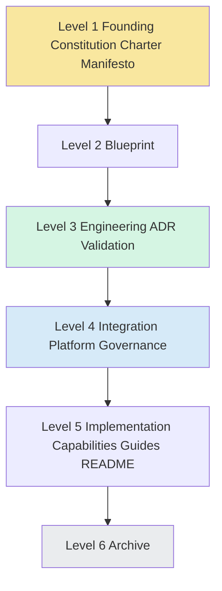
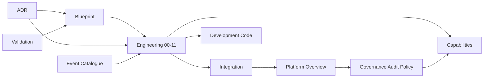
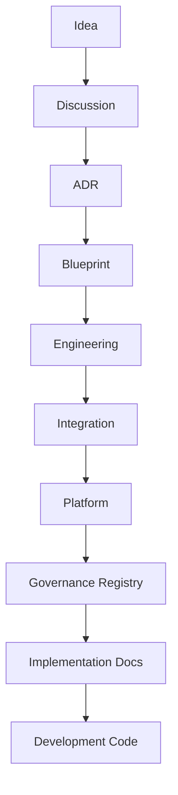
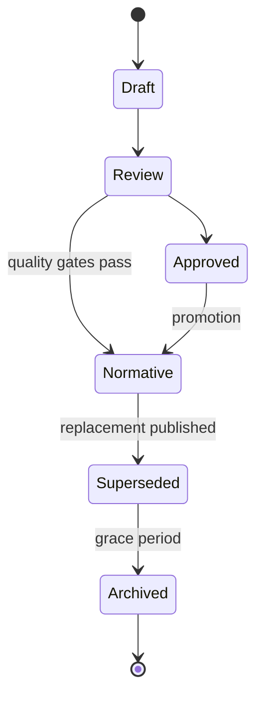

# Humanity Union Documentation Governance

## Version 1.0

### Official Documentation Governance Policy

---

# Document Status

| Field | Value |
|-------|-------|
| **Type** | Institutional governance policy |
| **Scope** | All Humanity Union documentation |
| **Authority** | Governs documentation maintenance — does not override Blueprint civic authority |
| **Stability** | Intended to remain stable across platform expansion |
| **Related** | [00_DOCUMENTATION_AUDIT.md](./00_DOCUMENTATION_AUDIT.md) |

**This document does not modify any existing document.** It defines how all documents are created, maintained, reviewed, merged, archived, and superseded.

---

# Section 1 — Purpose

Humanity Union has reached **documentation maturity**. The project contains **346 Markdown documents** across constitutional, architectural, integration, platform, implementation, and historical layers ([Documentation Audit](./00_DOCUMENTATION_AUDIT.md)).

Without governance, large documentation sets drift. Teams implement from outdated specs. Terminology forks. Parallel truths emerge. Years of work become hard to trust.

## Why documentation governance exists

| Goal | Meaning for Humanity Union |
|------|----------------------------|
| **Consistency** | One civic platform, one vocabulary, one architectural story |
| **Traceability** | Every normative claim links upward to Blueprint principles and ADR decisions |
| **Single source of truth** | Each major concept has exactly one authoritative document |
| **Long-term maintainability** | Updates follow controlled waves — not ad hoc edits |
| **Controlled evolution** | Change flows down the pyramid after review — not sideways |
| **Knowledge preservation** | History is archived, never deleted; supersession is explicit |

Documentation governance protects the **institutional memory of the project itself** — separate from, but analogous to, Institutional Memory in the civic domain.

---

# Section 2 — The Documentation Pyramid

Humanity Union documentation is organized as a **six-level pyramid**. Higher levels govern lower levels. When documents conflict, **the higher level wins** unless an ADR explicitly records an approved exception.

```text
                    ┌─────────────────────┐
                    │  Level 1 — Founding │
                    └─────────────────────┘
                    ┌─────────────────────┐
                    │  Level 2 — Blueprint│
                    └─────────────────────┘
              ┌───────────────────────────────┐
              │ Level 3 — Engineering · ADR · │
              │         Validation            │
              └───────────────────────────────┘
        ┌─────────────────────────────────────────┐
        │ Level 4 — Integration · Platform ·      │
        │           Governance                    │
        └─────────────────────────────────────────┘
  ┌───────────────────────────────────────────────────┐
  │ Level 5 — Implementation · Development ·          │
  │           Capabilities · Guides · README          │
  └───────────────────────────────────────────────────┘
┌───────────────────────────────────────────────────────┐
│ Level 6 — Archive · Historical · Legacy               │
└───────────────────────────────────────────────────────┘
```

## Level 1 — Founding documents

| Documents | Folder | Purpose |
|-----------|--------|---------|
| **Constitution** | `blueprint/Book_01_Foundation/01_CONSTITUTION.md` | Constitutional civic and platform principles |
| **Charter of Ethical Technology** | `blueprint/Book_01_Foundation/02_CHARTER_OF_ETHICAL_TECHNOLOGY.md` | Ethics, dignity, AI boundaries |
| **Engineering Manifesto** | `engineering/ENGINEERING_MANIFESTO.md` | Engineering values and Blueprint fidelity |

**Role:** Immutable in spirit. Changes require highest scrutiny and explicit ADR + constitutional review where applicable.

## Level 2 — Blueprint

| Documents | Folder | Purpose |
|-----------|--------|---------|
| Blueprint Foundation (Book 01) | `/blueprint/Book_01_Foundation` | Philosophy, information architecture, human journeys, event philosophy |
| Blueprint Civic Specifications (05–17) | `/blueprint/05`–`17` | Activity, Discussion, Workspace, Inbox, AI, Decision, Institution, Proposal |
| Blueprint Engineering Bridge (Book 02) | `/blueprint/Book_02_Engineering` | Bridge to engineering — not implementation norm |

**Role:** **Civic product authority.** When implementation and Blueprint conflict, Blueprint governs (per Blueprint index and Engineering Manifesto).

## Level 3 — Engineering, ADR, Validation

| Documents | Folder | Purpose |
|-----------|--------|---------|
| Engineering `00`–`11` | `/engineering` | Normative implementation architecture |
| Canonical Event Catalogue | `/engineering/CANONICAL_EVENT_CATALOGUE.md` | Single source of truth for 50 domain events |
| Architecture Decision Records | `/architecture/ARCHITECTURE_DECISION_RECORDS.md` | Recorded architectural decisions |
| Validation Scenarios & Playbook | `/validation` | Proof of architectural intent |

**Role:** **Implementation architecture authority.** Engineering translates Blueprint into bounded contexts, aggregates, contracts, and workflows. ADR records *why*. Validation proves *behavior*.

## Level 4 — Integration, Platform, Governance

| Documents | Folder | Purpose |
|-----------|--------|---------|
| Activity Integration Review & Blueprint | `/integration` | Activity-centered integration analysis and UX bridge |
| Platform Overview | `/platform/00_PLATFORM_OVERVIEW.md` | Official product description for all audiences |
| Documentation Audit | `/governance/00_DOCUMENTATION_AUDIT.md` | Registry and consistency baseline |
| Documentation Governance | `/governance/01_DOCUMENTATION_GOVERNANCE.md` | This policy |

**Role:** **Integration and communication authority.** Connects engineering truth to product experience and documentation maintenance. Does not redefine domain aggregates without Level 3 update.

## Level 5 — Implementation, Development, Capabilities, Guides

| Documents | Folder | Purpose |
|-----------|--------|---------|
| Capability specifications | `/capabilities` | Epic-level implementation specs (Capabilities 01–03 era) |
| Foundation docs & runbooks | `/docs` | Feature foundations, operations, UX briefings |
| Project journals & architecture notes | `/project` | Working notes, freezes, reviews |
| Phase implementation guides | `/engineering/PHASE_01_FOUNDATION` | Bootstrap and onboarding guides |
| Root baselines & roadmaps | `PLATFORM_*.md`, `PROJECT_ROADMAP.md` | Capability-era baselines — verify against Level 3 |
| Code-adjacent README | `/apps` | Module orientation |

**Role:** **Supporting and operational.** May be detailed and timely. Must **defer** to Levels 1–4 for domain truth. Requires supersession banner if contradicted.

## Level 6 — Archive

| Documents | Folder | Purpose |
|-----------|--------|---------|
| Legacy architecture | `/archive/legacy-architecture` | Superseded baselines and reviews |
| Historical audits | `/archive/historical-audits` | Pre-alignment consistency reviews |
| Deprecated terminology | `/archive/deprecated-terminology` | Snapshots after merge |
| Certificates & milestones | `/archive/certificates-and-milestones` | Historical milestone artifacts |

**Role:** **Preservation only.** Not normative. Retained for audit, learning, and recovery.

---

# Section 3 — Authority Model

## 3.1 Normative documents

Normative documents **define what the platform is and how it must behave architecturally.** Implementation must conform unless an approved ADR records an exception.

| Category | Paths | Authority |
|----------|-------|-----------|
| **Blueprint** | `/blueprint` (Foundation, 05–17, Book 02 bridge) | Civic product and behavioral specification |
| **Engineering** | `/engineering/00`–`11`, `CANONICAL_EVENT_CATALOGUE.md`, `ENGINEERING_MANIFESTO.md` | Implementation architecture, terminology (domain), events |
| **Integration** | `/integration/00`, `/integration/01` | Activity-centered integration — UX/architecture bridge |
| **Platform** | `/platform/00_PLATFORM_OVERVIEW.md` | Official product language for non-engineering audiences |
| **Governance** | `/governance/00`, `/governance/01` | Documentation registry and maintenance policy |
| **ADR** | `/architecture/ARCHITECTURE_DECISION_RECORDS.md` | Decision record — binds future changes |
| **Validation** | `/validation/ARCHITECTURE_VALIDATION_SCENARIOS.md`, `SCENARIO_PLAYBOOK.md` | Behavioral proof obligations |

**Conflict resolution (implementation):**

```text
Constitution / Charter / Manifesto
  → Blueprint
  → ADR
  → Engineering + Canonical Event Catalogue
  → Integration Blueprint
  → Platform Overview
  → Validation scenarios
  → Governance policy
  → (then) Implementation docs
```

## 3.2 Supporting documents

Supporting documents **assist implementation** but do not define platform architecture.

| Category | Examples | Authority |
|----------|----------|-----------|
| **Capabilities** | `/capabilities/**` | Epic implementation detail — must map to Engineering |
| **Guides** | `/engineering/PHASE_01/**`, `/docs/*FOUNDATION.md` | Onboarding, bootstrap, feature foundations |
| **Tutorials & examples** | Future `/examples` | Illustration only |
| **README** | Root, `/apps/**` | Navigation and local orientation |
| **Project journals** | `/project/WORK_LOG.md`, `PROJECT_STATE.md` | Working state — not normative |

Supporting documents **must not** introduce competing domain definitions, event names, or bounded contexts.

## 3.3 Historical documents

| Category | Examples | Authority |
|----------|----------|-----------|
| **Audit records** | Release Readiness Review, Alignment Report, Integration Review | Point-in-time audit — non-normative |
| **Reference logs** | Validation log, Blueprint changelog | Historical record |
| **Archive** | `/archive/**` | Preserved history — explicitly superseded |

Historical documents inform **context**. They do not govern implementation after supersession.

---

# Section 4 — Single Source of Truth

**Rule:** For every major concept, **exactly one authoritative document** exists. Other documents **reference** — they do not redefine.

| Concept | Authoritative document | Notes |
|---------|------------------------|-------|
| **Activity** | `blueprint/05_ACTIVITY_ENGINE_SPECIFICATION.md` + ADR-002; engineering: `00`, `02`, Catalogue | Product language: Platform §5; Integration §4 |
| **Domain events (names, ownership)** | `engineering/CANONICAL_EVENT_CATALOGUE.md` | **Exclusive** event registry; deprecated aliases in Catalogue §15 |
| **Engineering terminology** | `engineering/00_UBIQUITOUS_LANGUAGE.md` | Business terms; not competing event catalogue |
| **Aggregates & invariants** | `engineering/02_DOMAIN_MODEL.md` | 18 aggregate roots |
| **Bounded contexts** | `engineering/01_SYSTEM_ARCHITECTURE.md` | 17 contexts |
| **Workspace** | `blueprint/09_WORKSPACE_ARCHITECTURE.md` | Product: Platform §9; not a domain truth owner |
| **Activity Inbox** | `blueprint/10_ACTIVITY_INBOX_ARCHITECTURE.md` | Engineering: `07` relationship §15.5 |
| **Discussion** | `blueprint/06_DISCUSSION_AND_COLLABORATION_MODEL.md` | Engineering: Discussion aggregate |
| **Conversation** | Blueprint 06 (Discussion type) + Integration Blueprint §6 | **Not** a separate subsystem |
| **AI Facilitator** | `blueprint/11_AI_FACILITATOR_ARCHITECTURE.md` + ADR-005 | Engineering: `09_AI_INTEGRATION.md` |
| **Proposal & Member Signal** | `blueprint/17_PROPOSAL_AND_MEMBER_SIGNAL_FRAMEWORK.md` | Engineering: Proposal context |
| **Decision & Voting** | `blueprint/12_DECISION_LIFECYCLE_ARCHITECTURE.md` | Engineering: `06_PERMISSION_MODEL.md` |
| **Institution** | `blueprint/15`, `16` + ADR-004 | Engineering: Institution aggregate |
| **Platform product description** | `platform/00_PLATFORM_OVERVIEW.md` | Human-readable; defers to Blueprint + Engineering |
| **Activity-centered UX integration** | `integration/01_ACTIVITY_INTEGRATION_BLUEPRINT.md` | Bridge; defers to Engineering |
| **Documentation inventory** | `governance/00_DOCUMENTATION_AUDIT.md` | Registry; updated on waves |
| **Documentation policy** | `governance/01_DOCUMENTATION_GOVERNANCE.md` | This document |
| **Architectural decisions** | `architecture/ARCHITECTURE_DECISION_RECORDS.md` | ADR required for structural change |
| **Validation obligations** | `validation/ARCHITECTURE_VALIDATION_SCENARIOS.md` | Scenario catalog |
| **Implementation mapping (pending)** | `/capabilities` (after alignment) | **Not yet SOT** — Priority 1 wave per Audit |

### Prohibited patterns

| Anti-pattern | Why forbidden |
|--------------|---------------|
| Second domain model in `/docs` | Creates AC-04 class conflicts |
| Second terminology dictionary | Creates AC-05 class conflicts |
| Second event catalogue | Deprecated alias drift |
| Parallel system architecture in `/project` | Creates AC-03/AC-06 class conflicts |
| Initiative as competing root without ADR | AC-01 — Activity is trace anchor (ADR-002) |

When a supporting document must describe a concept, it **links** to the authoritative path and states: *"Authoritative definition: [path]"*.

---

# Section 5 — Change Governance

All **normative** documentation change follows a controlled cascade. Ad hoc edits to Level 1–4 documents are prohibited without the process below.

## Official change flow

```text
Idea
  ↓
Discussion
  ↓
ADR
  ↓
Blueprint
  ↓
Engineering
  ↓
Integration
  ↓
Platform
  ↓
Governance (Audit registry update)
  ↓
Implementation (Capabilities, docs, guides)
  ↓
Development (code, README)
```

## Stage definitions

| Stage | Description | Output |
|-------|-------------|--------|
| **Idea** | Problem, opportunity, or civic need identified | Informal proposal — not documentation |
| **Discussion** | Stakeholders deliberate impact on architecture, terminology, UX | Recorded rationale; no normative edit yet |
| **ADR** | Architectural decision recorded with alternatives and consequences | New or updated ADR entry — **required for structural change** |
| **Blueprint** | Civic product specification updated if behavior or principles change | Blueprint document revision |
| **Engineering** | Implementation architecture updated — aggregates, contexts, events, workflows | Engineering `00`–`11`, Catalogue if events affected |
| **Integration** | Activity-centered integration impact assessed | Integration Review update if compatibility affected |
| **Platform** | Product overview updated for human-readable consistency | Platform Overview revision |
| **Governance** | Audit registry, merge/archive actions, wave planning | `00_DOCUMENTATION_AUDIT` update |
| **Implementation** | Capability specs, foundation docs, guides aligned | `/capabilities`, `/docs` wave updates |
| **Development** | Code and module README reflect normative docs | Application implementation |

## Change classes

| Class | ADR required? | Typical path |
|-------|---------------|--------------|
| **Typo / clarity** (no semantic change) | No | Direct PR + patch version |
| **Terminology alignment** | No (unless new term) | Engineering `00` → Platform → supporting docs |
| **New domain event** | **Yes** | ADR → Catalogue → Engineering → workflows |
| **New bounded context / aggregate** | **Yes** | ADR → Blueprint (if civic) → Engineering `01`, `02` |
| **UX integration shift** | Review required | Integration → Platform → supporting UX docs |
| **Product term (Initiative mapping)** | **Yes** (AC-01) | ADR → Integration → Platform → capabilities |
| **Documentation merge/archive** | No (unless content normative) | Governance wave → archive snapshot |

**Rule:** Never skip downward propagation. If Engineering changes, Integration and Platform must be checked in the same change wave or flagged in Audit Priority 1.

---

# Section 6 — Document Ownership

Ownership means **accountability for accuracy, review, and propagation** — not personal property of content.

| Domain | Owner role | Responsibilities |
|--------|------------|------------------|
| **Architecture (Blueprint + ADR)** | Architecture steward / blueprint maintainer | Blueprint fidelity; ADR registry; constitutional alignment |
| **Engineering** | Engineering architecture steward | `00`–`11`, Catalogue, alignment with Blueprint and ADR |
| **Platform** | Product documentation steward | Platform Overview; plain-language consistency |
| **Integration** | Integration architecture steward | Integration Review and Blueprint; Activity-centered coherence |
| **Governance** | Documentation architect | Audit registry, this policy, waves, merge/archive |
| **Capabilities** | Capability epic owners | Epic docs map to Engineering; no parallel domain truth |
| **Implementation (`/docs`, guides)** | Feature / ops owners | Runbooks and foundations; supersession banners when stale |
| **Archive** | Documentation architect | Move, banner, index; never delete |

### Ownership rules

1. Every normative document has a **named steward** in the document header or governance registry.
2. Supporting documents name their **authoritative upstream** document.
3. No capability epic owner may publish DOMAIN_MODEL as authoritative without Engineering review.
4. Governance steward maintains `00_DOCUMENTATION_AUDIT` after each wave.

---

# Section 7 — Document Lifecycle

Every document exists in exactly one lifecycle state. States are recorded in the Documentation Audit registry.

```text
Draft
  ↓
Review
  ↓
Approved
  ↓
Normative
  ↓
Superseded
  ↓
Archived
```

## Lifecycle states

| State | Meaning | Who may cite as authority? |
|-------|---------|----------------------------|
| **Draft** | Work in progress; incomplete review | Nobody for implementation |
| **Review** | Under architecture/governance review | Reviewers only |
| **Approved** | Accepted for a specific scope (e.g., epic freeze) | Scoped implementation until normative promotion or supersession |
| **Normative** | Active authority within its pyramid level | **Yes** — per Authority Model |
| **Superseded** | Replaced by newer document; banner required | **No** — link to replacement only |
| **Archived** | Moved to `/archive`; historical preservation | **No** — context only |

## Transitions

| From | To | Gate |
|------|-----|------|
| Draft | Review | Author completes self-check against Review Checklist |
| Review | Approved | Architecture or epic review sign-off |
| Review | Normative | Full Quality Gates (§13) + governance sign-off |
| Approved | Normative | Promotion when epic scope becomes platform-wide truth |
| Normative | Superseded | Replacement published + Audit updated |
| Superseded | Archived | After grace period (minimum 90 days) or merge snapshot complete |

Audit statuses map to lifecycle: **ACTIVE** ≈ Normative; **UPDATE** ≈ Approved/Review needing alignment; **REFERENCE** ≈ Approved audit/historical; **ARCHIVE** ≈ Archived.

---

# Section 8 — Versioning Policy

## Semantic versioning for normative documents

| Bump | When | Example |
|------|------|---------|
| **Major (X.0)** | Breaking semantic change, aggregate boundary change, removed events, civic principle shift | Engineering 1.0 → 2.0 |
| **Minor (x.Y)** | Additive content, new optional sections, new events with ADR, clarified invariants | Engineering 1.0 → 1.1 |
| **Patch (x.y.Z)** | Typos, formatting, non-semantic cross-links, diagram fixes | 1.0 → 1.0.1 |

## Document revision history

Normative documents must maintain:

- **Version** field in header  
- **Status** field (Normative, Superseded, etc.)  
- **Related documents** with paths  
- **Changelog** entry in document or collection changelog (Blueprint uses `BLUEPRINT_CHANGELOG.md`)

## Supersession policy

When document B supersedes document A:

1. A receives header: *Superseded by [B path] — [date]*  
2. B references A in *Prior versions* or ADR  
3. Audit registry updated  
4. A moved to Archive after snapshot if merge occurred  

## Compatibility policy

| Layer | Backward compatibility expectation |
|-------|-----------------------------------|
| Blueprint | Civic principles persist; breaking civic change requires ADR + major version |
| Engineering / Catalogue | Event names stable; deprecated aliases never reused; breaking API/event = major + ADR |
| Integration / Platform | Product language may evolve minor; must remain consistent with Engineering |
| Capabilities | May version per epic; must declare Engineering version compatibility |
| Code | Must implement normative Engineering + Catalogue at declared version |

---

# Section 9 — Terminology Governance

Terminology is **platform infrastructure**. Ungoverned terms create duplicate systems.

## Official terminology process

Every canonical term must have:

| Field | Requirement |
|-------|-------------|
| **Definition** | One clear sentence + boundaries |
| **Authoritative source** | Path to normative document |
| **Alternative names** | Colloquial names mapped to preferred term |
| **Deprecated names** | Never used in new docs; listed with replacement |

**Primary registry:** `engineering/00_UBIQUITOUS_LANGUAGE.md`  
**Product phrasing:** `platform/00_PLATFORM_OVERVIEW.md`  
**Domain events:** `engineering/CANONICAL_EVENT_CATALOGUE.md` (not UL Section 9 duplicate catalogue)

### New term procedure

1. Proposal in Discussion (project channel — not domain Discussion)  
2. Check for duplicate in `00` and Platform  
3. ADR if term implies new aggregate, event, or bounded context  
4. Add to `00` before use in Engineering or capabilities  
5. Reflect in Platform if user-facing  
6. Update Audit registry  

### Canonical terms (summary)

| Term | Authoritative source | Alternative / deprecated |
|------|---------------------|--------------------------|
| **Activity** | Blueprint 05, ADR-002, `00` | None — not "post", "action item", "notification" |
| **Member** | `00`, Platform | Not "User" in product/domain prose (User = technical identity in code only) |
| **Workspace** | Blueprint 09, Platform §9 | Not "dashboard", "profile page", "feed" |
| **Discussion** | Blueprint 06, `02` | Not "forum", "comments system" as separate product |
| **Conversation** | Blueprint 06 (Discussion type), Integration §6 | Not standalone messaging subsystem |
| **Proposal** | Blueprint 17, `02` | Not informal "suggestion" (see Contribution type Suggestion) |
| **Decision** | Blueprint 12, `06` | Vote is governed Decision process — not separate product |
| **Impact** | `02` ImpactAssessment, Platform | Not generic "analytics dashboard" |
| **Working Group** | Blueprint 08, `02` | Not permanent Institution |
| **Institution** | Blueprint 15–16, ADR-004 | Not Working Group |
| **Initiative** | Blueprint 09 (product grouping) — **ADR pending** | Not competing trace anchor vs Activity (ADR-002) |
| **Activity Inbox** | Blueprint 10, `07` | Not notification center |
| **Notification** | `07`, Platform §9 | Not Inbox; not domain event authority |
| **Civic Responsibility Profile** | `00`, Blueprint IA | Not public profile alone |
| **Social Activity Plan** | `00`, Blueprint | Not Activity; not schedule of posts |
| **Contribution** | Blueprint 06, `02` | Typed deliberation unit |
| **Evidence** | Blueprint 06, Catalogue `EvidenceContributed` | Not `EvidenceSubmitted` (deprecated) |
| **Analysis** | Blueprint 06 (Contribution type) + lifecycle label | Not separate bounded context |

**Legacy `/docs/PROJECT_DICTIONARY.md` terms** (WSAZ, CRZ, Humanity Council, etc.) require ADR before normative promotion or remain historical reference only.

---

# Section 10 — Document Update Waves

Per [Documentation Audit §8](./00_DOCUMENTATION_AUDIT.md#section-8--update-priority), updates occur in **controlled waves** — not one-off scattered edits.

## Wave philosophy

| Principle | Rationale |
|-----------|-----------|
| **Top-down** | Normative layers update before supporting layers |
| **Batch by domain** | All Initiative-related docs in one wave — not one file per month |
| **Banner before rewrite** | Superseded docs get banner immediately; full merge in wave |
| **Registry always updated** | Audit reflects wave completion |

## Priority 1 — Before implementation (Wave A)

| Action | Scope |
|--------|-------|
| README documentation map | Root navigation to Platform → Integration → Engineering |
| Initiative mapping ADR | Close AC-01 |
| Supersession banners | `PLATFORM_ARCHITECTURE_BASELINE_V1`, `docs/DOMAIN_MODEL`, `docs/PROJECT_DICTIONARY` |
| Participation pipeline mapping | `capabilities/02_participation/PARTICIPATION_PIPELINE.md` |
| Capability 02 index | Map epics to Engineering bounded contexts |

**Gate:** Implementation teams must not treat unbannered legacy docs as authoritative.

## Priority 2 — During implementation (Wave B)

| Action | Scope |
|--------|-------|
| Capability DOMAIN_MODEL / DOMAIN_LANGUAGE | Per epic as implemented |
| `/docs` experience foundations | Workspace, membership — align to Platform |
| Intelligence layer reframe | `/project/architecture/intelligence` → AI Facilitation notes |
| PHASE_01 cross-links | Engineering bootstrap guides |
| Consistency Review addendum | Close resolved audit findings |

## Priority 3 — Later (Wave C)

| Action | Scope |
|--------|-------|
| Archive migration | Move superseded docs to `/archive` |
| Livingi terminology refresh | Blueprint 04 optional update |
| Validation log execution | Operational |
| Module README refresh | `/apps` as modules stabilize |

## Wave completion checklist

- [ ] Normative layers checked for consistency  
- [ ] Audit registry statuses updated  
- [ ] Supersession banners verified  
- [ ] No new duplicate SOT introduced  
- [ ] Governance steward sign-off  

---

# Section 11 — Merge Policy

## When to merge

Merge when two documents define the **same authority scope** for the same audience.

| Signal | Action |
|--------|--------|
| Same concept, two DOMAIN_MODEL files | Merge into `engineering/02` |
| Same terms, two dictionaries | Merge into `engineering/00` |
| Same Workspace spec in three places | Merge into Blueprint 09 + Platform §9; archive others |
| Epic doc duplicates Engineering aggregate | Epic becomes **mapping** doc only — not second model |

## When not to merge

| Signal | Action |
|--------|--------|
| Different pyramid levels (Blueprint vs Engineering) | **Link**, not merge — distinct roles |
| Audit vs normative spec | Keep separate — audit is REFERENCE |
| Runbook vs architecture | Keep separate — ops vs domain |
| Platform vs Engineering | Keep separate — audience split |

## Merge approval process

1. **Proposal** — identify source, target, rationale (Documentation steward)  
2. **Impact review** — Architecture steward confirms no authority loss  
3. **Snapshot** — source archived to `/archive/deprecated-terminology` or relevant folder  
4. **Execute merge** — single PR with Audit registry update  
5. **Banner** — archived source: *Merged into [target] — [date]*  

Audit MERGE candidates: `docs/DOMAIN_MODEL`, `docs/PROJECT_DICTIONARY`, `docs/WORKSPACE`, `project/architecture/core/SYSTEM_ARCHITECTURE`, `PLATFORM_CAPABILITY_MAP` ([Audit §2](./00_DOCUMENTATION_AUDIT.md)).

---

# Section 12 — Archive Policy

## Core rule

**Nothing is deleted.** Archive preserves project history, decision context, and recovery capability.

## Archive categories

| Category | Path | Contents |
|----------|------|----------|
| **Legacy** | `/archive/legacy-architecture` | Superseded baselines (`PLATFORM_ARCHITECTURE_BASELINE_V1`, old reviews) |
| **Historical** | `/archive/historical-audits` | Pre-alignment audits, consistency reviews |
| **Deprecated** | `/archive/deprecated-terminology` | Snapshots after dictionary/domain model merge |
| **Superseded** | `/archive/superseded-specs` | Full specs replaced by normative stack |
| **Milestones** | `/archive/certificates-and-milestones` | Certificates, one-time briefings |

## Archive header template

```markdown
> **ARCHIVED** — Superseded by [path/to/current/document.md]
> Archived: YYYY-MM-DD | Reason: [merge | supersession | obsolete]
> This document is preserved for historical reference only.
```

## Archive triggers

| Trigger | Action |
|---------|--------|
| Document superseded | Banner → grace period → move |
| Merge completed | Snapshot source to Deprecated |
| Audit status ARCHIVE | Scheduled in Wave C |
| Epic retired | Capability freeze doc archived with epic version |

---

# Section 13 — Quality Gates

Before any document becomes **Normative** (Audit status ACTIVE at Levels 1–4), it must pass:

| Gate | Verification |
|------|--------------|
| **Architecture consistency** | Aligns with ADR-002 Activity anchor, bounded contexts, Integration conclusions |
| **Terminology consistency** | Terms exist in `00` or Platform; no deprecated event aliases as active names |
| **Cross-reference validation** | Related Documents paths exist; upstream authority cited |
| **Broken link validation** | Internal links resolve (CI check recommended) |
| **Duplicate detection** | Audit search — no second SOT for same concept |
| **Governance review** | Documentation steward + domain steward sign-off |

### Normative promotion record

| Field | Value |
|-------|-------|
| Document path | |
| Version | |
| Reviewers | |
| Audit ticket / PR | |
| Date | |
| Exceptions (ADR ref) | |

Release Readiness Review (89/100) and Documentation Alignment Report established the baseline for current normative Engineering — new promotions must meet same standard.

---

# Section 14 — Document Relationships

## Diagram 1 — Documentation Pyramid



## Diagram 2 — Document Dependencies



## Diagram 3 — Change Flow



## Diagram 4 — Lifecycle



---

# Section 15 — Final Governance Principles

Humanity Union documentation is:

| Principle | Commitment |
|-----------|------------|
| **Hierarchical** | Six-level pyramid; higher governs lower |
| **Traceable** | Every doc links upward; ADR records why |
| **Consistent** | One term, one meaning, one authoritative path |
| **Versioned** | Semantic versions; explicit supersession |
| **Reviewable** | Quality gates before normative promotion |
| **Preserved** | Archive — never delete history |

**Institutional rules:**

1. **No document exists without a defined role** — register in Audit or archive.  
2. **No document overrides a higher-level document** — except recorded ADR exception.  
3. **No competing source of truth** — merge or banner.  
4. **No silent drift** — waves, not scattered edits.  
5. **No erasure** — archive preserves civic and project memory alike.  

---

# Governance Principles

1. Blueprint authority for civic behavior; Engineering authority for implementation architecture.  
2. Activity is the universal civic trace anchor (ADR-002) — documentation must not reintroduce competing roots without ADR.  
3. Canonical Event Catalogue is the exclusive domain event registry.  
4. Platform Overview is the entry narrative for all non-engineering audiences.  
5. Integration Blueprint bridges experience to architecture — not a second platform.  
6. Documentation Audit is the living registry; this policy is the maintenance constitution.  
7. Implementation docs defer upward — always.  
8. History is archived — never deleted.  

---

# Documentation Hierarchy

| Level | Name | Authority | Folders |
|-------|------|-----------|---------|
| 1 | Founding | Constitutional / ethical / engineering values | Constitution, Charter, Manifesto |
| 2 | Blueprint | Civic product | `/blueprint` |
| 3 | Engineering & proof | Implementation architecture | `/engineering`, `/architecture`, `/validation` |
| 4 | Integration & product | UX bridge & product language | `/integration`, `/platform`, `/governance` |
| 5 | Implementation | Supporting detail | `/capabilities`, `/docs`, `/project`, guides, README |
| 6 | Archive | Historical preservation | `/archive` |

---

# Authority Matrix

| Document type | Normative? | Can override implementation? | Overridden by |
|---------------|------------|-------------------------------|---------------|
| Constitution / Charter | Yes | Civic principles | — (highest) |
| Blueprint | Yes | Civic behavior spec | Constitution |
| ADR | Yes (decisions) | Recorded decisions | Constitution, Blueprint |
| Engineering `00`–`11` | Yes | Architecture & contracts | Blueprint, ADR |
| Event Catalogue | Yes | Event vocabulary | ADR, Engineering |
| Integration | Yes (bridge) | UX integration rules | Engineering, Blueprint |
| Platform Overview | Yes (product) | Product language | Blueprint, Integration, Engineering |
| Governance Audit/Policy | Yes (meta) | Documentation rules | Constitution (for civic content only) |
| Validation scenarios | Yes (proof) | Test obligations | Blueprint |
| Capabilities / docs | No | Epic/feature detail | All above |
| Archive | No | None | — |

---

# Lifecycle Matrix

| Audit status | Lifecycle | Cite for implementation? | Next action |
|--------------|-----------|--------------------------|-------------|
| ACTIVE | Normative | Yes | Keep; patch/minor as needed |
| UPDATE | Approved / Review | Only with verification | Wave alignment |
| REFERENCE | Approved (audit) | Context only | Keep; optional addendum |
| MERGE | Superseded (pending) | No | Execute merge wave |
| ARCHIVE | Archived | No | Move to `/archive` |

---

# Review Checklist

Use before **Review → Normative** promotion:

- [ ] Document level in pyramid identified  
- [ ] No duplicate SOT for concepts used  
- [ ] Terminology matches `engineering/00`  
- [ ] Event names match Catalogue (if applicable)  
- [ ] Related Documents section complete and valid  
- [ ] Upstream authority cited  
- [ ] ADR reference if structural change  
- [ ] Integration + Platform checked if Engineering/Blueprint changed  
- [ ] Diagrams use canonical names (WorkingGroupCreated not WorkingGroupFormed)  
- [ ] AI boundaries respect ADR-005  
- [ ] Governance steward notified for registry update  

---

# Change Checklist

Use for every **normative change wave**:

- [ ] Change class identified (typo / terminology / structural)  
- [ ] ADR created if required  
- [ ] Blueprint updated first if civic behavior affected  
- [ ] Engineering + Catalogue updated  
- [ ] Integration + Platform synchronized  
- [ ] Audit registry updated  
- [ ] Supporting docs bannered or scheduled in wave  
- [ ] Validation scenarios flagged if behavior changed  
- [ ] Version bump applied (major/minor/patch)  
- [ ] Supersession banners on replaced docs  

---

# Recommended Governance Workflow

| Frequency | Activity | Owner |
|-----------|----------|-------|
| **Per PR (normative)** | Review + Change checklists | Author + steward |
| **Per sprint** | Wave progress vs Audit Priority 1–2 | Documentation architect |
| **Per release** | Registry refresh; link check | Documentation architect |
| **Quarterly** | Spot consistency audit (terminology, duplicates) | Architecture + documentation stewards |
| **Per major version** | Full documentation health assessment | Governance review session |
| **On ADR acceptance** | Cascade plan documented before merge | ADR author |

**New contributor path:** Platform Overview → Integration Blueprint → Engineering `00`, `01`, `02` → Catalogue → Blueprint civic spec for area of work → capability doc **only after** verifying banner/status in Audit.

---

# Future Governance Improvements

| Improvement | Priority | Notes |
|-------------|----------|-------|
| **`governance/01_DOCUMENTATION_MAP.md`** | P1 | Visual navigation companion to Audit |
| **CI link checker** | P2 | Automated broken link validation |
| **CI deprecated-term scanner** | P2 | Fail on active use of Catalogue deprecated aliases |
| **ADR template integration** | P2 | Required cascade checklist in ADR template |
| **Initiative terminology ADR** | P1 | Close AC-01 from Audit |
| **Machine-readable manifest** | P3 | JSON export of Audit registry |
| **Documentation health dashboard** | P3 | Scores tracked over time |
| **i18n glossary governance** | Future | Translation term registry linked to `00` |

---

**Document:** Documentation Governance  
**Version:** 1.0  
**Status:** Normative — Governance Policy  
**Date:** 2026-07-21  
**Supersedes:** Informal documentation practices prior to Architecture Milestone v1.0  
**Maintained by:** Documentation architect (Governance steward)  
**Registry companion:** [00_DOCUMENTATION_AUDIT.md](./00_DOCUMENTATION_AUDIT.md)  
**Does not modify:** Any document outside `/governance`
