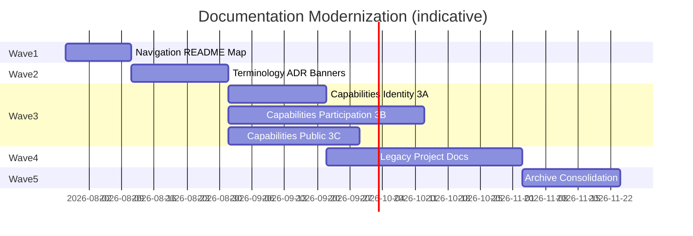
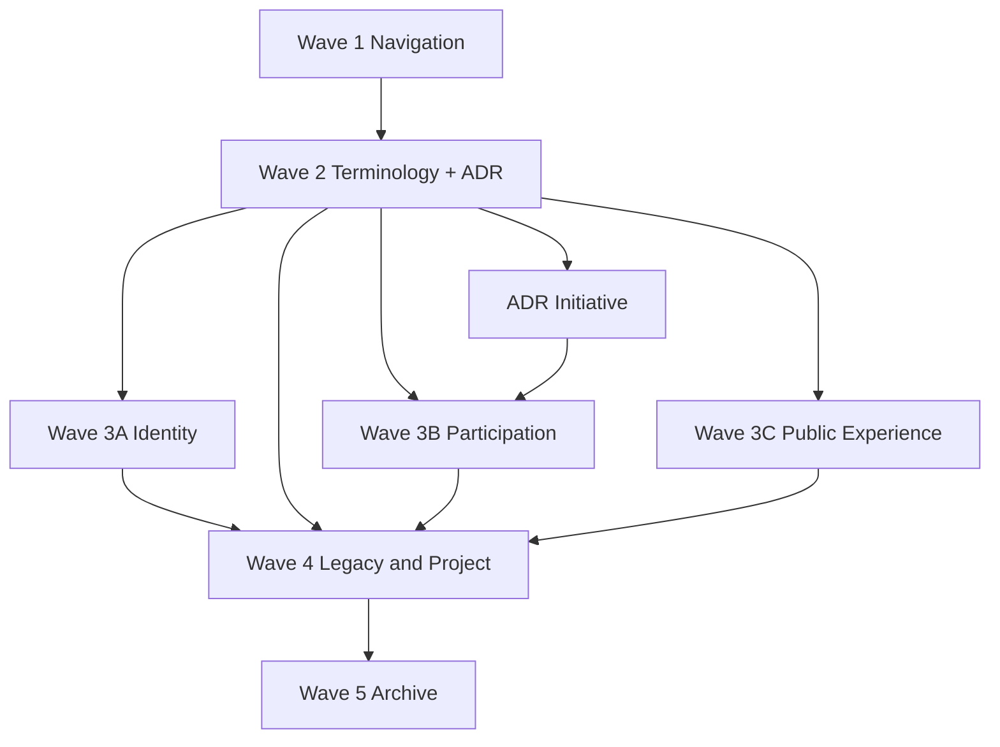
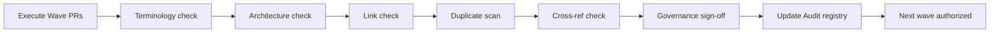
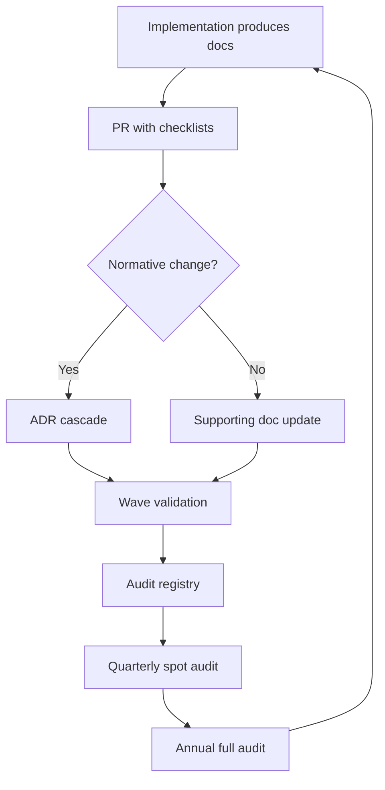

# Humanity Union Documentation Update Plan

## Version 1.0

### Master Execution Plan for Documentation Modernization

---

# Document Status

| Field | Value |
|-------|-------|
| **Type** | Execution plan — defines *how* updates will run |
| **Scope** | All 346 Markdown documents ([Audit](./00_DOCUMENTATION_AUDIT.md)) |
| **Policy** | Executes under [Documentation Governance](./01_DOCUMENTATION_GOVERNANCE.md) |
| **Modifies existing docs?** | **No** — this plan only; edits occur in future governed waves |
| **Horizon** | Approximately 4–6 months (parallel with early implementation) |

---

# Section 1 — Purpose

Humanity Union has completed architecture design, Activity-centered integration, platform definition, documentation audit, and documentation governance. **268 documents** remain in **UPDATE** status. Random edits would recreate the drift the normative stack was built to prevent.

## Why planned waves — not ad hoc edits

| Goal | How waves deliver it |
|------|----------------------|
| **Consistency** | Top-down propagation in each wave; terminology before capabilities |
| **Predictability** | Teams know what changes when; dashboard tracks completion |
| **Traceability** | Each wave ends with registry update and validation record |
| **Low risk** | Supersession banners before merges; no delete; gate between waves |
| **Architecture preservation** | Normative Levels 1–4 frozen unless ADR + governed cascade |

**This document is the master execution plan.** It does not edit any source document. It schedules *when* and *in what order* future edits occur.

---

# Section 2 — Update Principles

All modernization work must obey [Documentation Governance §2–5](./01_DOCUMENTATION_GOVERNANCE.md).

## Guiding rules

| # | Rule |
|---|------|
| 1 | **Never update lower-level documents before higher-level ones** within the same concept domain |
| 2 | **Never introduce new terminology** without Governance approval (`00` + Platform if user-facing) |
| 3 | **Never duplicate authority** — merge or banner; one SOT per concept |
| 4 | **Never delete historical documentation** — archive with header template |
| 5 | **Update only after dependency validation** — upstream doc status ACTIVE or explicitly bannered |
| 6 | **Never skip wave validation** — Section 6 checklist before next wave starts |
| 7 | **ADR before structural change** — new aggregates, events, bounded contexts, Initiative write model |
| 8 | **Batch by domain** — all Capability 02 Initiative docs in Wave 3, not scattered |
| 9 | **Registry always updated** — `00_DOCUMENTATION_AUDIT` reflects each wave closure |
| 10 | **Normative stack is baseline** — Engineering `00`–`11`, Catalogue, Integration, Platform are reference, not rewrite targets in Waves 1–5 unless ADR |

## Out of scope for this plan

- Rewriting Blueprint civic principles  
- Adding domain events outside Catalogue  
- Replacing Engineering architecture  
- Code implementation (except README cross-links in Wave 1)  

---

# Section 3 — Update Waves

Five waves over **~4–6 months**. Waves are **sequential gates** — Wave *n+1* starts only after Wave *n* validation passes (Section 6).

```text
Wave 1 — Navigation          (Weeks 1–2)
Wave 2 — Terminology         (Weeks 3–5)
Wave 3 — Capabilities        (Weeks 6–12)
Wave 4 — Legacy & project    (Weeks 10–16, partial overlap with 3)
Wave 5 — Archive consolidation (Weeks 14–18)
```

---

## Wave 1 — Repository navigation

**Objective:** Every contributor finds the normative stack in under five minutes. Zero ambiguity about where truth lives.

| Deliverable | Documents | Action |
|-------------|-----------|--------|
| Root README map | `README.md` | Add pyramid, reading order, links to Platform → Integration → Engineering → Blueprint → Governance |
| Documentation map | `governance/03_DOCUMENTATION_MAP.md` *(new — Wave 1 deliverable)* | Visual + textual navigation companion to Audit |
| Governance index | `governance/README.md` *(optional)* | Link Audit, Governance, Update Plan |
| Cross-links in normative headers | Engineering `00`–`11`, Integration, Platform | Verify Related Documents paths (link-only PR if broken) |
| Audit registry bump | `00_DOCUMENTATION_AUDIT` | Record Wave 1 completion |

**Documents touched:** ~15 (mostly navigation metadata, not semantic rewrites)  
**Dependencies:** None — normative content already ACTIVE  
**Risk level:** Low  

---

## Wave 2 — Terminology

**Objective:** Eliminate dual dictionaries and active confusion from legacy domain language (AC-04, AC-05).

| Deliverable | Documents | Action |
|-------------|-----------|--------|
| Supersession banners | `docs/DOMAIN_MODEL.md`, `docs/PROJECT_DICTIONARY.md` | Banner → Engineering `02`, `00` |
| Initiative ADR | New ADR in `architecture/ARCHITECTURE_DECISION_RECORDS.md` | Close AC-01 — Initiative as Activity graph grouping vs aggregate |
| Baseline banner | `PLATFORM_ARCHITECTURE_BASELINE_V1.md` | Supersession + Activity-first mapping table |
| Participation pipeline mapping | `capabilities/02_participation/PARTICIPATION_PIPELINE.md` | Equivalence table: Initiative pipeline ↔ Activity lifecycle |
| Capability 02 index | `CAPABILITY_02_PARTICIPATION.md` | Bounded context map to Engineering `02` |
| Blueprint Book 02 pointer | `Book_02_Engineering/11_ENGINEERING_ARCHITECTURE.md` | Note Engineering `01` as implementation norm |
| Glossary extension plan | Issue/tracker for `00` | List WSAZ/CRZ/Humanity Council — ADR or ARCHIVE decision |

**Documents touched:** ~12 normative-adjacent + 1 ADR  
**Dependencies:** Wave 1 complete (navigation to SOT)  
**Risk level:** Medium — requires ADR approval for Initiative  

**Merge execution (optional end of Wave 2):** Snapshot `PROJECT_DICTIONARY` to `/archive/deprecated-terminology` after banner; defer full content merge to Wave 4 if contentious.

---

## Wave 3 — Capabilities (Activity-first migration)

**Objective:** Align 159 capability documents with Activity-centered Engineering without rewriting epics unnecessarily.

### Wave 3 phases

| Phase | Scope | Documents (approx.) |
|-------|-------|---------------------|
| **3A — Identity** | `capabilities/01_human_identity/**` | 24 |
| **3B — Participation** | `capabilities/02_participation/**` | 84 |
| **3C — Public experience** | `capabilities/03_public_experience/**` | 50 |

### Per-epic update template

For each epic folder apply:

1. **DOMAIN_LANGUAGE.md** — align terms to `engineering/00`; Conversation = Discussion type  
2. **DOMAIN_MODEL.md** — map aggregates to Engineering `02`; remove competing roots  
3. **STATE_MACHINE.md** — align transitions to Catalogue events  
4. **IMPLEMENTATION_GUIDE_*.md** — cite Catalogue event names; `MemberRegistered` not deprecated aliases  
5. **ARCHITECTURE_FREEZE / REVIEW** — add compatibility footer: *Engineering v1.0, Catalogue v1.0*  
6. **WORKSPACE_SPECIFICATION.md** — defer to Blueprint 09 + Platform §9  

### Terminology focus (Wave 3)

| Legacy pattern | Target pattern |
|----------------|----------------|
| Initiative-first pipeline entry | Activity-first + Initiative grouping (per ADR) |
| Petition epic as separate civic root | Map to Proposal / Member Signal path |
| Poll epic | Map to Decision / non-binding policy per `06` |
| Collaborative Analysis as module | Discussion Contributions + Analysis type |
| Separate Conversation domain | Discussion type + Inbox category |

**Documents touched:** ~159 (batched by epic during implementation sprints)  
**Dependencies:** Wave 2 complete (ADR + banners + pipeline mapping)  
**Risk level:** High if ADR delayed — **block 3B until Initiative ADR merged**  

---

## Wave 4 — Platform documentation alignment

**Objective:** Align `/docs`, `/project`, root baselines, and PHASE guides with normative + Platform language.

| Cluster | Documents | Action |
|---------|-----------|--------|
| **Legacy domain docs** | `docs/WORKSPACE.md`, `MEMBER_SPECIFICATION.md`, `CIVIC_RESPONSIBILITY_PROFILE.md` | Banner + merge content into Blueprint/Engineering references OR rewrite as implementation notes |
| **Membership cluster** | `docs/MEMBERSHIP*.md`, `MEMBER_*.md` | Align to Identity/Member engineering model |
| **Experience docs** | `docs/PUBLIC_*`, `DESIGN_SYSTEM.md`, `SITE_MAP.md` | Align to Platform + public experience capabilities |
| **Project architecture core** | `project/architecture/core/SYSTEM_ARCHITECTURE.md`, `DOMAIN_MODELING_GUIDELINES.md` | Banner → `engineering/01`, `02`; merge unique content only |
| **Project intelligence** | `project/architecture/intelligence/*` (6) | Reframe as AI Facilitation implementation notes (ADR-005) |
| **Root roadmaps** | `PLATFORM_CAPABILITY_MAP.md`, `PLATFORM_ROADMAP.md`, `PROJECT_ROADMAP.md` | Align layers to Platform Overview; MERGE map into Platform companion doc |
| **PHASE_01 guides** | `engineering/PHASE_01_FOUNDATION/*` (16) | Cross-link Catalogue, `11`, Governance reading order |
| **Ops runbooks** | `docs/EMAIL_*`, `STAGING_*`, `PRODUCTION_*` | **Keep** — add note: operational, not domain architecture |
| **Consistency Review** | `ENGINEERING_ARCHITECTURE_CONSISTENCY_REVIEW.md` | Addendum listing resolved items OR schedule Wave 5 archive |

**Documents touched:** ~109 in `/docs` + `/project` + root (selective — not all 109 require semantic edit)  
**Dependencies:** Wave 2 banners minimum; Wave 3A recommended before membership docs  
**Risk level:** Medium — large surface; use cluster PRs  

---

## Wave 5 — Historical consolidation

**Objective:** Move superseded documents to `/archive`; finalize registry; achieve target health scores.

| Action | Documents |
|--------|-----------|
| Create `/archive` structure | Per Governance §12 |
| Move ARCHIVE candidates | `HUMANITY_PLATFORM_ARCHITECTURE_REVIEW_V1`, `MASTER_PROJECT_SPEC`, certificates, cleanup briefing |
| Move bannered baselines | `PLATFORM_ARCHITECTURE_BASELINE_V1` (after Wave 2 snapshot) |
| Dictionary/domain snapshots | Post-merge snapshots from Wave 2–4 |
| Audit registry final pass | All 346 docs status refreshed |
| Optional: Blueprint Livingi refresh | `04_LIVINGi_PLATFORM_BLUEPRINT.md` — UPDATE or ARCHIVE decision |

**Documents touched:** ~7–15 moves + registry  
**Dependencies:** Waves 2–4 banners and merges complete  
**Risk level:** Low  

---

# Section 4 — Dependency Order

Documentation modernization **must** respect the authority cascade. Violating order recreates AC-01 through AC-06 class defects.

```text
Blueprint (civic behavior)
        ↓
ADR (decisions)
        ↓
Engineering + Canonical Event Catalogue
        ↓
Integration (Activity-centered bridge)
        ↓
Platform Overview (product language)
        ↓
Governance (Audit registry + policy)
        ↓
Capabilities (epic implementation)
        ↓
/docs + /project (foundations & notes)
        ↓
Development (apps README, code comments)
        ↓
Archive (historical preservation)
```

## Why order must never be violated

| Violation | Consequence |
|-----------|-------------|
| Update Capability before ADR | Initiative write model coded against wrong authority |
| Update `/docs` dictionary before `engineering/00` | Permanent terminology fork |
| Merge DOMAIN_MODEL before Engineering stable | Merge target moves — double work |
| Archive before banner | Broken links, lost traceability |
| Change Catalogue from capability epic | Event vocabulary fork — implementation failure |

**Wave mapping to dependency order:**

| Wave | Highest layer touched | Lowest layer touched |
|------|----------------------|----------------------|
| 1 | Governance (map) | README (dev entry) |
| 2 | ADR | Capability index, baseline banners |
| 3 | — (reads normative) | Capabilities |
| 4 | — (reads normative) | docs, project, PHASE |
| 5 | — | Archive |

Normative Levels 1–4 (**49 ACTIVE docs**) are **reference anchors** for Waves 1–5 — not bulk rewrite targets.

---

# Section 5 — Update Criteria

Before editing **any** document in a wave, the editor completes this checklist for that file:

| # | Criterion | Verification source |
|---|-----------|---------------------|
| 1 | **Authority source** | Identify single upstream SOT from Governance §4 |
| 2 | **Terminology** | Terms exist in `engineering/00` or Platform; deprecated names not used actively |
| 3 | **Architecture** | Bounded contexts match `engineering/01`; events match Catalogue |
| 4 | **Cross-references** | Related Documents paths valid; upstream cited in header |
| 5 | **Dependencies** | Upstream wave complete; ADR merged if structural |
| 6 | **Duplicate content** | Audit §5 — not redefining merged concepts |
| 7 | **Status from Audit** | Current ACTIVE / UPDATE / MERGE / ARCHIVE classification |
| 8 | **Change class** | Governance §5 — ADR required? |
| 9 | **Audience** | Correct layer — don't put implementation detail in Platform |

**Block edit if:** upstream SOT is UPDATE without banner; Initiative domain code depends on doc and ADR-Initiative is open (Wave 3B).

---

# Section 6 — Validation After Each Wave

No wave closes until **all** validations pass and Governance steward signs off.

## Validation cycle (per wave)

```text
Execute wave PRs
        ↓
Terminology validation
        ↓
Architecture validation
        ↓
Broken link check
        ↓
Duplicate detection scan
        ↓
Cross-reference validation
        ↓
Governance review
        ↓
Update Audit registry
        ↓
Dashboard completion %
        ↓
Authorize next wave
```

## Validation procedures

| Validation | Method | Pass criteria |
|------------|--------|---------------|
| **Terminology** | Grep deprecated event aliases; compare to `00` | Zero active deprecated aliases in updated docs |
| **Architecture** | Checklist vs `01`, `02`, Integration Review | Activity anchor preserved; no new aggregates without ADR |
| **Broken links** | `find` + link checker (manual or CI) | All internal links in wave scope resolve |
| **Duplicate detection** | Audit concept search | No new second SOT for updated concepts |
| **Cross-reference** | Related Documents audit | Every updated doc cites upstream authority |
| **Governance review** | Steward sign-off | Registry updated; wave record filed |

## Wave closure record template

| Field | Value |
|-------|-------|
| Wave number | |
| Completion date | |
| PRs merged | |
| Documents updated | |
| Validation pass/fail | |
| Audit registry version | |
| Exceptions (ADR ref) | |
| Authorized by | |

---

# Section 7 — Success Metrics

Measurable goals at **plan completion** (end of Wave 5) and **ongoing** maintenance.

| Metric | Baseline (Audit v1.0) | Target | Measurement |
|--------|----------------------|--------|-------------|
| **Terminology consistency** | 68 / 100 | **≥ 90 / 100** | Sample 50 random UPDATE docs vs `00` |
| **Authoritative references** | ~60% supporting docs cite SOT | **100%** in updated scope | Automated grep for "Authoritative definition:" or Related Documents upstream |
| **Conflicting definitions** | AC-01–AC-06 open | **0 open P1 conflicts** | Audit inconsistency table cleared |
| **Duplicate authority** | 62 / 100 duplication score | **≥ 85 / 100** | No MERGE candidates remaining active |
| **Fully linked navigation** | README incomplete | **100%** pyramid links from README + Documentation Map | Manual review |
| **Repository navigation completeness** | No map | Map + README + Governance index | Deliverable exists |
| **ACTIVE registry accuracy** | 49 ACTIVE | **≥ 55 ACTIVE** post-capability alignment *(supporting promoted or correctly bannered)* | Audit status counts |
| **ARCHIVE hygiene** | 0 in `/archive` | **All ARCHIVE candidates moved** | File count in `/archive` |
| **Documentation Health Score** | 74 / 100 | **≥ 85 / 100** | Re-run Audit assessment |

### Wave-level completion metrics

| Wave | Completion definition |
|------|----------------------|
| 1 | README + Documentation Map published; validation record filed |
| 2 | ADR-Initiative merged; banners on dictionary, domain model, baseline; pipeline mapping published |
| 3 | 100% capability epic indexes updated; 3A/3B/3C validation each passed |
| 4 | All MERGE clusters executed or bannered; intelligence reframed; roadmaps aligned |
| 5 | Archive structure populated; Audit v1.1 registry published |

---

# Section 8 — Risk Management

| Risk | Impact | Likelihood | Mitigation |
|------|--------|------------|------------|
| **Updating supporting docs before normative** | High | Medium | Wave order + Section 5 block rules |
| **Changing terminology inconsistently** | High | Medium | Wave 2 before Wave 3; grep validation |
| **Breaking links on move/merge** | Medium | High | Link check each wave; redirect banners with paths |
| **Conflicting diagrams** | Medium | Medium | Canonical names in diagram review checklist |
| **Duplicate definitions after merge** | High | Low | Duplicate scan; single PR per merge cluster |
| **ADR-Initiative delayed** | High | Medium | Block Wave 3B; proceed with 3A and 3C |
| **Capability epic owner bypasses process** | High | Medium | Architecture review on epic PRs; freeze footer required |
| **Implementers use bannered docs** | High | Medium | Wave 1 navigation; bold banners; onboarding script |
| **Scope creep into normative rewrite** | High | Low | Governance §10 — normative frozen without ADR |
| **Archive without snapshot** | Medium | Low | Merge policy snapshot step mandatory |
| **Parallel waves without validation** | High | Low | Sequential gate — dashboard blocks next wave |

---

# Section 9 — Modernization Dashboard

*Status at plan publication — update after each wave closure.*

| Wave | Status | Documents (scope) | Dependencies | Validation | Completion % | Owner | Notes |
|------|--------|-------------------|--------------|------------|--------------|-------|-------|
| **1 — Navigation** | Not started | ~15 | None | Pending | 0% | Documentation steward | First execution wave |
| **2 — Terminology** | Not started | ~12 + ADR | Wave 1 | Pending | 0% | Architecture + Doc steward | ADR-Initiative critical path |
| **3A — Capabilities Identity** | Not started | 24 | Wave 2 | Pending | 0% | Capability 01 owner | Can parallel after Wave 2 |
| **3B — Capabilities Participation** | Blocked | 84 | Wave 2 + ADR | Pending | 0% | Capability 02 owner | **Blocked on ADR-Initiative** |
| **3C — Capabilities Public** | Not started | 50 | Wave 2 | Pending | 0% | Capability 03 owner | Search/public projection focus |
| **4 — Legacy & project** | Not started | ~60–109 selective | Wave 2 min; 3A rec. | Pending | 0% | Doc + feature stewards | Cluster PRs |
| **5 — Archive** | Not started | ~7–15 moves | Waves 2–4 | Pending | 0% | Documentation steward | Final consolidation |

**Overall plan completion:** 0%  
**Target completion date:** ~18 weeks from Wave 1 start (adjust per team capacity)

---

# Section 10 — Long-Term Maintenance

Documentation modernization does not end at Wave 5. Implementation will generate new docs continuously.

## Recurring governance cadence

| Cadence | Activity | Owner |
|---------|----------|-------|
| **Per normative PR** | Change + Review checklists (Governance) | Author + steward |
| **Per sprint** | Dashboard update; Wave progress | Documentation steward |
| **Quarterly** | Spot audit — terminology, duplicates, 20-doc sample | Doc + Architecture stewards |
| **Per release** | Audit registry refresh; link check | Documentation steward |
| **Annual** | Full Documentation Audit re-run (v2.0); health scores | Governance review session |
| **On ADR acceptance** | Cascade plan before merge | ADR author |
| **Archive review** | Verify banners; no orphaned ACTIVE status | Documentation steward |

## Post-implementation triggers for new wave

| Trigger | Response |
|---------|----------|
| New bounded context proposed | ADR → Blueprint → Engineering wave |
| New domain event | ADR → Catalogue → downstream wave |
| New capability (04+) | Capability index + map to Engineering before epic docs |
| Major Platform UX shift | Integration review → Platform update → docs wave |
| Health score drops below 80 | Targeted mini-wave |

---

# Section 11 — Final Roadmap

Documentation modernization is a **continuous governance process**, not a one-time cleanup.

## Strategy summary

1. **Stabilize navigation** (Wave 1) so nobody implements from the wrong layer.  
2. **Resolve terminology and Initiative ADR** (Wave 2) to remove P1 conflicts.  
3. **Align capabilities Activity-first** (Wave 3) in epic batches with validation gates.  
4. **Clean legacy and project docs** (Wave 4) through merge, banner, and reframe — not delete.  
5. **Archive and registry finalize** (Wave 5) to reach target health scores.  
6. **Maintain** via quarterly audit and annual full reassessment.

The normative stack (Blueprint, Engineering, Catalogue, Integration, Platform, Governance) remains the **anchor**. Modernization brings **268 UPDATE documents** into deferential alignment — without redesigning the platform.

```text
2026 Q3  Wave 1–2  Navigation + Terminology + ADR-Initiative
2026 Q3–Q4  Wave 3     Capabilities (3A → 3B → 3C)
2026 Q4  Wave 4       Legacy / project alignment
2026 Q4–Q1 2027  Wave 5   Archive + Audit v1.1
Ongoing       Maintenance cadence (Section 10)
```

---

# Mermaid Diagrams

## Diagram 1 — Documentation Modernization Roadmap



## Diagram 2 — Wave Dependency Graph



## Diagram 3 — Validation Cycle



## Diagram 4 — Continuous Governance Loop



---

# Modernization Roadmap

| Phase | Weeks | Wave | Outcome |
|-------|-------|------|---------|
| **Phase A** | 1–2 | 1 | Navigable repository; Documentation Map |
| **Phase B** | 3–5 | 2 | Terminology gates; ADR-Initiative; P1 banners |
| **Phase C** | 6–12 | 3 | Capabilities Activity-first aligned |
| **Phase D** | 10–16 | 4 | Legacy/project docs merged or bannered |
| **Phase E** | 14–18 | 5 | Archive complete; Audit v1.1; health ≥ 85 |

---

# Wave Summary

| Wave | Name | Docs | Critical deliverable |
|------|------|------|----------------------|
| 1 | Navigation | ~15 | `governance/03_DOCUMENTATION_MAP.md` + README |
| 2 | Terminology | ~12 + ADR | ADR-Initiative; dictionary/domain banners |
| 3 | Capabilities | ~159 | Epic templates; Activity-first language |
| 4 | Legacy & project | ~60–109 | MERGE clusters; intelligence reframe |
| 5 | Archive | ~7–15 | `/archive` populated; registry finalized |

---

# Priority Matrix

| Priority | Wave | Rationale | Blocker if skipped |
|----------|------|-----------|-------------------|
| **P0** | 1 | Navigation | Wrong-doc implementation |
| **P0** | 2 | Terminology + ADR | AC-01, AC-04, AC-05 persist |
| **P1** | 3B | Participation capabilities | Initiative-centric code/docs drift |
| **P1** | 3A, 3C | Identity + public | Parallel after Wave 2 |
| **P2** | 4 | Legacy cleanup | Duplication score stays low |
| **P3** | 5 | Archive | Acceptable if bannered |

---

# Validation Checklist

*(Copy per wave closure — from Section 6)*

- [ ] All wave PRs merged  
- [ ] Terminology validation passed  
- [ ] Architecture validation passed  
- [ ] Broken links resolved in scope  
- [ ] Duplicate detection passed  
- [ ] Cross-references verified  
- [ ] Governance steward sign-off  
- [ ] `00_DOCUMENTATION_AUDIT` updated  
- [ ] Dashboard completion % updated  
- [ ] Next wave authorized  

---

# Success Metrics

| Metric | Target at plan end |
|--------|-------------------|
| Terminology consistency score | ≥ 90 / 100 |
| Documentation Health Score | ≥ 85 / 100 |
| Duplicate documentation score | ≥ 85 / 100 |
| P1 architecture conflicts (AC-01–06) | 0 open |
| Supporting docs with upstream citation | 100% in modernized scope |
| ARCHIVE candidates relocated | 100% |
| README + Documentation Map | Published and linked |

---

# Recommended First Execution Wave

## **Wave 1 — Repository navigation**

**Start here.** Lowest risk; highest immediate value; no semantic rewrites.

### Wave 1 execution pack (when approved to edit)

1. Update `README.md` with documentation pyramid and reading order  
2. Create `governance/03_DOCUMENTATION_MAP.md`  
3. Verify cross-links in normative Related Documents sections  
4. Run link validation on governance + normative paths  
5. File Wave 1 closure record; set dashboard Wave 1 to 100%  
6. Authorize Wave 2 (Terminology + ADR-Initiative drafting in parallel)

**Estimated effort:** 2–5 person-days  
**Dependencies:** None  
**Does not require:** Capability or `/docs` content rewrites  

---

# GO / REVIEW AGAIN

## **GO** — Execute modernization plan

The plan is compatible with [Documentation Governance](./01_DOCUMENTATION_GOVERNANCE.md) and [Documentation Audit](./00_DOCUMENTATION_AUDIT.md). **Begin Wave 1** when the team approves documentation edit windows.

## **REVIEW AGAIN** — Before starting Wave 3B

Reconvene if **ADR-Initiative** is not merged by Wave 2 closure — Wave 3B remains blocked.

## **REVIEW AGAIN** — Before any normative edit

Engineering `00`–`11`, Catalogue, Integration, Platform require ADR and Governance cascade — not scheduled in Waves 1–5 except link fixes.

---

**Document:** Documentation Update Plan  
**Version:** 1.0  
**Status:** Normative — Governance Execution Plan  
**Date:** 2026-07-21  
**Companion documents:** [00_DOCUMENTATION_AUDIT.md](./00_DOCUMENTATION_AUDIT.md), [01_DOCUMENTATION_GOVERNANCE.md](./01_DOCUMENTATION_GOVERNANCE.md)  
**Does not modify:** Any document outside `/governance`  
**Next action:** Approve Wave 1 execution → create `governance/03_DOCUMENTATION_MAP.md`
