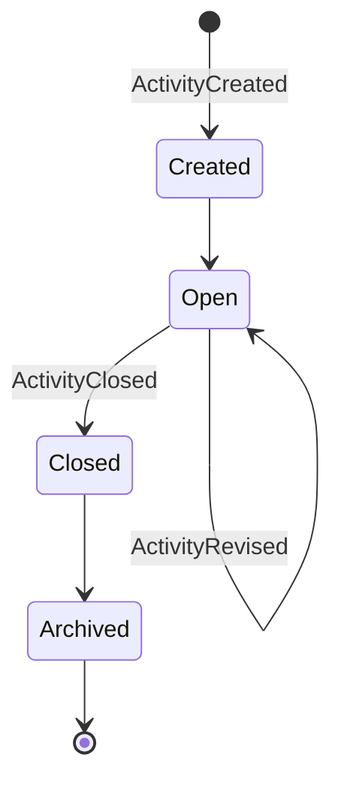
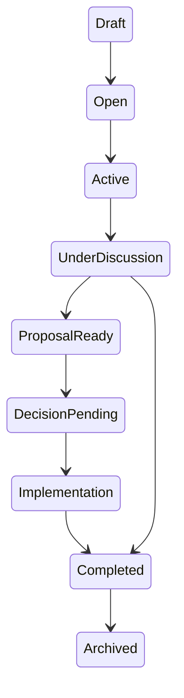

# Humanity Union Activity Implementation Specification

## Version 2.0

### Canonical Implementation Specification for the Activity Module

---

# Document Status

| Field | Value |
|-------|-------|
| **Document Type** | Canonical Module Implementation Specification |
| **Version** | 2.0 |
| **Status** | Approved for Implementation |
| **Authority Level** | Normative |
| **Implementation Scope** | Activity Module |
| **Primary Audience** | Software Architects, Backend Engineers, Frontend Engineers, QA Engineers, Technical Leads |
| **Implementation Readiness** | Production Architecture |
| **Repository Status** | Canonical Engineering Specification |

---

# Architectural Authority

This document defines the canonical implementation architecture of the Humanity Union Activity Module.

All Activity implementations SHALL conform to this specification.

This document defines:

- Activity implementation boundaries;
- Activity responsibilities;
- Activity composition;
- Activity lifecycle behavior;
- Activity command routing;
- Activity navigation;
- Activity presentation model;
- Activity integration with other bounded contexts;
- Activity implementation requirements.

This specification SHALL NOT redefine domain architecture established by the Blueprint.

---

# Document Position

This document translates Blueprint architecture into implementation guidance for the Activity module.

It specifies **how** the Activity module SHALL be implemented while preserving the architectural constraints defined by the Blueprint.

The Blueprint remains the authoritative source for:

- domain model;
- bounded contexts;
- aggregates;
- domain events;
- ownership rules;
- governance.

This specification SHALL NOT introduce:

- new bounded contexts;
- additional aggregates;
- undocumented commands;
- undocumented Catalogue Events;
- alternative ownership models;
- implementation shortcuts that violate Blueprint architecture.

---

# Normative References

This specification SHALL be interpreted together with the following repository documents.

### Blueprint

- 00_PLATFORM_BLUEPRINT
- 01_DOMAIN_MODEL
- 02_DOMAIN_BOUNDARIES
- 03_CQRS_AND_EVENT_ARCHITECTURE
- 04_APPLICATION_ARCHITECTURE
- 05_ACTIVITY_ENGINE_SPECIFICATION
- 06_MEMBER_SPECIFICATION
- 07_DISCUSSION_SPECIFICATION
- 08_PROPOSAL_SPECIFICATION
- 09_DECISION_SPECIFICATION
- 10_IMPLEMENTATION_SPECIFICATION

### Engineering Standards

- Engineering Standards v2
- Application Workflows
- Canonical Event Catalogue
- Validation Framework
- CQRS Standards
- API Standards
- Security Standards

### Repository Specifications

- Workspace Implementation Specification
- Member Journey Specification
- MVP Implementation Strategy
- Integration Blueprint
- Platform Overview

---

# Repository Position

Within the repository, this specification occupies the implementation layer between Blueprint architecture and software implementation.

```text
Blueprint

        ↓

Engineering Standards

        ↓

Activity Implementation Specification

        ↓

Backend Services
Frontend Components
API Endpoints
Read Projections

        ↓

Production System
```

This document SHALL remain implementation-focused and SHALL NOT duplicate Blueprint responsibilities.

---

# Scope

This specification defines the implementation architecture of the Activity Module.

It includes:

- Activity Thread architecture;
- Activity aggregate implementation;
- Activity presentation;
- lifecycle implementation;
- command routing;
- read projections;
- navigation;
- component composition;
- CQRS implementation;
- integration with other bounded contexts;
- validation requirements.

---

# Non-Scope

This specification SHALL NOT define:

- domain governance;
- constitutional rules;
- Activity policy;
- institutional procedures;
- Member governance;
- Proposal governance;
- Decision governance;
- Implementation governance.

Those responsibilities remain within their respective Blueprint specifications.

---

# Architectural Principles

The Activity Module SHALL conform to the following architectural principles.

## Activity-First Architecture

Activity represents the canonical civic trace of meaningful participation.

Every civic workflow SHALL begin with an Activity.

Activity SHALL remain the permanent coordination anchor of civic participation.

---

## Single Civic Trace

Every civic interaction SHALL belong to exactly one Activity thread.

Multiple independent civic traces representing the same participation SHALL NOT exist.

This principle preserves traceability across the platform.

---

## Aggregate Ownership

Activity owns only the Activity aggregate.

Discussion owns the Discussion aggregate.

Proposal owns the Proposal aggregate.

Decision owns the Decision aggregate.

Implementation owns the Implementation aggregate.

ImpactAssessment owns the ImpactAssessment aggregate.

Ownership SHALL NOT be transferred through the Activity thread.

---

## Projection-Driven Presentation

The Activity Thread SHALL present information using approved read projections.

The thread SHALL NOT directly query or mutate aggregates outside their owning contexts.

Composite presentation SHALL remain projection-driven.

---

## Command Routing

Commands originating from the Activity Thread SHALL always be routed to the owning bounded context.

Examples include:

- Discussion commands;
- Proposal commands;
- Decision commands;
- Implementation commands;
- Impact commands.

The Activity Thread SHALL coordinate user interaction without assuming ownership of foreign aggregates.

---

## Immutable Civic Trace

Activity represents an immutable civic record.

Historical Activity information SHALL NOT be modified.

Corrections SHALL occur exclusively through append-only revision mechanisms defined by the Catalogue.

---

## Activity as Civic Coordination

Activity coordinates civic work.

It SHALL NOT become:

- a workflow engine;
- a discussion engine;
- a proposal engine;
- a decision engine;
- an implementation engine.

Those capabilities remain within their respective bounded contexts.

---

# Section 1 — Purpose

## Why Activity Exists

The Humanity Union platform records meaningful civic participation rather than interface interactions, notifications, or temporary workflow state.

Activity answers a single canonical question:

> **What meaningful civic participation occurred?**

Activity therefore serves as the permanent civic trace that connects every stage of participation throughout the platform.

Rather than creating isolated discussions, proposals, decisions, or implementation records, Humanity Union preserves a continuous civic history centered on Activity.

This architectural principle guarantees:

- complete traceability;
- institutional transparency;
- long-term accountability;
- historical integrity;
- reproducible civic history.

Activity therefore represents the canonical coordination object of the Humanity Union platform.

---

## Why Activity Is the Civic Anchor

Without Activity, civic participation fragments into disconnected workflows.

Discussion becomes independent from Proposal.

Proposal becomes independent from Decision.

Decision becomes independent from Implementation.

Implementation becomes independent from recorded Impact.

Such fragmentation destroys institutional traceability.

Activity prevents this by providing one immutable civic anchor referenced by every participating bounded context.

Every authorized observer therefore views the same civic history regardless of their Workspace configuration or personal responsibilities.

---

## Relationship to Workspace

Workspace and Activity serve fundamentally different architectural purposes.

| Dimension | Workspace | Activity |
|-----------|-----------|----------|
| **Purpose** | Operational environment for Members | Canonical civic trace |
| **Primary responsibility** | Presentation and navigation | Civic participation coordination |
| **Ownership** | Member Workspace | Activity aggregate |
| **Persistence** | Personal preferences and UI state | Immutable civic history |
| **Personalization** | Private | Shared according to visibility policy |
| **Commands** | Workspace operations | Activity aggregate commands |
| **Role** | Member interface | Civic coordination anchor |

Workspace SHALL surface Activities.

Workspace SHALL NOT own Activities.

Activity SHALL remain independent of Workspace implementation.

---

## Relationship to Discussion

Discussion provides structured deliberation.

Activity records that meaningful civic participation exists.

Discussion therefore extends Activity rather than replacing it.

Discussion SHALL reference Activity through ActivityId.

Discussion SHALL NOT become an alternative civic anchor.

Activity SHALL coordinate navigation between civic stages while preserving ownership boundaries.

Discussion SHALL continue to own:

- Contributions;
- Evidence;
- discussion lifecycle;
- deliberation.

Activity SHALL continue to own only the Activity aggregate.

## Relationship to the Civic Lifecycle

Activity is the permanent coordination spine of the Humanity Union civic lifecycle.

Every downstream civic process SHALL attach to the same Activity thread while preserving ownership of its own aggregate.

The canonical civic progression is illustrated below.

```text
CreateActivity
        │
        ▼
ActivityCreated
        │
        ▼
OpenDiscussion
        │
        ▼
DiscussionOpened
        │
        ▼
ContributionAdded
EvidenceContributed
        │
        ▼
SubmitProposal
        │
        ▼
ProposalSubmitted
        │
        ▼
DecisionApproved
DecisionRejected
DecisionReturnedForRevision
        │
        ▼
ImplementationStarted
        │
        ▼
ImplementationCompleted
        │
        ▼
ImpactRecorded
        │
        ▼
CloseActivity
        │
        ▼
ActivityClosed
```

This sequence represents the complete civic lifecycle.

Individual Activities MAY terminate earlier depending on governance outcomes.

The Activity module SHALL support both complete and partial civic journeys.

---

# Section 2 — Activity Responsibilities

The Activity Module is responsible for implementing the canonical civic trace defined by the Blueprint.

Its responsibilities are intentionally limited.

Activity SHALL coordinate civic participation without assuming ownership of neighboring bounded contexts.

---

## Responsibility Principles

The Activity Module SHALL:

- own the Activity aggregate;
- coordinate civic navigation;
- expose Activity commands;
- compose Activity Thread presentation;
- consume approved read projections;
- preserve civic traceability.

The Activity Module SHALL NOT:

- execute Proposal business logic;
- execute Decision business logic;
- execute Discussion business logic;
- execute Implementation business logic;
- execute Impact evaluation.

Those responsibilities remain within their owning bounded contexts.

---

## Responsibility Matrix

| Responsibility | Activity Module | Owning Context | MVP |
|----------------|----------------|----------------|-----|
| **Activity context** | Display Activity identity, visibility, actor, timestamps | Activity | ✓ |
| **Activity Thread composition** | Compose civic thread presentation | Activity | ✓ |
| **Participation visibility** | Present participation information | Activity + Discussion | ✓ |
| **Lifecycle visibility** | Display aggregate state and civic stage | Composite projections | ✓ |
| **Related Discussions** | Present linked Discussions | Discussion | ✓ |
| **Evidence visibility** | Present Evidence summaries | Discussion | ✓ |
| **Proposal entry** | Route Proposal commands | Proposal | ✓ |
| **Decision visibility** | Display governance progress | Decision | ✓ |
| **Implementation visibility** | Display execution progress | Implementation | ✓ |
| **Impact visibility** | Present documented outcomes | Implementation | ✓ |
| **Activity creation** | Dispatch `CreateActivity` | Activity | ✓ |
| **Activity revision** | Dispatch `ReviseActivity` | Activity | ✓ |
| **Activity closure** | Dispatch `CloseActivity` | Activity | ✓ |
| **Public discovery** | Support Search projections | Search | ✓ |
| **Inbox integration** | Publish Activity-derived projections | Workspace Inbox | ✓ |
| **Notification integration** | Provide Catalogue Events consumed by Notification | Notification | ✓ |
| **Working Groups** | Deferred | Working Group | ✗ |
| **Allies** | Deferred | Allies | ✗ |
| **Institutional Memory** | Deferred | Institutional Memory | ✗ |
| **AI Facilitation** | Deferred | AI Facilitation | ✗ |
| **Initiative Graph** | Deferred | Initiative | ✗ |

The Activity Module SHALL remain focused on civic coordination rather than feature accumulation.

---

## Responsibility Boundaries

The following architectural boundaries SHALL remain permanent.

### Activity Owns

- Activity aggregate
- Activity lifecycle
- Activity commands
- Activity metadata
- Activity identity
- Activity visibility
- Activity thread coordination

---

### Discussion Owns

- Discussions
- Contributions
- Evidence
- deliberation
- discussion lifecycle

---

### Proposal Owns

- proposal lifecycle;
- proposal drafting;
- proposal revisions;
- proposal withdrawal.

---

### Decision Owns

- governance workflow;
- approval;
- rejection;
- voting;
- decision outcomes.

---

### Implementation Owns

- implementation execution;
- implementation milestones;
- implementation completion;
- impact recording.

---

## Architectural Invariants

The following rules SHALL NEVER be violated.

### Single Activity Ownership

Only the Activity bounded context MAY mutate the Activity aggregate.

---

### No Cross-Aggregate Writes

The Activity Module SHALL NOT mutate:

- Discussion aggregates;
- Proposal aggregates;
- Decision aggregates;
- Implementation aggregates;
- ImpactAssessment aggregates.

Cross-context operations SHALL always occur through Application Layer command routing.

---

### Activity Thread Is Not an Aggregate

The Activity Thread is a presentation composition.

It SHALL NOT become:

- an aggregate;
- a workflow engine;
- an orchestration service;
- a persistence model.

Its responsibility is presentation and coordination only.

---

### Activity Thread Is Projection-Driven

The Activity Thread SHALL compose information from approved read projections.

Composite views SHALL NOT introduce independent business logic.

Projection ownership SHALL remain with the originating bounded context.

---

### No Duplicate Civic History

Activity SHALL remain the single canonical civic trace.

Duplicate Activity records representing identical civic participation SHALL NOT be created.

---

### No Orphan Civic Objects

Discussion SHALL reference Activity.

Proposal SHALL reference Activity.

Decision SHALL remain connected through the Proposal → Activity chain.

Implementation SHALL remain connected through the Decision → Proposal → Activity chain.

ImpactAssessment SHALL remain connected through the complete civic chain.

No civic object SHALL exist without traceable Activity ancestry.

---

### Immutable Activity Record

The Activity aggregate SHALL remain immutable.

Historical corrections SHALL occur only through append-only revision events.

Previous civic history SHALL remain permanently preserved.

---

## What the Activity Module Must Never Do

The Activity Module SHALL NEVER:

- own Discussion mutations;
- own Proposal mutations;
- own Decision mutations;
- own Implementation mutations;
- create Proposal objects directly;
- execute governance decisions;
- bypass Catalogue Events;
- mutate projections;
- replace Inbox functionality;
- replace Notification functionality;
- optimize for popularity or engagement metrics;
- introduce alternative civic trace models.

These prohibitions preserve the architectural integrity of the Humanity Union platform.

# Section 3 — Activity Lifecycle

The Activity Module defines two independent but coordinated lifecycle models.

These lifecycle models SHALL remain architecturally distinct.

Implementations SHALL NOT merge them into a single state machine.

---

## Lifecycle Architecture

The Activity architecture consists of:

1. **Aggregate Lifecycle**
2. **Civic Stage Lifecycle**

The Aggregate Lifecycle represents the authoritative state of the Activity aggregate.

The Civic Stage Lifecycle represents a derived projection describing where civic work currently resides within the broader governance process.

The Civic Stage Lifecycle SHALL NEVER become aggregate state.

---

## Layer A — Aggregate Lifecycle

The Aggregate Lifecycle is owned exclusively by the Activity bounded context.

Only Activity commands MAY transition aggregate state.

Catalogue Events SHALL remain the only source of truth.



---

### Aggregate States

| Aggregate State | Meaning | Catalogue Event |
|-----------------|---------|-----------------|
| **Created** | Activity successfully recorded | `ActivityCreated` |
| **Open** | Active civic trace accepting downstream participation | Follows `ActivityCreated` |
| **Closed** | Activity lifecycle completed | `ActivityClosed` |
| **Archived** | Historical presentation state | No additional Catalogue Event |

Archived is a presentation state derived from a closed Activity.

The Catalogue SHALL NOT define an `ActivityArchived` event.

---

### Aggregate Commands

Only the following commands SHALL mutate the Activity aggregate.

| Command | Result |
|----------|--------|
| `CreateActivity` | Creates Activity |
| `ReviseActivity` | Appends historical correction |
| `CloseActivity` | Ends Activity lifecycle |

No additional aggregate commands SHALL be introduced without Blueprint revision.

---

### Aggregate Invariants

The Aggregate Lifecycle SHALL satisfy the following invariants.

- every Activity has exactly one creation event;
- every Activity remains uniquely identifiable;
- Activity revisions remain append-only;
- historical records are never rewritten;
- closure is irreversible;
- archived Activities remain readable according to visibility policy.

---

## Layer B — Civic Stage Lifecycle

The Civic Stage Lifecycle is a projection.

It represents where civic work currently exists across multiple bounded contexts.

It SHALL NEVER become Activity aggregate state.

Instead, it SHALL be derived from Catalogue Events published by the owning contexts.



---

### Civic Stage Indicators

| Civic Stage | Entry Condition | Exit Condition | Primary Events |
|--------------|----------------|----------------|----------------|
| **Draft** | Member prepares Activity | `ActivityCreated` | Client preparation only |
| **Open** | Activity recorded | Discussion begins or Activity closes | `ActivityCreated` |
| **Active** | Participation begins | Discussion or closure | Activity + participation |
| **Under Discussion** | Discussion opened | Proposal submitted or discussion closed | `DiscussionOpened` |
| **Proposal Ready** | Deliberation maturity reached | Proposal submission | `MemberSignalRecorded` (optional) |
| **Decision Pending** | Proposal submitted | Decision outcome | `ProposalSubmitted` |
| **Implementation** | Approved proposal enters execution | Completion or suspension | `ImplementationStarted` |
| **Completed** | Impact recorded or Activity closed | Archive presentation | `ImpactRecorded`, `ActivityClosed` |
| **Archived** | Activity closed | None | Presentation only |

These stages SHALL remain presentation constructs.

---

## Aggregate Transition Rules

Aggregate transitions SHALL remain deterministic.

| From | To | Command | Event |
|------|----|----------|-------|
| — | Created | `CreateActivity` | `ActivityCreated` |
| Created | Open | Automatic | — |
| Open | Open | `ReviseActivity` | `ActivityRevised` |
| Open | Closed | `CloseActivity` | `ActivityClosed` |
| Closed | Archived | Presentation transition | — |

No additional transitions SHALL exist.

---

## Civic Stage Transition Rules

Civic stages advance through Catalogue Events produced by other bounded contexts.

The Activity Module SHALL consume these events through projections.

It SHALL NOT generate them.

| Transition | Triggering Context | Trigger Event |
|------------|-------------------|---------------|
| Open → Under Discussion | Discussion | `DiscussionOpened` |
| Under Discussion → Proposal Ready | Discussion / Proposal | Policy maturity, optional `MemberSignalRecorded` |
| Proposal Ready → Decision Pending | Proposal | `ProposalSubmitted` |
| Decision Pending → Implementation | Decision + Implementation | `DecisionApproved`, `ImplementationStarted` |
| Implementation → Completed | Implementation | `ImpactRecorded` |
| Completed → Archived | Activity | `ActivityClosed` |

---

## Forbidden Lifecycle Transitions

The following transitions SHALL NEVER occur.

| Forbidden Transition | Reason |
|----------------------|--------|
| Proposal before Activity | Breaks civic trace |
| Decision before Proposal | Violates governance |
| Implementation before Decision approval | Violates execution policy |
| Impact before Implementation | Invalid civic chronology |
| Discussion without ActivityId | Violates ADR-002 |
| Activity reopening after closure | Aggregate immutability |
| Aggregate state driven by projections | Violates CQRS |

---

## Partial Civic Journeys

Not every Activity SHALL traverse the complete civic lifecycle.

Partial civic journeys are valid.

Examples include:

| Pattern | Supported |
|----------|-----------|
| Volunteer coordination | ✓ |
| Public discussion only | ✓ |
| Proposal rejected | ✓ |
| Proposal withdrawn | ✓ |
| Implementation completed | ✓ |
| Information-sharing Activity | ✓ |

The Activity Module SHALL support all valid partial journeys without introducing inconsistent lifecycle states.

---

## Lifecycle Invariants

The following architectural invariants SHALL always remain true.

### Aggregate Authority

Only the Activity aggregate owns the Aggregate Lifecycle.

---

### Projection Authority

Only read projections determine the Civic Stage Lifecycle.

---

### Catalogue Authority

Lifecycle transitions SHALL originate exclusively from approved Catalogue Events.

---

### Ownership Preservation

Each bounded context SHALL remain responsible for its own lifecycle.

---

### Historical Integrity

Lifecycle history SHALL remain permanently reconstructable from the event stream.

---

### Projection Rebuildability

Every Civic Stage SHALL be reproducible through event replay.

No projection SHALL become the authoritative source of truth.

# Section 4 — Activity Components

The Activity Module is composed of presentation components that collectively render the canonical Activity Thread.

Each component has a clearly defined responsibility.

Component boundaries SHALL remain aligned with Blueprint ownership rules.

Components SHALL coordinate civic participation without assuming ownership of neighboring bounded contexts.

---

## Component Architecture Principles

Every Activity component SHALL satisfy the following principles.

### Single Responsibility

Each component SHALL implement one clearly defined responsibility.

Components SHALL NOT combine unrelated civic capabilities.

---

### Projection-First Rendering

Components SHALL render approved read projections.

Components SHALL NOT execute business logic.

---

### Command Routing

Components MAY initiate commands.

Commands SHALL always be routed to the owning bounded context.

---

### Ownership Preservation

Rendering information from another bounded context SHALL NOT imply ownership.

Presentation remains independent from aggregate ownership.

---

### Independent Composition

Components SHALL remain independently maintainable.

Replacing one component SHALL NOT require redesign of the Activity Thread.

---

# Component 1 — Activity Thread Root

| Field | Specification |
|-------|---------------|
| **Purpose** | Canonical presentation root of an Activity |
| **Inputs** | ActivityId, authenticated session |
| **Outputs** | Activity Thread composition |
| **Dependencies** | Activity Detail Projection, authorization |
| **Bounded Context** | Activity |
| **Aggregate** | Activity |
| **Read Models** | `ActivityDetailProjection` |
| **Catalogue Events** | `ActivityCreated`, `ActivityRevised`, `ActivityClosed` |

### Responsibilities

The Activity Thread Root SHALL:

- compose all Activity components;
- establish Activity identity;
- coordinate navigation;
- preserve thread consistency;
- provide the canonical presentation surface.

The Thread Root SHALL NOT contain business logic.

---

# Component 2 — Activity Header

| Field | Specification |
|-------|---------------|
| **Purpose** | Present immutable Activity metadata |
| **Inputs** | Activity aggregate |
| **Outputs** | Activity identity information |
| **Dependencies** | Visibility Policy |
| **Bounded Context** | Activity |
| **Aggregate** | Activity |
| **Read Models** | `ActivityDetailProjection` |
| **Catalogue Events** | `ActivityCreated`, `ActivityRevised` |

### Displayed Information

The Header SHALL display:

- Activity Identifier;
- Activity Type;
- Title;
- Creator;
- Civic Context;
- Visibility;
- Creation Timestamp;
- Current Aggregate State.

The Header SHALL NOT display derived lifecycle information.

That responsibility belongs to the Civic Stage Indicator.

---

# Component 3 — Civic Stage Indicator

| Field | Specification |
|-------|---------------|
| **Purpose** | Present derived civic progression |
| **Inputs** | Composite projections |
| **Outputs** | Civic Stage visualization |
| **Dependencies** | Cross-context event projections |
| **Bounded Context** | Composite Read Model |
| **Aggregate** | None |
| **Read Models** | `ActivityCivicStageProjection` |
| **Catalogue Events** | Consumes downstream Catalogue Events |

### Responsibilities

The Civic Stage Indicator SHALL:

- visualize civic progression;
- orient Members;
- summarize current civic status;
- remain projection-driven.

The Civic Stage Indicator SHALL NOT:

- execute transitions;
- mutate Activity;
- publish Catalogue Events;
- replace downstream panels.

---

# Component 4 — Participation Panel

| Field | Specification |
|-------|---------------|
| **Purpose** | Present participation information |
| **Inputs** | Participation projections |
| **Outputs** | Participant presentation |
| **Dependencies** | Participation Policy |
| **Bounded Context** | Activity + Discussion |
| **Aggregate** | Activity |
| **Read Models** | `ActivityParticipationProjection` |
| **Catalogue Events** | Activity and Discussion participation events |

### Responsibilities

The Participation Panel SHALL:

- display participants;
- display participation eligibility;
- expose authorized participation commands;
- respect visibility policy.

Participation information SHALL remain projection-based.

---

# Component 5 — Lifecycle Controls

| Field | Specification |
|-------|---------------|
| **Purpose** | Execute Activity aggregate commands |
| **Inputs** | Authorized Member actions |
| **Outputs** | Activity aggregate commands |
| **Dependencies** | Authorization Policy |
| **Bounded Context** | Activity |
| **Aggregate** | Activity |
| **Read Models** | Activity Detail Projection |
| **Catalogue Events** | Publishes `ActivityRevised`, `ActivityClosed` |

### Responsibilities

Lifecycle Controls SHALL expose only Activity aggregate commands.

Supported commands are:

- `ReviseActivity`
- `CloseActivity`

The component SHALL NOT expose commands belonging to neighboring bounded contexts.

---

# Component 6 — Related Discussions Panel

| Field | Specification |
|-------|---------------|
| **Purpose** | Present Discussions associated with the Activity |
| **Inputs** | Discussion projections |
| **Outputs** | Discussion navigation |
| **Dependencies** | Discussion projections |
| **Bounded Context** | Discussion |
| **Aggregate** | Discussion |
| **Read Models** | `ActivityDiscussionsProjection` |
| **Catalogue Events** | `DiscussionOpened`, `DiscussionClosed` |

### Responsibilities

The panel SHALL:

- list associated Discussions;
- display Discussion status;
- route navigation to Discussion;
- preserve Activity context.

Discussion ownership SHALL remain unchanged.

---

# Component 7 — Discussion Stage Panel

| Field | Specification |
|-------|---------------|
| **Purpose** | Present structured deliberation |
| **Inputs** | Discussion projections |
| **Outputs** | Discussion interaction |
| **Dependencies** | Discussion APIs |
| **Bounded Context** | Discussion |
| **Aggregate** | Discussion |
| **Read Models** | `DiscussionThreadProjection` |
| **Catalogue Events** | Discussion Catalogue Events |

### Responsibilities

The Discussion Stage Panel SHALL:

- present Contributions;
- present Evidence;
- dispatch Discussion commands;
- preserve Activity navigation context.

All writes SHALL be routed to the Discussion aggregate.

The Activity aggregate SHALL remain unaffected.

---

# Component 8 — Evidence Summary

| Field | Specification |
|-------|---------------|
| **Purpose** | Present summarized Evidence |
| **Inputs** | Evidence projections |
| **Outputs** | Evidence overview |
| **Dependencies** | Discussion projections |
| **Bounded Context** | Discussion |
| **Aggregate** | Discussion |
| **Read Models** | `ActivityEvidenceProjection` |
| **Catalogue Events** | `EvidenceContributed` |

### Responsibilities

The Evidence Summary SHALL:

- summarize available Evidence;
- preserve provenance;
- link to original Contributions;
- respect visibility policy.

Evidence SHALL remain owned by the Discussion bounded context.

---

# Component Architecture Invariants

Every Activity component SHALL satisfy the following architectural constraints.

## Projection Ownership

Components SHALL consume projections.

Components SHALL NOT own projections.

---

## Aggregate Ownership

Each component SHALL respect aggregate ownership boundaries.

---

## Command Isolation

Components SHALL dispatch commands only to their owning bounded context.

---

## Stateless Composition

Components SHALL remain presentation-oriented.

Persistent business state SHALL remain inside aggregates.

---

## Replaceability

Every component SHALL be independently replaceable without changing the overall Activity architecture.

---

## Blueprint Compliance

Component behavior SHALL remain fully compatible with the Blueprint, Engineering Standards, CQRS architecture, and the Canonical Event Catalogue.

# Component 9 — Proposal Entry Panel

| Field | Specification |
|-------|---------------|
| **Purpose** | Initiate Proposal workflow from an Activity |
| **Inputs** | ActivityId, deliberation history, Proposal eligibility |
| **Outputs** | Proposal commands routed to the Proposal bounded context |
| **Dependencies** | Proposal Policy, authorization, Activity reference validation |
| **Bounded Context** | Proposal |
| **Aggregate** | Proposal |
| **Read Models** | `ActivityProposalProjection` |
| **Catalogue Events** | `MemberSignalRecorded`, `ProposalSubmitted`, `ProposalRevised`, `ProposalWithdrawn` |

### Responsibilities

The Proposal Entry Panel SHALL:

- evaluate Proposal eligibility using approved projections;
- present Proposal status;
- dispatch Proposal commands;
- preserve the Activity reference throughout the Proposal lifecycle.

The Proposal Entry Panel SHALL NOT create Proposal state locally.

Proposal ownership SHALL remain exclusively within the Proposal bounded context.

---

## Component 10 — Decision Stage Panel

| Field | Specification |
|-------|---------------|
| **Purpose** | Present governance progress for the Activity |
| **Inputs** | Decision projections |
| **Outputs** | Decision visualization and authorized command routing |
| **Dependencies** | Decision Policy |
| **Bounded Context** | Decision |
| **Aggregate** | Decision |
| **Read Models** | `ActivityDecisionProjection` |
| **Catalogue Events** | `DecisionApproved`, `DecisionRejected`, `DecisionReturnedForRevision` |

### Responsibilities

The Decision Stage Panel SHALL:

- display current governance status;
- visualize review progress;
- dispatch authorized Decision commands;
- preserve Proposal and Activity relationships.

The panel SHALL NOT execute governance logic.

Decision authority SHALL remain entirely within the Decision bounded context.

---

## Component 11 — Implementation Stage Panel

| Field | Specification |
|-------|---------------|
| **Purpose** | Present implementation progress |
| **Inputs** | Implementation projections |
| **Outputs** | Implementation status and command routing |
| **Dependencies** | Approved Decision, authorization |
| **Bounded Context** | Implementation |
| **Aggregate** | Implementation |
| **Read Models** | `ActivityImplementationProjection` |
| **Catalogue Events** | `ImplementationStarted`, `ImplementationSuspended`, `ImplementationCompleted` |

### Responsibilities

The Implementation Stage Panel SHALL:

- display implementation progress;
- visualize milestones;
- expose authorized implementation commands;
- preserve Activity continuity.

Implementation execution SHALL remain owned by the Implementation bounded context.

---

## Component 12 — Impact Panel

| Field | Specification |
|-------|---------------|
| **Purpose** | Present documented civic outcomes |
| **Inputs** | Impact projections |
| **Outputs** | Impact presentation |
| **Dependencies** | Implementation completion |
| **Bounded Context** | Implementation |
| **Aggregate** | ImpactAssessment |
| **Read Models** | `ActivityImpactProjection` |
| **Catalogue Events** | `ImpactRecorded` |

### Responsibilities

The Impact Panel SHALL:

- present documented outcomes;
- display Impact assessments;
- preserve historical traceability;
- complete the visible civic lifecycle.

Impact SHALL remain derived from Implementation outcomes.

---

## Component 13 — Create Activity Flow

| Field | Specification |
|-------|---------------|
| **Purpose** | Create a new Activity |
| **Inputs** | Activity creation request |
| **Outputs** | `CreateActivity` command |
| **Dependencies** | Member eligibility, authorization |
| **Bounded Context** | Activity |
| **Aggregate** | Activity |
| **Read Models** | None |
| **Catalogue Events** | Publishes `ActivityCreated` |

### Responsibilities

The Create Activity Flow SHALL:

- validate eligibility;
- dispatch `CreateActivity`;
- wait for successful command completion;
- navigate to the created Activity Thread.

Activity creation SHALL require an eligible registered Member.

Authentication alone SHALL NOT satisfy creation requirements.

---

## Component 14 — Activity Search Card

| Field | Specification |
|-------|---------------|
| **Purpose** | Present Activities through public Search |
| **Inputs** | Search projections |
| **Outputs** | Activity Thread navigation |
| **Dependencies** | Visibility policy |
| **Bounded Context** | Search |
| **Aggregate** | None |
| **Read Models** | `PublicActivitySearchProjection` |
| **Catalogue Events** | `ActivityCreated`, `ActivityClosed` |

### Responsibilities

The Activity Search Card SHALL:

- display public Activity information;
- respect visibility policy;
- navigate directly to the Activity Thread.

Search SHALL remain read-only.

Search SHALL NOT modify Activity state.

---

# Section 5 — Activity Navigation

The Activity Module defines the canonical navigation model for civic participation.

All navigation SHALL preserve Activity continuity.

Navigation SHALL always remain centered on the Activity Thread.

---

## Navigation Principles

The Activity navigation model SHALL satisfy the following principles.

### Activity-Centered Navigation

Every civic workflow SHALL originate from an Activity.

No downstream civic workflow SHALL become independently navigable without preserving its Activity relationship.

---

### Persistent Civic Context

Navigation SHALL preserve:

- Activity identity;
- civic context;
- Member orientation;
- lifecycle continuity.

Context SHALL NOT be lost when navigating between civic stages.

---

### Projection-Based Navigation

Navigation decisions SHALL be derived from projections.

Navigation SHALL NOT require direct aggregate inspection.

---

### Authorization-Aware Navigation

Every navigation transition SHALL respect authorization.

Unauthorized destinations SHALL NOT be exposed.

---

## Entering an Activity

Members MAY enter an Activity through multiple authorized entry points.

| Entry Point | Destination | Requirement |
|-------------|-------------|-------------|
| **Workspace Inbox** | Activity Thread | Authorized Activity visibility |
| **My Activities** | Activity Thread | Member participation |
| **My Discussions** | Activity Thread | Discussion linked to Activity |
| **My Proposals** | Activity Thread | Proposal linked to Activity |
| **My Decisions** | Activity Thread | Decision linked to Activity |
| **My Impact** | Activity Thread | Recorded Impact |
| **Quick Actions** | Create Activity Flow | Eligible registered Member |
| **Notifications** | Activity Thread | Authorized visibility |
| **Public Search** | Activity Thread | Public visibility |
| **External Deep Link** | Activity Thread | Authorization verified |

Every route SHALL resolve to a canonical Activity Thread.

---

## Leaving an Activity

Leaving an Activity SHALL never affect domain state.

Supported navigation includes:

| Action | Result |
|---------|--------|
| Return to Workspace | Previous Workspace state restored |
| Navigate to another Activity | New Activity Thread loaded |
| Navigate to Search | Activity Thread unloaded |
| Session termination | Protected resources become inaccessible |

Navigation SHALL remain independent from aggregate lifecycle.

---

## Workspace Integration

Workspace SHALL remain the operational entry point.

Activity SHALL remain the civic coordination surface.

Workspace SHALL:

- list Activities;
- prioritize Activities;
- filter Activities;
- restore navigation state.

Workspace SHALL NOT execute Activity commands directly.

---

## Discussion Integration

Discussion SHALL always attach to an existing Activity.

The canonical navigation sequence SHALL be:

```text
Activity Thread

        │

        ▼

Discussion Panel

        │

        ▼

Discussion Aggregate

        │

        ▼

Discussion Projections

        │

        ▼

Activity Thread Refresh
```

Activity SHALL remain the persistent navigation anchor.

Discussion SHALL remain the owner of deliberation.

## Proposal Integration

Proposal workflows SHALL remain Activity-centered.

The canonical Proposal navigation sequence SHALL be:

```text
Activity Thread

        │

        ▼

Proposal Entry Panel

        │

        ▼

Proposal Aggregate

        │

        ▼

Proposal Projections

        │

        ▼

Activity Thread Refresh
```

Proposal creation SHALL require a valid Activity reference.

Proposal workflows SHALL NOT bypass the Activity Thread.

---

## Decision Integration

Decision workflows SHALL preserve the complete civic chain.

The canonical navigation sequence SHALL be:

```text
Activity Thread

        │

        ▼

Decision Stage Panel

        │

        ▼

Decision Aggregate

        │

        ▼

Decision Projections

        │

        ▼

Activity Thread Refresh
```

Decision execution SHALL remain independent from Activity ownership.

---

## Implementation Integration

Implementation workflows SHALL begin only after authorized governance outcomes.

The canonical navigation sequence SHALL be:

```text
Activity Thread

        │

        ▼

Implementation Stage Panel

        │

        ▼

Implementation Aggregate

        │

        ▼

Implementation Projections

        │

        ▼

Activity Thread Refresh
```

Implementation SHALL preserve complete traceability back to the originating Activity.

---

## Impact Integration

ImpactAssessment completes the civic participation lifecycle.

The canonical navigation sequence SHALL be:

```text
Activity Thread

        │

        ▼

Impact Panel

        │

        ▼

ImpactAssessment Aggregate

        │

        ▼

Impact Projection

        │

        ▼

Completed Civic Lifecycle
```

Impact SHALL remain permanently connected to the originating Activity.

---

## Deep Linking

The Activity Module SHALL support canonical deep links.

Every deep link SHALL resolve to exactly one Activity Thread.

Supported deep-link destinations include:

- Activity Thread;
- Discussion panel;
- Proposal panel;
- Decision panel;
- Implementation panel;
- Impact panel.

Deep links SHALL preserve:

- authorization;
- visibility policy;
- navigation context;
- Activity identity.

---

## Navigation Recovery

The Activity Module SHALL recover gracefully from interrupted navigation.

Recovery SHALL include:

- browser refresh;
- session restoration;
- projection refresh;
- delayed event propagation;
- authorization revalidation.

Navigation recovery SHALL preserve Activity context whenever possible.

---

## Forbidden Navigation Paths

The following navigation patterns SHALL NEVER be permitted.

| Forbidden Pattern | Architectural Violation |
|-------------------|-------------------------|
| Standalone Discussion without Activity | Breaks Activity-first architecture |
| Standalone Proposal editor | Creates orphan Proposal |
| Standalone Decision workflow | Breaks governance chain |
| Standalone Implementation workflow | Breaks execution traceability |
| Impact without Activity ancestry | Breaks civic history |
| Aggregate mutation through read projections | Violates CQRS |
| Proposal before Activity | Violates civic lifecycle |
| Guest Activity creation | Violates authorization |
| Direct cross-context writes | Violates bounded context ownership |
| Duplicate Activity Thread | Violates canonical civic trace |

These restrictions SHALL remain permanent architectural constraints.

---

## Navigation Invariants

The following navigation invariants SHALL always remain true.

### Single Navigation Anchor

Every civic workflow SHALL remain anchored by exactly one Activity Thread.

---

### Canonical Activity Identity

Navigation SHALL preserve the same ActivityId throughout the civic lifecycle.

---

### Context Preservation

Navigation SHALL preserve civic context between panels.

---

### Ownership Preservation

Navigation SHALL NEVER transfer aggregate ownership.

---

### Projection Navigation

Navigation SHALL be driven by projections rather than aggregate inspection.

---

### Authorization Integrity

Navigation SHALL never expose unauthorized civic information.

---

# Section 6 — Participation Rules

Participation within the Activity Module SHALL be governed by authorization, visibility policy, and civic responsibility.

Participation SHALL remain traceable throughout the complete civic lifecycle.

---

## Participation Principles

Participation SHALL satisfy the following principles.

### Authorized Participation

Only authorized Members MAY participate in Activities.

Authorization SHALL be evaluated before command execution.

---

### Traceable Participation

Every meaningful participation SHALL remain permanently connected to its originating Activity.

Participation SHALL remain reconstructable from the Catalogue Event stream.

---

### Ownership Preservation

Participation SHALL NOT alter aggregate ownership.

Members participate in Activities.

They do not own downstream bounded contexts.

---

### Immutable Civic History

Participation history SHALL remain immutable.

Historical participation SHALL never be removed or rewritten.

---

## Viewing Activities

Visibility SHALL be determined by the Visibility Policy.

| Actor | Authorized Visibility |
|--------|-----------------------|
| **Guest** | Public Activities only |
| **Registered Member** | Activities permitted by visibility policy |
| **Participant** | Activities within participation scope |
| **Activity Owner** | Full authorized visibility |
| **Authorized Reviewer** | Visibility according to governance rules |

Visibility SHALL be evaluated before Activity projections are rendered.

---

## Joining Civic Participation

Participation begins through meaningful civic engagement rather than explicit subscription.

The following rules SHALL apply.

| Rule | Requirement |
|------|-------------|
| Activity creation | Requires eligible registered Member |
| Discussion participation | Requires authorized Discussion access |
| Proposal participation | Requires Proposal eligibility |
| Decision participation | Requires governance authorization |
| Implementation participation | Requires implementation authorization |

The MVP SHALL NOT introduce a separate Activity membership aggregate.

---

## Contributing

Contributions SHALL remain owned by the Discussion bounded context.

The Activity Module SHALL dispatch contribution commands without owning contribution data.

| Member Action | Owning Context | Catalogue Event |
|---------------|----------------|-----------------|
| Open Discussion | Discussion | `DiscussionOpened` |
| Add Contribution | Discussion | `ContributionAdded` |
| Add Evidence | Discussion | `EvidenceContributed` |
| Record Member Signal | Proposal | `MemberSignalRecorded` |
| Submit Proposal | Proposal | `ProposalSubmitted` |

Activity SHALL remain the civic coordination anchor throughout the contribution process.

---

## Evidence

Evidence SHALL remain governed by the Discussion bounded context.

The Activity Module SHALL present Evidence using approved projections.

Evidence SHALL satisfy the following requirements:

- provenance preserved;
- visibility enforced;
- immutable history;
- traceable origin;
- Activity continuity maintained.

Evidence SHALL NOT become Activity-owned data.

## Following Activities

The MVP SHALL NOT introduce a dedicated Follow aggregate.

Activity awareness SHALL be derived from existing participation mechanisms.

The following mechanisms SHALL be used.

| Mechanism | Behavior |
|-----------|----------|
| **Participation** | Members become associated with an Activity through meaningful civic participation |
| **Inbox** | Activity visibility determined by Civic Responsibility Profile and Social Activity Plan |
| **Notifications** | Activity events evaluated through Notification Policy |
| **Workspace** | Authorized Activity projections presented according to Member responsibilities |

The platform SHALL avoid introducing parallel subscription models that duplicate existing participation semantics.

---

## Leaving an Activity

Leaving an Activity SHALL affect only the Member's current interaction.

It SHALL NOT modify historical civic participation.

| Member Action | Effect |
|---------------|--------|
| Navigate away | Presentation state only |
| End participation | No historical deletion |
| Logout | Authorization removed until next authentication |
| Activity closure | Aggregate lifecycle completed |

Historical Contributions SHALL remain permanently preserved.

---

## Permission Summary

Participation permissions SHALL be evaluated by the owning bounded contexts.

| Capability | Required Authorization |
|------------|------------------------|
| Create Activity | Eligible registered Member |
| Open Discussion | Authorized Discussion access |
| Add Contribution | Authorized participation |
| Submit Proposal | Proposal eligibility |
| Revise Activity | Activity owner or authorized governance |
| Close Activity | Activity owner or authorized governance |
| Decision actions | Authorized governance participants |
| Start Implementation | Approved Decision and implementation authorization |
| Record Impact | Authorized implementation participants |

Permission evaluation SHALL occur before command execution.

---

## Participation Invariants

The following rules SHALL remain permanently true.

### Meaningful Participation

Only meaningful civic participation SHALL create or extend an Activity.

Passive interface interaction SHALL NOT become civic history.

---

### Permanent Traceability

Every Contribution SHALL remain connected to its originating Activity.

---

### Immutable Participation

Historical participation SHALL never be deleted.

---

### Ownership Preservation

Participation SHALL NOT transfer ownership of aggregates.

---

### Authorization Integrity

Unauthorized Members SHALL NOT participate in protected civic workflows.

---

### Visibility Compliance

Participation SHALL always respect the Visibility Policy.

---

# Section 7 — CQRS and Event Flow

The Activity Module SHALL implement the CQRS architecture defined by the Blueprint.

Commands and queries SHALL remain completely separated.

The Activity Thread SHALL coordinate both sides without merging their responsibilities.

---

## CQRS Principles

The Activity Module SHALL implement the following architectural principles.

### Single Aggregate Writes

Each command SHALL modify exactly one aggregate.

Transactions SHALL NOT mutate multiple aggregates simultaneously.

---

### Event-Driven State

Aggregate state SHALL change only through approved Catalogue Events.

Commands SHALL NOT update read projections directly.

---

### Projection-Driven Presentation

The Activity Thread SHALL consume read projections exclusively.

Presentation SHALL remain independent from aggregate persistence.

---

### Eventual Consistency

Read projections SHALL support eventual consistency.

Temporary delays between command completion and projection updates SHALL be expected.

---

## Write Side

Commands SHALL be routed to the owning bounded context.

| Command | Owning Context | Aggregate | Published Catalogue Event |
|----------|----------------|-----------|----------------------------|
| `CreateActivity` | Activity | Activity | `ActivityCreated` |
| `ReviseActivity` | Activity | Activity | `ActivityRevised` |
| `CloseActivity` | Activity | Activity | `ActivityClosed` |
| `OpenDiscussion` | Discussion | Discussion | `DiscussionOpened` |
| `AddContribution` | Discussion | Discussion | `ContributionAdded`, `EvidenceContributed` |
| `SubmitProposal` | Proposal | Proposal | `ProposalSubmitted` |
| Decision Commands | Decision | Decision | Decision Catalogue Events |
| Implementation Commands | Implementation | Implementation | Implementation Catalogue Events |
| `RecordImpactAssessment` | Implementation | ImpactAssessment | `ImpactRecorded` |

---

## Write-Side Rules

The following implementation rules SHALL always apply.

- every command targets one aggregate;
- every aggregate owns its own transaction;
- every successful transaction publishes Catalogue Events;
- command handlers SHALL remain idempotent;
- aggregate validation SHALL occur before event publication;
- failed commands SHALL NOT update read projections.

---

## Command Routing

The Activity Thread SHALL dispatch commands without executing business logic.

```text
Activity Thread

        │

        ▼

Application Layer

        │

        ▼

Owning Bounded Context

        │

        ▼

Aggregate

        │

        ▼

Catalogue Event
```

The Activity Thread SHALL remain a presentation coordinator.

---

## Read Side

The Activity Module SHALL consume approved read projections.

| Read Projection | Primary Source Events | Consumer |
|-----------------|----------------------|----------|
| `ActivityDetailProjection` | Activity Catalogue Events | Thread Root, Header |
| `ActivityCivicStageProjection` | Composite Catalogue Events | Civic Stage Indicator |
| `ActivityDiscussionsProjection` | Discussion Events | Related Discussions |
| `ActivityEvidenceProjection` | Evidence Events | Evidence Summary |
| `ActivityProposalProjection` | Proposal Events | Proposal Panel |
| `ActivityDecisionProjection` | Decision Events | Decision Panel |
| `ActivityImplementationProjection` | Implementation Events | Implementation Panel |
| `ActivityImpactProjection` | Impact Events | Impact Panel |
| `PublicActivitySearchProjection` | Activity Events | Search |
| `ActivityInboxProjection` | Composite Events | Workspace Inbox |

Read projections SHALL remain rebuildable from the event stream.

---

## Projection Principles

Every read projection SHALL satisfy the following requirements.

### Derived State

Read projections SHALL be derived from Catalogue Events.

---

### Rebuildability

Every projection SHALL be reproducible through event replay.

---

### No Projection Ownership

Read projections SHALL never become authoritative data.

---

### Read Optimization

Projection design MAY optimize read performance without altering business behavior.

---

### Projection Independence

Each projection SHALL evolve independently while remaining compatible with the canonical event stream.

## Inbox Integration

The Activity Module SHALL integrate with the Workspace Inbox through read projections.

Inbox SHALL remain an independent presentation surface.

Activity SHALL publish Catalogue Events.

Inbox SHALL consume projections derived from those events.

The integration model is illustrated below.

```text
Catalogue Event

        │

        ▼

Projection Consumer

        │

        ▼

ActivityInboxProjection

        │

        ▼

Workspace Inbox

        │

        ▼

Activity Thread
```

Inbox SHALL NOT mutate the Activity aggregate.

---

## Notification Integration

Notifications SHALL remain independent from the Inbox.

The Notification bounded context SHALL consume Catalogue Events and determine whether a Member should receive an alert.

```text
Catalogue Event

        │

        ▼

Notification Policy

        │

        ▼

Notification Projection

        │

        ▼

Notification Center

        │

        ▼

Activity Thread
```

Notifications SHALL inform Members.

Inbox SHALL prioritize civic work.

These responsibilities SHALL remain separate.

---

## Read Consistency

Because the Activity Module follows CQRS, different presentation surfaces MAY update at different times.

The following consistency expectations SHALL apply.

| Surface | Expected Consistency | Member Expectation |
|----------|----------------------|--------------------|
| Activity Thread after `CreateActivity` | Read-your-writes | Immediate navigation |
| Activity Detail | Immediate after aggregate commit | Current aggregate state |
| Civic Stage Indicator | Eventual consistency | Short synchronization delay possible |
| Discussion Panel | Eventual consistency | Updates after Discussion events |
| Proposal Panel | Eventual consistency | Updates after Proposal events |
| Decision Panel | Eventual consistency | Updates after Decision events |
| Implementation Panel | Eventual consistency | Updates after Implementation events |
| Impact Panel | Eventual consistency | Updates after Impact events |
| Workspace Inbox | Eventual consistency | Activity appears after projection update |
| Public Search | Eventual consistency | Discovery follows indexing |

Projection latency SHALL NOT compromise architectural correctness.

---

## CQRS Invariants

The following CQRS rules SHALL remain permanently enforced.

### Aggregate Authority

Aggregates SHALL remain the only authoritative write model.

---

### Projection Authority

Read projections SHALL remain presentation models only.

---

### Event Authority

Catalogue Events SHALL represent the only mechanism for synchronizing read models.

---

### Command Isolation

Commands SHALL never modify read projections directly.

---

### Query Isolation

Queries SHALL never modify aggregate state.

---

### Replayability

Every read projection SHALL remain reconstructable from the canonical event stream.

---

### Event Ordering

Projection consumers SHALL preserve event ordering whenever required for deterministic reconstruction.

---

### Idempotent Consumption

Projection consumers SHALL tolerate repeated delivery of identical Catalogue Events without producing inconsistent state.

---

# Section 8 — Architecture Mapping

The Activity Module occupies the central coordination position within the Humanity Union platform.

It connects multiple bounded contexts while preserving strict ownership boundaries.

The Activity Module SHALL coordinate navigation and presentation without assuming ownership of neighboring aggregates.

---

## Bounded Context Relationships

The following table defines the architectural relationship between the Activity Module and every participating bounded context.

| Bounded Context | Relationship |
|-----------------|--------------|
| **Activity** | Owns the Activity aggregate and Activity lifecycle |
| **Member** | Provides identity, eligibility, and actor references |
| **Discussion** | Owns deliberation associated with the Activity |
| **Proposal** | Owns proposal lifecycle referenced by Activity |
| **Decision** | Owns governance lifecycle |
| **Implementation** | Owns execution lifecycle |
| **ImpactAssessment** | Owns documented outcomes |
| **Workspace** | Presents Activity through operational views |
| **Notification** | Consumes Activity-related Catalogue Events |
| **Search** | Presents public Activity projections |
| **Identity** | Controls authentication and authorization |

Ownership SHALL remain unchanged regardless of presentation composition.

---

## Aggregate Relationships

The canonical aggregate relationships are defined below.

| Aggregate | Relationship to Activity |
|------------|--------------------------|
| **Activity** | Canonical civic trace |
| **Discussion** | References ActivityId |
| **Proposal** | References ActivityId |
| **Decision** | References Proposal and Activity chain |
| **Implementation** | References Decision and Activity chain |
| **ImpactAssessment** | References Implementation and Activity chain |

Activity SHALL remain the permanent coordination anchor.

---

## Layer Mapping

The Activity Module participates in multiple architectural layers.

| Architecture Layer | Activity Responsibility |
|--------------------|------------------------|
| **Presentation Layer** | Activity Thread composition |
| **Application Layer** | Command routing |
| **Domain Layer** | Activity aggregate |
| **Event Layer** | Catalogue Event publication |
| **Projection Layer** | Read model consumption |
| **Infrastructure Layer** | Persistence and messaging implementation |

Responsibilities SHALL remain isolated by layer.

---

## Projection Mapping

The following projections support Activity presentation.

| Projection | Responsible Context |
|------------|---------------------|
| Activity Detail | Activity |
| Civic Stage | Composite |
| Participation | Activity + Discussion |
| Discussions | Discussion |
| Evidence | Discussion |
| Proposal | Proposal |
| Decision | Decision |
| Implementation | Implementation |
| Impact | Implementation |
| Inbox | Workspace |
| Search | Search |

Projection ownership SHALL remain explicit.

---

## Command Routing Map

The Activity Thread SHALL dispatch commands according to the following routing model.

| Activity Component | Destination Context |
|--------------------|---------------------|
| Create Activity | Activity |
| Lifecycle Controls | Activity |
| Discussion Panel | Discussion |
| Proposal Entry | Proposal |
| Decision Panel | Decision |
| Implementation Panel | Implementation |
| Impact Panel | Implementation |

No component SHALL dispatch commands outside its authorized routing responsibilities.

---

## Event Relationships

The Activity Module publishes only Activity Catalogue Events.

It consumes Catalogue Events published by neighboring bounded contexts.

This separation preserves bounded context independence while enabling complete civic traceability.

The Activity Module SHALL NEVER publish Catalogue Events owned by another bounded context.

---

## Architectural Dependencies

The Activity Module depends upon the following architectural capabilities.

- Identity and Authentication;
- Authorization Policy;
- Activity aggregate;
- Canonical Event Catalogue;
- CQRS infrastructure;
- Projection infrastructure;
- Navigation framework;
- Workspace integration;
- Notification infrastructure;
- Search infrastructure.

These dependencies SHALL remain implementation-neutral and SHALL NOT introduce reverse ownership relationships.

## Repository Integration

The Activity Module integrates with multiple repository specifications while preserving a single architectural source of truth.

This specification SHALL inherit architectural decisions from the Blueprint and SHALL provide implementation guidance without redefining domain behavior.

The integration relationships are summarized below.

| Repository Specification | Relationship |
|--------------------------|--------------|
| Platform Blueprint | Defines overall platform architecture |
| Domain Model | Defines Activity as a canonical domain concept |
| Domain Boundaries | Defines bounded context ownership |
| CQRS & Event Architecture | Defines write/read separation |
| Activity Engine Specification | Defines Activity domain behavior |
| Member Specification | Provides Member identity and eligibility |
| Discussion Specification | Defines deliberation architecture |
| Proposal Specification | Defines proposal lifecycle |
| Decision Specification | Defines governance lifecycle |
| Implementation Specification | Defines execution lifecycle |
| Workspace Implementation | Provides operational presentation |
| Member Journey | Defines Member progression |
| Canonical Event Catalogue | Defines approved Catalogue Events |
| Engineering Standards | Defines implementation standards |

The Activity Module SHALL remain consistent with every referenced specification.

---

## Future Extension Principles

The Activity Module SHALL support future platform evolution without requiring architectural redesign.

Future capabilities SHALL extend the existing Activity architecture rather than replacing it.

Examples include:

- Working Groups;
- Allies;
- Institutional Memory;
- Initiative Graphs;
- AI Facilitation;
- Civic Analytics;
- Cross-region collaboration.

Future capabilities SHALL continue using:

- ActivityId;
- Catalogue Events;
- CQRS;
- read projections;
- bounded context ownership.

---

## Extension Rules

Every future extension SHALL satisfy the following requirements.

### Preserve Activity Identity

Every new civic capability SHALL remain connected to an Activity.

---

### Preserve Aggregate Ownership

New capabilities SHALL own their own aggregates.

Activity SHALL remain the civic coordination anchor.

---

### Preserve Catalogue Compatibility

New Catalogue Events SHALL remain compatible with the canonical event stream.

Deprecated aliases SHALL NOT be introduced.

---

### Preserve CQRS

Future extensions SHALL preserve:

- command separation;
- projection rebuilding;
- eventual consistency;
- replayability.

---

### Preserve Navigation

Every future workflow SHALL remain Activity-centered.

Activity SHALL continue serving as the canonical navigation anchor.

---

## Architecture Invariants

The following architectural rules SHALL remain permanently true.

### Canonical Civic Trace

Exactly one Activity SHALL represent each meaningful civic participation.

---

### Single Aggregate Ownership

Every aggregate SHALL have exactly one owning bounded context.

---

### Event Integrity

Catalogue Events SHALL remain the authoritative synchronization mechanism.

---

### Projection Integrity

Read projections SHALL remain disposable and rebuildable.

---

### Thread Integrity

The Activity Thread SHALL remain a presentation composition.

It SHALL never become an aggregate.

---

### Lifecycle Integrity

Aggregate Lifecycle and Civic Stage Lifecycle SHALL remain separate architectural concepts.

---

### Navigation Integrity

Every civic workflow SHALL preserve Activity continuity.

---

### Blueprint Compliance

The Activity Module SHALL remain fully aligned with the Blueprint.

No implementation shortcut SHALL violate architectural ownership.

---

# Section 9 — Implementation Guidelines

This section defines engineering guidance for implementing the Activity Module.

These recommendations supplement the Engineering Standards while remaining specific to Activity.

---

## General Engineering Principles

The implementation SHALL prioritize:

- modularity;
- maintainability;
- deterministic behavior;
- testability;
- observability;
- architectural consistency.

Engineering decisions SHALL favor long-term maintainability over short-term optimization.

---

## Recommended Project Structure

The Activity Module SHOULD follow a layered organization.

```text
activity/

    application/
        commands/
        handlers/
        queries/

    domain/
        aggregates/
        entities/
        events/
        policies/

    infrastructure/
        persistence/
        messaging/
        projections/

    presentation/
        thread/
        components/
        routing/

    tests/
```

Equivalent structures MAY be used provided architectural responsibilities remain unchanged.

---

## Component Organization

Presentation components SHOULD remain independent.

Example organization:

```text
ActivityThread/

    ThreadRoot/
    Header/
    CivicStageIndicator/
    ParticipationPanel/
    LifecycleControls/
    RelatedDiscussions/
    DiscussionPanel/
    EvidenceSummary/
    ProposalPanel/
    DecisionPanel/
    ImplementationPanel/
    ImpactPanel/
```

Component organization SHALL preserve replaceability.

---

## State Management

Presentation state SHALL remain separate from domain state.

Presentation state MAY include:

- expanded panels;
- current tab;
- scroll position;
- filters;
- temporary selections.

Presentation state SHALL NOT contain business state.

---

## Routing Guidelines

Activity routing SHALL be deterministic.

Routes SHOULD use ActivityId as the canonical identifier.

Example:

```text
/activity/{ActivityId}
```

Panel navigation MAY be represented using nested routes, fragments, or equivalent mechanisms without changing architectural behavior.

---

## Accessibility

The Activity Module SHALL comply with platform accessibility requirements.

Implementations SHALL support:

- keyboard navigation;
- semantic markup;
- assistive technologies;
- visible focus indicators;
- accessible forms;
- accessible thread navigation.

Accessibility SHALL be treated as a core implementation requirement rather than an optional enhancement.

---

## Internationalization

The Activity Module SHALL support the platform internationalization architecture.

Implementations SHALL:

- separate content from presentation;
- support localization;
- preserve canonical identifiers;
- avoid embedding language-specific logic.

Translations SHALL NOT alter Activity identity or event semantics.

## Error Handling

The Activity Module SHALL handle failures in a predictable and recoverable manner.

Errors SHALL be classified according to their architectural origin.

| Error Category | Expected Behavior |
|----------------|-------------------|
| Authorization failure | Reject command; preserve current Activity Thread |
| Validation failure | Return deterministic validation feedback |
| Aggregate conflict | Retry or request projection refresh |
| Projection delay | Display current projection state while awaiting synchronization |
| Network interruption | Preserve presentation state; allow retry |
| Missing Activity | Present canonical "Activity Not Found" state |
| Visibility violation | Present authorization failure without exposing protected information |

Failures SHALL NOT compromise Activity integrity.

---

## Observability

The Activity Module SHALL expose sufficient operational information to support diagnostics.

Observability SHOULD include:

- command execution;
- projection updates;
- event publication;
- event consumption;
- navigation transitions;
- authorization failures;
- synchronization latency.

Observability SHALL remain implementation-neutral.

---

## Logging

Logging SHALL support engineering diagnostics without exposing protected information.

The implementation SHOULD log:

- command identifiers;
- Activity identifiers;
- Catalogue Event identifiers;
- routing failures;
- projection failures;
- unexpected exceptions.

Sensitive Member information SHALL NOT be written to application logs.

---

## Configuration

Implementation-specific configuration SHALL remain external to business logic.

Typical configuration MAY include:

- messaging infrastructure;
- persistence providers;
- projection refresh intervals;
- caching policies;
- feature flags;
- monitoring endpoints.

Configuration SHALL NOT alter Blueprint-defined behavior.

---

## Dependency Injection

Dependencies SHOULD be injected through the Application Layer.

Presentation components SHALL NOT directly instantiate:

- aggregates;
- repositories;
- event publishers;
- projection builders;
- authorization services.

Dependency inversion SHALL preserve component independence.

---

## Testing Strategy

Testing SHALL verify architectural behavior rather than implementation details.

The Activity Module SHOULD include multiple testing layers.

| Test Level | Primary Purpose |
|------------|-----------------|
| Unit Tests | Aggregate behavior |
| Application Tests | Command handlers |
| Projection Tests | Read model generation |
| Integration Tests | Cross-context interaction |
| End-to-End Tests | Complete civic workflows |
| Regression Tests | Blueprint compliance |

Testing SHALL remain reproducible.

---

## Aggregate Testing

Aggregate tests SHALL verify:

- command validation;
- invariant enforcement;
- Catalogue Event publication;
- append-only revision behavior;
- lifecycle transitions.

Aggregate tests SHALL NOT depend upon presentation components.

---

## Projection Testing

Projection tests SHALL verify:

- event consumption;
- projection rebuilding;
- ordering guarantees;
- replay behavior;
- eventual consistency.

Projection correctness SHALL be deterministic.

---

## Navigation Testing

Navigation tests SHALL verify:

- Activity-centered navigation;
- ActivityId preservation;
- deep linking;
- Workspace return behavior;
- panel transitions.

Navigation SHALL remain independent from aggregate implementation.

---

## Authorization Testing

Authorization tests SHALL verify:

- visibility enforcement;
- command permissions;
- restricted Activity access;
- ownership rules;
- governance authorization.

Protected information SHALL never become accessible through presentation behavior.

---

## Failure Simulation

Engineering teams SHOULD simulate:

- duplicate event delivery;
- delayed projections;
- interrupted messaging;
- authorization failures;
- stale projections;
- network interruptions.

The Activity Module SHALL remain operational under expected failure conditions.

---

## Engineering Review Checklist

Before implementation is accepted, reviewers SHOULD verify the following.

| Requirement | Complete |
|-------------|----------|
| Activity aggregate isolated | □ |
| CQRS preserved | □ |
| Catalogue Events compliant | □ |
| Read projections rebuildable | □ |
| Activity Thread projection-driven | □ |
| Navigation Activity-centered | □ |
| Aggregate ownership preserved | □ |
| Command routing correct | □ |
| Visibility policy enforced | □ |
| Authorization verified | □ |
| Accessibility verified | □ |
| Internationalization supported | □ |
| Observability implemented | □ |
| Testing completed | □ |

This checklist supplements formal engineering review.

---

## Implementation Constraints

The following implementation constraints SHALL remain mandatory.

### No Aggregate Coupling

Aggregates SHALL remain independently deployable and independently testable.

---

### No Projection Mutation

Presentation code SHALL NEVER modify read projections directly.

---

### No Business Logic in Components

Presentation components SHALL remain free of domain business logic.

---

### No Cross-Context Persistence

A bounded context SHALL NEVER persist another bounded context's aggregate.

---

### No Event Bypass

All state changes SHALL occur through approved Catalogue Events.

---

### No Blueprint Violations

Implementation optimizations SHALL NEVER alter Blueprint-defined architecture.

---

## Implementation Invariants

The following engineering invariants SHALL always remain true.

### Architectural Consistency

Implementation SHALL remain consistent with Blueprint architecture.

---

### Deterministic Behavior

Equivalent command sequences SHALL always produce equivalent Catalogue Events.

---

### Replay Compatibility

The complete Activity lifecycle SHALL remain reconstructable from the event stream.

---

### Component Independence

Presentation components SHALL remain independently maintainable.

---

### Engineering Maintainability

Implementation SHALL remain understandable, testable, and evolvable throughout the platform lifecycle.

# Section 10 — Verification Criteria

This section defines the mandatory verification requirements for the Activity Module.

Verification SHALL demonstrate that the implementation conforms to the Blueprint, Engineering Standards, and all referenced repository specifications.

Compliance SHALL be evaluated through observable architectural behavior rather than implementation details.

---

## Architectural Verification

The implementation SHALL demonstrate compliance with the following architectural requirements.

| Requirement | Verification Method |
|------------|---------------------|
| Activity-first architecture | Architecture review |
| Single Activity ownership | Domain model inspection |
| Aggregate boundaries preserved | Code review |
| CQRS separation maintained | Architecture verification |
| Event-driven synchronization | Integration testing |
| Projection-only presentation | Component inspection |
| Navigation centered on Activity | End-to-end testing |
| Canonical Activity identity preserved | Lifecycle testing |

Architectural verification SHALL precede implementation approval.

---

## Functional Verification

The Activity Module SHALL successfully support the complete civic lifecycle.

Verification SHALL demonstrate successful execution of:

- Activity creation;
- Activity revision;
- Activity closure;
- Discussion integration;
- Proposal initiation;
- Decision progression;
- Implementation progression;
- Impact presentation.

Every workflow SHALL preserve Activity continuity.

---

## CQRS Verification

CQRS implementation SHALL satisfy the following conditions.

| Verification Item | Expected Result |
|-------------------|-----------------|
| Commands modify aggregates only | Pass |
| Queries modify nothing | Pass |
| Catalogue Events published | Pass |
| Read projections rebuilt successfully | Pass |
| Event replay succeeds | Pass |
| Aggregate transactions isolated | Pass |
| Projection synchronization verified | Pass |

CQRS compliance SHALL remain mandatory.

---

## Event Verification

The Catalogue Event stream SHALL satisfy the following requirements.

- every successful command publishes approved Catalogue Events;
- failed commands publish no domain events unless explicitly defined;
- event ordering remains deterministic where required;
- duplicate event consumption remains safe;
- replay produces identical projections.

Catalogue Event compatibility SHALL remain permanent.

---

## Projection Verification

Read projections SHALL demonstrate:

- rebuildability;
- deterministic reconstruction;
- read optimization;
- presentation independence;
- eventual consistency.

Projection implementation SHALL never become the authoritative source of truth.

---

## Navigation Verification

Navigation SHALL be validated against the canonical Activity navigation model.

Verification SHALL include:

- Workspace → Activity;
- Activity → Discussion;
- Activity → Proposal;
- Activity → Decision;
- Activity → Implementation;
- Activity → Impact;
- Notification → Activity;
- Search → Activity;
- deep linking;
- browser refresh recovery.

Navigation SHALL preserve ActivityId throughout every transition.

---

## Authorization Verification

Authorization SHALL be verified independently from presentation.

Verification SHALL confirm:

- unauthorized Members cannot execute protected commands;
- visibility rules are enforced;
- governance permissions are respected;
- protected Activities remain inaccessible;
- projections expose only authorized information.

Authorization SHALL remain deterministic.

---

## Accessibility Verification

Accessibility verification SHALL confirm compliance with platform accessibility requirements.

Verification SHALL include:

- keyboard navigation;
- focus management;
- semantic document structure;
- screen reader compatibility;
- accessible controls;
- responsive layouts.

Accessibility SHALL be considered complete only after successful verification.

---

## Performance Verification

Performance SHALL be evaluated using implementation-specific benchmarks.

The Activity Module SHOULD demonstrate:

- responsive Activity loading;
- efficient projection rendering;
- scalable command processing;
- efficient event consumption;
- acceptable projection synchronization latency.

Performance optimization SHALL NOT compromise architectural correctness.

---

## Resilience Verification

Engineering verification SHOULD include expected failure scenarios.

Examples include:

- delayed projections;
- duplicate events;
- unavailable messaging infrastructure;
- interrupted client sessions;
- temporary persistence failures;
- network instability.

The Activity Module SHALL remain recoverable under expected operational failures.

---

# Section 11 — Definition of Done

The Activity Module SHALL be considered complete only when every mandatory engineering, architectural, and governance requirement has been satisfied.

Partial implementation SHALL NOT be considered production-ready.

---

## Architecture Completion

Architecture SHALL be considered complete when:

- Activity-first architecture is preserved;
- aggregate ownership is correct;
- bounded contexts remain isolated;
- CQRS is fully implemented;
- Catalogue Events conform to the Canonical Event Catalogue;
- projections remain rebuildable;
- Blueprint compliance is verified.

---

## Functional Completion

Functionality SHALL be considered complete when:

- Activity lifecycle is operational;
- Discussion integration functions correctly;
- Proposal integration functions correctly;
- Decision integration functions correctly;
- Implementation integration functions correctly;
- Impact presentation functions correctly;
- navigation remains Activity-centered.

---

## Engineering Completion

Engineering SHALL be considered complete when:

- implementation passes engineering review;
- coding standards are satisfied;
- dependency boundaries are respected;
- deterministic behavior is verified;
- observability is available;
- configuration is externalized.

---

## Testing Completion

Testing SHALL be considered complete when:

- unit testing passes;
- integration testing passes;
- end-to-end testing passes;
- projection replay succeeds;
- authorization testing succeeds;
- regression testing succeeds.

---

## Accessibility Completion

Accessibility SHALL be considered complete when platform accessibility requirements have been verified.

---

## Documentation Completion

Documentation SHALL be considered complete when:

- implementation matches this specification;
- architectural decisions are documented;
- engineering assumptions are documented;
- repository references remain current.

---

## Repository Completion

Repository integration SHALL be considered complete when all referenced specifications remain mutually consistent.

Conflicting architectural definitions SHALL NOT exist.

---

# Final Engineering Assessment

The Activity Module defines the canonical civic coordination surface of the Humanity Union platform.

Its primary responsibility is not to own every civic workflow, but to provide the permanent coordination anchor through which every meaningful civic action remains connected.

The architecture established by this specification preserves:

- Activity-first navigation;
- strict bounded context ownership;
- CQRS separation;
- event-driven synchronization;
- replayable civic history;
- projection-driven presentation;
- deterministic lifecycle progression.

By maintaining these principles, the Activity Module becomes the permanent civic trace that links discussions, proposals, governance decisions, implementation efforts, and measurable impact into a single coherent participation history.

This specification SHALL remain fully aligned with:

- Platform Blueprint;
- Engineering Standards;
- Domain Model;
- Domain Boundaries;
- Canonical Event Catalogue;
- all repository implementation specifications.

Future platform evolution SHALL extend this architecture without violating its foundational principles.

---

# Appendix A — Canonical Component Inventory

| Component | Primary Responsibility |
|-----------|------------------------|
| Activity Thread Root | Compose the Activity Thread |
| Activity Header | Present immutable Activity metadata |
| Civic Stage Indicator | Display civic progression |
| Participation Panel | Present participation information |
| Lifecycle Controls | Execute Activity commands |
| Related Discussions | Navigate associated Discussions |
| Discussion Stage Panel | Present deliberation |
| Evidence Summary | Present supporting evidence |
| Proposal Entry Panel | Initiate Proposal workflow |
| Decision Stage Panel | Present governance progress |
| Implementation Stage Panel | Present execution progress |
| Impact Panel | Present civic outcomes |
| Create Activity Flow | Create new Activities |
| Activity Search Card | Present searchable Activities |

Each component SHALL remain independently replaceable while preserving overall architectural integrity.

---

# Appendix B — Canonical Activity Principles

The following principles constitute the permanent architectural foundation of the Activity Module.

1. Activity is the canonical civic coordination anchor.
2. One Activity represents one meaningful civic participation.
3. Every aggregate owns its own lifecycle.
4. Catalogue Events synchronize the platform.
5. Read projections remain disposable.
6. Navigation remains Activity-centered.
7. Aggregate ownership SHALL never be violated.
8. Civic history SHALL remain immutable.
9. CQRS SHALL remain the permanent architectural pattern.
10. Blueprint compliance SHALL remain mandatory.

