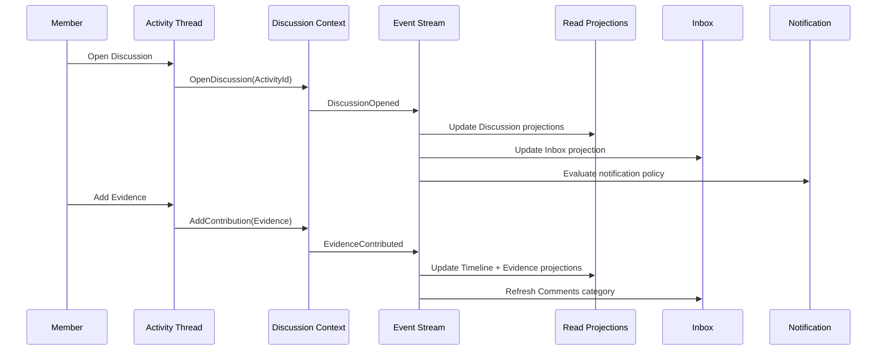
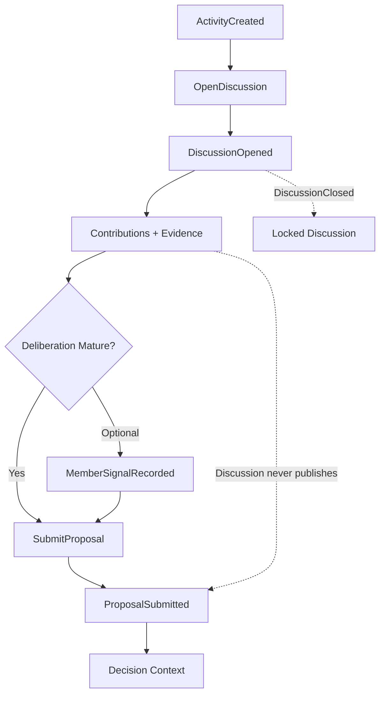

# Humanity Union Discussion Implementation Specification

## Version 2.0

### Canonical MVP Implementation Specification for the Discussion Module

---

# Document Status

| Field | Value |
|-------|-------|
| **Document Type** | Canonical implementation specification |
| **Status** | Approved for MVP implementation |
| **Architectural Layer** | Application Implementation Specification |
| **Bounded Context** | Discussion |
| **Primary Aggregate** | Discussion |
| **Architectural Authority** | Platform Blueprint v2.0 |
| **Implementation Authority** | Engineering Standards v2.0 |
| **Scope** | Discussion aggregate, Discussion Thread composition, CQRS behavior, Activity integration, lifecycle, projections, navigation |
| **Non-Scope** | New bounded contexts, governance workflows, AI facilitation, moderation systems, collaboration products beyond approved architecture |

---

# Architectural Authority

This specification defines the canonical implementation of the Discussion Module.

Every implementation SHALL conform to:

- Platform Blueprint v2.0;
- Engineering Standards v2.0;
- Canonical Event Catalogue;
- Domain Model;
- Domain Boundaries;
- CQRS Architecture;
- Activity Implementation Specification.

No implementation MAY redefine architectural ownership established by the Blueprint.

---

# Normative References

This specification SHALL be interpreted together with:

- Platform Blueprint
- Engineering Standards
- Domain Model
- Domain Boundaries
- Activity Implementation Specification
- Workspace Implementation Specification
- Member Journey Specification
- Canonical Event Catalogue
- ADR-003 — Discussion as Universal Collaboration
- ADR-005 — Human Governance Authority

---

# Repository Position

The Discussion Module provides the platform's canonical civic deliberation capability.

It owns:

- Discussion lifecycle;
- Contributions;
- Evidence participation;
- Deliberation history.

It SHALL coordinate with:

- Activity
- Proposal
- Decision
- Implementation
- Workspace
- Notification

without assuming ownership of their aggregates.

---

# Scope

This specification defines:

- Discussion aggregate behavior;
- Discussion lifecycle;
- Activity integration;
- Discussion components;
- CQRS implementation;
- command routing;
- projection architecture;
- navigation behavior;
- participation rules;
- implementation guidance.

---

# Non-Scope

This specification SHALL NOT define:

- Proposal implementation;
- Decision implementation;
- Implementation workflows;
- Notification architecture;
- Search implementation;
- AI Facilitation;
- Translation;
- Working Group architecture;
- Ally collaboration.

Those capabilities remain governed by their respective specifications.

---

# Architectural Principles

The Discussion Module SHALL be implemented according to the following principles.

### Activity-Centered Deliberation

Every Discussion SHALL belong to exactly one Activity.

Discussion SHALL never exist independently.

---

### Structured Civic Deliberation

Discussion SHALL organize civic reasoning rather than informal conversation.

The objective of Discussion is collective understanding.

---

### Aggregate Ownership

Discussion owns:

- Contributions;
- Evidence;
- Discussion lifecycle.

It SHALL NOT own:

- Activity;
- Proposal;
- Decision;
- Implementation.

---

### Immutable Civic History

Discussion SHALL preserve an append-only civic record.

Historical participation SHALL remain permanently reconstructable.

---

### CQRS Separation

Commands SHALL modify aggregates.

Queries SHALL consume projections.

Discussion presentation SHALL remain projection-driven.

---

### Event-Driven Synchronization

Neighbouring bounded contexts SHALL synchronize through approved Catalogue Events.

Direct aggregate mutation across bounded contexts SHALL NEVER occur.

---

# Section 1 — Purpose

## Why Discussion Exists

The Humanity Union platform requires structured civic deliberation rather than unstructured conversation.

Discussion provides the canonical environment where Members exchange:

- ideas;
- evidence;
- analysis;
- questions;
- counterarguments;
- recommendations.

Every Discussion SHALL remain connected to an Activity and SHALL contribute toward accountable civic outcomes.

Discussion SHALL exist to improve collective understanding rather than maximize participation volume.

---

## Civic Purpose

Discussion fulfills five primary civic objectives.

| Objective | Discussion Responsibility |
|-----------|---------------------------|
| Collective understanding | Structured civic reasoning |
| Evidence review | Verified supporting information |
| Constructive disagreement | Organized counterarguments |
| Proposal preparation | Mature deliberation before governance |
| Civic history | Permanent participation record |

Discussion SHALL remain outcome-oriented throughout its lifecycle.

---

## Position Within the Civic Lifecycle

```text
ActivityCreated

        │

        ▼

DiscussionOpened

        │

        ▼

Contributions

        │

        ▼

Evidence

        │

        ▼

ProposalSubmitted

        │

        ▼

Decision

        │

        ▼

Implementation

        │

        ▼

Impact
```

Discussion represents the deliberation stage of the civic lifecycle.

Proposal, Decision, Implementation, and Impact remain independent bounded contexts.

---

## Relationship to Activity

Activity and Discussion serve different architectural purposes.

| Activity | Discussion |
|----------|------------|
| Canonical civic trace | Structured civic deliberation |
| Owns Activity lifecycle | Owns Discussion lifecycle |
| Coordinates civic journey | Coordinates deliberation |
| Activity aggregate | Discussion aggregate |
| Navigation anchor | Deliberation workspace |

Discussion SHALL always reference ActivityId.

Activity SHALL remain the permanent civic coordination anchor.

## Component Architecture Principles

Every Discussion component SHALL remain a presentation component.

Components SHALL coordinate civic interaction without introducing business ownership.

The following architectural principles SHALL apply to every component.

### Projection-Driven Presentation

Components SHALL render read projections exclusively.

Presentation SHALL never access aggregate persistence directly.

---

### Aggregate Isolation

Commands SHALL be routed to the owning aggregate.

Presentation components SHALL NOT execute domain logic.

---

### Component Independence

Each component SHALL remain independently replaceable.

Replacing one component SHALL NOT require changes to neighboring components.

---

### Authorization Awareness

Every component SHALL respect authorization before rendering actions or data.

Unauthorized functionality SHALL remain unavailable.

---

### Activity Continuity

Every component SHALL preserve Activity context throughout navigation.

Discussion SHALL never lose its associated ActivityId.

---

## Component 3 — Open Discussion Control

### Purpose

Initiates a new Discussion for an existing Activity when no Discussion currently exists.

### Inputs

- ActivityId
- Discussion type
- Visibility
- `OpenDiscussion` command payload

### Outputs

- `DiscussionOpened`

### Dependencies

- Existing Activity
- Authorization
- `CanOpenDiscussion`

### Bounded Context

Discussion

### Aggregate

Discussion

### Read Models

- `DiscussionDetailProjection`

### Catalogue Events

Publishes:

- `DiscussionOpened`

Discussion SHALL NEVER exist independently of Activity.

---

## Component 4 — Contribution Composer

### Purpose

Provides the canonical interface for creating new civic Contributions.

### Inputs

- Contribution type
- Content
- References
- ParentContributionId

### Outputs

Command dispatch to the Discussion aggregate.

### Dependencies

- Open Discussion
- Participation Policy

### Bounded Context

Discussion

### Aggregate

Discussion

### Catalogue Events

Publishes:

- `ContributionAdded`
- `EvidenceContributed`

The component SHALL become unavailable after Discussion closure.

---

## Component 5 — Contribution Timeline

### Purpose

Displays the chronological civic history of Discussion participation.

### Inputs

Discussion timeline projection.

### Outputs

- chronological Contributions;
- presentation threading;
- civic history.

### Read Models

- `DiscussionTimelineProjection`

### Catalogue Events

Consumes:

- `ContributionAdded`
- `EvidenceContributed`

The timeline SHALL remain immutable.

---

## Component 6 — Evidence Panel

### Purpose

Displays all Evidence Contributions associated with the Discussion.

### Inputs

Evidence read projection.

### Outputs

- Evidence list;
- provenance;
- references;
- links to original Contributions.

### Read Models

- `DiscussionEvidenceProjection`

### Catalogue Events

Consumes:

- `EvidenceContributed`

Evidence SHALL remain owned by the Discussion aggregate.

---

## Component 7 — Participation Indicators

### Purpose

Displays civic participation information.

### Inputs

- Contribution actors;
- authorization;
- participation evaluation.

### Outputs

- participant list;
- participation status;
- contribution availability.

### Read Models

- `DiscussionParticipationProjection`

### Catalogue Events

Derived from:

- `ContributionAdded`
- `EvidenceContributed`

Participation SHALL remain projection-driven.

---

## Component 8 — Close Discussion Control

### Purpose

Terminates the active deliberation phase.

### Inputs

- authorization;
- close reason.

### Outputs

- `DiscussionClosed`

### Dependencies

Governance policy.

### Aggregate

Discussion

### Catalogue Events

Publishes:

- `DiscussionClosed`

Closed Discussions SHALL reject new Contributions.

---

## Component 9 — Proposal Preparation Entry

### Purpose

Provides the transition from Discussion toward Proposal preparation.

### Inputs

- ActivityId;
- DiscussionId;
- maturity indicators.

### Outputs

Navigation to the Proposal bounded context.

### Aggregate

Proposal (target)

### Catalogue Events

May consume:

- `MemberSignalRecorded`

The component SHALL route Members to Proposal.

It SHALL NOT publish `ProposalSubmitted`.

---

## Component 10 — Empty Discussion State

### Purpose

Represents Activities that have not yet entered deliberation.

### Inputs

Activity without Discussion.

### Outputs

Open Discussion action.

Discussion creation SHALL remain authorization-controlled.

---

## Component 11 — Deliberation Stage Indicator

### Purpose

Displays the current deliberation stage.

### Inputs

Composite read projections.

### Outputs

Current civic stage label.

### Read Models

- `DiscussionStageProjection`

### Catalogue Events

Consumes:

- Discussion Catalogue Events;
- Proposal Catalogue Events.

The indicator SHALL remain presentation-only.

---

# Section 5 — Contribution Model

The Contribution Model defines how Members participate in civic deliberation.

Every Contribution SHALL belong to exactly one Discussion.

Every Discussion SHALL belong to exactly one Activity.

---

## Contribution Principles

### Structured Participation

Every Contribution SHALL have an approved civic purpose.

---

### Immutable History

Historical Contributions SHALL remain append-only.

Corrections SHALL be represented by new Contributions.

---

### Evidence Integrity

Evidence SHALL preserve provenance.

Evidence SHALL remain independently verifiable.

---

### Activity Traceability

Every Contribution SHALL remain connected to its originating Activity.

---

## Canonical Contribution Types

| Contribution Type | Civic Purpose | Command | Catalogue Event |
|-------------------|---------------|---------|-----------------|
| Comment | General deliberation | `AddContribution` | `ContributionAdded` |
| Question | Clarification | `AddContribution` | `ContributionAdded` |
| Suggestion | Civic improvement | `AddContribution` | `ContributionAdded` |
| Evidence | Verifiable supporting material | `AddContribution` | `EvidenceContributed` |

These contribution types SHALL constitute the canonical MVP model.

---

## Contribution Inputs

Every Contribution SHALL contain the following information.

| Field | Requirement |
|--------|-------------|
| Actor | Required |
| ActivityId | Required |
| DiscussionId | Required |
| ContributionType | Required |
| Content | Required |
| Provenance | Required for Evidence |
| ParentContributionId | Optional |
| Language | Optional |

---

## Participation Permissions

Authorization SHALL be evaluated before accepting Contributions.

| Action | Authorization |
|--------|---------------|
| View Discussion | Visibility Policy |
| Add Contribution | Open Discussion + Participation Policy |
| Add Evidence | Participation + Evidence validation |
| Close Discussion | Governance authorization |
| Correct Contribution | Append-only |
| Remove Contribution | Not permitted through deletion |

---

## Navigation Principles

Discussion navigation SHALL remain Activity-centered.

The canonical navigation sequence SHALL be:

```text
Workspace

        │

        ▼

Activity Thread

        │

        ▼

Discussion Panel

        │

        ▼

Proposal Entry
```

Discussion SHALL never become a standalone navigation destination.

---

## Forbidden Navigation Paths

The following navigation patterns SHALL NEVER be permitted.

| Forbidden Pattern | Architectural Violation |
|-------------------|-------------------------|
| Standalone Discussion route | Breaks Activity-first architecture |
| Proposal without Activity | Breaks civic trace |
| Discussion publishing ProposalSubmitted | Violates bounded context ownership |
| Inbox composition outside Activity | Breaks civic continuity |
| Unauthorized participation | Violates authorization |
| Parallel messaging subsystem | Violates ADR-003 |

These constraints SHALL remain permanent architectural rules.

# Section 7 — CQRS and Event Flow

The Discussion Module SHALL implement the platform CQRS architecture as defined by the Blueprint and Engineering Standards.

Commands and queries SHALL remain completely separated.

The Discussion aggregate SHALL remain the only authoritative write model.

---

## CQRS Principles

The Discussion Module SHALL follow the principles below.

### Aggregate Authority

Every write operation SHALL target exactly one Discussion aggregate.

---

### Projection-Driven Presentation

Discussion presentation SHALL consume read projections only.

Presentation SHALL never access aggregate persistence directly.

---

### Event-Driven Synchronization

Neighbouring bounded contexts SHALL synchronize exclusively through approved Catalogue Events.

---

### Eventual Consistency

Read projections SHALL support eventual consistency.

Short synchronization delays between command completion and projection updates SHALL be expected.

---

## Write Side

Discussion commands SHALL be routed exclusively to the Discussion aggregate.

| Command | Aggregate | Published Catalogue Event |
|---------|-----------|---------------------------|
| `OpenDiscussion` | Discussion | `DiscussionOpened` |
| `AddContribution` (Comment, Question, Suggestion) | Discussion | `ContributionAdded` |
| `AddContribution` (Evidence) | Discussion | `EvidenceContributed` |
| `CloseDiscussion` | Discussion | `DiscussionClosed` |

---

## Write-Side Rules

The following implementation rules SHALL always apply.

- every transaction modifies exactly one aggregate;
- ActivityId SHALL be validated before command execution;
- aggregate validation SHALL precede event publication;
- successful commands SHALL publish approved Catalogue Events;
- failed commands SHALL publish no domain events unless explicitly defined;
- command handlers SHALL remain idempotent.

---

## Command Routing

The canonical command flow SHALL be:

```text
Discussion Thread

        │

        ▼

Application Layer

        │

        ▼

Discussion Bounded Context

        │

        ▼

Discussion Aggregate

        │

        ▼

Catalogue Event
```

The Activity Thread SHALL dispatch commands without owning Discussion persistence.

---

## Read Side

Discussion presentation SHALL consume approved read projections.

| Read Projection | Source Events | Primary Consumer |
|-----------------|---------------|------------------|
| `DiscussionDetailProjection` | `DiscussionOpened`, `DiscussionClosed` | Header, Panel Shell |
| `DiscussionTimelineProjection` | `ContributionAdded`, `EvidenceContributed` | Timeline |
| `DiscussionEvidenceProjection` | `EvidenceContributed` | Evidence Panel |
| `DiscussionParticipationProjection` | Contribution Events | Participation Indicators |
| `DiscussionStageProjection` | Discussion + Proposal Events | Deliberation Indicator |
| `ActivityDiscussionsProjection` | Discussion Events | Activity Module |
| `PublicDiscussionSearchProjection` | Authorized Events | Search |

Every read projection SHALL remain rebuildable from the canonical event stream.

---

## Projection Principles

All projections SHALL satisfy the following requirements.

### Derived State

Every projection SHALL be derived from Catalogue Events.

---

### Replayability

Projection rebuilding through event replay SHALL produce equivalent results.

---

### Presentation Independence

Read projections SHALL remain independent from aggregate persistence.

---

### Disposable State

Read projections SHALL be replaceable without affecting domain integrity.

---

### No Write Through

Presentation SHALL NEVER update aggregates through read projections.

---

## Discussion Timeline

The timeline SHALL provide the canonical chronological history of deliberation.

Implementation SHALL preserve:

- immutable creation timestamps;
- chronological ordering;
- pagination support;
- parent-child references for replies.

Reply threading SHALL remain a presentation concern rather than a persistence hierarchy.

---

## Evidence Projection

Evidence SHALL be represented through a dedicated read projection.

The Evidence projection SHALL:

- consume `EvidenceContributed`;
- preserve provenance;
- support Proposal references;
- exclude restricted Evidence from public presentation.

Evidence SHALL remain owned by the Discussion aggregate.

---

## Inbox Integration

The Discussion Module SHALL integrate with Workspace through Activity-based projections.

```text
Discussion Catalogue Event

        │

        ▼

Projection Consumer

        │

        ▼

ActivityInboxProjection

        │

        ▼

Workspace Inbox

        │

        ▼

Activity Thread
```

Workspace SHALL consume Discussion-related events without acquiring ownership of the Discussion aggregate.

---

## Notification Integration

Notifications SHALL remain independent from Inbox.

```text
Discussion Catalogue Event

        │

        ▼

Notification Policy

        │

        ▼

Notification Projection

        │

        ▼

Notification Center

        │

        ▼

Activity Thread
```

Notifications SHALL inform Members.

Inbox SHALL organize civic work.

These responsibilities SHALL remain separated.

---

## Read Consistency

The following consistency expectations SHALL apply.

| Presentation Surface | Consistency Model | Expected Behavior |
|----------------------|------------------|-------------------|
| Newly submitted Contribution | Read-your-writes | Immediate visibility |
| Timeline | Eventual consistency | Short synchronization delay |
| Evidence Panel | Eventual consistency | Synchronizes after event processing |
| Workspace Inbox | Eventual consistency | Updated after projection refresh |
| Deliberation Indicator | Eventual consistency | Updates after lifecycle events |

Projection latency SHALL NOT compromise architectural correctness.

---

## CQRS Invariants

The following architectural rules SHALL remain permanently true.

### Aggregate Authority

Only the Discussion aggregate SHALL own Discussion state.

---

### Projection Authority

Read projections SHALL remain presentation models only.

---

### Command Isolation

Commands SHALL never modify projections directly.

---

### Query Isolation

Queries SHALL never modify aggregate state.

---

### Event Authority

Catalogue Events SHALL remain the exclusive synchronization mechanism.

---

### Replay Compatibility

Every projection SHALL remain reconstructable through event replay.

---

### Idempotent Event Consumption

Projection consumers SHALL tolerate repeated Catalogue Event delivery without producing inconsistent state.

---

# Section 8 — Architecture Mapping

The Discussion Module represents the platform's canonical civic deliberation capability.

It coordinates participation while preserving strict bounded context ownership.

---

## Bounded Context Relationships

| Bounded Context | Relationship |
|-----------------|--------------|
| **Discussion** | Owns Discussion aggregate and Contributions |
| **Activity** | Provides canonical civic anchor |
| **Proposal** | Receives mature deliberation outcomes |
| **Member** | Provides participant identity |
| **Notification** | Consumes Catalogue Events |
| **Search** | Consumes authorized projections |
| **Identity** | Provides authentication and authorization |

Discussion SHALL never assume ownership of neighboring aggregates.

---

## Aggregate Mapping

| Aggregate | Primary Responsibility |
|------------|------------------------|
| **Discussion** | Deliberation lifecycle and Contributions |

Owned entities include:

- Comment;
- Question;
- Suggestion;
- Evidence.

The Discussion aggregate SHALL publish only Discussion Catalogue Events.

---

## Canonical Catalogue Events

The complete MVP Discussion event set SHALL consist of:

| Catalogue Event | Purpose |
|-----------------|---------|
| `DiscussionOpened` | Opens deliberation |
| `DiscussionClosed` | Closes deliberation |
| `ContributionAdded` | Records civic participation |
| `EvidenceContributed` | Records verifiable supporting material |

No additional MVP Discussion Catalogue Events SHALL be introduced.

---

## Layer Mapping

| Architecture Layer | Discussion Responsibility |
|--------------------|--------------------------|
| Presentation Layer | Discussion Thread composition |
| Application Layer | Command routing |
| Domain Layer | Discussion aggregate |
| Event Layer | Catalogue Event publication |
| Projection Layer | Read model consumption |
| Infrastructure Layer | Persistence and messaging |

Responsibilities SHALL remain isolated by layer.

---

## Architectural Dependencies

The Discussion Module depends upon:

- Activity Module;
- Identity;
- Authorization Policy;
- CQRS infrastructure;
- Event infrastructure;
- Projection infrastructure;
- Workspace integration;
- Notification infrastructure;
- Search infrastructure.

Dependencies SHALL remain implementation-neutral.

---

# Section 9 — Verification

The following architectural requirements SHALL be satisfied before implementation approval.

| Requirement | Verification Criterion |
|-------------|------------------------|
| Discussion references Activity only | Pass |
| Proposal ownership preserved | Pass |
| Evidence owned by Discussion | Pass |
| Proposal transition routed correctly | Pass |
| Inbox projection-only | Pass |
| Notification independent | Pass |
| Shared projection reuse | Pass |
| Approved Catalogue Events only | Pass |
| ADR-003 preserved | Pass |
| Visibility inheritance enforced | Pass |
| Append-only Contributions | Pass |
| Closed Discussion blocks Contributions | Pass |
| MVP Discussion types only | Pass |
| MVP implementation alignment | Pass |
| Member Journey compatibility | Pass |

Every verification item SHALL pass before production deployment.

---

# Architectural Diagrams

The following diagrams constitute the canonical architectural reference for the Discussion Module.

1. Discussion Structure
2. Discussion Lifecycle
3. Contribution Flow

Implementations SHALL remain behaviorally consistent with these diagrams even when internal technologies evolve.

# Canonical Architectural Diagrams

The following diagrams constitute the authoritative behavioral reference for the Discussion Module.

Implementations MAY differ technically, but SHALL preserve the architectural behavior illustrated below.

---

## Diagram 4 — Discussion Event Flow



---

## Diagram 5 — Discussion → Proposal Transition



The Discussion Module SHALL provide routing toward Proposal.

It SHALL NOT publish `ProposalSubmitted`.

---

# Appendix A — Contribution Matrix

| Contribution Type | Catalogue Event | Provenance Required | Public Search | Proposal Reference | MVP |
|-------------------|-----------------|--------------------|---------------|--------------------|-----|
| Comment | `ContributionAdded` | No | Authorized only | Optional | ✓ |
| Question | `ContributionAdded` | No | Authorized only | Optional | ✓ |
| Suggestion | `ContributionAdded` | No | Authorized only | Optional | ✓ |
| Evidence | `EvidenceContributed` | **Required** | Authorized only | Primary reference | ✓ |
| Analysis (Presentation Label) | `ContributionAdded` | Recommended | Authorized only | Optional | ✓ |
| Reply | `ContributionAdded` | No | Authorized only | — | ✓ |
| Member Summary | `ContributionAdded` | No | Authorized only | — | ✓ |
| AI Summary | — | — | — | — | Deferred |

The canonical MVP Contribution model SHALL remain unchanged.

---

# Appendix B — Lifecycle Matrix

| Lifecycle Label | Layer | Entry | Exit | Command | Catalogue Event |
|-----------------|-------|-------|------|---------|-----------------|
| Draft | Aggregate + Indicator | Prepare Discussion | `OpenDiscussion` | `OpenDiscussion` | `DiscussionOpened` |
| Open | Indicator | `DiscussionOpened` | Active participation | — | `DiscussionOpened` |
| Active | Indicator | Contribution activity | Completion or closure | `AddContribution` | Contribution Events |
| Completed | Indicator | Civic objective achieved | Closed | — | Outcome signals |
| Locked | Indicator | `DiscussionClosed` | Archived | `CloseDiscussion` | `DiscussionClosed` |
| Open | Aggregate | `DiscussionOpened` | Closed | — | `DiscussionOpened` |
| Closed | Aggregate | `CloseDiscussion` | Archived | `CloseDiscussion` | `DiscussionClosed` |
| Archived | Aggregate + Indicator | Closed | — | — | — |

Aggregate lifecycle and Deliberation Indicator SHALL remain separate architectural concepts.

---

# Appendix C — Event Matrix

| Catalogue Event | Publisher | Timeline | Evidence | Inbox | Notification | Search | Civic Stage |
|-----------------|-----------|----------|----------|-------|--------------|--------|-------------|
| `DiscussionOpened` | Discussion | ✓ | — | Conversations | ✓ | Optional | Discussion |
| `DiscussionClosed` | Discussion | ✓ | — | Updated | Optional | — | Locked |
| `ContributionAdded` | Discussion | ✓ | — | Comments | ✓ | Optional | Active |
| `EvidenceContributed` | Discussion | ✓ | ✓ | Comments | Optional | Authorized | Active |
| `MemberSignalRecorded` | Proposal | — | — | Optional | Optional | — | Proposal Ready |
| `ProposalSubmitted` | Proposal | — | — | Governance | ✓ | Optional | Decision Pending |

Discussion SHALL publish only Discussion Catalogue Events.

---

# Appendix D — Permission Matrix

| Capability | Guest | Member | Contributor | Facilitator | Owner / Policy |
|------------|-------|--------|-------------|-------------|----------------|
| View Public Discussion | ✓ | ✓ | ✓ | ✓ | ✓ |
| View Restricted Discussion | ✗ | Authorized | ✓ | ✓ | ✓ |
| Open Discussion | ✗ | Authorized | — | ✓ | Policy |
| Add Contribution | ✗ | Authorized | ✓ | ✓ | Open Discussion |
| Add Evidence | ✗ | Authorized | ✓ | ✓ | Open Discussion + Provenance |
| Close Discussion | ✗ | ✗ | ✗ | ✓ | Authorized |
| Navigate to Proposal | ✗ | ✓ | ✓ | ✓ | Authorized |
| Moderate Visibility | ✗ | ✗ | ✗ | ✓ | Policy |

Authorization SHALL always be evaluated before command execution.

---

# Section 10 — Implementation Guidelines

Discussion implementation SHALL prioritize:

- deterministic behavior;
- modularity;
- maintainability;
- replayability;
- observability;
- Blueprint compliance.

Implementation SHALL preserve bounded context ownership at all times.

---

## Engineering Checklist

Before implementation is accepted, reviewers SHOULD verify:

| Requirement | Complete |
|-------------|----------|
| Discussion aggregate isolated | □ |
| CQRS preserved | □ |
| Catalogue Events compliant | □ |
| Activity reference preserved | □ |
| Discussion projections rebuildable | □ |
| Timeline immutable | □ |
| Evidence provenance enforced | □ |
| Navigation Activity-centered | □ |
| Authorization verified | □ |
| Visibility inherited correctly | □ |
| Append-only Contributions | □ |
| Accessibility verified | □ |
| Tests completed | □ |

---

## Implementation Constraints

The following implementation constraints SHALL remain permanent.

### No Aggregate Coupling

Discussion SHALL never persist Activity, Proposal, or Decision aggregates.

---

### No Cross-Context Writes

Discussion SHALL never modify another bounded context.

---

### No Business Logic in Presentation

Presentation SHALL dispatch commands only.

---

### No Projection Mutation

Read projections SHALL remain read-only.

---

### No Event Bypass

Every state change SHALL be represented by approved Catalogue Events.

---

# Section 11 — Verification Criteria

Implementation SHALL satisfy the following verification requirements.

| Verification Item | Expected Result |
|-------------------|-----------------|
| Activity reference preserved | Pass |
| Discussion ownership preserved | Pass |
| CQRS separation verified | Pass |
| Event replay succeeds | Pass |
| Timeline immutable | Pass |
| Evidence projection rebuilds | Pass |
| Navigation Activity-centered | Pass |
| Authorization enforced | Pass |
| Visibility inheritance verified | Pass |
| Approved Catalogue Events only | Pass |

All verification items SHALL pass before production deployment.

---

# Section 12 — Definition of Done

The Discussion Module SHALL be considered complete only when:

- Discussion lifecycle is fully implemented;
- Contribution model is operational;
- Evidence handling is complete;
- CQRS implementation is verified;
- read projections rebuild successfully;
- Activity integration functions correctly;
- Proposal routing is implemented;
- authorization is verified;
- visibility rules are enforced;
- engineering review is complete;
- Blueprint compliance is confirmed.

Partial implementation SHALL NOT be considered production-ready.

---

# Final Engineering Assessment

The Discussion Module provides the Humanity Union platform with its canonical civic deliberation capability.

Its purpose is not to replace governance, messaging, or social interaction, but to provide a structured environment where civic reasoning can mature into accountable action.

The architecture defined by this specification preserves:

- Activity-centered deliberation;
- strict bounded context ownership;
- immutable participation history;
- append-only Contributions;
- CQRS separation;
- event-driven synchronization;
- projection-driven presentation;
- Proposal boundary integrity.

Every Discussion remains permanently connected to an Activity, ensuring that civic reasoning becomes part of a complete, traceable participation history.

This specification SHALL remain fully aligned with:

- Platform Blueprint;
- Engineering Standards;
- Domain Model;
- Domain Boundaries;
- Canonical Event Catalogue;
- Activity Implementation Specification;
- all related implementation specifications.

Future platform evolution SHALL extend this architecture without violating its foundational principles.

---

# Appendix E — Canonical Discussion Principles

The following principles constitute the permanent architectural foundation of the Discussion Module.

1. Every Discussion belongs to exactly one Activity.
2. Discussion owns civic deliberation only.
3. Contributions remain append-only.
4. Evidence always preserves provenance.
5. Activity remains the civic coordination anchor.
6. Proposal ownership is never transferred to Discussion.
7. Catalogue Events remain the only synchronization mechanism.
8. Read projections remain disposable.
9. CQRS remains the permanent architectural pattern.
10. Blueprint compliance remains mandatory.