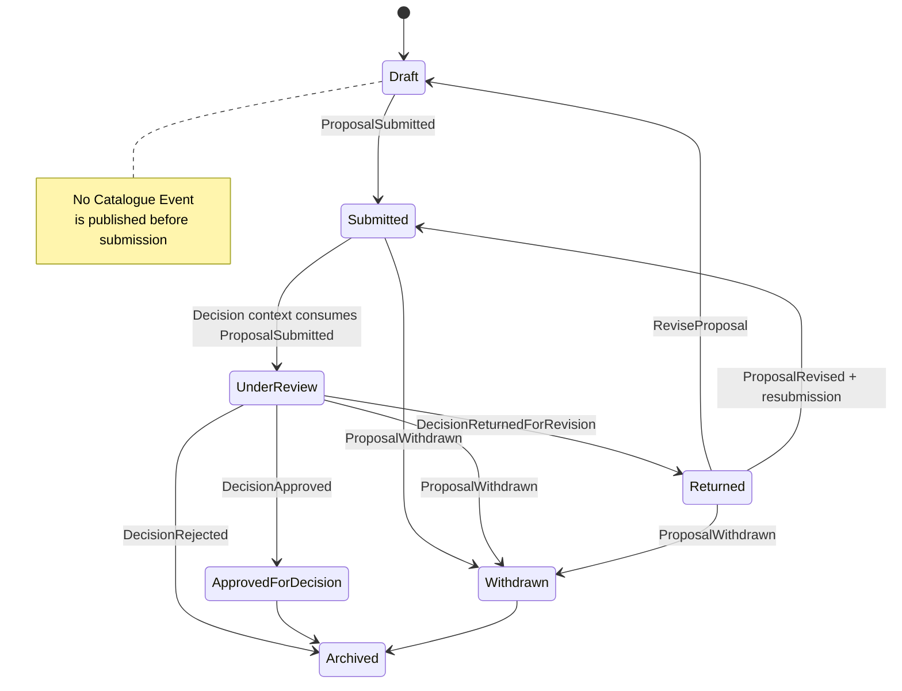
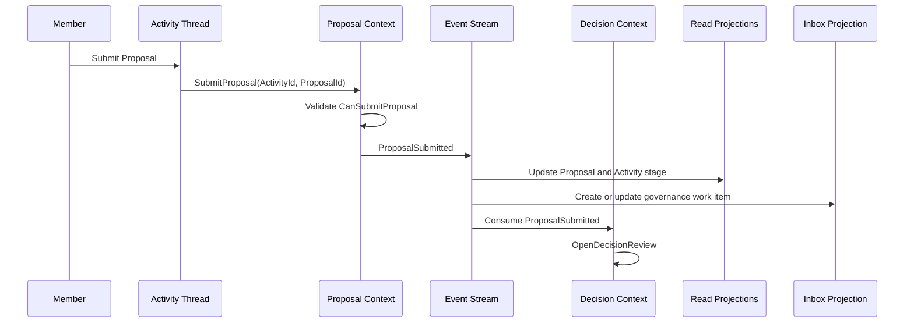
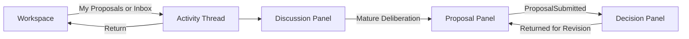
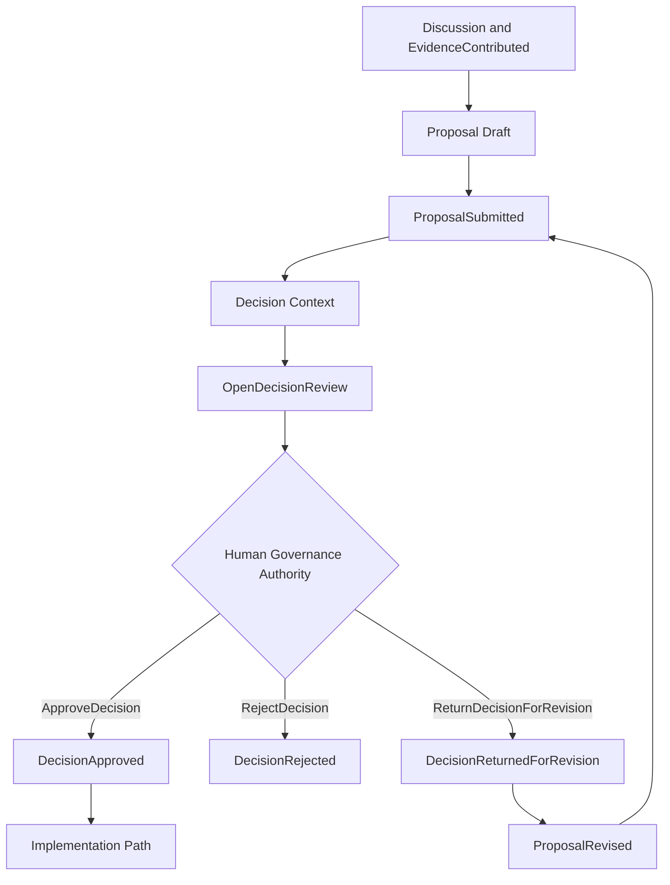

# Humanity Union Proposal Implementation Specification

## Version 2.0

### Canonical MVP Implementation Specification for the Proposal Module

---

# Document Status

| Field | Value |
|-------|-------|
| **Document Type** | Canonical implementation specification |
| **Status** | Approved for MVP implementation |
| **Architectural Layer** | Application Implementation Specification |
| **Bounded Context** | Proposal |
| **Primary Aggregate** | Proposal |
| **Supporting Aggregate** | MemberSignal |
| **Architectural Authority** | Platform Blueprint v2.0 |
| **Implementation Authority** | Engineering Standards v2.0 |
| **Scope** | Proposal aggregate, MemberSignal integration, lifecycle, CQRS behavior, Activity integration, Discussion integration, Decision handoff |
| **Non-Scope** | Decision implementation, governance execution, AI drafting, institutional proposal variants beyond MVP |

---

# Architectural Authority

This specification defines the canonical implementation of the Proposal Module.

Every implementation SHALL conform to:

- Platform Blueprint v2.0;
- Engineering Standards v2.0;
- Domain Model;
- Domain Boundaries;
- Canonical Event Catalogue;
- Activity Implementation Specification;
- Discussion Implementation Specification.

No implementation MAY redefine Proposal ownership established by the Blueprint.

---

# Normative References

This specification SHALL be interpreted together with:

- Platform Blueprint
- Engineering Standards
- Domain Model
- Domain Boundaries
- Activity Implementation Specification
- Discussion Implementation Specification
- Member Journey Specification
- Proposal & Member Signal Framework
- Canonical Event Catalogue
- ADR-009 — Proposal and Member Signal Framework
- ADR-005 — Human Governance Authority

---

# Repository Position

The Proposal Module provides the platform's canonical mechanism for transforming civic deliberation into governed decision candidates.

It owns:

- Proposal lifecycle;
- Proposal revisions;
- Proposal withdrawal;
- Proposal readiness;
- MemberSignal integration.

It SHALL coordinate with:

- Activity;
- Discussion;
- Decision;
- Implementation;

without assuming ownership of their aggregates.

---

# Scope

This specification defines:

- Proposal aggregate behavior;
- Proposal lifecycle;
- MemberSignal integration;
- Activity and Discussion integration;
- Proposal components;
- CQRS implementation;
- command routing;
- projection architecture;
- navigation behavior;
- implementation guidance.

---

# Non-Scope

This specification SHALL NOT define:

- Decision implementation;
- voting procedures;
- governance execution;
- Implementation workflows;
- AI proposal drafting;
- Translation;
- institutional Proposal types beyond MVP.

Those capabilities remain governed by their respective specifications.

---

# Architectural Principles

The Proposal Module SHALL be implemented according to the following principles.

### Activity-Centered Governance

Every Proposal SHALL belong to exactly one Activity.

Proposal SHALL never exist independently.

---

### Deliberation-Driven Submission

Every Proposal SHALL originate from structured civic deliberation.

Proposal SHALL transform Discussion outcomes into formal governance candidates.

---

### Aggregate Ownership

Proposal owns:

- Proposal lifecycle;
- Proposal revisions;
- Proposal withdrawal;
- Proposal references.

Proposal SHALL NOT own:

- Activity;
- Discussion;
- Evidence;
- Decision.

---

### Immutable Governance History

Proposal history SHALL remain append-only.

Proposal revisions SHALL preserve complete historical traceability.

---

### Evidence by Reference

Proposal SHALL reference Evidence.

Evidence SHALL remain owned by the Discussion aggregate.

Proposal SHALL NEVER duplicate or mutate Evidence.

---

### CQRS Separation

Commands SHALL modify Proposal aggregates.

Queries SHALL consume read projections.

Proposal presentation SHALL remain projection-driven.

---

### Event-Driven Governance

Proposal SHALL synchronize neighboring bounded contexts exclusively through approved Catalogue Events.

Cross-context aggregate mutation SHALL NEVER occur.

---

# Section 1 — Purpose

## Why Proposal Exists

Discussion develops collective understanding.

Proposal transforms that understanding into a structured governance candidate.

Every Proposal SHALL represent a formal request for civic change prepared for human governance review.

Proposal SHALL exist to provide:

- structured civic solutions;
- traceable governance candidates;
- accountable revision history;
- Decision readiness;
- governance continuity.

Proposal SHALL remain preparation.

Decision SHALL remain authority.

---

## Civic Purpose

Proposal fulfills the following civic objectives.

| Objective | Proposal Responsibility |
|-----------|-------------------------|
| Structured solution | Formal governance candidate |
| Traceable origin | References Activity and Discussion |
| Review readiness | Proposal validation |
| Accountable history | Versioned revisions |
| Governance transition | Decision handoff |

Proposal SHALL remain governance-oriented throughout its lifecycle.

---

## Position Within the Civic Lifecycle

```text
ActivityCreated

        │

        ▼

Discussion

        │

        ▼

Evidence

        │

        ▼

Member Signal

        │

        ▼

Proposal

        │

        ▼

Decision

        │

        ▼

Implementation

        │

        ▼

Impact
```

Proposal represents the governance preparation stage.

Decision, Implementation, and Impact remain independent bounded contexts.

---

## Relationship to Activity

Activity and Proposal fulfill different architectural responsibilities.

| Activity | Proposal |
|----------|-----------|
| Canonical civic trace | Formal governance candidate |
| Owns Activity lifecycle | Owns Proposal lifecycle |
| Coordinates civic journey | Coordinates governance preparation |
| Activity aggregate | Proposal aggregate |
| Navigation anchor | Governance preparation |

Proposal SHALL always reference ActivityId.

Activity SHALL remain the permanent civic coordination anchor.

---

## Relationship to Discussion

Discussion and Proposal represent consecutive stages of civic participation.

| Discussion | Proposal |
|------------|-----------|
| Deliberation | Governance preparation |
| Owns Evidence | References Evidence |
| Civic reasoning | Structured civic solution |
| Discussion aggregate | Proposal aggregate |

Proposal SHALL summarize Discussion.

Discussion SHALL preserve deliberation history.

---

## Relationship to Decision

Proposal prepares governance.

Decision exercises governance authority.

| Proposal | Decision |
|----------|----------|
| Creates governance candidate | Produces governance outcome |
| Publishes Proposal events | Publishes Decision events |
| References Activity | References Proposal |
| Never approves itself | Sole governance authority |

Proposal SHALL NEVER publish Decision Catalogue Events.

## Component Architecture Principles

Every Proposal component SHALL remain a presentation component.

Components SHALL coordinate governance preparation without assuming domain ownership.

The following architectural principles SHALL apply to every Proposal component.

---

### Projection-Driven Presentation

Proposal components SHALL render read projections exclusively.

Presentation SHALL never access aggregate persistence directly.

---

### Aggregate Isolation

Commands SHALL be routed exclusively to the owning aggregate.

Presentation SHALL never execute Proposal domain logic.

---

### Component Independence

Every Proposal component SHALL remain independently replaceable.

Replacing one component SHALL NOT require modification of neighboring components.

---

### Authorization Awareness

Components SHALL evaluate authorization before exposing actions or data.

Unauthorized operations SHALL remain unavailable.

---

### Activity Continuity

Proposal components SHALL preserve Activity context throughout the governance lifecycle.

Proposal SHALL never lose its associated ActivityId.

---

## Component 1 — Proposal Panel Shell

### Purpose

Provides the container for all Proposal functionality within the Activity Thread.

### Inputs

- ActivityId
- ProposalId
- Authorized session

### Outputs

- Proposal stage presentation
- Child component composition

### Dependencies

- Activity Thread
- Authorization

### Bounded Context

Proposal

### Aggregate

Proposal

### Read Models

- `ProposalPanelProjection`

### Catalogue Events

Consumes:

- `ProposalSubmitted`
- `ProposalRevised`
- `ProposalWithdrawn`

---

## Component 2 — Proposal Header

### Purpose

Displays Proposal identity and governance status.

### Inputs

Proposal metadata.

### Outputs

- Proposal title
- Lifecycle state
- Revision number
- Activity reference

### Read Models

- `ProposalDetailProjection`

### Catalogue Events

Consumes:

- Proposal Catalogue Events
- Decision outcome events

The header SHALL always reflect the current governance state.

---

## Component 3 — Draft Editor

### Purpose

Allows Proposal authors to prepare structured Proposal content.

### Inputs

- Proposal fields
- Governance scope
- Community scope
- Proposal content

### Outputs

Internal Proposal draft persistence.

### Dependencies

- Proposal authorization
- Activity reference
- Discussion maturity

### Aggregate

Proposal

### Catalogue Events

No external Catalogue Events SHALL be published while the Proposal remains in Draft.

---

## Component 4 — Evidence Linkage Panel

### Purpose

Associates Proposal revisions with Evidence owned by Discussion.

### Inputs

Evidence identifiers.

### Outputs

Evidence reference list.

### Dependencies

Discussion Evidence Projection.

### Aggregate

Proposal

### Read Models

- `ProposalEvidenceLinksProjection`

### Catalogue Events

Consumes:

- `EvidenceContributed`

Proposal SHALL reference Evidence.

Proposal SHALL NEVER duplicate Evidence.

---

## Component 5 — Discussion Reference Panel

### Purpose

Displays the deliberation history supporting the Proposal.

### Inputs

- DiscussionId
- Contribution references

### Outputs

Read-only Discussion lineage.

### Read Models

- `ProposalDiscussionRefsProjection`

### Catalogue Events

Consumes:

- `DiscussionOpened`
- `ContributionAdded`
- `EvidenceContributed`

---

## Component 6 — Author and Co-Sponsor Panel

### Purpose

Displays Proposal ownership.

### Inputs

Member identities.

### Outputs

Proposal sponsorship information.

### Aggregate

Proposal

### Read Models

- `ProposalAuthorsProjection`

Ownership SHALL remain part of the Proposal aggregate.

---

## Component 7 — Review Readiness Indicator

### Purpose

Evaluates Proposal readiness before submission.

### Inputs

Proposal draft.

### Outputs

Readiness evaluation.

### Dependencies

`ProposalReadinessEvaluation`

### Aggregate

Proposal

Readiness SHALL evaluate completeness.

Readiness SHALL NOT represent governance approval.

---

## Component 8 — Submit Control

### Purpose

Initiates the Proposal governance lifecycle.

### Inputs

Validated Proposal draft.

### Outputs

- `ProposalSubmitted`

### Dependencies

- `CanSubmitProposal`
- Activity reference

### Aggregate

Proposal

### Catalogue Events

Publishes:

- `ProposalSubmitted`

Submission SHALL remain the first externally visible Proposal event.

---

## Component 9 — Revision Control

### Purpose

Creates a new Proposal revision.

### Inputs

Revision content.

### Outputs

- `ProposalRevised`

### Aggregate

Proposal

### Read Models

- Proposal Version History

### Catalogue Events

Publishes:

- `ProposalRevised`

Revision history SHALL remain immutable.

---

## Component 10 — Withdraw Control

### Purpose

Withdraws a Proposal while preserving historical integrity.

### Inputs

Withdrawal request.

### Outputs

- `ProposalWithdrawn`

### Aggregate

Proposal

### Catalogue Events

Publishes:

- `ProposalWithdrawn`

Withdrawal SHALL preserve Proposal history.

---

## Component 11 — Support and Objection Recording

### Purpose

Records civic support and objections.

### Inputs

Support and objection commands.

### Outputs

Support and objection entities.

### Aggregate

Proposal

### Read Models

- `ProposalSupportProjection`

Support SHALL remain distinct from Evidence.

---

## Component 12 — Member Signal Entry

### Purpose

Captures preliminary Member intent before Proposal submission.

### Inputs

`RecordMemberSignal`

### Outputs

- `MemberSignalRecorded`

### Aggregate

MemberSignal

### Catalogue Events

Publishes:

- `MemberSignalRecorded`
- `MemberSignalConsolidated` (optional)

Member Signal SHALL remain independent from Proposal submission.

---

## Component 13 — Decision Outcome Display

### Purpose

Displays Decision results associated with the Proposal.

### Inputs

Decision projections.

### Outputs

Governance outcome presentation.

### Aggregate

Decision (read-only)

### Read Models

- `ProposalDecisionOutcomeProjection`

### Catalogue Events

Consumes:

- `DecisionApproved`
- `DecisionRejected`
- `DecisionReturnedForRevision`

Proposal SHALL display Decision outcomes.

Proposal SHALL NEVER publish Decision events.

---

## Component 14 — Empty / Not Ready State

### Purpose

Guides Members toward completing deliberation before Proposal creation.

### Inputs

Activity without Proposal.

### Outputs

Discussion navigation.

Proposal submission guidance.

The component SHALL encourage completion of deliberation before governance submission.

---

# Section 5 — Proposal Rules

The Proposal Module SHALL enforce the following governance rules.

---

## Proposal Principles

### Structured Governance

Every Proposal SHALL represent a structured governance candidate.

---

### Activity Traceability

Every Proposal SHALL reference exactly one Activity.

---

### Deliberation Dependency

Proposal SHALL originate from completed civic deliberation.

---

### Revision Integrity

Proposal revisions SHALL preserve immutable governance history.

---

### Human Authority

Proposal SHALL prepare governance.

Decision SHALL exercise governance authority.

---

## Proposal Eligibility

| Requirement | Rule |
|-------------|------|
| Authentication | Required |
| Activity Reference | Required |
| Discussion Path | Required |
| Authorization | `CanCreateProposal` |
| Guest | Not permitted |
| AI | Never permitted |

---

## Editing Rules

| Proposal State | Editing Permission |
|----------------|-------------------|
| Draft | Authors |
| Submitted | Restricted by policy |
| Under Review | Prohibited |
| Returned | Authors may revise |
| Approved for Decision | Locked |
| Withdrawn | Locked |
| Archived | Locked |

---

## Editing Prohibitions

Proposal editing SHALL NOT be permitted when:

- governance review is active;
- Proposal is approved;
- Proposal is withdrawn;
- Proposal is archived;
- authorization is insufficient;
- the actor is AI.

---

## Revision Policy

Proposal revisions SHALL satisfy the following rules.

- revision history SHALL remain immutable;
- submitted revisions SHALL publish `ProposalRevised`;
- Draft revisions SHALL remain internal;
- returned Proposals SHALL re-enter the revision workflow;
- previous revisions SHALL never be deleted.

The Proposal aggregate SHALL preserve complete governance history.

## Evidence Integration Principles

Proposal SHALL integrate with Evidence according to the following rules.

| Principle | Implementation |
|-----------|----------------|
| Evidence ownership | Discussion aggregate |
| Proposal relationship | Evidence references only |
| Evidence integrity | Immutable after publication |
| Visibility | Inherited through authorization policy |
| Catalogue compliance | `EvidenceContributed` only |

Proposal SHALL never duplicate, modify, or replace Evidence owned by Discussion.

---

## Discussion Integration Principles

Proposal SHALL preserve the complete civic trace.

| Principle | Implementation |
|-----------|----------------|
| Activity reference | Mandatory |
| Discussion reference | Recommended |
| Contribution references | Recommended |
| Deliberation maturity | Required before submission |

Proposal SHALL summarize deliberation.

Discussion SHALL preserve deliberation history.

---

# Section 6 — Navigation

Proposal navigation SHALL remain Activity-centered.

Proposal SHALL never become an independent navigation destination.

---

## Canonical Navigation Flow

```text
Workspace

        │

        ▼

Activity Thread

        │

        ▼

Discussion

        │

        ▼

Proposal

        │

        ▼

Decision
```

Every Proposal SHALL remain connected to its originating Activity.

---

## Entry Points

| Source | Destination |
|---------|-------------|
| Discussion | Proposal Panel |
| Workspace → My Proposals | Activity Thread |
| Workspace Inbox | Activity Thread |
| Activity Civic Stage | Proposal Panel |

Every entry SHALL preserve Activity context.

---

## Exit Points

| Destination | Behavior |
|-------------|----------|
| Workspace | Preserve Proposal context |
| Decision Panel | Continue governance lifecycle |
| Discussion Panel | Return for additional deliberation |

---

## Forbidden Navigation

The following navigation paths SHALL NEVER be permitted.

| Forbidden Pattern | Architectural Violation |
|-------------------|-------------------------|
| Proposal without Activity | Breaks civic trace |
| Decision before Proposal | Violates governance order |
| Proposal without Discussion | Violates Member Journey |
| Inline Proposal submission from Inbox | Breaks Activity continuity |
| Proposal publishing Decision events | Violates bounded context ownership |
| Guest Proposal creation | Violates authorization |
| Notification approval | Violates Notification responsibility |

---

# Section 7 — CQRS and Event Flow

The Proposal Module SHALL implement CQRS according to Engineering Standards.

Commands and queries SHALL remain completely separated.

---

## CQRS Principles

### Aggregate Authority

Proposal writes SHALL target only Proposal aggregates.

---

### Projection-Driven Presentation

Proposal presentation SHALL consume read projections only.

---

### Event Synchronization

Neighbouring bounded contexts SHALL synchronize exclusively through Catalogue Events.

---

### Eventual Consistency

Proposal read projections SHALL support eventual consistency.

---

## Write Side

| Command | Aggregate | Published Catalogue Event |
|---------|-----------|---------------------------|
| `RecordMemberSignal` | MemberSignal | `MemberSignalRecorded` |
| Signal Consolidation | MemberSignal | `MemberSignalConsolidated` |
| `CreateProposal` | Proposal | Internal Draft |
| `ReviseProposal` (Draft) | Proposal | Internal |
| `SubmitProposal` | Proposal | `ProposalSubmitted` |
| `ReviseProposal` (Submitted) | Proposal | `ProposalRevised` |
| `WithdrawProposal` | Proposal | `ProposalWithdrawn` |

Decision commands SHALL remain outside the Proposal bounded context.

---

## Write-Side Rules

The following implementation rules SHALL always apply.

- exactly one aggregate SHALL be modified per transaction;
- ActivityId SHALL be validated before execution;
- Proposal readiness SHALL be evaluated before submission;
- successful commands SHALL publish approved Catalogue Events;
- command handlers SHALL remain idempotent.

---

## Command Routing

The canonical Proposal command flow SHALL be:

```text
Proposal Panel

        │

        ▼

Application Layer

        │

        ▼

Proposal Context

        │

        ▼

Proposal Aggregate

        │

        ▼

Catalogue Event
```

Presentation SHALL never contain Proposal persistence logic.

---

## Read Side

| Read Projection | Source Events | Consumer |
|-----------------|---------------|----------|
| `ProposalDetailProjection` | Proposal + Decision events | Proposal Header |
| `ProposalRevisionHistoryProjection` | Proposal events | Revision History |
| `ProposalEvidenceLinksProjection` | Proposal + Evidence events | Evidence Panel |
| `ProposalDiscussionRefsProjection` | Proposal + Discussion events | Discussion References |
| `ProposalSupportProjection` | Internal entities | Support Panel |
| `ProposalReadinessProjection` | Draft + Domain Service | Readiness Indicator |
| `ActivityProposalProjection` | Proposal events | Activity Module |
| `PublicProposalSearchProjection` | Authorized Proposal events | Search |

Every Proposal projection SHALL remain rebuildable from Catalogue Events.

---

## Projection Principles

Proposal projections SHALL satisfy the following principles.

### Derived State

Every projection SHALL originate from Catalogue Events.

---

### Replayability

Projection rebuilding SHALL reproduce identical presentation state.

---

### Presentation Independence

Read projections SHALL remain independent from aggregate persistence.

---

### Disposable State

Projections SHALL be replaceable without affecting domain integrity.

---

### No Write Through

Read projections SHALL NEVER modify Proposal aggregates.

---

## Review Synchronization

Proposal SHALL synchronize governance state through Decision events.

The following Proposal states SHALL be updated through integration:

- Under Review;
- Returned;
- Approved for Decision;
- Rejected.

Decision SHALL remain the publishing bounded context.

---

## Proposal Summaries

Proposal summaries SHALL remain read projections.

No dedicated Proposal Summary aggregate SHALL exist.

---

## Inbox Integration

Proposal SHALL integrate with Workspace through Activity-based projections.

```text
Proposal Catalogue Event

        │

        ▼

ActivityInboxProjection

        │

        ▼

Workspace Inbox

        │

        ▼

Activity Thread
```

Inbox SHALL remain projection-only.

---

## Notification Integration

Notifications SHALL remain independent from Inbox.

```text
Proposal Catalogue Event

        │

        ▼

Notification Policy

        │

        ▼

Notification Projection

        │

        ▼

Proposal Panel
```

Notifications SHALL inform.

Inbox SHALL organize civic work.

---

## Read Consistency

| Presentation Surface | Consistency |
|----------------------|-------------|
| Newly submitted Proposal | Read-your-writes |
| Decision Outcome | Eventual consistency |
| Evidence references | Strong validation + eventual synchronization |
| Workspace Inbox | Eventual consistency |

---

## CQRS Invariants

The following architectural rules SHALL remain permanently true.

### Aggregate Authority

Only Proposal aggregates SHALL own Proposal state.

---

### Projection Authority

Read projections SHALL remain presentation models only.

---

### Command Isolation

Commands SHALL never modify projections.

---

### Query Isolation

Queries SHALL never modify aggregate state.

---

### Event Authority

Catalogue Events SHALL remain the exclusive synchronization mechanism.

---

### Replay Compatibility

Every Proposal projection SHALL remain reconstructable through event replay.

---

### Idempotent Consumption

Projection consumers SHALL tolerate repeated Catalogue Event delivery.

---

# Section 8 — Architecture Mapping

The Proposal Module provides the platform's canonical governance preparation capability.

---

## Aggregate Mapping

| Aggregate | Responsibility |
|------------|----------------|
| Proposal | Governance candidate lifecycle |
| MemberSignal | Preliminary civic intent |

---

## Bounded Context Relationships

Proposal owns:

- Proposal;
- MemberSignal.

Proposal references:

- Activity;
- Discussion;
- Evidence;
- Decision outcomes.

Proposal SHALL never own neighboring aggregates.

---

## Canonical Catalogue Events

| Catalogue Event | Publisher |
|-----------------|-----------|
| `MemberSignalRecorded` | MemberSignal |
| `MemberSignalConsolidated` | MemberSignal |
| `ProposalSubmitted` | Proposal |
| `ProposalRevised` | Proposal |
| `ProposalWithdrawn` | Proposal |

No additional Proposal Catalogue Events SHALL be introduced.

---

## Layer Mapping

| Architecture Layer | Responsibility |
|--------------------|----------------|
| Presentation | Proposal Panel |
| Application | Command Routing |
| Domain | Proposal Aggregate |
| Event | Catalogue Events |
| Projection | Read Models |
| Infrastructure | Persistence & Messaging |

---

## Architectural Dependencies

Proposal depends upon:

- Activity;
- Discussion;
- Decision;
- Identity;
- Authorization;
- CQRS infrastructure;
- Event infrastructure;
- Workspace;
- Notification;
- Search.

Dependencies SHALL remain implementation-neutral.

---

# Section 9 — Verification

Implementation SHALL satisfy the following architectural requirements.

| Verification Requirement | Expected Result |
|--------------------------|-----------------|
| Proposal references Activity only | Pass |
| Discussion ownership preserved | Pass |
| Decision ownership preserved | Pass |
| Evidence immutable | Pass |
| Proposal precedes Decision | Pass |
| Inbox projection-only | Pass |
| Notifications independent | Pass |
| Evidence ownership preserved | Pass |
| No `ProposalCreated` event | Pass |
| Approved Catalogue Events only | Pass |
| Support distinct from Evidence | Pass |
| MemberSignal independent | Pass |
| Withdrawal preserves history | Pass |
| MVP compliance | Pass |
| Member Journey compatibility | Pass |

Every verification requirement SHALL pass before production deployment.

---

# Canonical Architectural Diagrams

The following diagrams constitute the authoritative architectural reference for the Proposal Module.

1. Proposal Structure

Implementations MAY differ technically but SHALL preserve the architectural behavior represented by these diagrams.

# Canonical Architectural Diagrams

The diagrams in this section define the canonical behavioral relationships of the Proposal Module.

Implementations MAY use different internal technologies or deployment models, but SHALL preserve:

- aggregate ownership;
- command routing;
- Catalogue Event ownership;
- Activity-centered navigation;
- Decision boundary integrity;
- immutable governance history.

---

## Diagram 2 — Proposal Lifecycle



The Proposal lifecycle SHALL distinguish:

- Proposal-owned transitions;
- Decision-driven synchronization;
- internal Draft persistence;
- externally published Catalogue Events.

The Proposal bounded context SHALL NOT publish Decision outcome events.

---

## Diagram 3 — Proposal Event Flow



The Activity Thread SHALL dispatch the command.

The Proposal aggregate SHALL validate and publish the event.

Decision SHALL consume `ProposalSubmitted` independently.

---

## Diagram 4 — Proposal Navigation



Proposal navigation SHALL remain within the Activity Thread.

A standalone Proposal workflow that removes Activity context SHALL NOT be introduced.

---

## Diagram 5 — Proposal to Decision Transition



Proposal SHALL prepare the governance candidate.

Decision SHALL determine the governance outcome.

Implementation SHALL begin only after an authorized Decision outcome enables it.

---

# Appendix A — Lifecycle Matrix

| State | Purpose | Entry | Exit | Allowed Commands | Proposal-Published Events | Consumed Events |
|-------|---------|-------|------|------------------|---------------------------|-----------------|
| **Draft** | Prepare a structured governance candidate | `CreateProposal` or returned revision path | Submit or withdraw | `CreateProposal`, `ReviseProposal`, `SubmitProposal`, `WithdrawProposal` where policy permits | Optional MemberSignal events only | `DecisionReturnedForRevision` where applicable |
| **Submitted** | Enter formal governance review | `SubmitProposal` | Review, withdrawal | `WithdrawProposal` | `ProposalSubmitted`, optionally `ProposalWithdrawn` | — |
| **Under Review** | Await human governance outcome | Decision consumes `ProposalSubmitted` | Return, approval, rejection, withdrawal | `WithdrawProposal` only where policy permits | `ProposalWithdrawn` | Decision review state and outcome events |
| **Returned** | Revise after governance feedback | `DecisionReturnedForRevision` | Resubmit or withdraw | `ReviseProposal`, `SubmitProposal`, `WithdrawProposal` | `ProposalRevised`, `ProposalWithdrawn` | `DecisionReturnedForRevision` |
| **Approved for Decision** | Record successful Decision outcome | `DecisionApproved` | Archive | None | — | `DecisionApproved` |
| **Withdrawn** | Preserve owner-initiated withdrawal | `WithdrawProposal` | Archive | None | `ProposalWithdrawn` | — |
| **Archived** | Preserve terminal historical record | Approved, rejected, or withdrawn terminal path | None | None | — | `DecisionRejected` where applicable |

## Lifecycle Invariants

The lifecycle SHALL preserve the following invariants:

1. Draft creation SHALL NOT publish `ProposalCreated`.
2. Submission SHALL publish `ProposalSubmitted`.
3. Material post-submission revision SHALL publish `ProposalRevised`.
4. Withdrawal SHALL publish `ProposalWithdrawn`.
5. Decision outcomes SHALL be published only by the Decision bounded context.
6. Archived Proposal records SHALL remain immutable and queryable.
7. No lifecycle transition SHALL physically delete prior revisions.

---

# Appendix B — Component Matrix

| Component | Write Responsibility | Read Model | Owning Aggregate or Service | MVP Phase |
|-----------|----------------------|------------|-----------------------------|-----------|
| Proposal Panel Shell | None | `ProposalPanelProjection` | Proposal reference | Phase 5 |
| Proposal Header | None | `ProposalDetailProjection` | Proposal | Phase 5 |
| Draft Editor | Create and revise Draft | Draft representation | Proposal | Phase 5 |
| Evidence Linkage Panel | Store Evidence identifiers | `ProposalEvidenceLinksProjection` | Proposal references; Discussion owns Evidence | Phase 5 |
| Discussion Reference Panel | Store reference identifiers | `ProposalDiscussionRefsProjection` | Proposal references; Discussion owns source data | Phase 5 |
| Author and Co-Sponsor Panel | Aggregate-internal sponsorship changes | `ProposalAuthorsProjection` | Proposal | Phase 5 |
| Review Readiness Indicator | None | `ProposalReadinessProjection` | Domain service | Phase 5 |
| Submit Control | `SubmitProposal` | `ProposalDetailProjection` | Proposal | Phase 5 |
| Revision Control | `ReviseProposal` | `ProposalRevisionHistoryProjection` | Proposal | Phase 5 |
| Withdraw Control | `WithdrawProposal` | `ProposalDetailProjection` | Proposal | Phase 5 |
| Support and Objection Recording | Aggregate-internal recording | `ProposalSupportProjection` | Proposal | Phase 5, minimal |
| Member Signal Entry | `RecordMemberSignal` | `MemberSignalProjection` | MemberSignal | Phase 5, optional |
| Decision Outcome Display | None | `ProposalDecisionOutcomeProjection` | Decision read integration | Phase 6 |
| Empty or Not Ready State | None | Readiness and Discussion state | Presentation composition | Phase 5 |

## Component Invariants

- Presentation components SHALL NOT contain aggregate persistence logic.
- Components SHALL dispatch commands through the application layer.
- Evidence and Discussion components SHALL use reference-based integration.
- Decision Outcome Display SHALL remain read-only.
- Components SHALL respect lifecycle and authorization state before exposing commands.

---

# Appendix C — Event Matrix

| Catalogue Event | Publisher | Proposal Detail | Activity Stage | Inbox | Notification | Search | Decision Integration |
|-----------------|-----------|-----------------|----------------|-------|--------------|--------|----------------------|
| `MemberSignalRecorded` | MemberSignal | Optional | Proposal Ready | Optional | Optional | — | — |
| `MemberSignalConsolidated` | MemberSignal | Optional | Optional update | — | — | Optional | — |
| `ProposalSubmitted` | Proposal | Update | Decision Pending | Update | Policy-based | Authorized | Opens review path |
| `ProposalRevised` | Proposal | Update | Revision update | Optional | Policy-based | Authorized | May refresh review input |
| `ProposalWithdrawn` | Proposal | Withdrawn | Terminal update | Update | Policy-based | Restricted or historical | Closes active review where applicable |
| `DecisionReturnedForRevision` | Decision | Returned | Revision Required | Update | Policy-based | — | Consumed by Proposal |
| `DecisionApproved` | Decision | Approved for Decision | Implementation Ready | Update | Policy-based | Authorized | Consumed by Proposal |
| `DecisionRejected` | Decision | Rejected or Archived | Terminal update | Update | Policy-based | Authorized | Consumed by Proposal |
| `EvidenceContributed` | Discussion | Evidence reference availability | — | — | — | Visibility-based | — |

## Event Ownership Invariants

- Proposal SHALL publish only Proposal Catalogue Events.
- MemberSignal SHALL publish only MemberSignal Catalogue Events.
- Decision SHALL publish all Decision outcome events.
- Discussion SHALL remain the sole publisher of `EvidenceContributed`.
- Projection consumers SHALL be idempotent.
- Repeated event delivery SHALL NOT produce duplicated Proposal state.

---

# Appendix D — Permission Matrix

| Capability | Guest | Member | Author or Co-Sponsor | Authorized Reviewer | Governing Policy |
|------------|-------|--------|----------------------|---------------------|------------------|
| View public Proposal | Permitted | Permitted | Permitted | Permitted | Visibility Policy |
| View restricted Proposal | Prohibited | Scope-dependent | Permitted | Scope-dependent | Visibility Policy |
| Create Draft | Prohibited | Policy-dependent | Permitted | Not applicable | `CanCreateProposal` and Activity path |
| Edit Draft | Prohibited | Prohibited unless author role assigned | Permitted | Prohibited | Draft state and authorship |
| Submit Proposal | Prohibited | Prohibited unless authorized author | Permitted | Prohibited | `CanSubmitProposal` |
| Revise Submitted Proposal | Prohibited | Prohibited | Policy-dependent | Prohibited | Returned state or governed revision |
| Withdraw Proposal | Prohibited | Prohibited | Policy-dependent | Prohibited | Author and withdrawal policy |
| Record Support or Objection | Prohibited | Policy-dependent | Permitted | Policy-dependent | Participation Policy |
| Record Member Signal | Prohibited | Permitted where authorized | Permitted | Not applicable | MemberSignal rules |
| Execute Decision Actions | Prohibited | Prohibited | Prohibited by Proposal role alone | Permitted | Decision Policy |

Authorization SHALL be evaluated:

1. before command dispatch where possible;
2. inside the application layer;
3. inside the aggregate or governing domain policy before state mutation.

Client-side visibility SHALL NOT be treated as sufficient authorization.

---

# Section 10 — Implementation Guidelines

## General Engineering Principles

The Proposal Module SHALL be implemented according to the following engineering principles:

- domain logic SHALL remain inside the Proposal or MemberSignal domain model;
- command orchestration SHALL remain in the application layer;
- infrastructure concerns SHALL remain behind interfaces;
- presentation SHALL consume projections;
- integrations SHALL use approved Catalogue Events;
- all public command handlers SHALL be idempotent where retry is possible;
- historical Proposal state SHALL remain reconstructable.

---

## Recommended Project Structure

A compatible implementation MAY use the following structure:

```text
proposal/
├── application/
│   ├── commands/
│   ├── handlers/
│   ├── queries/
│   ├── authorization/
│   └── integration/
├── domain/
│   ├── proposal/
│   │   ├── Proposal.ts
│   │   ├── ProposalRevision.ts
│   │   ├── CoSponsorship.ts
│   │   ├── ProposalSupport.ts
│   │   └── ProposalObjection.ts
│   ├── member-signal/
│   │   └── MemberSignal.ts
│   ├── policies/
│   ├── specifications/
│   └── events/
├── infrastructure/
│   ├── persistence/
│   ├── messaging/
│   └── projections/
├── presentation/
│   ├── components/
│   ├── routes/
│   └── view-models/
└── tests/
    ├── domain/
    ├── application/
    ├── integration/
    ├── projection/
    └── end-to-end/
```

The physical repository MAY use a different directory structure, provided that architectural boundaries remain explicit and enforceable.

---

## Aggregate Implementation

The Proposal aggregate SHALL enforce:

- mandatory ActivityId;
- valid lifecycle transitions;
- author and co-sponsor authorization;
- readiness before submission;
- immutable revision history;
- reference-only Evidence linkage;
- withdrawal rules;
- prohibition of post-terminal mutation.

The MemberSignal aggregate SHALL remain separate from Proposal.

Signal consolidation SHALL NOT implicitly create or submit a Proposal.

---

## Command Handling

Command handlers SHALL:

1. authenticate the actor;
2. authorize the requested capability;
3. load the owning aggregate;
4. validate referenced identifiers where required;
5. execute domain behavior;
6. persist aggregate changes atomically;
7. publish resulting Catalogue Events through the outbox or equivalent reliable mechanism;
8. return a command result suitable for read-your-writes presentation.

A command handler SHALL NOT modify more than one aggregate transactionally unless an explicitly approved architectural pattern authorizes it.

---

## Decision Integration

Decision outcome consumers SHALL:

- verify the ProposalId reference;
- process events idempotently;
- reject impossible lifecycle transitions;
- record synchronization metadata;
- update Proposal state without republishing Decision events;
- update relevant projections independently.

A Decision integration handler SHALL NOT impersonate the Decision bounded context.

---

## Evidence and Discussion Integration

Evidence linkage SHALL use stable Evidence identifiers.

The Proposal Module SHALL validate that:

- Evidence exists;
- Evidence belongs to an Activity-linked Discussion;
- the actor may reference it;
- visibility does not exceed the source Evidence visibility.

Proposal snapshots MAY preserve display metadata for resilient presentation, but such snapshots SHALL NOT become authoritative Evidence copies.

---

## Error Handling

The implementation SHALL distinguish:

- validation failures;
- authorization failures;
- lifecycle conflicts;
- stale aggregate versions;
- unavailable referenced entities;
- projection delays;
- infrastructure failures.

Domain failures SHOULD use stable machine-readable error codes.

Error responses SHALL NOT disclose restricted Proposal, Discussion, Evidence, or Member information.

---

## Observability

The Proposal Module SHALL emit operational telemetry for:

- command execution;
- command rejection;
- lifecycle transitions;
- event publication;
- event consumption;
- projection latency;
- integration failures;
- authorization denials;
- readiness evaluation failures.

Telemetry SHALL include correlation identifiers.

Sensitive Proposal content SHALL NOT be placed in logs.

---

## Accessibility

Proposal components SHALL support:

- keyboard-only operation;
- semantic headings and landmarks;
- accessible form labels;
- field-level validation messages;
- clear lifecycle status announcements;
- non-color-only state indicators;
- accessible revision comparisons;
- sufficient focus management after submission or validation failure.

Readiness failures SHALL identify specific corrective actions.

---

## Internationalization

All user-facing Proposal text SHALL use localization resources.

Proposal content and interface labels SHALL remain separate.

The implementation SHOULD preserve:

- authoring language;
- locale metadata;
- language-independent identifiers;
- future translation references.

Localized presentation SHALL NOT mutate the original Proposal content.

---

## Testing Strategy

Testing SHALL cover:

### Aggregate Tests

- Draft creation;
- submission readiness;
- revision creation;
- withdrawal;
- invalid lifecycle transitions;
- terminal-state mutation rejection;
- ActivityId invariant;
- Evidence reference rules.

### Application Tests

- authorization;
- command routing;
- idempotency;
- concurrency handling;
- Decision event consumption;
- Discussion and Evidence reference validation.

### Projection Tests

- event replay;
- duplicate event handling;
- out-of-order event handling where supported;
- Proposal detail updates;
- revision history;
- Activity stage synchronization;
- Inbox and Search projection behavior.

### Navigation Tests

- Workspace to Activity Thread;
- Discussion to Proposal;
- Proposal to Decision;
- Returned Proposal to Discussion or revision;
- deep-link authorization;
- forbidden shortcut rejection.

### End-to-End Tests

At minimum, the implementation SHALL verify:

1. mature Discussion to Proposal submission;
2. Proposal submission to Decision review;
3. returned Proposal revision and resubmission;
4. Proposal withdrawal with preserved history;
5. Decision approval synchronization;
6. Decision rejection and archival;
7. restricted Evidence visibility;
8. new Member path represented by SCENARIO 002.

---

# Section 11 — Verification Criteria

## Architectural Verification

The implementation SHALL verify that:

- Proposal and MemberSignal aggregates are isolated;
- Activity remains the civic trace anchor;
- Discussion remains the owner of Evidence;
- Decision remains the owner of governance outcomes;
- no cross-context aggregate writes exist;
- no standalone Proposal navigation path bypasses Activity.

---

## Functional Verification

The implementation SHALL verify:

- Draft creation;
- readiness evaluation;
- submission;
- material revision;
- withdrawal;
- author and co-sponsor behavior;
- Evidence linkage;
- Discussion lineage;
- Decision outcome display;
- terminal-state restrictions.

---

## CQRS Verification

The implementation SHALL verify:

- writes use aggregate command handlers;
- queries use projections;
- projections do not accept domain writes;
- read models rebuild from authoritative sources;
- command and query responsibilities remain separated.

---

## Event Verification

The implementation SHALL verify that:

- only approved Catalogue Events are published;
- `ProposalCreated` is never emitted;
- Proposal never publishes Decision events;
- Proposal never republishes `EvidenceContributed`;
- handlers remain idempotent;
- duplicate delivery does not duplicate state;
- event metadata supports correlation and traceability.

---

## Projection Verification

Projection verification SHALL include:

- complete replay;
- partial replay from checkpoint;
- rebuild after deletion;
- synchronization after Proposal revision;
- Decision outcome synchronization;
- visibility filtering;
- Inbox independence;
- Search authorization.

---

## Authorization Verification

Authorization tests SHALL cover:

- guests;
- ordinary Members;
- Proposal authors;
- co-sponsors;
- authorized reviewers;
- restricted community scope;
- terminal Proposal states;
- unauthorized direct API calls.

Hiding a control in the user interface SHALL NOT count as authorization enforcement.

---

## Performance Verification

The implementation SHOULD verify:

- paginated revision history;
- efficient Proposal list queries;
- bounded Evidence reference loading;
- acceptable command response latency;
- projection catch-up performance;
- absence of unbounded Activity Thread queries.

---

## Resilience Verification

The implementation SHALL verify behavior under:

- repeated commands;
- concurrent revisions;
- duplicate Catalogue Events;
- delayed Decision events;
- temporarily unavailable Discussion projections;
- failed Notification delivery;
- failed Inbox projection updates;
- projection rebuild.

A failure in a derived projection SHALL NOT corrupt the Proposal aggregate.

---

# Section 12 — Definition of Done

The Proposal Module SHALL be considered complete only when all criteria below are satisfied.

## Architecture Completion

- [ ] Proposal bounded context is explicitly isolated.
- [ ] Proposal and MemberSignal aggregate ownership is implemented.
- [ ] Activity, Discussion, Evidence, and Decision boundaries are preserved.
- [ ] Approved Catalogue Events are used exclusively.
- [ ] ADR-009 behavior is preserved.

## Functional Completion

- [ ] Draft creation and editing are operational.
- [ ] Readiness evaluation is operational.
- [ ] Proposal submission is operational.
- [ ] Revision history is operational.
- [ ] Withdrawal preserves history.
- [ ] Evidence references are validated.
- [ ] Discussion references are displayed.
- [ ] Decision outcomes synchronize correctly.
- [ ] Support and objection behavior conforms to MVP policy.
- [ ] Optional MemberSignal path is implemented where included in scope.

## Engineering Completion

- [ ] Commands are routed through the application layer.
- [ ] Aggregate persistence is atomic.
- [ ] Event publication is reliable.
- [ ] Integration handlers are idempotent.
- [ ] Projections are rebuildable.
- [ ] Observability is implemented.
- [ ] Sensitive content is excluded from logs.
- [ ] Configuration is externalized.

## Testing Completion

- [ ] Aggregate tests pass.
- [ ] Application tests pass.
- [ ] Projection replay tests pass.
- [ ] Authorization tests pass.
- [ ] Navigation tests pass.
- [ ] Decision integration tests pass.
- [ ] Failure simulations pass.
- [ ] SCENARIO 002 passes.

## Accessibility Completion

- [ ] Proposal forms are keyboard accessible.
- [ ] Validation is programmatically associated with fields.
- [ ] Lifecycle states are announced accessibly.
- [ ] Revision history is readable without visual-only cues.
- [ ] Focus behavior is verified.

## Documentation Completion

- [ ] Public commands are documented.
- [ ] Published and consumed events are documented.
- [ ] Projection ownership is documented.
- [ ] Authorization rules are documented.
- [ ] Operational failure procedures are documented.
- [ ] Decision integration behavior is documented.

## Repository Completion

- [ ] Module ownership is clear.
- [ ] No deprecated event names remain.
- [ ] No duplicate Proposal subsystem exists.
- [ ] No unauthorized cross-context imports exist.
- [ ] Architecture and dependency checks pass.
- [ ] Repository references are current.

The Proposal Module SHALL NOT be classified as production-ready until every mandatory item is complete.

---

# Appendix E — Phase 5 Implementation Checklist

## Proposal Core

- [ ] Implement `CreateProposal`.
- [ ] Implement Draft `ReviseProposal`.
- [ ] Implement `SubmitProposal`.
- [ ] Implement submitted or returned `ReviseProposal`.
- [ ] Implement `WithdrawProposal`.
- [ ] Publish `ProposalSubmitted`.
- [ ] Publish `ProposalRevised`.
- [ ] Publish `ProposalWithdrawn`.
- [ ] Do not publish `ProposalCreated`.
- [ ] Enforce ActivityId on every Proposal.
- [ ] Implement Discussion reference linkage.
- [ ] Implement Evidence identifier linkage.
- [ ] Implement `CanCreateProposal`.
- [ ] Implement `CanSubmitProposal`.
- [ ] Implement immutable Proposal revisions.
- [ ] Implement author and co-sponsor rules.
- [ ] Implement support and objection recording.
- [ ] Implement optional MemberSignal path where approved.

## Presentation and Navigation

- [ ] Implement Proposal Panel on Activity Thread.
- [ ] Implement Draft Editor.
- [ ] Implement Evidence Linkage Panel.
- [ ] Implement Discussion Reference Panel.
- [ ] Implement Authors and Co-Sponsors Panel.
- [ ] Implement Readiness Indicator.
- [ ] Implement Submit Control.
- [ ] Implement Revision Control.
- [ ] Implement Withdraw Control.
- [ ] Implement Empty or Not Ready state.
- [ ] Block forbidden navigation paths.
- [ ] Preserve Activity context on all entry points.

## CQRS and Integration

- [ ] Implement Proposal projections.
- [ ] Implement Activity Proposal projection.
- [ ] Implement Inbox consumers.
- [ ] Implement Notification policy consumers.
- [ ] Implement minimal authorized Search projection.
- [ ] Implement Decision return integration.
- [ ] Implement Decision approval integration.
- [ ] Implement Decision rejection integration.
- [ ] Ensure Decision events are never republished by Proposal.
- [ ] Verify read-your-writes after submission.

## Verification

- [ ] Verification requirements P1–P15 pass.
- [ ] Event replay passes.
- [ ] Duplicate delivery tests pass.
- [ ] Authorization tests pass.
- [ ] Visibility tests pass.
- [ ] SCENARIO 002 passes.

---

# Appendix F — Ready for Development Gates

| Gate | Requirement | Required Status |
|------|-------------|-----------------|
| **Architecture** | ADR-009 Proposal framework confirmed | Complete |
| **Activity Integration** | Activity-centered Proposal route defined | Complete |
| **Discussion Integration** | Deliberation maturity and Evidence ownership defined | Complete |
| **Catalogue** | Proposal and MemberSignal events approved | Complete |
| **Lifecycle** | Proposal states and transitions mapped | Complete |
| **Decision Boundary** | Proposal prepares; Decision decides | Complete |
| **Evidence Integrity** | Reference-only integration defined | Complete |
| **CQRS** | Write and read separation defined | Complete |
| **Inbox and Notification** | Independent projection behavior defined | Complete |
| **Authorization** | Creation, submission, revision, and withdrawal rules defined | Complete |
| **Deferred Scope** | AI drafting and extended institutional types excluded | Complete |
| **Verification** | P1–P15 and SCENARIO 002 defined | Complete |

---

# Appendix G — Developer Handoff Notes

1. Phase 5 SHALL depend on operational Activity and Discussion modules.
2. Draft persistence SHALL remain internal until formal submission.
3. Evidence SHALL be referenced by identifier and SHALL remain owned by Discussion.
4. Decision integration SHALL consume events without republishing them.
5. `ApprovedForDecision` SHALL mean that `DecisionApproved` was consumed.
6. Support and objection recording SHALL NOT introduce unapproved Catalogue Events.
7. MemberSignal SHALL remain distinct from Proposal.
8. Proposal navigation SHALL remain Activity-centered.
9. Terminal Proposal records SHALL remain immutable.
10. SCENARIO 002 SHALL be included in end-to-end acceptance testing.

---

# Final Engineering Assessment

The Proposal Module provides the canonical bridge between civic deliberation and formal human governance.

Its architecture preserves a strict separation between:

- Activity as the civic trace anchor;
- Discussion as the owner of deliberation and Evidence;
- Proposal as the structured governance candidate;
- Decision as the sole governance authority;
- Implementation as the execution path following an approved outcome.

The Proposal aggregate owns preparation, revisions, submission, and withdrawal. It does not own the deliberation that informed the Proposal and does not own the Decision that judges it.

The architecture defined by this specification preserves:

- Activity-centered traceability;
- deliberation-driven Proposal creation;
- reference-only Evidence integration;
- immutable Proposal revision history;
- human governance authority;
- CQRS separation;
- projection-driven presentation;
- event-driven bounded-context synchronization;
- append-only governance memory.

Future Proposal capabilities MAY extend:

- Proposal types;
- institutional pathways;
- MemberSignal analysis;
- structured co-sponsorship;
- advisory drafting assistance;
- multilingual examination.

Such extensions SHALL preserve all aggregate boundaries, Catalogue Event ownership, authorization rules, and governance invariants defined by this specification.

---

# Appendix H — Canonical Proposal Principles

The following principles constitute the permanent architectural foundation of the Proposal Module:

1. Every Proposal belongs to exactly one Activity.
2. Proposal transforms mature deliberation into a governance candidate.
3. Proposal prepares; Decision decides.
4. Discussion owns Evidence.
5. Proposal references Evidence by stable identifier.
6. Proposal never mutates Discussion content.
7. MemberSignal is not a Proposal.
8. Support is not Evidence.
9. Draft creation does not publish `ProposalCreated`.
10. Submission publishes `ProposalSubmitted`.
11. Material revision preserves prior versions.
12. Withdrawal never deletes history.
13. Decision outcomes are published only by Decision.
14. Read projections never own Proposal state.
15. Activity context remains present throughout navigation.
16. Human authority remains mandatory for governance outcomes.
17. Catalogue Events remain the canonical integration contract.
18. Blueprint and Engineering Standards compliance remains mandatory.