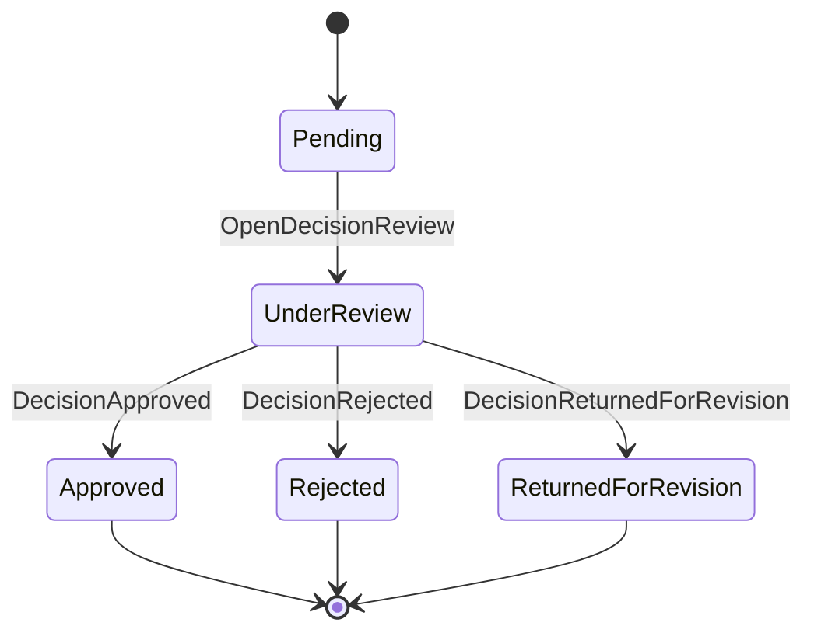
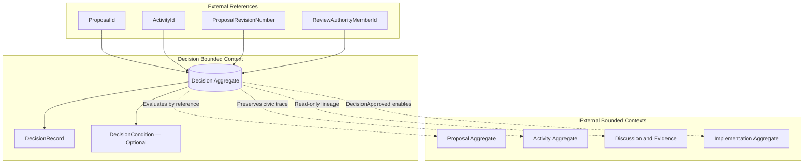
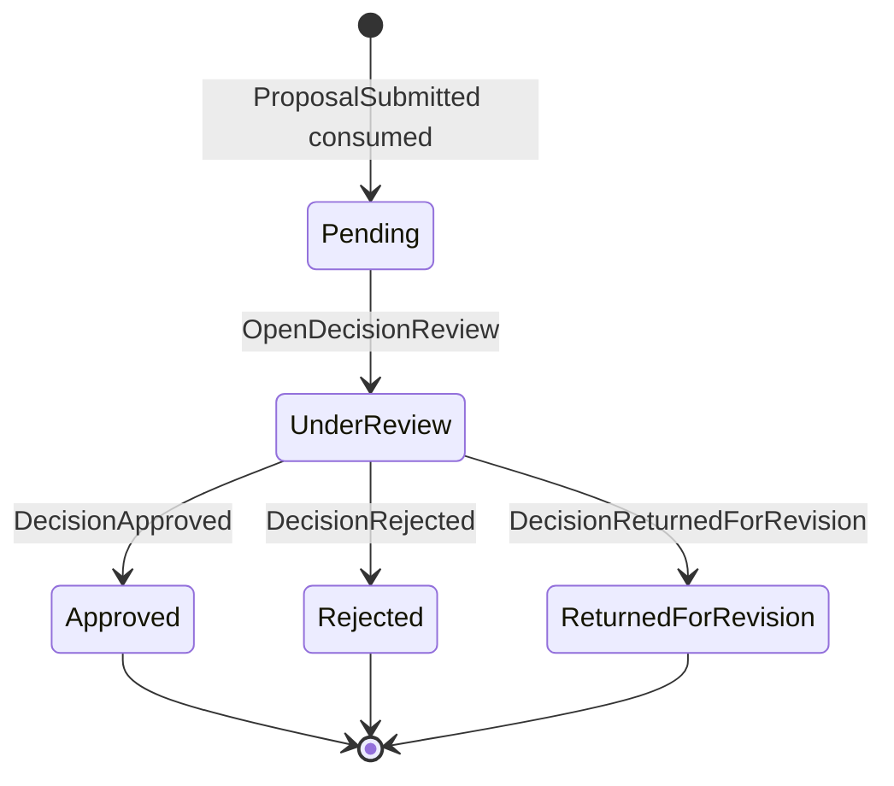
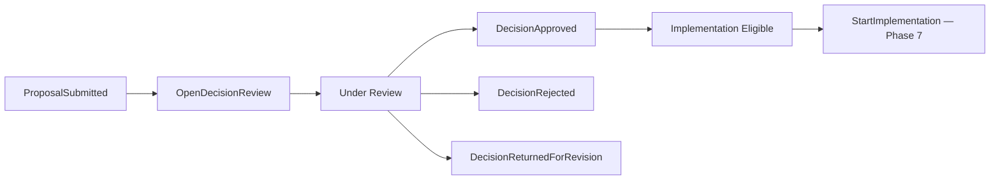
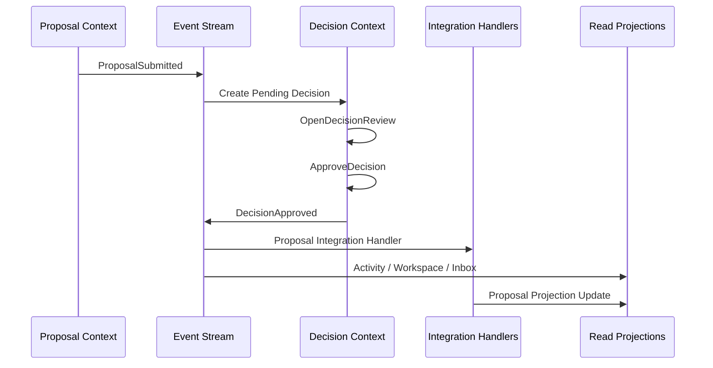
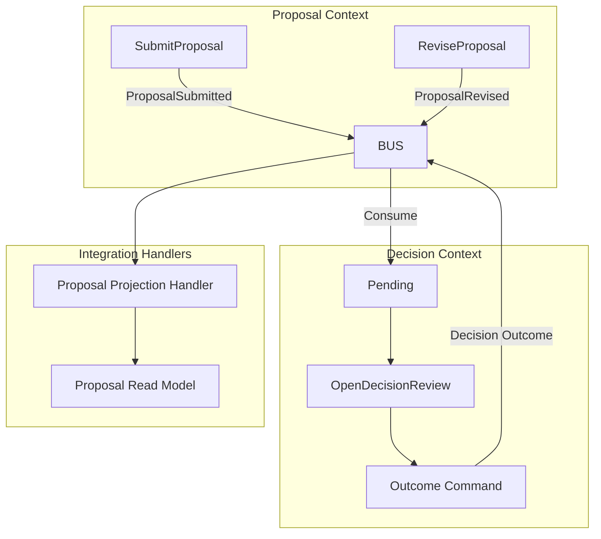
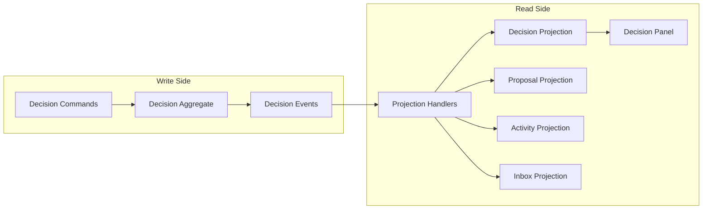
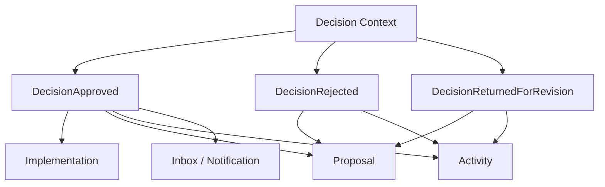
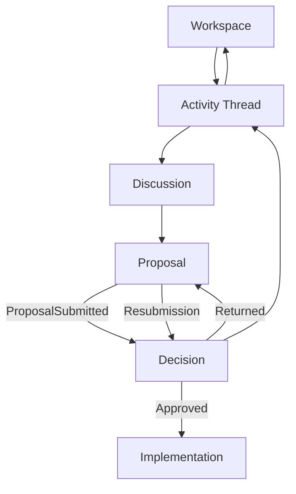
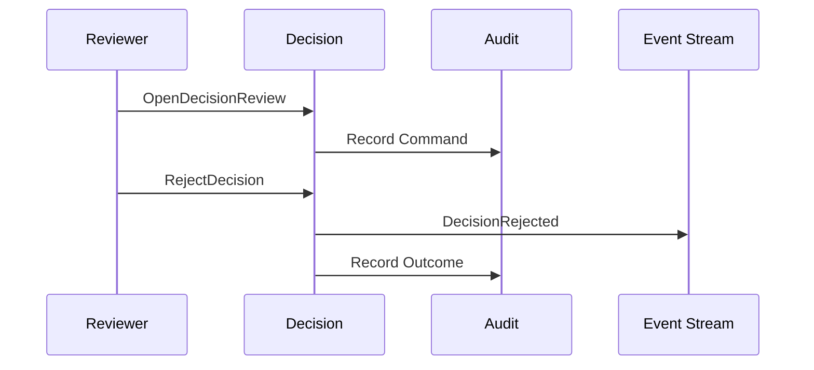

# Humanity Union Decision Implementation Specification

## Version 2.0

### Canonical MVP Implementation Specification for the Decision Module

---

# Document Status

| Field | Value |
|-------|-------|
| **Document Type** | Canonical implementation specification |
| **Status** | Approved for MVP implementation |
| **Architectural Layer** | Application Implementation Specification |
| **Bounded Context** | Decision |
| **Primary Aggregate** | Decision |
| **Architectural Authority** | Platform Blueprint v2.0 |
| **Implementation Authority** | Engineering Standards v2.0 |
| **Scope** | Decision aggregate, human review workflow, CQRS behavior, Proposal integration, Activity integration, Implementation handoff |
| **Non-Scope** | Institutional governance, voting systems, AI authority, implementation execution |

---

# Architectural Authority

This specification defines the canonical implementation of the Decision Module.

Every implementation SHALL conform to:

- Platform Blueprint v2.0;
- Engineering Standards v2.0;
- Domain Model;
- Domain Boundaries;
- Canonical Event Catalogue;
- Proposal Implementation Specification;
- Activity Implementation Specification.

No implementation MAY redefine Decision ownership established by the Blueprint.

---

# Normative References

This specification SHALL be interpreted together with:

- Platform Blueprint
- Engineering Standards
- Domain Model
- Domain Boundaries
- Proposal Implementation Specification
- Activity Implementation Specification
- Member Journey Specification
- Decision Lifecycle Architecture
- Canonical Event Catalogue
- ADR-003
- ADR-005

---

# Repository Position

The Decision Module provides the platform's canonical governance authority.

It owns:

- Decision lifecycle;
- human review;
- governance outcomes;
- decision rationale.

It SHALL coordinate with:

- Activity;
- Proposal;
- Discussion;
- Implementation;

without assuming ownership of their aggregates.

---

# Scope

This specification defines:

- Decision aggregate behavior;
- Decision lifecycle;
- human review workflow;
- Proposal integration;
- Activity integration;
- CQRS implementation;
- command routing;
- projection architecture;
- navigation behavior;
- implementation guidance.

---

# Non-Scope

This specification SHALL NOT define:

- Proposal authoring;
- institutional governance;
- elections;
- voting systems;
- AI governance;
- implementation execution.

Those capabilities remain governed by their own specifications.

---

# Architectural Principles

The Decision Module SHALL be implemented according to the following principles.

### Human Governance Authority

Every governance outcome SHALL be produced by authorized human decision-makers.

AI SHALL NEVER produce authoritative governance outcomes.

---

### Proposal-Centered Review

Every Decision SHALL evaluate exactly one Proposal.

Decision SHALL never exist independently.

---

### Aggregate Ownership

Decision owns:

- review lifecycle;
- governance outcome;
- DecisionRecord;
- DecisionCondition.

Decision SHALL NOT own:

- Proposal;
- Activity;
- Discussion;
- Evidence;
- Implementation.

---

### Immutable Governance History

Decision history SHALL remain append-only.

Governance outcomes SHALL remain permanently traceable.

---

### CQRS Separation

Commands SHALL modify Decision aggregates.

Queries SHALL consume projections.

Decision presentation SHALL remain projection-driven.

---

### Event-Driven Governance

Neighbouring bounded contexts SHALL synchronize exclusively through approved Catalogue Events.

Cross-context aggregate mutation SHALL NEVER occur.

---

# Section 1 — Purpose

## Why Decision Exists

Proposal prepares a governance candidate.

Decision applies governance authority.

Every Decision SHALL represent the formal human evaluation of a submitted Proposal.

Decision SHALL exist to provide:

- authorized governance outcomes;
- accountable review;
- documented rationale;
- implementation authorization;
- governance continuity.

Decision SHALL remain the only authoritative source of governance outcomes.

---

## Civic Purpose

Decision fulfills the following civic objectives.

| Objective | Decision Responsibility |
|-----------|-------------------------|
| Human evaluation | Governance review |
| Governance outcome | Approved / Rejected / Returned |
| Accountability | Decision rationale |
| Implementation authorization | DecisionApproved |
| Historical record | Immutable audit |

Decision SHALL remain governance authority throughout its lifecycle.

---

## Position Within the Civic Lifecycle

```text
Activity

        │

        ▼

Discussion

        │

        ▼

Proposal

        │

        ▼

Decision

        │

        ▼

Implementation

        │

        ▼

Impact
```

Decision represents the governance authority stage.

Implementation SHALL remain an independent bounded context.

---

## Relationship to Activity

Activity and Decision fulfill different responsibilities.

| Activity | Decision |
|----------|-----------|
| Civic trace | Governance authority |
| Activity aggregate | Decision aggregate |
| Navigation anchor | Human review |
| Coordinates civic participation | Produces governance outcomes |

Decision SHALL always reference ActivityId.

Activity SHALL remain the permanent civic coordination anchor.

---

## Relationship to Proposal

Proposal and Decision represent consecutive governance stages.

| Proposal | Decision |
|----------|-----------|
| Governance candidate | Governance authority |
| Proposal aggregate | Decision aggregate |
| Owns Proposal revisions | Owns governance outcomes |

Decision SHALL evaluate Proposal.

Decision SHALL NEVER modify Proposal content.

---

## Relationship to Discussion

Discussion remains the source of deliberation.

Decision SHALL consume Proposal references.

Decision SHALL NEVER own:

- Discussion;
- Contributions;
- Evidence.

---

## Relationship to Implementation

Implementation SHALL consume Decision outcomes.

Decision SHALL NEVER execute implementation.

Implementation SHALL begin only after:

- `DecisionApproved`.

---

# Section 2 — Decision Responsibilities

The Decision Module SHALL perform the following responsibilities.

| Responsibility | Decision Role |
|----------------|---------------|
| Proposal eligibility | Review validation |
| Human review | Governance authority |
| Decision rationale | DecisionRecord |
| Governance outcome | Decision aggregate |
| Catalogue Events | Decision publisher |
| Activity synchronization | Read projections |
| Proposal synchronization | Integration handlers |
| Implementation authorization | DecisionApproved |

Decision SHALL remain the only publisher of Decision Catalogue Events.

---

## Responsibilities Explicitly Excluded

Decision SHALL NOT perform:

- Proposal authoring;
- Proposal revision;
- Discussion moderation;
- Evidence ownership;
- Activity management;
- Implementation execution;
- AI governance.

---

# Section 3 — Domain Ownership and Boundaries

## Bounded Context Relationships

| Bounded Context | Relationship |
|-----------------|--------------|
| Activity | Civic trace reference |
| Discussion | Deliberation reference |
| Proposal | Governance candidate |
| Decision | Governance authority |
| Implementation | Consumes approved outcomes |
| Workspace | Projection consumer |
| Notification | Projection consumer |

Decision SHALL never assume ownership of neighboring aggregates.

---

## Aggregate Ownership

| Aggregate | Responsibility |
|------------|----------------|
| Decision | Human governance review |

Decision owns:

- Decision lifecycle;
- DecisionRecord;
- DecisionCondition.

---

## External References

Decision SHALL reference:

- ProposalId;
- ActivityId;
- MemberId;
- ProposalRevisionNumber.

These SHALL remain references only.

---

## Consumed Catalogue Events

| Event | Purpose |
|-------|---------|
| `ProposalSubmitted` | Create review eligibility |
| `ProposalWithdrawn` | Handle review cancellation |
| `ProposalRevised` | Evaluate review validity |

---

## Published Catalogue Events

| Event | Purpose |
|-------|---------|
| `DecisionApproved` | Governance approval |
| `DecisionRejected` | Governance rejection |
| `DecisionReturnedForRevision` | Governance return |

No additional Decision Catalogue Events SHALL be introduced.

---

## Boundary Principles

The following architectural rules SHALL remain permanent.

- Decision references Proposal.
- Decision never owns Proposal.
- Decision never owns Discussion.
- Decision never owns Evidence.
- Decision never executes Implementation.
- Proposal never publishes Decision events.
- Decision outcomes SHALL propagate through Catalogue Events only.

---

# Section 4 — Decision Aggregate

The Decision aggregate SHALL remain the sole authority for governance outcomes.

---

## Aggregate Identity

The aggregate SHALL contain:

- DecisionId;
- ProposalId;
- ActivityId;
- ProposalRevisionNumber;
- Status;
- DecisionOutcome;
- DecisionRecord;
- DecisionCondition;
- AuditReference;
- ReviewAuthorityMemberId;
- CreatedAt;
- CompletedAt.

---

## Aggregate Principles

### Single Proposal Authority

Every Decision SHALL evaluate exactly one Proposal.

---

### Human Authority

Every governance outcome SHALL originate from an authorized human Member.

---

### Immutable Governance

Governance outcomes SHALL remain append-only.

---

### Proposal Integrity

Decision SHALL never modify Proposal content.

---

### Auditability

Every governance outcome SHALL preserve:

- reviewer;
- rationale;
- timestamps;
- audit references.

---

## Aggregate Invariants

The following invariants SHALL remain permanently true.

1. Decision SHALL exist only after Proposal submission.
2. Only authorized human Members SHALL execute governance commands.
3. Terminal outcomes SHALL never be applied twice.
4. Withdrawn Proposals SHALL not be approved.
5. Governance history SHALL remain immutable.
6. Returned for Revision SHALL remain distinct from Approval and Rejection.
7. Rejection SHALL always include rationale.
8. Command handlers SHALL remain idempotent.
9. Decision SHALL remain the only publisher of Decision Catalogue Events.
10. Every Decision SHALL reference one Proposal.
11. Authentication alone SHALL never grant governance authority.

---

# Section 5 — Decision Lifecycle

The Decision lifecycle consists of two complementary layers.

- Aggregate lifecycle.
- Presentation lifecycle.

Aggregate state SHALL remain authoritative.

Presentation SHALL consume projections only.

---

## Aggregate Lifecycle



---

## Aggregate States

| State | Purpose | Entry | Exit | Published Event |
|-------|---------|-------|------|-----------------|
| Pending | Awaiting review | ProposalSubmitted | Review Open | — |
| Under Review | Human governance | OpenDecisionReview | Governance outcome | Outcome event |
| Approved | Successful governance | ApproveDecision | Terminal | DecisionApproved |
| Rejected | Governance rejected | RejectDecision | Terminal | DecisionRejected |
| Returned For Revision | Governance returned | ReturnDecisionForRevision | Terminal | DecisionReturnedForRevision |

No DecisionOpened, DecisionClosed, or DecisionCompleted Catalogue Events SHALL exist.

---

## Presentation States

| Presentation Label | Aggregate State |
|--------------------|-----------------|
| Pending Review | Pending |
| Under Review | UnderReview |
| Approved | Approved |
| Rejected | Rejected |
| Returned for Revision | ReturnedForRevision |
| Closed | Terminal presentation |
| Archived | Historical presentation |

Presentation SHALL remain projection-driven.

---

## Review Continuity

Returned Proposals SHALL begin a new governance cycle after:

1. Proposal revision.
2. Proposal resubmission.
3. New Decision review.

Previous Decision history SHALL remain preserved.

## Read-Model Consequences

Decision lifecycle changes SHALL propagate to derived presentation models through Catalogue Event consumption.

| Authoritative Event or State | Activity Stage | Proposal Projection | Workspace | Inbox | Implementation |
|------------------------------|----------------|---------------------|-----------|-------|----------------|
| Pending or Under Review | Decision Pending | Under Review | My Decisions | Governance work item | Not eligible |
| `DecisionApproved` | Implementation Eligible | Approved | Outcome history | Updated outcome item | Eligible |
| `DecisionRejected` | Rejected | Rejected | Outcome history | Updated outcome item | Not eligible |
| `DecisionReturnedForRevision` | Revision Required | Returned | Updated review item | Revision work item | Not eligible |

Read models SHALL remain derived state.

No Activity, Proposal, Workspace, Inbox, or Implementation projection SHALL replace the Decision aggregate as the source of governance authority.

---

# Section 6 — Command Model

The Decision Module SHALL expose only commands approved by the canonical architecture.

No implementation SHALL introduce alternate command names that duplicate existing domain behavior.

---

## Command Model Principles

### Human Actor Requirement

Every Decision command SHALL be executed by an authenticated and authorized human Member.

AI SHALL NEVER be accepted as a Decision command actor.

---

### Aggregate Authority

Every Decision command SHALL target exactly one Decision aggregate instance.

---

### Explicit Authorization

Authentication SHALL NOT be treated as Decision authority.

Command handlers SHALL evaluate the applicable Decision Policy before aggregate mutation.

---

### Idempotent Execution

Outcome command processing SHALL be idempotent.

Repeated delivery of the same command identifier SHALL NOT publish duplicate outcome events.

---

### Audit Completeness

Every command SHALL preserve:

- command identifier;
- actor identifier;
- correlation identifier;
- timestamp;
- Proposal reference;
- Proposal revision;
- authorization context.

---

## Rejected Command Aliases

| Rejected Command | Canonical Replacement | Reason |
|------------------|-----------------------|--------|
| `StartDecisionReview` | `OpenDecisionReview` | Canonical command name |
| `RecordDecisionRationale` | Rationale within outcome command | Rationale belongs to DecisionRecord |
| `CloseDecision` | Outcome command | Terminal state follows authoritative outcome |

No `DecisionOpened`, `DecisionClosed`, or `DecisionCompleted` Catalogue Events SHALL be introduced.

---

## Command — `OpenDecisionReview`

### Purpose

Transitions an eligible Decision from Pending to Under Review.

### Actor

Authorized human reviewer.

### Permission

Decision review authority.

### Inputs

- DecisionId or ProposalId;
- ActivityId correlation;
- command identifier;
- actor context.

### Preconditions

- `ProposalSubmitted` has been consumed;
- Decision is Pending;
- Proposal is not withdrawn;
- no terminal outcome exists;
- actor has review authority.

### Aggregate Result

Decision transitions to `UnderReview`.

### Published Catalogue Event

None.

Review opening SHALL remain an aggregate-internal lifecycle transition.

### Failure Conditions

The command SHALL fail when:

- Proposal does not exist;
- Proposal is not submitted;
- Proposal has been withdrawn;
- Decision is terminal;
- actor is unauthorized;
- reference identifiers do not match.

### Idempotency

Repeated execution against an already active review SHALL either:

- produce a deterministic no-op; or
- return a stable lifecycle conflict;

according to Decision Policy.

### Audit

The review opening SHALL preserve actor, timestamp, command correlation, ProposalId, ActivityId, and ProposalRevisionNumber.

---

## Command — `ApproveDecision`

### Purpose

Records an authoritative human approval.

### Actor

Authorized human reviewer satisfying `CanApproveDecision`.

### Inputs

- DecisionId;
- rationale;
- optional DecisionCondition;
- command identifier;
- actor context.

### Preconditions

- Decision status is `UnderReview`;
- Proposal remains eligible;
- Proposal has not been withdrawn;
- reviewed revision matches the Decision record;
- actor has approval authority.

### Aggregate Result

Decision transitions to `Approved`.

### Published Catalogue Event

- `DecisionApproved`

### Failure Conditions

The command SHALL fail when:

- Decision is not Under Review;
- Proposal is withdrawn;
- actor is unauthorized;
- Proposal revision is stale;
- terminal outcome already exists;
- DecisionCondition violates policy.

### Idempotency

Repeated processing of the same command identifier SHALL return the original outcome and SHALL NOT publish another event.

### Audit

The DecisionRecord SHALL preserve:

- reviewer;
- rationale;
- conditions;
- Proposal revision;
- completion timestamp;
- authorization context.

---

## Command — `RejectDecision`

### Purpose

Records an authoritative human rejection.

### Actor

Authorized human reviewer.

### Inputs

- DecisionId;
- mandatory rationale;
- command identifier;
- actor context.

### Preconditions

- Decision status is `UnderReview`;
- actor has rejection authority;
- rationale is present and valid.

### Aggregate Result

Decision transitions to `Rejected`.

### Published Catalogue Event

- `DecisionRejected`

### Failure Conditions

The command SHALL fail when:

- rationale is absent;
- Decision is not Under Review;
- actor is unauthorized;
- terminal outcome already exists.

### Idempotency

Idempotency SHALL be mandatory.

### Audit

Rejection rationale SHALL remain permanently preserved in DecisionRecord and the audit trail.

---

## Command — `ReturnDecisionForRevision`

### Purpose

Returns the Proposal to its authors for governed revision without approving or rejecting it.

### Actor

Authorized human reviewer.

### Inputs

- DecisionId;
- revision rationale;
- revision guidance;
- command identifier;
- actor context.

### Preconditions

- Decision status is `UnderReview`;
- Proposal has not been withdrawn;
- actor has return authority.

### Aggregate Result

Decision transitions to `ReturnedForRevision`.

### Published Catalogue Event

- `DecisionReturnedForRevision`

### Failure Conditions

The command SHALL fail when:

- actor is unauthorized;
- Decision is not Under Review;
- Proposal is withdrawn;
- terminal outcome already exists.

### Idempotency

Idempotency SHALL be mandatory.

### Audit

Revision guidance SHALL remain preserved as part of the DecisionRecord.

---

## Command Execution Flow

The canonical command flow SHALL be:

```text
Decision Panel

        │

        ▼

Application Layer

        │

        ▼

Authorization Policy

        │

        ▼

Decision Aggregate

        │

        ▼

Catalogue Event

        │

        ▼

Outbox / Event Stream
```

Presentation components SHALL never mutate Decision persistence directly.

---

# Section 7 — Decision Outcomes

Decision outcomes SHALL represent authoritative human governance facts.

Only one terminal outcome SHALL be permitted for each Decision aggregate instance.

---

## Outcome — Approved

### Catalogue Event

`DecisionApproved`

### Domain Meaning

An authorized human governance authority has accepted the Proposal at the Proposal revision recorded by the Decision aggregate.

### Required Consequences

- Decision becomes terminal;
- Proposal projection reflects approval;
- Activity stage becomes Implementation Eligible;
- Workspace outcome history updates;
- Inbox review work is completed or replaced;
- authorized stakeholders may be notified;
- Implementation becomes eligible to receive `StartImplementation`.

### Implementation Boundary

Approval SHALL NOT start Implementation automatically.

Implementation SHALL remain responsible for its own commands, authorization, and lifecycle.

### DecisionRecord

The record SHALL preserve:

- ProposalId;
- ProposalRevisionNumber;
- reviewer identity;
- rationale;
- optional conditions;
- timestamp;
- audit reference.

---

## Outcome — Rejected

### Catalogue Event

`DecisionRejected`

### Domain Meaning

An authorized human governance authority has declined the Proposal.

### Required Consequences

- Decision becomes terminal;
- Proposal projection becomes Rejected;
- Activity stage reflects rejection;
- Implementation remains ineligible;
- rejection rationale remains visible according to policy;
- relevant Inbox and Notification projections update.

### Rationale

Rejection rationale SHALL be mandatory.

### Restarting the Governance Path

A new governance cycle SHALL require a new or resubmitted Proposal according to Proposal Policy.

The rejected Decision instance SHALL remain immutable.

---

## Outcome — Returned for Revision

### Catalogue Event

`DecisionReturnedForRevision`

### Domain Meaning

The Proposal requires revision before another governance review.

This outcome SHALL NOT represent approval or rejection.

### Required Consequences

- Decision becomes terminal;
- Proposal integration transitions the Proposal to Returned;
- Activity stage reflects Revision Required;
- Implementation remains ineligible;
- authors receive revision guidance;
- a later resubmission may create a new Decision instance.

### Ownership Boundary

Decision SHALL NOT revise Proposal content.

Proposal authors SHALL revise through the Proposal bounded context.

---

## Outcome Invariants

The following statements SHALL remain permanently true.

| Statement | Architectural Rule |
|-----------|--------------------|
| Support is not approval | Proposal support cannot create a Decision outcome |
| Objection is not rejection | Proposal objection cannot create a Decision outcome |
| MemberSignal is not Decision | Examination signals have no governance authority |
| Discussion consensus is not Decision | Deliberation cannot replace formal review |
| Submission is not approval | `ProposalSubmitted` creates eligibility only |
| Proposal projection is not authoritative | Decision aggregate and events remain authoritative |
| Implementation eligibility is not execution | Separate Implementation command required |

---

# Section 8 — Human Authority and Permissions

Decision authority SHALL remain explicitly assigned, policy-governed, and human.

---

## MVP Authority Model

For MVP implementation:

- Decision Policy SHALL assign review authority to authorized Members;
- `CanApproveDecision` SHALL govern outcome authority;
- institutional chamber workflows SHALL remain deferred;
- advanced voting systems SHALL remain deferred;
- voting semantics MAY be evaluated internally by policy without introducing unapproved Catalogue Events;
- Facilitator status SHALL NOT grant Decision authority;
- Proposal authorship SHALL NOT grant Decision authority;
- AI SHALL remain excluded from every Decision outcome command.

---

## Authority Principles

### Human Authority

Only human Members SHALL issue authoritative Decision outcomes.

---

### Least Privilege

Reviewers SHALL receive only the capabilities required by their assigned governance role.

---

### Contextual Authorization

Authorization SHALL consider:

- community scope;
- Proposal type;
- review assignment;
- conflict-of-interest policy;
- Decision lifecycle state;
- Proposal visibility;
- Proposal revision.

---

### Separation of Duties

Proposal authorship, facilitation, moderation, and Decision authority SHALL remain distinct unless an explicit policy authorizes overlap.

---

### Server-Side Enforcement

Authorization SHALL be enforced within the application and domain layers.

Hiding a control in the interface SHALL NOT constitute authorization.

---

## Permission Matrix

| Action | Guest | Member | Proposal Author | Facilitator | Authorized Reviewer |
|--------|-------|--------|-----------------|-------------|---------------------|
| View public Decision outcome | Permitted | Permitted | Permitted | Permitted | Permitted |
| View restricted Decision | Prohibited | Scope-dependent | Scope-dependent | Scope-dependent | Permitted where assigned |
| View pending review queue | Prohibited | Prohibited | Prohibited | Prohibited | Permitted |
| `OpenDecisionReview` | Prohibited | Prohibited | Prohibited | Prohibited | Permitted |
| `ApproveDecision` | Prohibited | Prohibited | Prohibited | Prohibited | Permitted |
| `RejectDecision` | Prohibited | Prohibited | Prohibited | Prohibited | Permitted |
| `ReturnDecisionForRevision` | Prohibited | Prohibited | Prohibited | Prohibited | Permitted |
| View complete audit history | Prohibited | Policy-dependent | Scope-dependent | Prohibited unless assigned | Permitted |
| `StartImplementation` | Prohibited | Prohibited | Prohibited by Decision role alone | Prohibited | Governed by Implementation Policy |

---

## Authority Separation

| Identity or Capability | Grants Decision Authority |
|------------------------|---------------------------|
| `MemberRegistered` | No |
| `MemberAuthenticated` | No |
| Proposal authorship | No |
| Facilitator assignment | No |
| Review authority assignment | Yes |
| `CanApproveDecision` | Yes, subject to policy |
| AI Facilitator | Never |

Authentication establishes identity.

Authorization establishes governance authority.

---

## Conflict-of-Interest Enforcement

Where required by Decision Policy, a reviewer SHALL be prevented from issuing an outcome when:

- they are the sole Proposal author;
- they have an undeclared material interest;
- they participated in a prohibited conflicting role;
- community or institutional rules require recusal.

Recusal behavior MAY remain policy-driven, but SHALL be auditable.

---

# Section 9 — Decision Components

The Decision Stage Panel SHALL appear within the Activity Thread after Proposal submission.

Every component SHALL remain projection-driven and authorization-aware.

---

## Component Architecture Principles

### Activity Continuity

Every Decision component SHALL preserve ActivityId and ProposalId context.

---

### Projection-Driven Presentation

Components SHALL render read models rather than aggregate persistence.

---

### Command Isolation

Writable components SHALL dispatch commands through the application layer.

---

### Human Authority Awareness

Outcome controls SHALL appear only for authorized human reviewers.

---

### Immutable Outcome Presentation

Terminal Decision records SHALL render as immutable historical content.

---

### Context Ownership

Proposal content, Evidence, Activity state, Inbox, and Notifications SHALL remain owned by their respective contexts.

---

## Component 1 — Decision Panel Shell

### Purpose

Provides the Activity Thread container for Decision review and outcome presentation.

### Inputs

- ActivityId;
- ProposalId;
- DecisionId;
- authorized session.

### Outputs

- Decision stage presentation;
- lifecycle-specific child composition;
- review or outcome state.

### Dependencies

- submitted Proposal;
- Activity Thread route;
- visibility policy;
- authorization service.

### Bounded Context

Decision

### Aggregate

Decision

### Read Model

- `DecisionPanelProjection`

### Catalogue Events

Consumes:

- `ProposalSubmitted`;
- `ProposalRevised`;
- `ProposalWithdrawn`;
- `DecisionApproved`;
- `DecisionRejected`;
- `DecisionReturnedForRevision`.

### Empty State

The component SHALL remain hidden or display a non-actionable state before Proposal submission.

---

## Component 2 — Decision Header

### Purpose

Displays Decision identity and governance state.

### Inputs

Decision projection metadata.

### Outputs

- DecisionId;
- lifecycle state;
- Proposal reference;
- Activity reference;
- reviewed Proposal revision.

### Read Model

- `DecisionDetailProjection`

### Catalogue Events

Consumes all Decision outcome events.

The header SHALL distinguish authoritative aggregate state from presentation-only labels.

---

## Component 3 — Proposal Summary Reference

### Purpose

Displays the Proposal revision being reviewed.

### Inputs

- ProposalId;
- ProposalRevisionNumber.

### Outputs

Read-only Proposal summary or snapshot.

### Dependencies

- Proposal read projection;
- Proposal visibility policy.

### Ownership

Proposal remains owned by the Proposal bounded context.

### Error Behavior

Missing or unavailable Proposal data SHALL produce a graceful restricted or unavailable state.

The Decision component SHALL NOT silently substitute a different Proposal revision.

---

## Component 4 — Activity Context Reference

### Purpose

Preserves navigation to the civic trace anchor.

### Inputs

ActivityId.

### Outputs

- Activity title;
- Activity scope;
- Activity Thread link;
- civic-stage context.

### Read Model

Activity detail subset.

Decision SHALL never become an orphaned governance destination.

---

## Component 5 — Review Status

### Purpose

Displays the authoritative Decision lifecycle and presentation state.

### Inputs

Decision status projection.

### Outputs

- Pending Review;
- Under Review;
- Approved;
- Rejected;
- Returned for Revision;
- historical presentation labels where applicable.

### Read Model

- `DecisionStatusProjection`

### Catalogue Events

Consumes:

- `DecisionApproved`;
- `DecisionRejected`;
- `DecisionReturnedForRevision`.

Pending and Under Review MAY be derived from aggregate state without dedicated Catalogue Events.

---

## Component 6 — Reviewer and Authority Summary

### Purpose

Displays assigned review authority and completed outcome actor information.

### Inputs

- ReviewAuthorityMemberId;
- assignment metadata;
- audit metadata;
- completion actor.

### Outputs

Policy-filtered reviewer information.

### Dependencies

- Identity projection;
- Decision Policy;
- visibility policy.

Restricted reviewer or audit data SHALL NOT be exposed beyond authorized scope.

---

## Component 7 — Rationale Panel

### Purpose

Captures and displays the reasoning associated with a Decision outcome.

### Inputs

- rationale;
- revision guidance;
- optional DecisionCondition.

### Outputs

Outcome command payload and terminal DecisionRecord presentation.

### Dependencies

- Decision Policy;
- lifecycle state;
- reviewer authorization.

### Aggregate

Decision

### Read Model

- `DecisionRationaleProjection`

### Catalogue Events

Rationale SHALL be included in the applicable outcome event payload or referenced authoritative DecisionRecord.

No separate `RecordDecisionRationale` command or Catalogue Event SHALL exist.

### Validation Rules

- rejection rationale SHALL be required;
- return-for-revision guidance SHALL be required;
- approval rationale SHALL follow Decision Policy;
- rationale SHALL be validated before command dispatch and again within the application or domain layer;
- terminal rationale SHALL remain immutable.

## Component 8 — Approve Control

### Purpose

Dispatches the authoritative approval command.

### Inputs

- DecisionId;
- approval rationale;
- optional DecisionCondition.

### Outputs

- `DecisionApproved`

### Dependencies

- `CanApproveDecision`;
- Decision Policy;
- Decision lifecycle;
- Proposal eligibility.

### Aggregate

Decision

### Read Model

- `DecisionStatusProjection`

### Catalogue Events

Publishes:

- `DecisionApproved`

### Visibility Rules

The control SHALL remain unavailable when:

- Decision is not `UnderReview`;
- Proposal has been withdrawn;
- the reviewer lacks approval authority;
- the Decision is terminal.

---

## Component 9 — Reject Control

### Purpose

Dispatches an authoritative rejection.

### Inputs

- DecisionId;
- mandatory rationale.

### Outputs

- `DecisionRejected`

### Aggregate

Decision

### Catalogue Events

Publishes:

- `DecisionRejected`

### Validation Rules

Rejection SHALL require rationale before command execution.

---

## Component 10 — Return for Revision Control

### Purpose

Returns the Proposal for governed revision.

### Inputs

- DecisionId;
- revision guidance.

### Outputs

- `DecisionReturnedForRevision`

### Aggregate

Decision

### Catalogue Events

Publishes:

- `DecisionReturnedForRevision`

### Validation Rules

Revision guidance SHALL be preserved as part of the DecisionRecord.

---

## Component 11 — Outcome Summary

### Purpose

Displays the immutable governance outcome.

### Outputs

- Approved;
- Rejected;
- Returned for Revision.

### Read Model

- `DecisionOutcomeProjection`

Outcome Summary SHALL remain read-only.

---

## Component 12 — Audit Timeline

### Purpose

Displays the complete immutable governance history.

### Contents

- review opening;
- reviewer identity;
- rationale;
- outcome;
- timestamps;
- audit references.

### Read Model

- `DecisionAuditProjection`

### Authorization

Audit visibility SHALL follow Decision Policy.

---

## Component 13 — Permission Denied State

### Purpose

Provides a safe presentation for unauthorized viewers.

### Behavior

The component SHALL:

- hide outcome controls;
- expose only authorized information;
- preserve navigation context.

Authorization SHALL remain enforced by the server.

---

## Component 14 — Pending Review State

### Purpose

Represents the period between Proposal submission and active review.

### Outputs

- Pending Review status;
- Open Review action for authorized reviewers.

### Read Model

- `DecisionStatusProjection`

The component SHALL remain read-only for non-reviewers.

---

## Component 15 — Completed Decision State

### Purpose

Displays immutable terminal Decision outcomes.

### Outputs

- governance outcome;
- rationale;
- audit summary;
- optional Implementation entry point.

### Dependencies

Decision lifecycle.

Implementation eligibility.

### Rule

Completed Decisions SHALL NOT expose mutation controls.

Proposal SHALL remain immutable from within the Decision Module.

---

# Section 10 — Navigation

Decision navigation SHALL remain Activity-centered.

Decision SHALL never become a standalone workflow detached from the originating Activity.

---

## Navigation Principles

### Activity Continuity

Every navigation path SHALL preserve Activity context.

---

### Proposal Continuity

Decision SHALL always remain associated with its Proposal.

---

### Governance Sequence

Navigation SHALL preserve the canonical governance order.

---

### Projection Continuity

Presentation state SHALL survive navigation where appropriate.

---

## Canonical Navigation Flow

```text
Workspace

        │

        ▼

Activity Thread

        │

        ▼

Discussion

        │

        ▼

Proposal

        │

        ▼

Decision

        │

        ▼

Implementation
```

---

## Entry Points

| Entry | Destination |
|--------|-------------|
| Workspace → My Decisions | Activity Thread |
| Workspace Inbox | Activity Thread |
| Proposal Panel | Decision Panel |

All entry points SHALL preserve ActivityId.

---

## Exit Points

| Exit | Destination |
|------|-------------|
| Decision Approved | Implementation Panel |
| Decision Rejected | Discussion or Activity |
| Returned for Revision | Proposal Panel |
| Return | Workspace |

Implementation SHALL NOT begin automatically.

---

## Forbidden Navigation

The following navigation paths SHALL NEVER be permitted.

| Forbidden Pattern | Architectural Violation |
|-------------------|-------------------------|
| Decision without Proposal | Breaks governance sequence |
| Approval from Discussion | Bypasses Proposal |
| Approval from Activity | Bypasses Proposal |
| Implementation before DecisionApproved | Violates governance authority |
| Proposal editing inside Decision | Cross-aggregate mutation |
| Proposal publishing Decision events | Violates bounded context ownership |
| Inbox controlling workflow | Projection ownership violation |
| Notification replacing governance state | Projection ownership violation |

---

## Navigation Matrix

| From | To | Allowed |
|------|----|---------|
| My Decisions | Activity → Decision | ✓ |
| Inbox | Activity → Decision | ✓ |
| Proposal | Decision | ✓ |
| Discussion | Decision Outcome | ✗ |
| Activity | Decision without Proposal | ✗ |
| Decision Approved | Implementation | ✓ |
| Decision | Workspace | ✓ |

---

# Section 11 — CQRS and Event Flow

Decision SHALL implement CQRS according to Engineering Standards.

Commands and queries SHALL remain completely separated.

---

## CQRS Principles

### Aggregate Authority

Only the Decision aggregate SHALL own Decision state.

---

### Projection-Driven Presentation

Decision presentation SHALL consume projections only.

---

### Event Synchronization

Neighbouring bounded contexts SHALL synchronize exclusively through Catalogue Events.

---

### Eventual Consistency

Decision projections SHALL support eventual consistency.

---

## Write Side

| Command | Aggregate | Published Catalogue Event |
|---------|-----------|---------------------------|
| `OpenDecisionReview` | Decision | — |
| `ApproveDecision` | Decision | `DecisionApproved` |
| `RejectDecision` | Decision | `DecisionRejected` |
| `ReturnDecisionForRevision` | Decision | `DecisionReturnedForRevision` |

---

## Write-Side Rules

Decision commands SHALL:

- target one aggregate;
- validate authorization;
- validate lifecycle;
- validate Proposal eligibility;
- publish only approved Catalogue Events;
- remain idempotent.

---

## Command Routing

```text
Decision Panel

        │

        ▼

Application Layer

        │

        ▼

Decision Context

        │

        ▼

Decision Aggregate

        │

        ▼

Catalogue Event
```

Presentation SHALL never execute Decision business logic.

---

## Read Side

| Read Projection | Source Events | Consumer |
|-----------------|---------------|----------|
| `DecisionDetailProjection` | Decision events | Decision Header |
| `DecisionPanelProjection` | Decision + Proposal | Decision Panel |
| `DecisionOutcomeProjection` | Decision outcome events | Outcome Summary |
| `DecisionAuditProjection` | Commands + events | Audit Timeline |
| `ProposalDecisionOutcomeProjection` | Decision events | Proposal |
| `ActivityDecisionProjection` | Decision events | Activity |
| `WorkspaceDecisionsProjection` | Decision events | Workspace |
| `ActivityInboxProjection` | Decision events | Inbox |

Every Decision projection SHALL remain replayable.

---

## Projection Principles

Decision projections SHALL satisfy:

- Derived State;
- Replayability;
- Presentation Independence;
- Disposable State;
- No Write Through.

---

## Integration Resolution

Decision SHALL remain the exclusive publisher of:

- `DecisionApproved`;
- `DecisionRejected`;
- `DecisionReturnedForRevision`.

Proposal SHALL consume those events.

Proposal SHALL NEVER republish them.

---

## Publisher / Consumer Mapping

| Catalogue Event | Publisher | Consumers |
|-----------------|-----------|-----------|
| `ProposalSubmitted` | Proposal | Decision |
| `DecisionApproved` | Decision | Implementation, Proposal, Activity, Workspace, Inbox, Notification |
| `DecisionRejected` | Decision | Proposal, Activity, Workspace, Inbox, Notification |
| `DecisionReturnedForRevision` | Decision | Proposal, Activity, Workspace, Inbox, Notification |
| `ProposalWithdrawn` | Proposal | Decision |

---

## Read Consistency

| Presentation Surface | Consistency |
|----------------------|-------------|
| Decision outcome | Read-your-writes |
| Proposal projection | Eventual consistency |
| Activity stage | Eventual consistency |
| Inbox | Eventual consistency |
| Implementation eligibility | Eventual consistency |

---

## CQRS Invariants

The following rules SHALL remain permanent.

### Aggregate Authority

Decision owns Decision state.

---

### Projection Authority

Read projections SHALL remain presentation models.

---

### Command Isolation

Commands SHALL never modify projections.

---

### Query Isolation

Queries SHALL never mutate aggregates.

---

### Event Authority

Decision outcome events SHALL remain the canonical synchronization mechanism.

---

### Replay Compatibility

Decision projections SHALL remain rebuildable.

---

### Idempotent Consumption

Consumers SHALL tolerate duplicate event delivery.

---

# Section 12 — Proposal and Decision Integration

Decision and Proposal SHALL communicate exclusively through approved Catalogue Events.

---

## Canonical Integration Flow

| Step | Responsibility |
|------|----------------|
| Proposal publishes `ProposalSubmitted` | Proposal |
| Decision validates eligibility | Decision |
| Decision creates Pending review | Decision |
| Authorized reviewer opens review | Decision |
| Decision publishes outcome | Decision |
| Proposal consumes outcome | Proposal |
| Proposal revision path | Proposal |

---

## Proposal Evaluation

Decision SHALL evaluate:

- ProposalId;
- ProposalRevisionNumber.

Decision SHALL NOT duplicate Proposal ownership.

---

## Stale Proposal Handling

Decision SHALL reject outcome commands when:

- Proposal has been withdrawn;
- Proposal revision is stale;
- Proposal eligibility is lost.

---

## Integration Principles

### Proposal Ownership

Proposal owns Proposal content.

---

### Decision Ownership

Decision owns governance outcomes.

---

### Revision Isolation

Decision SHALL never revise Proposal content.

---

### Event Synchronization

Synchronization SHALL occur exclusively through Catalogue Events.

---

### Review Independence

Every review cycle SHALL preserve previous Decision history.

---

## Open Architectural Questions

The following implementation decisions remain configurable:

| Question | Guidance |
|-----------|----------|
| Decision instance per Proposal cycle | Prefer one Decision per submission cycle |
| Reviewer assignment | Decision Policy |
| Conditional approval UI | Optional MVP capability |

---

# Section 13 — Activity and Workspace Projections

Every projection described below SHALL remain read-only.

Decision SHALL remain the authoritative source.

---

## Activity Thread

| Presentation | Source |
|--------------|--------|
| Decision stage | `ActivityDecisionProjection` |
| Outcome Summary | `DecisionOutcomeProjection` |
| Rationale | `DecisionDetailProjection` |
| Implementation eligibility | Derived from `DecisionApproved` |

---

## Workspace

| Module | Projection |
|---------|------------|
| My Decisions | `WorkspaceDecisionsProjection` |
| Inbox | `ActivityInboxProjection` |
| Participation Summary | Decision projections |
| Notifications | Notification projections |

---

## Proposal Panel

| Presentation | Source |
|--------------|--------|
| Current Decision status | Proposal projection |
| Latest outcome | Read-only |
| Returned banner | `DecisionReturnedForRevision` |
| Decision history | Audit projection |

Proposal SHALL consume Decision outcomes without becoming the source of governance truth.

# Section 14 — Inbox and Notifications

Inbox and Notifications SHALL remain independent derived capabilities.

Neither capability SHALL own Decision workflow state.

---

## Inbox Projection

Inbox SHALL operate as a governance work queue for authorized reviewers and participants.

| Property | Canonical Rule |
|----------|----------------|
| Role | Governance and review work queue |
| Primary Categories | Work; Governance |
| Ownership | Projection only |
| Inputs | Proposal and Decision Catalogue Events |
| Domain Publication | Prohibited |
| Read Acknowledgement | Inbox-local state only |
| Decision Mutation | Prohibited |
| Navigation | Deep link to Activity Thread |

Inbox SHALL NOT:

- approve or reject a Decision;
- open a Decision review directly without command routing;
- mutate the Decision aggregate;
- become the authoritative source of review state.

---

## Inbox Responsibilities

Inbox MAY display:

- pending review assignments;
- returned-for-revision work;
- completed outcome notices;
- reviewer-specific governance tasks.

Inbox items SHALL reference:

- ActivityId;
- ProposalId;
- DecisionId where available;
- work category;
- authorized deep-link destination.

Inbox presentation SHALL preserve Activity context.

---

## Notification Channel

Notifications SHALL provide alerts only.

| Trigger | Intended Recipient |
|---------|--------------------|
| `ProposalSubmitted` | Assigned reviewers and authorized stakeholders |
| `DecisionApproved` | Proposal authors and policy-defined participants |
| `DecisionRejected` | Proposal authors and policy-defined participants |
| `DecisionReturnedForRevision` | Proposal authors and co-sponsors |
| Review assignment change | Assigned reviewer where policy supports it |

Notifications SHALL deep-link to:

```text
Activity Thread
    → Decision Panel
```

or, for revision work:

```text
Activity Thread
    → Proposal Panel
```

---

## Notification Principles

### Alert-Only Responsibility

Notifications SHALL inform users of governance changes.

Notifications SHALL NOT define or mutate Decision state.

---

### Authorization-Aware Delivery

A notification SHALL NOT reveal content the recipient is not authorized to view.

Restricted notifications SHOULD contain minimal metadata.

---

### Idempotent Delivery

Notification consumers SHALL suppress duplicates using a stable delivery or event deduplication key.

---

### Independent Failure

Notification delivery failure SHALL NOT roll back:

- Decision outcome;
- Proposal synchronization;
- Activity projection;
- Inbox projection.

---

### Source-of-Truth Separation

Opening a notification SHALL always resolve current state from authoritative projections.

Notification payload content SHALL NOT be treated as current governance truth.

---

# Section 15 — Error and Exception Flows

The Decision Module SHALL distinguish domain failures, authorization failures, concurrency failures, integration failures, and projection delays.

No failure handler SHALL silently rewrite aggregate truth through a projection.

---

## Canonical Error Matrix

| Case | Detection | Domain Response | User-Facing Response | Retry Behavior | Audit Requirement |
|------|-----------|-----------------|----------------------|----------------|------------------|
| Proposal not found | Invalid ProposalId | Reject command | Proposal unavailable | No automatic retry | Record reference failure |
| Proposal not submitted | Missing eligible submission | Reject review opening | Proposal not ready for review | No automatic retry | Record eligibility failure |
| Proposal withdrawn | `ProposalWithdrawn` consumed | Block outcome commands | Proposal withdrawn | No retry unless new cycle | Record lifecycle conflict |
| Stale Proposal revision | Revision mismatch | Reject outcome | Review based on outdated revision | Manual review restart | Record version conflict |
| Decision already terminal | Aggregate lifecycle check | Return prior result or conflict | Decision completed | No retry required | Record duplicate attempt |
| Duplicate command | Command identifier dedupe | Return original result | No visible change | Safe retry | Record deduplication |
| Unauthorized reviewer | Authorization policy | Reject command | Not authorized | No retry without authority change | Security audit |
| Missing rejection rationale | Input/domain validation | Reject command | Rationale required | User correction permitted | No outcome event |
| Missing return guidance | Input/domain validation | Reject command | Revision guidance required | User correction permitted | No outcome event |
| Invalid transition | Aggregate state machine | Reject command | Action unavailable in current state | No retry without state change | Record lifecycle violation |
| Projection delay | Consumer lag | Preserve domain truth | Status may be temporarily delayed | Refresh or poll | Operational metric |
| Notification before projection | Event ordering | Preserve domain truth | Open current Activity state | No domain retry | Delivery trace |
| Event-handler retry | At-least-once delivery | Idempotent consumption | No user-facing error where recovered | Automatic | Record retry count |
| Concurrent outcomes | Optimistic concurrency | One command succeeds | Decision already completed | Reload current state | Record concurrency conflict |
| Event publication failure | Outbox/infrastructure failure | Preserve transaction for retry | Outcome processing pending | Automatic infrastructure retry | Critical operational alert |
| Audit persistence failure | Infrastructure validation | Prevent terminal completion where atomic audit required | Unable to complete Decision | Safe retry | Critical operational alert |

---

## Error Classification

Stable machine-readable error codes SHOULD be used.

Recommended categories:

```text
DECISION_NOT_FOUND
PROPOSAL_NOT_ELIGIBLE
PROPOSAL_WITHDRAWN
PROPOSAL_REVISION_STALE
DECISION_NOT_UNDER_REVIEW
DECISION_ALREADY_COMPLETED
DECISION_UNAUTHORIZED
DECISION_RATIONALE_REQUIRED
DECISION_REVISION_GUIDANCE_REQUIRED
DECISION_CONCURRENCY_CONFLICT
DECISION_REFERENCE_MISMATCH
```

Error codes MAY differ in implementation, but SHALL preserve equivalent semantic distinctions.

---

## Domain Error Rules

Domain failures SHALL:

- remain deterministic;
- avoid leaking restricted data;
- include sufficient correlation metadata;
- never publish an outcome event after rejection;
- never leave the aggregate in a partially transitioned state.

---

## Retry Rules

Automatic retries SHALL be limited to retry-safe failures, including:

- transient persistence failure;
- event publication failure through outbox retry;
- projection handler failure;
- notification delivery failure.

Automatic retries SHALL NOT be used to bypass:

- authorization failure;
- invalid lifecycle transition;
- stale Proposal revision;
- missing rationale;
- withdrawn Proposal state.

---

## Concurrency Handling

Decision outcome commands SHALL use optimistic concurrency or an equivalent aggregate-version mechanism.

When concurrent terminal commands are received:

1. one command MAY succeed;
2. all later conflicting commands SHALL fail or return the already-recorded outcome;
3. only one terminal Catalogue Event SHALL exist;
4. the audit trail SHALL preserve the conflict attempt where policy requires.

---

## Projection Recovery Rule

Projection repair SHALL occur through:

- event replay;
- checkpoint reset;
- consumer retry;
- projection rebuild.

Projection repair SHALL NEVER mutate the Decision aggregate.

---

# Section 16 — Auditability and Traceability

Decision auditability SHALL support complete reconstruction of governance authority, reasoning, and event causation.

Audit records SHALL complement domain events.

Audit records SHALL NOT replace domain events.

---

## Audit Requirements

| Requirement | Canonical Implementation |
|-------------|--------------------------|
| Immutable Decision history | Event stream and append-only DecisionRecord |
| Actor traceability | ReviewAuthorityMemberId |
| Authority traceability | Authorization role or policy reference |
| Proposal traceability | ProposalId and ProposalRevisionNumber |
| Activity traceability | ActivityId |
| Rationale traceability | DecisionRecord |
| Condition traceability | DecisionCondition where used |
| Command traceability | CommandId |
| Correlation traceability | CorrelationId |
| Event causation | CausationId |
| Time traceability | CreatedAt, review timestamp, CompletedAt |
| Read presentation | `DecisionAuditProjection` |
| Access control | Audit visibility policy |
| Archival preservation | Immutable event and audit retention |

---

## Minimum Audit Envelope

Every outcome SHALL preserve an audit envelope equivalent to:

```text
DecisionId
ProposalId
ProposalRevisionNumber
ActivityId
CommandId
CorrelationId
CausationId
ReviewAuthorityMemberId
AuthorityScope
Outcome
RationaleReference
OccurredAt
AggregateVersion
```

Implementations MAY add fields but SHALL NOT omit information required for governance traceability.

---

## Audit Invariants

1. Every terminal Decision SHALL identify the human authority actor.
2. Every rejection SHALL preserve rationale.
3. Every return-for-revision outcome SHALL preserve revision guidance.
4. Every approval SHALL identify the exact reviewed Proposal revision.
5. Audit history SHALL remain append-only.
6. Audit access SHALL remain authorization-controlled.
7. Archival SHALL NOT erase events or DecisionRecord content.
8. Audit entries SHALL remain correlated with published Catalogue Events.

---

## Audit Visibility

Public Decision outcome visibility and full audit visibility SHALL be separate permissions.

A public viewer MAY receive:

- outcome;
- public rationale summary;
- completion date.

An authorized reviewer or auditor MAY receive:

- full rationale;
- authority assignment;
- command and event correlation;
- restricted conditions;
- review metadata.

Sensitive reviewer metadata SHALL NOT be public by default.

---

## Audit Retention

Decision history SHALL remain available after:

- Activity archival;
- Proposal archival;
- reviewer role change;
- Workspace item completion;
- Notification deletion.

Derived interface state SHALL NOT determine audit retention.

---

# Section 17 — Performance and Consistency

The Decision Module SHALL prioritize governance correctness over immediate cross-context visual consistency.

---

## MVP Performance Expectations

| Surface | Priority | Consistency Model |
|---------|----------|------------------|
| Decision command result | P0 | Strong read-after-own-write |
| Decision Panel | P0 | Strong for authoritative Decision state |
| Proposal summary reference | P1 | Eventual or request-time read |
| Workspace pending reviews | P1 | Eventual |
| Activity stage indicator | P1 | Eventual |
| Proposal outcome projection | P1 | Eventual |
| Implementation eligibility | P0 after event processing | Eventual across contexts |
| Audit timeline | P2 | Eventual |
| Notifications | P2 | Eventual |

---

## Deterministic Activity Stage Projection

Composite Activity stage indicators SHALL derive from canonical events through one authoritative projection path.

```text
Decision Catalogue Event
        ↓
ActivityDecisionProjection Consumer
        ↓
Activity Stage Read Model
        ↓
All Activity UI Components
```

Individual widgets SHALL NOT independently infer Decision lifecycle state.

This prevents conflicting states such as:

- one widget showing Under Review;
- another showing Approved;
- another showing Proposal Submitted.

---

## Projection Lag

Where projection lag is detected, presentation MAY display:

- synchronization indicator;
- last updated timestamp;
- refresh action;
- temporary pending state.

Presentation SHALL NOT invent an outcome while waiting for synchronization.

---

## Caching Rules

Decision caching MAY be used for read performance.

The implementation SHALL:

- invalidate relevant Decision projections after outcome events;
- use short-lived caching for pending-review queues;
- avoid caching authorization decisions beyond safe policy boundaries;
- include Decision or projection version where stale reads create governance risk;
- prevent cached terminal controls from remaining actionable.

---

## Pagination and Query Bounds

The implementation SHOULD support pagination for:

- pending review queues;
- completed Decision history;
- audit timelines;
- Decision search results.

Activity Thread loading SHALL NOT require unbounded Decision-history retrieval.

---

## Consistency Invariants

1. Decision aggregate state SHALL remain authoritative.
2. Own successful outcome commands SHALL support read-your-writes.
3. Cross-context projections MAY update asynchronously.
4. Projection delay SHALL NOT permit a second terminal outcome.
5. Implementation eligibility SHALL derive exclusively from `DecisionApproved`.
6. Caches SHALL never override aggregate version checks.
7. Projection failure SHALL not corrupt domain state.

---

# Section 18 — Architectural Traceability

Each Decision responsibility SHALL map to an approved architectural authority.

| Responsibility | Normative Source | Bounded Context | Aggregate | Command | Catalogue Event | Primary Consumer |
|----------------|------------------|-----------------|-----------|---------|-----------------|------------------|
| Open human review | Decision Lifecycle Architecture; Application Workflows | Decision | Decision | `OpenDecisionReview` | — | Decision projections |
| Approve Proposal | Canonical Event Catalogue | Decision | Decision | `ApproveDecision` | `DecisionApproved` | Implementation |
| Reject Proposal | Canonical Event Catalogue | Decision | Decision | `RejectDecision` | `DecisionRejected` | Proposal integration |
| Return Proposal | Canonical Event Catalogue | Decision | Decision | `ReturnDecisionForRevision` | `DecisionReturnedForRevision` | Proposal integration |
| Preserve human authority | ADR-005 | Decision | Decision | All outcome commands | Decision outcome events | Audit |
| Receive Proposal | Proposal workflow | Proposal → Decision | Decision | Consumer initialization | `ProposalSubmitted` consumed | Decision |
| Block withdrawn Proposal | Proposal workflow | Proposal → Decision | Decision | Outcome validation | `ProposalWithdrawn` consumed | Decision |
| Synchronize Proposal state | Architecture Review R2 | Decision → Proposal | — | Integration handler | Decision outcome events | Proposal |
| Update Activity stage | Architecture Review R1 | Decision → Activity | — | Projection consumer | Decision outcome events | Activity |
| Enable Implementation | Implementation boundary | Decision → Implementation | — | Separate Phase 7 command | `DecisionApproved` consumed | Implementation |
| Preserve Member Journey | Member Journey Stage 12 | Decision | Decision | Outcome commands | Three Decision outcomes | Activity Thread |

---

## Traceability Rules

- Every implementation capability SHALL map to a documented responsibility.
- Every published event SHALL exist in the Canonical Event Catalogue.
- Every command SHALL have an owning aggregate.
- Every projection SHALL identify its authoritative event sources.
- Every cross-context interaction SHALL identify publisher and consumer.
- Deferred institutional capabilities SHALL NOT be introduced through hidden implementation dependencies.

---

# Section 19 — Testing Strategy

Decision testing SHALL verify domain correctness, authorization, event ownership, projection behavior, navigation, resilience, and human-authority guarantees.

---

## Unit Tests

Unit tests SHALL cover:

- `Pending → UnderReview`;
- `UnderReview → Approved`;
- `UnderReview → Rejected`;
- `UnderReview → ReturnedForRevision`;
- invalid transition rejection;
- invariants I1–I11;
- `CanApproveDecision`;
- terminal double-outcome prevention;
- rejection without rationale;
- return without revision guidance;
- idempotent command replay;
- withdrawn Proposal approval rejection;
- stale Proposal revision rejection;
- AI actor rejection.

---

## Application Tests

Application tests SHALL cover:

- authentication and authorization separation;
- command routing;
- aggregate loading;
- optimistic concurrency;
- command deduplication;
- audit envelope construction;
- outbox publication;
- error-code mapping;
- Proposal eligibility validation.

---

## Integration Tests

Integration tests SHALL verify:

1. `ProposalSubmitted` creates Decision eligibility.
2. `OpenDecisionReview` transitions to Under Review without a Catalogue Event.
3. `ApproveDecision` publishes exactly one `DecisionApproved`.
4. `RejectDecision` publishes exactly one `DecisionRejected`.
5. `ReturnDecisionForRevision` publishes exactly one `DecisionReturnedForRevision`.
6. Proposal integration consumes each outcome correctly.
7. Activity stage projection updates.
8. Workspace and Inbox projections update independently.
9. Notifications remain non-authoritative.
10. Implementation eligibility appears only after `DecisionApproved`.

---

## Contract Tests

Contract tests SHALL cover schemas for:

- `ProposalSubmitted`;
- `ProposalRevised`;
- `ProposalWithdrawn`;
- `DecisionApproved`;
- `DecisionRejected`;
- `DecisionReturnedForRevision`.

Each contract SHALL verify:

- required identifiers;
- Proposal revision reference;
- Activity correlation;
- actor identity where authorized;
- correlation and causation metadata;
- event-version compatibility.

---

## Projection Tests

Projection tests SHALL cover:

- complete replay;
- checkpoint recovery;
- duplicate events;
- delayed events;
- event-order tolerance where applicable;
- projection rebuild after deletion;
- authorization filtering;
- Activity stage determinism;
- Inbox independence;
- Notification independence.

---

## Failure Tests

Failure testing SHALL include:

- duplicate command delivery;
- duplicate event delivery;
- stale revision;
- Proposal withdrawal during review;
- concurrent approval and rejection;
- unauthorized outcome command;
- AI actor attempt;
- event publication failure;
- projection lag;
- Inbox failure;
- Notification failure;
- consumer restart;
- audit persistence failure.

---

## Security Tests

Security testing SHALL verify:

- server-side authorization;
- restricted Decision visibility;
- audit-field redaction;
- direct API command attempts;
- reviewer scope boundaries;
- conflict-of-interest restrictions where configured;
- no authority elevation from Proposal authorship;
- no authority elevation from Facilitator role.

---

## End-to-End Tests

The implementation SHALL support at least the following canonical journeys.

### Approval Journey

```text
Workspace
    → Activity
    → Discussion
    → Proposal
    → Decision Review
    → DecisionApproved
    → Implementation Eligible
```

### Return Journey

```text
Workspace
    → Activity
    → Discussion
    → Proposal
    → Decision Review
    → DecisionReturnedForRevision
    → Proposal Revision
    → Proposal Resubmission
    → New Decision Review
```

### Rejection Journey

```text
Workspace
    → Activity
    → Discussion
    → Proposal
    → Decision Review
    → DecisionRejected
    → Historical Outcome
```

### Governance Gate Journey

```text
Approved Decision
    → Implementation Eligibility
    → Separate StartImplementation Authorization
```

The test SHALL verify that approval alone does not execute implementation.

---

# Section 20 — Validation

The Decision implementation SHALL pass all validation requirements before production classification.

| # | Validation Requirement | Pass Criterion |
|---|------------------------|----------------|
| **D1** | Decision owns formal review and outcome | Only Decision aggregate executes outcome transitions |
| **D2** | Proposal never publishes Decision events | No Decision event publisher exists in Proposal |
| **D3** | Proposal remains candidate | Proposal has no approval authority |
| **D4** | Activity remains interaction anchor | Decision navigation preserves ActivityId |
| **D5** | Discussion owns deliberation | Decision does not mutate Discussion |
| **D6** | Decision references Proposal | ProposalId and revision are external references |
| **D7** | Discussion owns Evidence | Decision contains no Evidence aggregate |
| **D8** | MemberSignal is not Decision | No MemberSignal-to-outcome shortcut |
| **D9** | Support and objection are not outcomes | No support-to-approve or objection-to-reject mapping |
| **D10** | Only authorized humans issue outcomes | Actor and authority validation enforced |
| **D11** | Authentication is not authority | Authorization policy required |
| **D12** | Inbox is projection-only | Inbox cannot mutate Decision |
| **D13** | Notifications remain separate | Notification delivery does not affect workflow |
| **D14** | Read models publish no domain events | Projection consumers remain write-isolated |
| **D15** | Implementation requires approval | Eligibility derives from `DecisionApproved` only |
| **D16** | Returned outcome does not mutate Proposal directly | Proposal handler owns revision state |
| **D17** | Canonical event names only | No aliases or deprecated events |
| **D18** | Deferred institutions excluded | No institutional workflow implementation |
| **D19** | AI has no governance authority | AI actor rejected at every outcome command |
| **D20** | Auditability preserved | Actor, rationale, revision, time, correlation recorded |
| **D21** | Proposal and Decision synchronize through handlers | No cross-context aggregate mutation |
| **D22** | Activity stage is deterministic | One canonical Decision projection path |
| **D23** | Single Decision truth source | Aggregate and Decision events authoritative |
| **D24** | Navigation bypass blocked | No direct approval outside Decision workflow |

All D1–D24 requirements SHALL pass.

---

# Canonical Architectural Diagrams

The following diagrams define the authoritative structural and behavioral relationships of the Decision Module.

Implementations MAY differ in internal technology but SHALL preserve the represented ownership, event flow, and lifecycle boundaries.

---

## Diagram 1 — Decision Bounded Context Structure



### Diagram Rules

- Decision owns DecisionRecord.
- DecisionCondition remains optional.
- Proposal, Activity, Discussion, Evidence, and Implementation remain external.
- All external relationships SHALL remain reference- or event-based.

---

## Diagram 2 — Decision Aggregate Lifecycle



### Lifecycle Rules

- Pending SHALL exist only for an eligible submitted Proposal.
- `OpenDecisionReview` SHALL NOT publish a Catalogue Event.
- Every outcome state SHALL be terminal for that Decision instance.
- Returned-for-revision SHALL permit a new review cycle through Proposal resubmission, not through reopening the terminal Decision.

---

## Diagram 3 — Proposal to Decision to Implementation Flow



### Flow Rules

- `ProposalSubmitted` creates review eligibility.
- Decision outcome SHALL require human authority.
- `DecisionApproved` creates Implementation eligibility.
- `DecisionApproved` SHALL NOT directly execute `StartImplementation`.
- Rejection and return SHALL never create Implementation eligibility.

# Canonical Architectural Diagrams

The following diagrams constitute the authoritative engineering reference for the Decision Module.

Implementations MAY differ technically but SHALL preserve the architectural behavior represented by these diagrams.

---

## Diagram 4 — Decision Command and Event Flow



### Diagram Rules

The command flow SHALL preserve:

- Proposal ownership;
- Decision ownership;
- Catalogue Event publication;
- integration-handler synchronization;
- projection independence.

Proposal SHALL NEVER publish Decision events.

---

## Diagram 5 — Proposal and Decision Integration



### Diagram Rules

Proposal SHALL own Proposal state.

Decision SHALL own Decision state.

Synchronization SHALL occur exclusively through Catalogue Events.

---

## Diagram 6 — Decision CQRS Separation



### Diagram Rules

Commands SHALL modify aggregates.

Queries SHALL consume projections.

Projection handlers SHALL NEVER mutate aggregate state.

---

## Diagram 7 — Decision Publisher and Consumer Map



### Diagram Rules

Decision SHALL remain the exclusive publisher of Decision outcome events.

Consumers SHALL remain independent.

---

## Diagram 8 — Navigation and Return Flow



### Diagram Rules

Decision navigation SHALL remain Activity-centered.

Implementation SHALL require Decision approval.

---

## Diagram 9 — Audit Trace



### Diagram Rules

Every outcome SHALL preserve:

- actor;
- rationale;
- Proposal revision;
- timestamps;
- correlation metadata.

Audit SHALL complement Catalogue Events.

---

# Appendix A — Decision Component Matrix

| Component | Primary Responsibility | Aggregate or Projection | MVP Phase |
|------------|-----------------------|-------------------------|-----------|
| Decision Panel Shell | Container | Projection | Phase 6 |
| Decision Header | Presentation | Projection | Phase 6 |
| Proposal Summary | Read-only Proposal | Projection | Phase 6 |
| Activity Context | Activity reference | Projection | Phase 6 |
| Review Status | Lifecycle | Projection | Phase 6 |
| Reviewer Summary | Reviewer metadata | Projection | Phase 6 |
| Rationale Panel | Outcome rationale | Decision | Phase 6 |
| Approve Control | `ApproveDecision` | Decision | Phase 6 |
| Reject Control | `RejectDecision` | Decision | Phase 6 |
| Return Control | `ReturnDecisionForRevision` | Decision | Phase 6 |
| Outcome Summary | Terminal outcome | Projection | Phase 6 |
| Audit Timeline | Governance history | Projection | Phase 6 |
| Permission Denied | Restricted presentation | Presentation | Phase 6 |
| Pending Review | Review opening | Decision | Phase 6 |
| Completed Decision | Immutable outcome | Projection | Phase 6 |

### Component Invariants

Every component SHALL:

- preserve Activity context;
- remain authorization-aware;
- avoid aggregate persistence logic;
- dispatch commands through the application layer.

---

# Appendix B — Decision Lifecycle Matrix

| Aggregate State | Purpose | Entry | Exit | Terminal |
|-----------------|---------|-------|------|----------|
| Pending | Await review | ProposalSubmitted | OpenDecisionReview | No |
| UnderReview | Active review | OpenDecisionReview | Outcome | No |
| Approved | Governance approved | DecisionApproved | — | Yes |
| Rejected | Governance rejected | DecisionRejected | — | Yes |
| ReturnedForRevision | Requires revision | DecisionReturnedForRevision | — | Yes |

Presentation states SHALL remain projection-derived.

---

# Appendix C — Command Matrix

| Command | Published Event | Required Authority | Preconditions |
|----------|-----------------|-------------------|----------------|
| `OpenDecisionReview` | None | Reviewer | Eligible Proposal |
| `ApproveDecision` | `DecisionApproved` | Reviewer | UnderReview |
| `RejectDecision` | `DecisionRejected` | Reviewer | UnderReview + rationale |
| `ReturnDecisionForRevision` | `DecisionReturnedForRevision` | Reviewer | UnderReview |

---

# Appendix D — Event Ownership Matrix

| Catalogue Event | Publishing Context |
|-----------------|--------------------|
| `DecisionApproved` | Decision |
| `DecisionRejected` | Decision |
| `DecisionReturnedForRevision` | Decision |

Decision SHALL remain the exclusive publisher.

---

# Appendix E — Publisher and Consumer Matrix

The canonical publisher and consumer relationships are defined in Section 11.

Every implementation SHALL preserve those relationships.

---

# Appendix F — Permission Matrix

The canonical authorization matrix is defined in Section 8.

Server-side authorization SHALL remain authoritative.

---

# Appendix G — Navigation Matrix

Canonical navigation is defined in Section 10.

Navigation SHALL remain Activity-centered.

---

# Appendix H — Proposal and Decision Integration Matrix

| Lifecycle Step | Proposal | Decision | Integration |
|----------------|----------|----------|-------------|
| Submit | Publish | Consume | — |
| Open Review | — | Execute | — |
| Outcome | — | Publish | Proposal handler |
| Revision | Proposal | — | Proposal |
| Resubmission | Publish | New review | — |
| Withdrawal | Publish | Consume | Validation |

---

# Appendix I — Projection Matrix

| Projection | Source |
|------------|--------|
| Decision Detail | Decision events |
| Decision Panel | Proposal + Decision |
| Proposal Decision | Decision events |
| Activity Decision | Decision events |
| Workspace Decisions | Decision events |
| Inbox | Proposal + Decision |
| Notifications | Proposal + Decision |

Every projection SHALL remain rebuildable.

---

# Appendix J — Exception Matrix

The canonical exception handling rules are defined in Section 15.

Every implementation SHALL preserve equivalent behavior.

---

# Appendix K — Testing Matrix

| Area | Unit | Application | Integration | Contract | End-to-End |
|------|------|-------------|-------------|----------|-----------|
| Lifecycle | ✓ | ✓ | ✓ | — | ✓ |
| Authorization | ✓ | ✓ | ✓ | — | ✓ |
| Event publication | ✓ | ✓ | ✓ | ✓ | ✓ |
| Proposal integration | — | ✓ | ✓ | ✓ | ✓ |
| Projection replay | — | — | ✓ | — | ✓ |
| Navigation | — | — | — | — | ✓ |
| Audit | ✓ | ✓ | ✓ | — | ✓ |

Every category SHALL pass before production deployment.

---

# Appendix L — Architectural Traceability Matrix

The canonical traceability mapping is defined in Section 18.

Implementations SHALL preserve every responsibility mapping.

---

# Appendix M — Phase 6 Implementation Checklist

## Aggregate

- [ ] Implement Decision aggregate.
- [ ] Implement DecisionRecord.
- [ ] Implement optional DecisionCondition.
- [ ] Implement invariants I1–I11.

---

## Commands

- [ ] Implement `OpenDecisionReview`.
- [ ] Implement `ApproveDecision`.
- [ ] Implement `RejectDecision`.
- [ ] Implement `ReturnDecisionForRevision`.

---

## Integration

- [ ] Consume `ProposalSubmitted`.
- [ ] Consume `ProposalWithdrawn`.
- [ ] Consume `ProposalRevised`.
- [ ] Publish three Decision outcome events.

---

## CQRS

- [ ] Implement write handlers.
- [ ] Implement read projections.
- [ ] Implement replay support.
- [ ] Implement projection consumers.

---

## Activity Integration

- [ ] ActivityDecisionProjection.
- [ ] Proposal outcome handler.
- [ ] Workspace consumers.
- [ ] Inbox consumers.
- [ ] Notification consumers.

---

## Audit

- [ ] DecisionAuditProjection.
- [ ] Correlation identifiers.
- [ ] DecisionRecord persistence.
- [ ] Immutable history.

---

## Phase 7 Interface

- [ ] Expose Implementation eligibility.
- [ ] Do not execute Implementation.

---

## Validation

- [ ] Pass D1–D24.
- [ ] Pass Architecture Review R1.
- [ ] Pass Architecture Review R2.
- [ ] Pass replay verification.
- [ ] Pass authorization verification.
- [ ] Pass integration verification.

# Appendix N — Ready for Development Gates

The Decision Module SHALL be considered ready for implementation only when every mandatory gate below is satisfied.

| Gate | Required Status |
|------|-----------------|
| Canonical Catalogue Event names confirmed | Complete |
| Decision aggregate lifecycle unambiguous | Complete |
| MVP human authority model defined | Complete |
| Permissions traceable to Authorization Policy | Complete |
| Proposal integration contract explicit | Complete |
| Proposal prohibited from publishing Decision events | Complete |
| Approved outcome handoff defined | Complete |
| Return-for-revision flow defined | Complete |
| Decision projections defined | Complete |
| Inbox and Notifications separated | Complete |
| Audit requirements defined | Complete |
| Error and failure handling defined | Complete |
| Testing coverage defined | Complete |
| Deferred institutional capabilities excluded | Complete |
| Open implementation questions documented | Complete |

All gates SHALL remain satisfied throughout implementation.

A later implementation change that invalidates any gate SHALL require architecture review before merge or deployment.

---

## Development Readiness Invariants

The following statements SHALL remain true at implementation start:

1. Decision is the sole owner of formal governance outcomes.
2. Proposal remains the governance candidate.
3. Activity remains the civic trace and navigation anchor.
4. Discussion remains the owner of deliberation and Evidence.
5. Implementation remains a separate execution context.
6. Only authorized human Members may issue Decision outcomes.
7. Decision publishes exactly three outcome Catalogue Events.
8. `OpenDecisionReview` publishes no Catalogue Event.
9. Inbox and Notifications remain derived projections.
10. Projection state never replaces Decision aggregate authority.
11. Returned-for-revision creates a later review cycle rather than reopening a terminal Decision.
12. `DecisionApproved` grants Implementation eligibility but does not start Implementation.

---

# Appendix O — Open Implementation Questions

The following questions are non-blocking implementation decisions.

They SHALL be resolved through configuration, policy, or implementation ADRs without changing the canonical Decision architecture.

| ID | Question | Recommended Resolution | Blocker |
|----|----------|------------------------|---------|
| **OQ-1** | One Decision aggregate per submission cycle or one aggregate for the entire Proposal lifetime | Create one Decision aggregate per valid Proposal submission cycle | No |
| **OQ-2** | MVP reviewer assignment model | Configure through Decision Policy using assigned reviewer or authorized reviewer pool | No |
| **OQ-3** | Conditional approval UI in MVP | Keep `DecisionCondition` optional and expose only where policy enables it | No |

---

## Resolution Rules

### OQ-1 — Decision Instance Strategy

The preferred implementation SHALL create a new Decision aggregate for each Proposal submission cycle.

This approach preserves:

- immutable prior review history;
- exact Proposal revision traceability;
- terminal Decision semantics;
- clear correlation between submission and outcome.

A returned Proposal SHALL NOT reopen its previous terminal Decision aggregate.

---

### OQ-2 — Reviewer Assignment

Reviewer assignment SHALL remain a Decision Policy concern.

The architecture MAY support:

- one explicitly assigned reviewer;
- an authorized reviewer pool;
- role-based assignment;
- queue-based assignment.

Regardless of assignment method:

- authority SHALL be evaluated server-side;
- assignment SHALL be auditable;
- Proposal authorship SHALL NOT grant authority;
- Facilitator status SHALL NOT grant authority;
- AI SHALL NEVER receive Decision authority.

---

### OQ-3 — Conditional Approval

`DecisionCondition` MAY remain dormant in the MVP interface.

Where enabled, conditions SHALL:

- belong to the Decision aggregate;
- be included in the approved DecisionRecord;
- remain immutable after approval;
- be visible according to authorization policy;
- be consumable by Implementation without granting Decision ownership to Implementation.

Conditional approval SHALL NOT introduce a new Catalogue Event unless separately approved through Event Catalogue governance.

---

# Section 21 — Final Engineering Assessment

## Decision Module Summary

The Decision Module constitutes the canonical human-authority boundary between Proposal and Implementation.

It implements:

- one Decision aggregate;
- four commands;
- three authoritative outcome Catalogue Events;
- one Activity-centered Decision Panel;
- Proposal, Activity, Workspace, Inbox, Notification, and Implementation integrations;
- immutable Decision history;
- server-side human authorization.

The canonical commands are:

- `OpenDecisionReview`;
- `ApproveDecision`;
- `RejectDecision`;
- `ReturnDecisionForRevision`.

The canonical published events are:

- `DecisionApproved`;
- `DecisionRejected`;
- `DecisionReturnedForRevision`.

No `DecisionOpened`, `DecisionClosed`, or `DecisionCompleted` event SHALL be introduced.

---

## Architectural Fidelity Assessment

**Assessment: High**

The specification is aligned with:

- Decision Lifecycle Architecture;
- Domain Model;
- Application Workflows;
- Canonical Event Catalogue;
- ADR-003;
- ADR-005;
- Member Journey Stage 12;
- MVP Strategy Phase 6;
- Proposal Implementation Specification;
- Activity Implementation Specification;
- Implementation Architecture Review 01.

The specification preserves all required bounded-context boundaries.

---

## Architecture Review Resolution

| Architecture Review Observation | Canonical Resolution |
|---------------------------------|----------------------|
| **R1 — Composite Activity stage consistency** | A single `ActivityDecisionProjection` path derives Decision stage from canonical Decision events |
| **R2 — Proposal and Decision synchronization** | Decision publishes outcome events; Proposal consumes them through integration handlers |

No Proposal component or service SHALL publish Decision events.

No Activity widget SHALL independently infer Decision lifecycle state.

---

## MVP Phase 6 Coverage

Phase 6 coverage SHALL include:

- consumption of `ProposalSubmitted`;
- Pending Decision creation;
- `OpenDecisionReview`;
- human review authorization;
- approval;
- rejection;
- return for revision;
- three canonical outcome events;
- Decision Panel on the Activity Thread;
- Proposal outcome synchronization;
- Activity stage synchronization;
- Workspace and Inbox projections;
- Notification delivery;
- immutable Decision audit history;
- Implementation eligibility handoff;
- exclusion of AI authority;
- exclusion of deferred institutional governance.

The Phase 6 specification is complete for MVP implementation.

---

## Risk Register

| Risk | Required Control |
|------|------------------|
| Incorrect cross-context event handling | Contract and integration tests |
| Approval after Proposal withdrawal | Aggregate eligibility validation |
| Approval against stale Proposal revision | Revision lock and stale-review detection |
| Concurrent terminal commands | Optimistic concurrency and idempotency |
| Reviewer policy ambiguity | Decision Policy configuration |
| Projection lag | Synchronization status and refresh behavior |
| Duplicate event delivery | Consumer deduplication |
| Unauthorized direct API command | Server-side authorization |
| Audit inconsistency | Atomic DecisionRecord and outcome persistence |
| Notification disclosure | Authorization-aware payload minimization |

These risks are implementation concerns, not architecture blockers.

---

## Monitoring Requirements

Production monitoring SHOULD include:

- Decision command success and rejection rates;
- authorization denials;
- stale review conflicts;
- concurrent terminal command conflicts;
- event publication latency;
- Proposal integration lag;
- Activity projection lag;
- Inbox projection lag;
- Implementation eligibility lag;
- notification delivery failures;
- audit persistence failures.

Monitoring SHALL use correlation identifiers and SHALL exclude sensitive Decision content from logs.

---

# Section 22 — Implementation Readiness Decision

## Status

**READY WITH NON-BLOCKING IMPLEMENTATION NOTES**

The Decision Module is ready for Phase 6 implementation.

The following items SHALL be finalized during build configuration:

- Decision aggregate instance strategy;
- reviewer assignment policy;
- optional conditional approval presentation.

These decisions SHALL NOT alter:

- aggregate ownership;
- command ownership;
- event ownership;
- human authority;
- lifecycle semantics;
- Proposal integration contract;
- Implementation boundary.

---

# Final Verdict

## **GO**

### Engineering Rationale

The Decision Implementation Specification is architecturally consistent with the approved Humanity Union platform model.

It establishes Decision as:

- the sole owner of formal human review;
- the sole publisher of governance outcome events;
- the immutable authority for Decision rationale and outcome;
- the only valid source of Implementation eligibility.

It preserves the mandatory governance sequence:

```text
Activity
    → Discussion
    → Proposal
    → Decision
    → Implementation
```

It explicitly prevents:

- Decision creation without Proposal submission;
- approval directly from Activity or Discussion;
- Proposal-side publication of Decision events;
- AI-generated governance outcomes;
- Inbox-owned governance state;
- Notification-owned governance state;
- Implementation without `DecisionApproved`;
- mutation of terminal Decision history.

Architecture Review observations R1 and R2 are fully resolved.

All validation requirements D1–D24 SHALL pass before production release.

---

# Authorization for Implementation

Phase 6 implementation MAY proceed.

Implementation teams SHALL:

1. preserve all Decision bounded-context boundaries;
2. use only canonical command and event names;
3. enforce human authority server-side;
4. retain immutable Decision history;
5. implement Proposal integration through event consumption;
6. expose Implementation eligibility only after `DecisionApproved`;
7. resolve OQ-1 through OQ-3 without introducing architectural divergence.

---

# Appendix P — Canonical Decision Principles

The following principles constitute the permanent architectural foundation of the Decision Module.

1. Every Decision evaluates exactly one submitted Proposal revision.
2. Proposal prepares; Decision decides.
3. Decision owns formal review and governance outcomes.
4. Only authorized human Members may issue Decision outcomes.
5. AI never has Decision authority.
6. Authentication alone never grants Decision authority.
7. Decision publishes exactly three outcome Catalogue Events.
8. Review opening does not publish a Catalogue Event.
9. Every terminal Decision outcome is immutable.
10. Rejection requires rationale.
11. Return for revision requires actionable guidance.
12. Returned for revision is neither approval nor rejection.
13. Proposal authors revise Proposal content through the Proposal context.
14. Decision never mutates Proposal, Discussion, Evidence, Activity, or Implementation aggregates.
15. Activity remains the navigation and traceability anchor.
16. Proposal revision at review open remains traceable.
17. Decision outcomes synchronize through Catalogue Events.
18. Projections remain derived and rebuildable.
19. Inbox remains a work projection.
20. Notifications remain an alert channel.
21. `DecisionApproved` creates Implementation eligibility.
22. Approval never starts Implementation directly.
23. Every review cycle preserves previous Decision history.
24. Canonical Event Catalogue compliance remains mandatory.

---

*Humanity Union Decision Implementation Specification v2.0 — canonical MVP implementation definition for the Decision bounded context. Compatible with the Platform Blueprint, Engineering Standards, Member Journey, Activity, Discussion, Proposal, Workspace, Integration Architecture, Canonical Event Catalogue, and Implementation Architecture Review 01.*