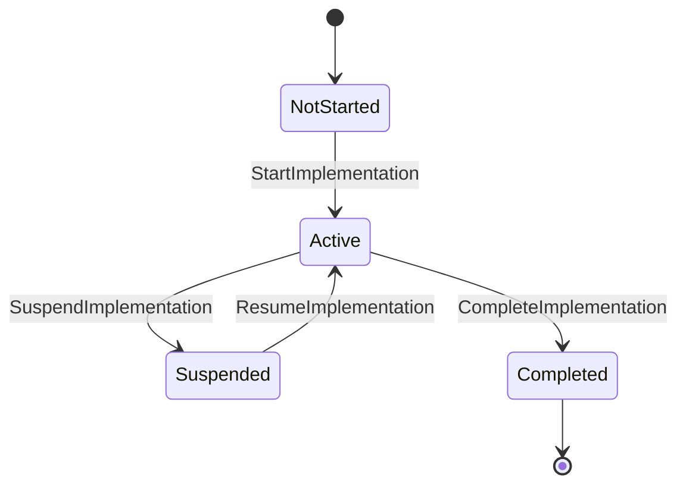
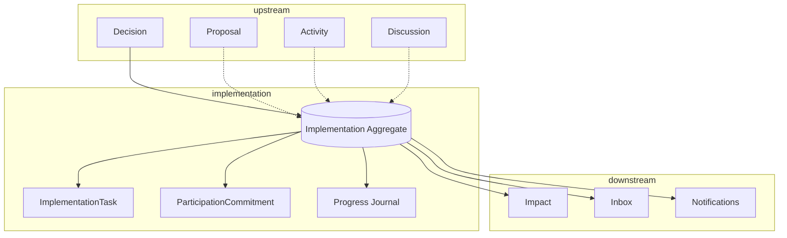
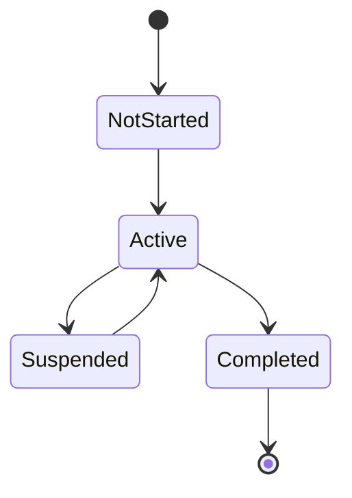
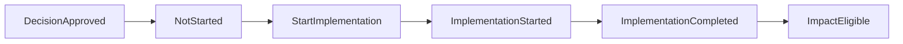

# Humanity Union Implementation Tracking Specification

## Version 2.0

### Canonical MVP Implementation Specification for the Implementation Tracking Module

---

# Document Status

| Field | Value |
|-------|-------|
| **Document Type** | Canonical implementation specification |
| **Status** | Approved for MVP implementation |
| **Architectural Layer** | Application Implementation Specification |
| **Bounded Context** | Implementation |
| **Primary Aggregate** | Implementation |
| **Architectural Authority** | Platform Blueprint v2.0 |
| **Implementation Authority** | Engineering Standards v2.0 |
| **Scope** | Implementation aggregate, execution tracking, Activity integration, Decision integration, CQRS behavior, Impact handoff |
| **Non-Scope** | Project management systems, institutional governance, AI execution authority, Kanban/Scrum workflows |

---

# Architectural Authority

This specification defines the canonical implementation of the Implementation Tracking Module.

Every implementation SHALL conform to:

- Platform Blueprint v2.0;
- Engineering Standards v2.0;
- Domain Model;
- Domain Boundaries;
- Canonical Event Catalogue;
- Decision Implementation Specification;
- Activity Implementation Specification.

Implementation Tracking SHALL NOT redefine governance authority established by the Decision bounded context.

---

# Normative References

This specification SHALL be interpreted together with:

- Platform Blueprint
- Engineering Standards
- Domain Model
- Domain Boundaries
- Decision Implementation Specification
- Activity Implementation Specification
- Member Journey Specification
- Decision Lifecycle Architecture
- Canonical Event Catalogue
- ADR-002
- ADR-005

---

# Repository Position

Implementation Tracking provides the platform's canonical civic execution record.

It owns:

- execution lifecycle;
- implementation progress;
- participation commitments;
- implementation milestones;
- execution evidence.

It SHALL coordinate with:

- Decision;
- Proposal;
- Discussion;
- Activity;
- Impact;

without assuming ownership of their aggregates.

---

# Scope

This specification defines:

- Implementation aggregate behavior;
- execution lifecycle;
- implementation tracking;
- participation commitments;
- progress recording;
- CQRS implementation;
- command routing;
- projection architecture;
- navigation behavior;
- implementation guidance.

---

# Non-Scope

This specification SHALL NOT define:

- governance decisions;
- Proposal authoring;
- institutional governance;
- project management systems;
- Kanban;
- Scrum;
- issue tracking;
- AI execution.

Those capabilities remain governed by their own specifications.

---

# Architectural Principles

The Implementation Module SHALL be implemented according to the following principles.

### Governance Before Execution

Execution SHALL exist only after an approved Decision.

---

### Human Execution Authority

Only authorized human Members SHALL issue execution lifecycle commands.

AI SHALL NEVER control execution authority.

---

### Aggregate Ownership

Implementation owns:

- execution lifecycle;
- execution status;
- ImplementationTask;
- ParticipationCommitment;
- progress journal.

Implementation SHALL NOT own:

- Decision;
- Proposal;
- Discussion;
- Activity;
- Impact.

---

### Immutable Civic Record

Implementation history SHALL remain append-only.

Execution history SHALL remain permanently traceable.

---

### CQRS Separation

Commands SHALL modify Implementation aggregates.

Queries SHALL consume projections.

Implementation presentation SHALL remain projection-driven.

---

### Event-Driven Synchronization

Neighbouring bounded contexts SHALL synchronize exclusively through approved Catalogue Events.

Cross-context aggregate mutation SHALL NEVER occur.

---

# Section 1 — Purpose

## Why Implementation Tracking Exists

Decision authorizes civic execution.

Implementation Tracking records civic execution.

Every Implementation SHALL represent the authoritative execution record for one approved Decision.

Implementation SHALL provide:

- execution visibility;
- civic accountability;
- public progress;
- implementation milestones;
- participation commitments;
- Impact eligibility.

Implementation SHALL remain the canonical execution authority.

---

## Civic Purpose

Implementation fulfills the following civic objectives.

| Objective | Implementation Responsibility |
|-----------|-------------------------------|
| Civic execution | Execution tracking |
| Public accountability | Progress transparency |
| Participation | Commitments |
| Delivery visibility | Execution lifecycle |
| Impact readiness | ImplementationCompleted |

Implementation SHALL remain the execution record throughout its lifecycle.

---

## Position Within the Civic Lifecycle

```text
Activity

        │

        ▼

Discussion

        │

        ▼

Proposal

        │

        ▼

Decision

        │

        ▼

Implementation

        │

        ▼

Impact
```

Implementation represents the civic execution stage.

Impact SHALL remain an independent bounded context.

---

## Relationship to Decision

Decision and Implementation perform distinct responsibilities.

| Decision | Implementation |
|----------|----------------|
| Governance authority | Civic execution |
| Decision aggregate | Implementation aggregate |
| Owns governance outcome | Owns execution progress |

Implementation SHALL always reference DecisionId.

Decision SHALL remain the only governance authority.

Implementation SHALL NEVER alter Decision outcomes.

---

## Relationship to Activity

Activity remains the civic trace anchor.

Implementation SHALL always reference ActivityId.

Activity SHALL coordinate navigation and civic continuity.

Implementation SHALL NEVER own Activity lifecycle.

---

## Relationship to Proposal

Proposal remains the civic origin.

Implementation SHALL reference ProposalId.

Implementation SHALL NEVER mutate Proposal content.

---

## Relationship to Discussion

Discussion remains the owner of deliberation and Evidence.

Implementation SHALL reference Evidence only.

Implementation SHALL NEVER own Discussion.

---

## Relationship to Impact

Impact SHALL consume completed Implementation.

Implementation SHALL NEVER publish Impact events.

Impact SHALL remain responsible for outcome assessment.

---

# Section 2 — Implementation Responsibilities

The Implementation Module SHALL perform the following responsibilities.

| Responsibility | Module Role |
|----------------|-------------|
| Implementation lifecycle | Aggregate |
| Execution progress | Aggregate |
| Participation commitments | Aggregate |
| Milestones | Aggregate |
| Progress journal | Aggregate |
| Public execution visibility | Projections |
| Activity synchronization | Projections |
| Workspace synchronization | Projections |
| Impact eligibility | `ImplementationCompleted` |

Implementation SHALL remain the only publisher of Implementation Catalogue Events.

---

## Responsibilities Explicitly Excluded

Implementation SHALL NOT perform:

- governance decisions;
- Proposal editing;
- Discussion moderation;
- Evidence ownership;
- project management;
- Kanban boards;
- Scrum workflows;
- AI execution.

---

# Section 3 — Domain Ownership and Boundaries

## Bounded Context Relationships

| Bounded Context | Relationship |
|-----------------|--------------|
| Decision | Governance authority |
| Activity | Civic trace |
| Proposal | Civic origin |
| Discussion | Evidence source |
| Implementation | Civic execution |
| Impact | Consequence assessment |
| Workspace | Projection consumer |
| Notification | Projection consumer |

Implementation SHALL never assume ownership of neighboring aggregates.

---

## Aggregate Ownership

| Aggregate | Responsibility |
|------------|----------------|
| Implementation | Civic execution tracking |

Implementation owns:

- execution lifecycle;
- execution status;
- ImplementationTask;
- ParticipationCommitment.

---

## External References

Implementation SHALL reference:

- DecisionId;
- ProposalId;
- ActivityId;
- ProposalRevisionNumber.

These SHALL remain references only.

---

## Consumed Catalogue Events

| Event | Purpose |
|-------|---------|
| `DecisionApproved` | Enable execution |

---

## Published Catalogue Events

| Event | Purpose |
|-------|---------|
| `ImplementationStarted` | Execution begins |
| `ImplementationSuspended` | Execution paused |
| `ImplementationCompleted` | Execution finished |

No additional Implementation Catalogue Events SHALL be introduced.

---

## Boundary Principles

The following architectural rules SHALL remain permanent.

- Implementation references Decision.
- Implementation never owns Decision.
- Implementation never owns Proposal.
- Implementation never owns Discussion.
- Implementation never owns Activity.
- Implementation never owns Impact.
- Decision never publishes Implementation events.
- Impact SHALL consume `ImplementationCompleted`.
- Execution synchronization SHALL occur through Catalogue Events only.

---

# Section 4 — Implementation Aggregate Lifecycle

The Implementation lifecycle consists of two complementary layers.

- Aggregate lifecycle.
- Presentation lifecycle.

Aggregate state SHALL remain authoritative.

Presentation SHALL consume projections only.

---

## Aggregate Lifecycle



---

## Aggregate States

| State | Purpose | Entry | Exit | Published Event |
|-------|---------|-------|------|-----------------|
| NotStarted | Awaiting execution | DecisionApproved | StartImplementation | — |
| Active | Execution | StartImplementation | Suspend / Complete | `ImplementationStarted` |
| Suspended | Execution paused | SuspendImplementation | Resume | `ImplementationSuspended` |
| Completed | Execution finished | CompleteImplementation | Terminal | `ImplementationCompleted` |

No `ImplementationUpdated`, `ImplementationResumed`, or automatic start Catalogue Events SHALL exist.

---

## Presentation States

| Presentation Label | Aggregate State |
|--------------------|-----------------|
| Awaiting Start | NotStarted |
| In Progress | Active |
| Suspended | Suspended |
| Completed | Completed |
| Impact Eligible | Completed |

Presentation SHALL remain projection-driven.

---

## Aggregate Invariants

The following invariants SHALL remain permanently true.

1. Implementation SHALL exist only after Decision approval.
2. Execution SHALL never start automatically.
3. Only authorized human Members SHALL execute lifecycle commands.
4. AI SHALL NEVER control execution.
5. Completed Implementation SHALL remain terminal.
6. One active Implementation SHALL exist per Decision by default.
7. Lifecycle commands SHALL remain idempotent.
8. Only Implementation SHALL publish Implementation Catalogue Events.
9. Every Implementation SHALL reference DecisionId and ActivityId.
10. Tasks and ParticipationCommitments SHALL remain aggregate-owned.
11. Progress history SHALL remain append-only.
12. Authentication alone SHALL never grant execution authority.

# Section 5 — Implementation Components

The Implementation Stage Panel SHALL provide the canonical execution interface within the Activity Thread.

Every component SHALL declare:

- purpose;
- inputs;
- outputs;
- dependencies;
- permissions;
- aggregate ownership;
- read model;
- Catalogue Event relationship.

Presentation SHALL remain projection-driven.

---

## Component 1 — Implementation Panel Shell

### Purpose

Provides the root container for Implementation presentation.

### Inputs

- ActivityId
- DecisionId
- ImplementationId
- Member session

### Outputs

- Implementation panel
- lifecycle slots
- child components

### Dependencies

- `DecisionApproved`
- Implementation eligibility
- Implementation aggregate

### Aggregate

Implementation

### Read Model

- `ImplementationPanelProjection`

### Catalogue Events

Consumes:

- `DecisionApproved`
- `ImplementationStarted`
- `ImplementationSuspended`
- `ImplementationCompleted`

### Empty State

Before implementation starts the panel SHALL display:

- implementation eligibility;
- StartImplementation availability;
- no execution history.

---

## Component 2 — Implementation Header

### Purpose

Displays canonical execution identity.

### Outputs

- ImplementationId
- lifecycle status
- Decision reference
- timestamps

### Aggregate

Implementation

### Read Model

- `ImplementationDetailProjection`

### Catalogue Events

Consumes:

- `ImplementationStarted`
- `ImplementationSuspended`
- `ImplementationCompleted`

---

## Component 3 — Decision Reference

### Purpose

Displays the governing Decision.

### Outputs

- Decision outcome
- rationale summary
- Decision link

### Aggregate

Decision (read-only)

### Read Model

- Decision detail subset

### Boundary Rule

Implementation SHALL NEVER mutate Decision.

---

## Component 4 — Proposal Reference

### Purpose

Provides civic traceability.

### Outputs

- Proposal title
- Proposal summary
- Proposal revision
- Proposal link

### Aggregate

Proposal (read-only)

### Read Model

Proposal detail subset.

Implementation SHALL NEVER modify Proposal.

---

## Component 5 — Activity Context

### Purpose

Preserves Activity-centered navigation.

### Outputs

- Activity header
- Activity navigation
- Activity identity

### Aggregate

Activity (read-only)

### Read Model

Activity detail subset.

---

## Component 6 — Execution Status Display

### Purpose

Displays authoritative execution lifecycle.

### Outputs

- Awaiting Start
- In Progress
- Suspended
- Completed

### Aggregate

Implementation

### Read Model

- `ImplementationStatusProjection`

### Catalogue Events

Consumes:

- `ImplementationStarted`
- `ImplementationSuspended`
- `ImplementationCompleted`

Execution status SHALL remain projection-derived.

---

## Component 7 — Milestone and Task List

### Purpose

Displays aggregate-owned implementation work units.

### Aggregate

Implementation

### Entities

- `ImplementationTask`

### Commands

- `AssignImplementationTask`
- `UpdateImplementationTask`

### Read Model

- `ImplementationTaskListProjection`

### Architectural Rules

ImplementationTask SHALL remain:

- aggregate-owned;
- non-independent;
- non-Kanban;
- non-ticket.

No Catalogue Event SHALL be published.

---

## Component 8 — Progress Journal

### Purpose

Provides immutable execution accountability.

### Aggregate

Implementation

### Commands

- `RecordImplementationProgress`

### Read Model

- `ImplementationProgressProjection`

### Rules

Progress SHALL remain:

- append-only;
- chronological;
- immutable.

No Catalogue Event SHALL be published.

---

## Component 9 — Implementation Evidence

### Purpose

Associates execution evidence with Implementation.

### Aggregate

Implementation

### Dependencies

Discussion Evidence.

### Read Model

- `ImplementationEvidenceProjection`

### Commands

Aggregate-internal attachment command.

### Boundary Rules

Implementation SHALL reference Discussion Evidence.

Implementation SHALL NEVER republish Discussion events.

---

## Component 10 — Participation Commitments

### Purpose

Records civic participation.

### Aggregate

Implementation

### Entity

- `ParticipationCommitment`

### Commands

- `RecordParticipationCommitment`

### Read Model

- `ParticipationCommitmentProjection`

Participation SHALL remain aggregate-owned.

---

## Component 11 — Lifecycle Controls

### Purpose

Provides authorized execution commands.

### Aggregate

Implementation

### Commands

- `StartImplementation`
- `SuspendImplementation`
- `ResumeImplementation`
- `CompleteImplementation`

### Published Catalogue Events

- `ImplementationStarted`
- `ImplementationSuspended`
- `ImplementationCompleted`

Resume SHALL NOT publish a Catalogue Event.

---

### Visibility Rules

| Control | Aggregate State |
|----------|-----------------|
| Start | NotStarted |
| Suspend | Active |
| Resume | Suspended |
| Complete | Active or policy-defined Suspended |

---

### Lifecycle Principles

Lifecycle controls SHALL:

- validate authority;
- validate lifecycle;
- validate Decision approval;
- remain idempotent;
- preserve audit history.

---

## Component 12 — Completion Summary

### Purpose

Displays immutable execution completion.

### Aggregate

Implementation

### Read Model

- `ImplementationCompletionProjection`

### Catalogue Events

Consumes:

- `ImplementationCompleted`

Completion SHALL remain read-only.

---

## Component 13 — Impact Eligibility Indicator

### Purpose

Represents the boundary between Implementation and Impact.

### Aggregate

Implementation

### Read Model

- `ImpactEligibilityProjection`

### Catalogue Events

Consumes:

- `ImplementationCompleted`

### Boundary Rule

Implementation SHALL NOT publish Impact events.

---

## Component Architecture Principles

All Implementation components SHALL satisfy:

### Activity Continuity

Activity SHALL remain the navigation anchor.

---

### Aggregate Ownership

Only the Implementation aggregate SHALL own execution state.

---

### Projection Presentation

Presentation SHALL consume projections only.

---

### Authorization Awareness

Every mutation control SHALL validate permissions.

---

### Immutable Accountability

Execution history SHALL remain append-only.

---

### Context Isolation

Components SHALL NOT mutate neighboring bounded contexts.

---

## Component Matrix

| Component | Aggregate | Read Model | MVP Phase |
|------------|-----------|------------|-----------|
| Implementation Panel Shell | Implementation | Panel | Phase 7 |
| Header | Implementation | Detail | Phase 7 |
| Decision Reference | Decision | Detail | Phase 7 |
| Proposal Reference | Proposal | Detail | Phase 7 |
| Activity Context | Activity | Detail | Phase 7 |
| Execution Status | Implementation | Status | Phase 7 |
| Task List | Implementation | Task List | Phase 7 |
| Progress Journal | Implementation | Progress | Phase 7 |
| Evidence | Implementation | Evidence | Phase 7 |
| Participation | Implementation | Commitments | Phase 7 |
| Lifecycle Controls | Implementation | Eligibility | Phase 7 |
| Completion Summary | Implementation | Completion | Phase 7 |
| Impact Eligibility | Implementation | Eligibility | Phase 8 Interface |

---

# Section 6 — Progress Model

Implementation SHALL record civic execution progress.

It SHALL NOT become a project-management workflow.

---

## Progress Principles

### Civic Accountability

Progress SHALL document execution.

---

### Aggregate Ownership

Progress SHALL remain owned by the Implementation aggregate.

---

### Immutable History

Progress SHALL remain append-only.

---

### Milestone Visibility

Milestones SHALL provide public execution transparency.

---

### No PM Workflow

Implementation SHALL NOT become:

- Kanban;
- Scrum;
- Issue tracking;
- Ticket management.

---

## Milestones

Milestones SHALL represent governed execution checkpoints.

### Aggregate

Implementation

### Entity

ImplementationTask

### Lifecycle

Milestone status MAY change.

Milestone definition SHALL remain historically preserved.

### Catalogue Events

No Catalogue Event SHALL be published.

### Read Model

- `ImplementationTaskListProjection`

---

## Progress Records

Progress records SHALL describe:

- accomplishments;
- blockers;
- execution findings;
- implementation notes.

### Command

- `RecordImplementationProgress`

### Aggregate

Implementation

### Catalogue Events

None.

### History Rules

Progress records SHALL remain:

- append-only;
- immutable;
- auditable.

Corrections SHALL append new records rather than modifying history.

---

## Progress Invariants

The following SHALL remain true.

1. Progress SHALL belong to the Implementation aggregate.
2. Milestones SHALL remain aggregate-owned.
3. Progress SHALL never modify Decision.
4. Progress SHALL never modify Proposal.
5. Progress SHALL never modify Activity.
6. Progress SHALL never publish Catalogue Events.
7. Execution accountability SHALL remain permanently traceable.
8. Historical progress SHALL never be deleted.

# Section 6 — Evidence, Completion, and Execution Integrity

Implementation SHALL preserve execution accountability through immutable evidence, governed completion, and permanent civic traceability.

---

## Execution Evidence

Implementation SHALL distinguish execution evidence from deliberation evidence.

| Evidence Type | Owner | Architectural Rule |
|---------------|-------|--------------------|
| Discussion Evidence | Discussion | Referenced only |
| Implementation Execution Evidence | Implementation | Aggregate-owned |
| Cross-context mutation | Forbidden | Never permitted |

Implementation SHALL reference Discussion Evidence through identifiers only.

Implementation SHALL NEVER:

- modify Discussion Evidence;
- republish Discussion events;
- replace deliberation records.

---

## Completion

Completion SHALL represent governed execution completion.

| Property | Requirement |
|----------|-------------|
| Command | `CompleteImplementation` |
| Catalogue Event | `ImplementationCompleted` |
| Preconditions | Valid lifecycle; authorized actor |
| Aggregate Result | Completed |
| Payload | Completion summary; optional milestone confirmation |
| Downstream Effect | Impact eligibility |

Completion SHALL remain irreversible within the MVP lifecycle.

---

## Human Verification

Implementation completion SHALL require human verification.

### Verification Rules

Completion SHALL represent:

- governed completion;
- human confirmation;
- execution accountability.

Completion SHALL NOT represent:

- automated test success;
- AI confirmation;
- background process completion.

---

### Authorized Actor

Only authorized human Members SHALL complete Implementation.

AI SHALL NEVER complete Implementation.

---

### Completion Record

Completion SHALL preserve:

- completion summary;
- actor identity;
- authority reference;
- timestamps;
- audit correlation.

---

### Public Visibility

Completion summaries SHALL be visible according to Activity visibility policy.

Restricted metadata SHALL remain authorization-controlled.

---

## Immutable Records

The following information SHALL remain permanently immutable.

| Record | Reason |
|--------|--------|
| Approved Decision outcome | Governance authority |
| Decision rationale | Governance traceability |
| Authorized Proposal revision | Civic history |
| Discussion Evidence | Deliberation integrity |
| Implementation Catalogue Events | Event-store authority |
| Progress journal | Accountability |
| Activity history | Civic trace |

---

## Evidence Principles

Implementation evidence SHALL satisfy:

### Aggregate Ownership

Implementation owns execution evidence.

---

### Deliberation Independence

Discussion owns deliberation evidence.

---

### Append-Only History

Evidence SHALL remain append-only.

---

### Civic Accountability

Execution evidence SHALL remain permanently traceable.

---

### Cross-Context Isolation

Implementation SHALL NEVER mutate external evidence.

---

# Section 7 — Navigation

Implementation navigation SHALL preserve the canonical civic workflow.

---

## Canonical Civic Sequence

```text
Workspace

        │

        ▼

Activity

        │

        ▼

Discussion

        │

        ▼

Proposal

        │

        ▼

Decision

        │

        ▼

Implementation

        │

        ▼

Impact
```

Implementation SHALL never bypass any preceding governance stage.

---

## Navigation Principles

### Activity Continuity

Activity SHALL remain the navigation anchor.

---

### Governance Continuity

Implementation SHALL always reference an approved Decision.

---

### Context Preservation

Every navigation path SHALL preserve ActivityId.

---

### Projection Continuity

Presentation SHALL remain projection-driven.

---

## Entry Points

| Entry | Destination |
|--------|-------------|
| Workspace My Work | Activity Thread |
| Workspace Inbox | Activity Thread |
| Decision Panel | Implementation Panel |

Every entry SHALL preserve civic context.

---

## Exit Points

| Exit | Destination |
|------|-------------|
| Return | Activity |
| Return | Workspace |
| Completed | Impact (Phase 8) |

Impact SHALL remain unavailable before completion.

---

## Forbidden Navigation

The following navigation paths SHALL NEVER be permitted.

| Forbidden Path | Architectural Violation |
|----------------|-------------------------|
| Workspace → Implementation directly | Breaks Activity traceability |
| Implementation without DecisionApproved | Violates governance sequence |
| Impact before completion | Violates Member Journey |
| Inbox mutating Implementation | Projection ownership violation |

---

## Navigation Permissions

| Capability | Authorized |
|------------|-----------|
| View public status | Public policy |
| View restricted execution | Authorized visibility |
| Start | `CanStartImplementation` |
| Suspend | `CanSuspendImplementation` |
| Resume | `CanResumeImplementation` |
| Complete | `CanCompleteImplementation` |
| Record progress | `CanRecordImplementationProgress` |
| Record participation | `CanRecordParticipationCommitment` |

Authorization SHALL remain server-side.

---

# Section 8 — CQRS

Implementation SHALL implement strict CQRS separation.

Commands SHALL mutate the Implementation aggregate.

Queries SHALL consume projections.

---

## CQRS Principles

### Aggregate Authority

Implementation owns execution state.

---

### Projection Authority

Read models SHALL remain derived state.

---

### Event Synchronization

Neighbouring bounded contexts SHALL synchronize through Catalogue Events.

---

### Eventual Consistency

Cross-context projections SHALL tolerate eventual consistency.

---

## Write Side

### Catalogue Commands

| Command | Aggregate | Published Catalogue Event |
|----------|-----------|---------------------------|
| `StartImplementation` | Implementation | `ImplementationStarted` |
| `SuspendImplementation` | Implementation | `ImplementationSuspended` |
| `CompleteImplementation` | Implementation | `ImplementationCompleted` |

---

### Aggregate-Internal Commands

| Command | Responsibility |
|----------|----------------|
| `ResumeImplementation` | Resume execution |
| `AssignImplementationTask` | Create task |
| `UpdateImplementationTask` | Update task |
| `RecordImplementationProgress` | Append progress |
| `RecordParticipationCommitment` | Participation |
| Evidence attachment | Append evidence |

No aggregate-internal command SHALL publish a Catalogue Event.

---

## Write-Side Rules

Commands SHALL:

- validate authority;
- validate lifecycle;
- validate Decision approval;
- remain idempotent;
- preserve audit history.

---

## Command Routing

```text
Implementation Panel

        │

        ▼

Application Layer

        │

        ▼

Implementation Context

        │

        ▼

Implementation Aggregate

        │

        ▼

Catalogue Event
```

Presentation SHALL NEVER execute business logic.

---

## Read Side

| Projection | Primary Source |
|------------|----------------|
| Implementation Detail | Aggregate |
| Implementation Status | Aggregate |
| Implementation Panel | Aggregate + Decision |
| Activity Implementation | Catalogue Events |
| Task List | Aggregate |
| Progress Journal | Aggregate |
| Participation | Aggregate |
| Evidence | Aggregate |
| Completion | `ImplementationCompleted` |
| Impact Eligibility | `ImplementationCompleted` |
| Workspace List | Catalogue Events |

---

## Projection Principles

Every Implementation projection SHALL remain:

- replayable;
- disposable;
- derived;
- read-only.

---

## Progress Projection Rules

Progress SHALL derive from:

- aggregate snapshots;
- aggregate-owned entities;
- lifecycle Catalogue Events.

Progress SHALL NOT require independent domain events.

---

## Inbox Projection

Inbox SHALL remain a derived work queue.

Inbox SHALL:

- consume Implementation events;
- remain non-authoritative;
- never publish domain events.

---

## Notifications

Notifications SHALL remain an alert channel.

They SHALL notify users about:

- ImplementationStarted;
- ImplementationSuspended;
- ImplementationCompleted;
- policy-defined milestones.

Notifications SHALL NOT determine execution state.

---

## Cache Principles

Caching SHALL:

- invalidate after Implementation events;
- invalidate after aggregate-internal writes;
- preserve read-your-writes;
- never replace aggregate authority.

---

## CQRS Invariants

1. Implementation aggregate owns execution state.
2. Read models remain derived.
3. Commands never modify projections.
4. Queries never mutate aggregates.
5. Catalogue Events remain authoritative synchronization.
6. Aggregate-internal commands publish no Catalogue Events.
7. Replay SHALL rebuild projections.

---

# Section 9 — Architectural Mapping

Implementation SHALL preserve explicit relationships with neighboring bounded contexts.

---

## Bounded Context Relationships

| Context | Responsibility |
|----------|---------------|
| Decision | Governance authority |
| Implementation | Civic execution |
| Impact | Consequence assessment |
| Activity | Civic trace |
| Workspace | Projection |
| Notification | Alerts |
| Discussion | Evidence |
| Proposal | Civic origin |

Implementation SHALL own execution only.

---

## Aggregate Relationships

| Aggregate | Ownership |
|------------|-----------|
| Implementation | Owned |
| Decision | Referenced |
| Activity | Referenced |
| Impact | Separate bounded context |

---

## Catalogue Events

| Event | Publisher |
|--------|-----------|
| `ImplementationStarted` | Implementation |
| `ImplementationSuspended` | Implementation |
| `ImplementationCompleted` | Implementation |
| `ImpactRecorded` | Impact |

Implementation SHALL publish only Implementation Catalogue Events.

---

## ADR Alignment

Implementation SHALL comply with:

- ADR-002;
- ADR-005;
- ADR-006;
- ADR-007.

---

## Engineering Traceability

Implementation SHALL remain traceable to:

- Domain Model;
- API Architecture;
- Database Strategy;
- Event Architecture;
- Permission Model;
- Application Workflows;
- Canonical Event Catalogue.

---

## Integration Traceability

Implementation SHALL integrate with:

- Activity Blueprint;
- Architecture Review;
- Decision Specification;
- Activity Specification;
- MVP Phase 7.

---

## Publisher and Consumer Matrix

| Catalogue Event | Publisher | Primary Consumers |
|-----------------|-----------|-------------------|
| `DecisionApproved` | Decision | Implementation |
| `ImplementationStarted` | Implementation | Activity, Workspace, Inbox, Notification |
| `ImplementationSuspended` | Implementation | Activity, Notification |
| `ImplementationCompleted` | Implementation | Activity, Impact, Workspace, Inbox, Notification |
| `ImpactRecorded` | Impact | Activity, Search, Memory |

---

## Boundary Principles

The following SHALL remain permanently true.

### Governance Authority

Decision owns governance.

---

### Execution Authority

Implementation owns execution.

---

### Impact Authority

Impact owns assessment.

---

### Projection Isolation

Workspace and Inbox remain projections.

---

### Event Ownership

Every Catalogue Event SHALL have exactly one publisher.

---

### Aggregate Isolation

Cross-context aggregate mutation SHALL NEVER occur.

# Section 10 — Validation

The Implementation Module SHALL satisfy every validation requirement before production deployment.

Validation SHALL verify:

- aggregate ownership;
- execution authority;
- bounded-context isolation;
- CQRS compliance;
- Catalogue Event integrity;
- Activity continuity;
- civic accountability.

---

## Validation Matrix

| # | Validation Requirement | Pass Criterion |
|---|------------------------|----------------|
| **V1** | Implementation never owns Decision | Decision remains sole publisher of Decision events; Implementation stores DecisionId reference only |
| **V2** | Decision remains governance authority | Implementation cannot modify Decision outcome or rationale |
| **V3** | Proposal remains immutable | ProposalId is read-only; no Proposal command originates from Implementation |
| **V4** | Evidence integrity preserved | Discussion Evidence referenced only; Implementation evidence append-only |
| **V5** | Impact remains independent | `ImplementationCompleted` enables Impact; Impact owns `ImpactRecorded` |
| **V6** | Inbox remains projection-only | Inbox never publishes domain events |
| **V7** | Notifications remain alert-only | Notifications never determine execution state |
| **V8** | No automatic execution | `DecisionApproved` never starts Implementation automatically |
| **V9** | Catalogue Event compliance | Only canonical Implementation events are published |
| **V10** | No PM workflow | No Kanban, Scrum, tickets, or issue tracking |
| **V11** | Activity trace preserved | ActivityId required for navigation |
| **V12** | Human execution authority | Lifecycle commands require authorized human Member |
| **V13** | Aggregate ownership preserved | Tasks and commitments remain aggregate-owned |
| **V14** | Completed remains terminal | No transition back to Active |
| **V15** | Reference scenarios supported | SCENARIO 035–039 pass |

---

## Validation Principles

Validation SHALL confirm:

### Aggregate Integrity

Implementation owns execution only.

---

### Execution Authority

Execution SHALL require authorized human Members.

---

### Traceability

DecisionId, ProposalId, and ActivityId SHALL remain permanently traceable.

---

### CQRS Integrity

Write-side and read-side SHALL remain separated.

---

### Event Integrity

Only canonical Catalogue Events SHALL synchronize neighboring contexts.

---

## Validation Scenarios

| Scenario | Verification |
|----------|--------------|
| **SCENARIO 035** | Manual execution start after approved Decision |
| **SCENARIO 036** | Delayed execution preserves accountability |
| **SCENARIO 039** | Suspension and resume preserve lifecycle correctness |

---

# Section 11 — Testing Strategy

Implementation SHALL be validated through unit, application, integration, contract, projection, security, and end-to-end testing.

---

## Unit Tests

Unit tests SHALL verify:

- aggregate lifecycle;
- invariants I1–I12;
- lifecycle authorization;
- idempotency;
- task persistence;
- progress persistence;
- commitment persistence;
- mandatory references;
- terminal-state protection.

---

## Application Tests

Application tests SHALL verify:

- command routing;
- authorization policies;
- aggregate loading;
- optimistic concurrency;
- audit construction;
- command deduplication;
- outbox publication.

---

## Integration Tests

Integration tests SHALL verify:

1. `DecisionApproved` enables Implementation.
2. No automatic execution occurs.
3. `StartImplementation` publishes exactly one `ImplementationStarted`.
4. `SuspendImplementation` publishes exactly one `ImplementationSuspended`.
5. `CompleteImplementation` publishes exactly one `ImplementationCompleted`.
6. Activity projections update.
7. Workspace projections update.
8. Inbox updates correctly.
9. Notifications remain independent.
10. Impact eligibility derives only from `ImplementationCompleted`.

---

## Contract Tests

Contract tests SHALL verify:

- `ImplementationStarted`
- `ImplementationSuspended`
- `ImplementationCompleted`

Each contract SHALL validate:

- identifiers;
- Decision linkage;
- Activity linkage;
- Proposal linkage;
- actor identity;
- correlation metadata;
- event-version compatibility.

---

## Projection Tests

Projection tests SHALL verify:

- replay;
- rebuild;
- duplicate event handling;
- delayed synchronization;
- Activity projections;
- Workspace projections;
- Inbox projections;
- Notification projections.

---

## Failure Tests

Failure testing SHALL include:

- duplicate commands;
- duplicate events;
- unauthorized lifecycle commands;
- stale Decision linkage;
- projection lag;
- notification failure;
- consumer restart;
- outbox retry;
- audit persistence failure.

---

## Security Tests

Security SHALL verify:

- server-side authorization;
- restricted visibility;
- AI rejection;
- lifecycle permission boundaries;
- aggregate isolation;
- Decision protection.

---

## End-to-End Tests

### Happy Path

```text
Activity
    → Proposal
    → Decision Approved
    → Start Implementation
    → Progress
    → Complete
    → Impact Eligible
```

---

### Delayed Execution

```text
Start
    → Progress
    → Delay
    → Continue
    → Complete
```

---

### Suspension Journey

```text
Start
    → Suspend
    → Resume
    → Complete
```

---

### Navigation Journey

```text
Workspace
    → Inbox
    → Activity
    → Implementation Panel
```

---

### Forbidden Journey

```text
Attempt Implementation

without

DecisionApproved

↓

Rejected
```

---

### Governance Journey

```text
Approved Decision

↓

Implementation

↓

Impact Eligibility
```

---

# Canonical Architectural Diagrams

The following diagrams constitute the authoritative engineering representation of the Implementation Module.

Technology MAY vary.

Architecture SHALL remain unchanged.

---

## Diagram 1 — Implementation Structure



### Diagram Rules

Implementation SHALL own:

- execution lifecycle;
- tasks;
- commitments;
- progress.

All neighboring contexts SHALL remain external.

---

## Diagram 2 — Aggregate Lifecycle



### Lifecycle Rules

Implementation SHALL remain terminal after completion.

Resume SHALL remain aggregate-internal.

---

## Diagram 3 — Decision to Implementation



Decision approval SHALL NEVER auto-start execution.

---

## Diagram 4 — Progress Flow

```mermaid
flowchart TD

ImplementationStarted

-->

Task Assignment

-->

Progress Journal

-->

Milestones

-->

ImplementationCompleted
```

Progress SHALL remain aggregate-owned.

---

## Diagram 5 — CQRS

```mermaid
flowchart LR

Commands

-->

Implementation Aggregate

-->

Catalogue Events

-->

Projection Handlers

-->

Read Models
```

Commands SHALL mutate aggregates.

Queries SHALL consume projections.

---

# Appendix A — Capability Matrix

| Capability | Owner | Phase |
|------------|-------|-------|
| Execution lifecycle | Implementation | Phase 7 |
| Tasks | Implementation | Phase 7 |
| Progress | Implementation | Phase 7 |
| Commitments | Implementation | Phase 7 |
| Evidence | Implementation | Phase 7 |
| Activity Panel | Activity Projection | Phase 7 |
| Inbox | Projection | Phase 7 |
| Notifications | Projection | Phase 7 |
| Impact | Impact | Phase 8 |

---

# Appendix B — Lifecycle Matrix

| Aggregate State | Published Event |
|-----------------|-----------------|
| NotStarted | — |
| Active | `ImplementationStarted` |
| Suspended | `ImplementationSuspended` |
| Completed | `ImplementationCompleted` |

---

# Appendix C — Permission Matrix

The canonical authorization rules SHALL remain server-side.

Lifecycle authority SHALL require explicit authorization.

Participation authority SHALL remain policy-driven.

Guests SHALL never issue lifecycle commands.

AI SHALL never issue lifecycle commands.

---

## Appendix Principles

Every appendix SHALL remain consistent with:

- Platform Blueprint;
- Engineering Standards;
- Decision Specification;
- Activity Specification;
- Canonical Event Catalogue.

Changes to appendices SHALL NOT introduce architectural behavior inconsistent with the normative sections of this specification.

# Appendix D — Catalogue Event Matrix

The following matrix defines the canonical event publication and consumption relationships for the Implementation Module.

| Catalogue Event | Publisher | Activity | Stage Projection | Inbox | Search | Notification |
|-----------------|-----------|----------|------------------|--------|--------|--------------|
| `DecisionApproved` | Decision | ✓ | ✓ | ✓ | Optional | ✓ |
| `ImplementationStarted` | Implementation | ✓ | ✓ | ✓ | Optional | ✓ |
| `ImplementationSuspended` | Implementation | ✓ | ✓ | Optional | — | Optional |
| `ImplementationCompleted` | Implementation | ✓ | ✓ | ✓ | Optional | ✓ |
| `ImpactRecorded` | ImpactAssessment | ✓ | ✓ | ✓ | Optional | ✓ |

---

## Event Matrix Principles

The following SHALL remain permanently true.

1. Every Catalogue Event SHALL have exactly one publisher.
2. Decision SHALL remain the sole publisher of `DecisionApproved`.
3. Implementation SHALL remain the sole publisher of Implementation lifecycle events.
4. Impact SHALL remain the sole publisher of `ImpactRecorded`.
5. Consumers SHALL remain independent.
6. Consumers SHALL synchronize through Catalogue Events only.
7. Cross-context aggregate mutation SHALL NEVER occur.

---

# Appendix E — Projection Matrix

The following projections SHALL remain derived and rebuildable.

| Projection | Primary Trigger |
|------------|-----------------|
| `ImplementationDetailProjection` | All Implementation Catalogue Events |
| `ImplementationStatusProjection` | All Implementation Catalogue Events |
| `ActivityImplementationProjection` | Implementation Catalogue Events |
| `ImplementationPanelProjection` | `DecisionApproved` + Implementation Catalogue Events |
| `ImplementationTaskListProjection` | Aggregate-internal task writes |
| `ImplementationProgressProjection` | Aggregate-internal progress writes |
| `ParticipationCommitmentProjection` | Aggregate-internal commitment writes |
| `WorkspaceImplementationListProjection` | Implementation Catalogue Events |
| Inbox Projection | `ImplementationStarted`, `ImplementationCompleted`, policy milestones |
| Notification Projection | Lifecycle events and policy-defined milestones |

---

## Projection Principles

Every projection SHALL remain:

- derived;
- replayable;
- disposable;
- read-only.

Projection state SHALL NEVER replace aggregate authority.

---

# Appendix F — Testing Matrix

| Capability | Unit | Application | Integration | Contract | End-to-End |
|-------------|------|-------------|-------------|----------|-----------|
| Aggregate lifecycle | ✓ | ✓ | ✓ | — | ✓ |
| Authorization | ✓ | ✓ | ✓ | — | ✓ |
| Event publication | ✓ | ✓ | ✓ | ✓ | ✓ |
| Decision integration | — | ✓ | ✓ | ✓ | ✓ |
| Projection replay | — | — | ✓ | — | ✓ |
| Navigation | — | — | — | — | ✓ |
| Progress persistence | ✓ | ✓ | ✓ | — | ✓ |
| Validation scenarios 035–039 | — | ✓ | ✓ | — | ✓ |

Every category SHALL pass before production deployment.

---

# Appendix G — Phase 7 Implementation Checklist

## Aggregate

- [ ] Implement Implementation aggregate.
- [ ] Implement aggregate-owned entities.
- [ ] Implement invariants I1–I12.

---

## Commands

- [ ] Implement `StartImplementation`.
- [ ] Implement `SuspendImplementation`.
- [ ] Implement `CompleteImplementation`.
- [ ] Implement `ResumeImplementation`.
- [ ] Implement aggregate-internal task commands.
- [ ] Implement progress commands.
- [ ] Implement participation commands.

---

## Integration

- [ ] Consume `DecisionApproved`.
- [ ] Publish three Implementation Catalogue Events.
- [ ] Preserve Decision ownership boundaries.

---

## CQRS

- [ ] Implement command handlers.
- [ ] Implement read projections.
- [ ] Implement replay capability.
- [ ] Implement Activity projections.
- [ ] Implement Workspace projections.

---

## Activity Integration

- [ ] Activity Implementation Stage Panel.
- [ ] ActivityImplementationProjection.
- [ ] Workspace lists.
- [ ] Inbox projections.
- [ ] Notification projections.

---

## Impact Interface

- [ ] Publish Implementation completion.
- [ ] Expose Impact eligibility.
- [ ] Do not implement Impact logic.

---

## Validation

- [ ] Pass V1–V15.
- [ ] Pass SCENARIO 035.
- [ ] Pass SCENARIO 036.
- [ ] Pass SCENARIO 039.

---

# Appendix H — Ready for Development Gates

Implementation SHALL be considered ready only after every gate below has been satisfied.

| Gate | Required Status |
|------|-----------------|
| Canonical Catalogue Event names confirmed | Complete |
| Aggregate lifecycle verified | Complete |
| Decision authority boundary preserved | Complete |
| No automatic execution | Complete |
| PM workflow exclusion verified | Complete |
| Authorization traceability verified | Complete |
| Decision integration verified | Complete |
| Decision ownership preserved | Complete |
| Proposal references verified | Complete |
| Evidence immutability verified | Complete |
| Impact handoff defined | Complete |
| Read projections complete | Complete |
| Inbox and Notifications separated | Complete |
| Activity trace preserved | Complete |
| Testing complete | Complete |
| MVP scope preserved | Complete |
| Open implementation questions documented | Complete |

---

## Development Readiness Principles

Implementation SHALL begin only when:

1. Decision authority is preserved.
2. Aggregate ownership is preserved.
3. Catalogue Event ownership is preserved.
4. Activity traceability is preserved.
5. CQRS separation is preserved.
6. Human authority is preserved.
7. Impact boundary remains independent.

---

# Appendix I — Open Implementation Questions

The following questions are implementation configuration decisions.

They SHALL NOT alter the approved architecture.

| ID | Question | Recommended Resolution | Blocker |
|----|----------|------------------------|---------|
| **OQ-1** | Implementation Lead assignment | Configure through Implementation Policy | No |
| **OQ-2** | Completion from Suspended | Policy decision; default Active only | No |
| **OQ-3** | Milestone notification thresholds | Policy configuration | No |

---

## Resolution Principles

### OQ-1

Implementation leadership SHALL remain policy-driven.

Leadership SHALL NEVER redefine governance authority.

---

### OQ-2

Completion SHALL follow approved lifecycle policy.

Policy SHALL remain server-side.

---

### OQ-3

Notification thresholds SHALL remain presentation policy.

Notification policy SHALL NEVER modify execution state.

---

# Section 12 — Final Engineering Assessment

## Implementation Module Summary

Implementation Tracking provides the canonical civic execution record.

It owns:

- execution lifecycle;
- implementation progress;
- participation commitments;
- implementation tasks;
- execution evidence.

It publishes exactly three canonical Catalogue Events:

- `ImplementationStarted`
- `ImplementationSuspended`
- `ImplementationCompleted`

It remains distinct from project management software.

---

## Architectural Fidelity Assessment

**Assessment: High**

The specification is fully aligned with:

- Platform Blueprint;
- Engineering Standards;
- Domain Model;
- Decision Specification;
- Activity Specification;
- Member Journey Stage 13;
- Canonical Event Catalogue;
- MVP Strategy Phase 7;
- Integration Blueprint;
- Architecture Review 01.

Implementation boundaries remain preserved.

---

## Decision Handoff Resolution

| Contract | Canonical Resolution |
|----------|----------------------|
| `DecisionApproved` | Creates Implementation eligibility only |
| `StartImplementation` | Separate authorized human command |
| Decision ownership | Decision remains governance authority |

Implementation SHALL NEVER assume governance authority.

---

## MVP Phase 7 Coverage

Phase 7 SHALL provide:

- Decision integration;
- execution lifecycle;
- aggregate-owned tasks;
- progress journal;
- participation commitments;
- Activity panel;
- Workspace integration;
- Inbox integration;
- Notifications;
- execution evidence;
- Impact eligibility.

The Phase 7 implementation scope is complete.

---

## Risk Register

| Risk | Required Control |
|------|------------------|
| Confusion with project-management software | UX validation and architectural review |
| Automatic execution | Integration testing |
| Resume transition visibility | Aggregate audit history |
| Projection lag | Projection replay and synchronization |
| Unauthorized execution | Server-side authorization |
| Cross-context mutation | Aggregate isolation |
| Evidence corruption | Append-only persistence |
| Activity desynchronization | Activity projection replay |

These risks SHALL remain implementation concerns only.

---

## Monitoring Requirements

Production monitoring SHOULD include:

- execution lifecycle transitions;
- authorization failures;
- projection synchronization latency;
- Inbox synchronization;
- notification delivery;
- Impact eligibility creation;
- replay failures;
- audit persistence.

Monitoring SHALL use correlation identifiers.

---

# Section 13 — Implementation Readiness Decision

## Status

**READY WITH NON-BLOCKING IMPLEMENTATION NOTES**

Implementation Tracking is ready for Phase 7 implementation.

The remaining questions concern configuration only.

No approved architectural boundary SHALL change.

---

# Final Verdict

## **GO**

### Engineering Rationale

The Implementation Tracking Specification is architecturally consistent with the approved Humanity Union platform.

It preserves:

- Decision as governance authority;
- Implementation as execution authority;
- Activity as civic trace;
- Impact as consequence assessment;
- aggregate ownership;
- CQRS separation;
- Catalogue Event ownership;
- Activity-centered navigation;
- immutable execution history.

It explicitly prevents:

- automatic execution;
- project-management workflows;
- AI execution authority;
- Decision mutation;
- Proposal mutation;
- Discussion mutation;
- cross-context writes;
- projection-owned workflow state.

Implementation SHALL remain the authoritative civic execution record.

---

# Authorization for Implementation

Phase 7 implementation MAY proceed.

Implementation teams SHALL:

1. preserve all bounded-context boundaries;
2. preserve aggregate ownership;
3. preserve Activity-centered navigation;
4. preserve human execution authority;
5. preserve immutable execution history;
6. publish only canonical Catalogue Events;
7. resolve OQ-1 through OQ-3 through configuration only.

---

# Appendix J — Canonical Implementation Principles

The following principles constitute the permanent architectural foundation of the Implementation Module.

1. Every Implementation originates from an approved Decision.
2. Decision authorizes; Implementation executes.
3. Implementation owns execution only.
4. Implementation never owns governance.
5. Implementation never owns Proposal.
6. Implementation never owns Discussion.
7. Implementation never owns Activity.
8. Implementation never owns Impact.
9. Only authorized human Members execute lifecycle commands.
10. AI never executes Implementation.
11. Execution history remains immutable.
12. Tasks remain aggregate-owned.
13. Progress remains append-only.
14. Evidence remains append-only.
15. CQRS separation remains mandatory.
16. Catalogue Event ownership remains unique.
17. Activity remains the navigation anchor.
18. Inbox remains a projection.
19. Notifications remain an alert channel.
20. `ImplementationCompleted` enables Impact.
21. Impact remains a separate bounded context.
22. Cross-context aggregate mutation is prohibited.
23. Aggregate ownership remains permanent.
24. Platform Blueprint compliance remains mandatory.

---

*Humanity Union Implementation Tracking Specification v2.0 — canonical implementation specification for the Implementation bounded context. Compatible with the Platform Blueprint, Engineering Standards, Domain Model, Activity, Discussion, Proposal, Decision, Impact, Member Journey, Integration Architecture, Canonical Event Catalogue, and Implementation Architecture Review 01.*