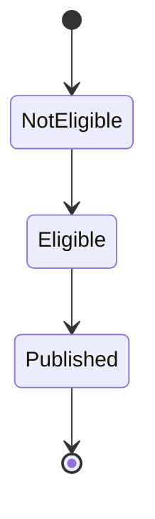
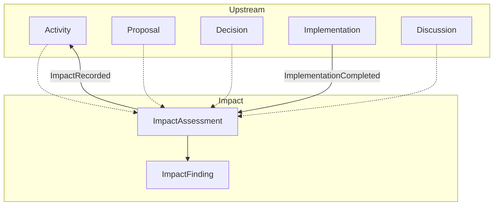
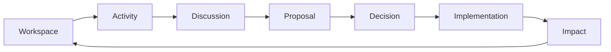
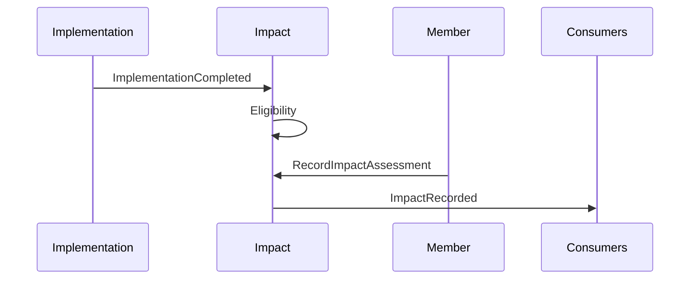
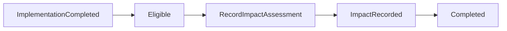
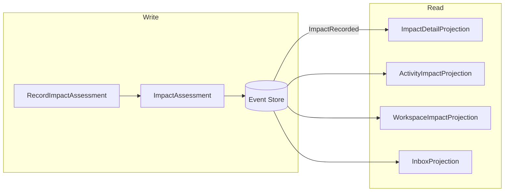
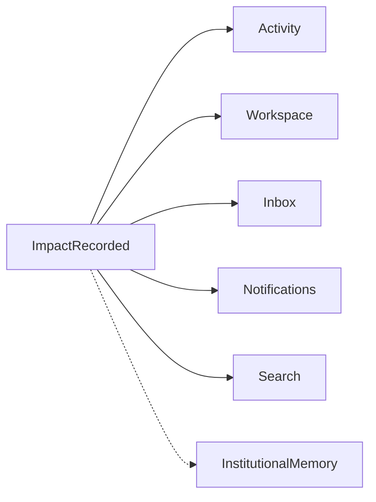
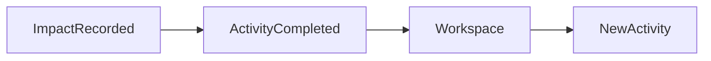
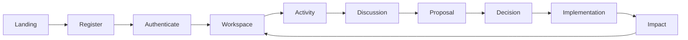
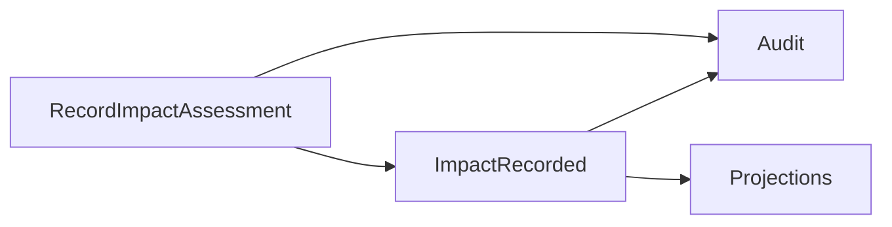

# Humanity Union Impact Specification

## Version 2.0

### Canonical MVP Implementation Specification for the Impact Module

---

# Document Status

| Field | Value |
|-------|-------|
| **Document Type** | Canonical implementation specification |
| **Status** | Approved for MVP implementation |
| **Architectural Layer** | Application Implementation Specification |
| **Bounded Context** | Implementation |
| **Primary Aggregate** | ImpactAssessment |
| **Architectural Authority** | Platform Blueprint v2.0 |
| **Implementation Authority** | Engineering Standards v2.0 |
| **Scope** | ImpactAssessment aggregate, civic outcome recording, Activity integration, Workspace integration, CQRS behavior, lifecycle completion |
| **Non-Scope** | Analytics platforms, predictive scoring, AI judgment, institutional reporting, reputation systems, automatic Activity creation |

---

# Architectural Authority

This specification defines the canonical implementation of the Impact Module.

Every implementation SHALL conform to:

- Platform Blueprint v2.0;
- Engineering Standards v2.0;
- Domain Model;
- Domain Boundaries;
- Canonical Event Catalogue;
- Implementation Tracking Specification;
- Activity Specification.

Impact SHALL remain the final civic lifecycle aggregate.

---

# Normative References

This specification SHALL be interpreted together with:

- Platform Blueprint
- Engineering Standards
- Domain Model
- Domain Boundaries
- Activity Specification
- Implementation Tracking Specification
- Workspace Specification
- Member Journey
- Decision Lifecycle Architecture
- Canonical Event Catalogue
- ADR-002
- ADR-005
- ADR-006

---

# Repository Position

ImpactAssessment represents the canonical civic outcome record.

It owns:

- impact assessment;
- impact findings;
- assessment narrative;
- outcome evidence;
- assessment metadata.

It SHALL coordinate with:

- Activity;
- Discussion;
- Proposal;
- Decision;
- Implementation;

without assuming ownership of their aggregates.

---

# Scope

This specification defines:

- ImpactAssessment aggregate;
- civic outcome recording;
- assessment lifecycle;
- evidence references;
- CQRS behavior;
- command handling;
- projections;
- navigation;
- implementation guidance.

---

# Non-Scope

This specification SHALL NOT define:

- governance decisions;
- implementation execution;
- analytics platforms;
- predictive scoring;
- AI judgment;
- institutional reporting;
- automatic Activity generation.

Those capabilities remain governed by their own specifications.

---

# Architectural Principles

The Impact Module SHALL be implemented according to the following principles.

### Outcome After Execution

Impact SHALL exist only after completed Implementation.

---

### Human Assessment Authority

Only authorized human Members SHALL record Impact.

AI SHALL NEVER determine civic outcomes.

---

### Aggregate Ownership

ImpactAssessment owns:

- outcome statement;
- impact findings;
- assessment metadata;
- assessment scope;
- qualitative evidence.

ImpactAssessment SHALL NOT own:

- Activity;
- Discussion;
- Proposal;
- Decision;
- Implementation.

---

### Immutable Civic Record

Impact history SHALL remain append-only.

Assessment SHALL remain permanently traceable.

---

### CQRS Separation

Commands SHALL mutate ImpactAssessment.

Queries SHALL consume projections.

---

### Event-Driven Synchronization

Neighbouring bounded contexts SHALL synchronize exclusively through Catalogue Events.

Cross-context aggregate mutation SHALL NEVER occur.

---

# Section 1 — Purpose

## Why Impact Exists

Implementation records civic execution.

Impact records civic outcome.

Every ImpactAssessment SHALL represent the authoritative civic assessment for one completed Implementation.

Impact SHALL provide:

- documented civic result;
- outcome narrative;
- evidence references;
- accountability;
- lessons learned;
- completion of the civic lifecycle.

---

## Civic Purpose

Impact fulfills the following civic objectives.

| Objective | Impact Responsibility |
|-----------|-----------------------|
| Civic accountability | Outcome documentation |
| Learning | Lessons and limitations |
| Traceability | Complete civic chain |
| Public transparency | Outcome visibility |
| Lifecycle completion | Activity completion |

Impact SHALL remain the authoritative civic outcome record.

---

## Position Within the Civic Lifecycle

```text
Activity

        │

        ▼

Discussion

        │

        ▼

Proposal

        │

        ▼

Decision

        │

        ▼

Implementation

        │

        ▼

Impact
```

Impact SHALL remain the terminal civic stage for the MVP lifecycle.

---

## Relationship to Implementation

Implementation and Impact perform distinct responsibilities.

| Implementation | Impact |
|---------------|--------|
| Execution | Outcome assessment |
| Implementation aggregate | ImpactAssessment aggregate |
| Owns execution history | Owns civic result |

Impact SHALL always reference ImplementationId.

Implementation SHALL NEVER own Impact.

---

## Relationship to Decision

Decision remains governance authority.

Impact SHALL reference DecisionId.

Impact SHALL NEVER modify Decision.

---

## Relationship to Proposal

Proposal remains the civic origin.

Impact SHALL reference ProposalId.

Impact SHALL NEVER modify Proposal.

---

## Relationship to Discussion

Discussion owns deliberation and Evidence.

Impact SHALL reference Evidence.

Impact SHALL NEVER own Discussion.

---

## Relationship to Activity

Activity remains the civic trace anchor.

Impact SHALL reference ActivityId.

Impact SHALL NEVER own Activity.

---

## Workspace Return

After `ImpactRecorded`:

- Activity SHALL become Completed;
- Workspace SHALL expose completed civic work;
- Members SHALL re-enter civic participation with full traceability.

Impact SHALL NEVER create Activities automatically.

---

# Section 2 — Impact Responsibilities

The Impact Module SHALL perform the following responsibilities.

| Responsibility | Module Role |
|----------------|-------------|
| Receive Implementation eligibility | Aggregate |
| Record outcome statement | Aggregate |
| Record findings | Aggregate |
| Reference evidence | Aggregate |
| Record assessment scope | Aggregate |
| Record limitations | Aggregate |
| Preserve audit history | Aggregate |
| Activity synchronization | Projections |
| Workspace synchronization | Projections |
| Complete civic lifecycle | `ImpactRecorded` |

ImpactAssessment SHALL remain the sole publisher of `ImpactRecorded`.

---

## Responsibilities Explicitly Excluded

Impact SHALL NOT perform:

- analytics;
- predictive scoring;
- reputation systems;
- AI judgment;
- institutional reporting;
- automatic Activity creation;
- Fair allocation;
- governance decisions.

---

# Section 3 — Domain Ownership and Boundaries

## Bounded Context Relationships

| Bounded Context | Relationship |
|-----------------|--------------|
| Activity | Civic trace |
| Discussion | Evidence source |
| Proposal | Civic origin |
| Decision | Governance authority |
| Implementation | Execution |
| Impact | Civic outcome |
| Workspace | Projection |
| Notification | Alerts |

Impact SHALL own civic outcome only.

---

## Aggregate Ownership

| Aggregate | Responsibility |
|------------|----------------|
| ImpactAssessment | Civic outcome assessment |

ImpactAssessment owns:

- outcome statement;
- impact findings;
- assessment scope;
- qualitative evidence.

---

## External References

Impact SHALL reference:

- ActivityId;
- ProposalId;
- DecisionId;
- ImplementationId;
- EvidenceReferenceIds;
- MemberId.

These SHALL remain references only.

---

## Consumed Catalogue Events

| Event | Purpose |
|-------|---------|
| `ImplementationCompleted` | Enable Impact recording |

---

## Published Catalogue Events

| Event | Purpose |
|-------|---------|
| `ImpactRecorded` | Civic outcome recorded |

No additional Impact Catalogue Events SHALL be introduced.

---

## Boundary Principles

The following architectural rules SHALL remain permanent.

- Impact references Implementation.
- Impact never owns Implementation.
- Impact never owns Decision.
- Impact never owns Proposal.
- Impact never owns Discussion.
- Impact never owns Activity.
- Implementation never publishes `ImpactRecorded`.
- Activity and Workspace consume Impact through projections only.

---

# Section 4 — ImpactAssessment Aggregate

The ImpactAssessment aggregate SHALL remain the authoritative civic outcome record.

---

## Aggregate Identity

The aggregate SHALL contain:

- ImpactAssessmentId;
- ImplementationId;
- DecisionId;
- ProposalId;
- ActivityId;
- RecordedByMemberId;
- OutcomeStatement;
- ImpactFinding;
- ImpactLevel;
- TimeRange;
- QualitativeEvidence;
- EvidenceReferenceIds;
- Limitations;
- AssessmentScope;
- Status;
- RecordedAt;
- AuditReference;
- Version.

No alternative aggregate identity SHALL be introduced.

---

## ImpactFinding Entity

ImpactFinding SHALL represent structured civic observations.

Minimum fields:

- FindingId;
- Summary;
- Category;
- EvidenceReferenceIds;
- LimitationNote.

ImpactFinding SHALL remain aggregate-owned.

---

## Aggregate Invariants

The following invariants SHALL remain permanently true.

1. Impact SHALL exist only after completed Implementation.
2. Eligibility SHALL require `ImplementationCompleted`.
3. One ImpactAssessment SHALL reference one Implementation by default.
4. Impact SHALL NEVER modify Implementation history.
5. Impact SHALL NEVER claim governance authority.
6. Evidence references SHALL remain immutable.
7. Published assessments SHALL remain append-only.
8. OutcomeStatement SHALL be mandatory.
9. Only authorized human Members SHALL record Impact.
10. AI SHALL NEVER record Impact.
11. ImpactAssessment SHALL remain the sole publisher of `ImpactRecorded`.
12. Duplicate recording SHALL remain idempotent.
13. Historical assessments SHALL remain auditable.
14. Authentication alone SHALL NEVER grant assessment authority.

# Section 5 — Impact Lifecycle

Impact SHALL implement two complementary lifecycle layers:

- aggregate lifecycle (authoritative);
- presentation lifecycle (projection-driven).

---

## Layer A — ImpactAssessment Aggregate Lifecycle

ImpactAssessment SHALL remain the authoritative lifecycle.

Only one Catalogue Event SHALL represent civic publication.



---

### Aggregate States

| State | Purpose | Entry | Exit | Published Catalogue Event | Terminal |
|-------|---------|------|------|---------------------------|----------|
| NotEligible | Implementation incomplete | Initial | `ImplementationCompleted` | — | No |
| Eligible | Recording permitted | `ImplementationCompleted` | `RecordImpactAssessment` | — | No |
| Published | Civic outcome recorded | `RecordImpactAssessment` | — | `ImpactRecorded` | Yes |

---

### Optional Internal Preparation

Implementation MAY support aggregate-internal preparation.

Internal preparation SHALL:

- publish no Catalogue Events;
- remain invisible outside the aggregate;
- never become public civic truth.

Possible internal states:

- Draft;
- InProgress.

These SHALL remain implementation details.

---

### Catalogue Event Authority

The following SHALL remain permanently true.

| Catalogue Event | Status |
|-----------------|--------|
| `ImpactRecorded` | Canonical |

No alternative Impact lifecycle event SHALL be introduced.

---

### Lifecycle Principles

Impact SHALL satisfy:

1. Eligibility requires completed Implementation.
2. Publication requires authorized command.
3. Published remains terminal.
4. Internal preparation remains aggregate-owned.
5. Public truth begins with `ImpactRecorded`.

---

## Layer B — Presentation Lifecycle

Presentation SHALL remain projection-driven.

| Presentation Label | Aggregate State |
|-------------------|-----------------|
| Not Recorded | NotEligible / Eligible |
| Awaiting Impact | Eligible |
| Draft | Optional internal preparation |
| Recorded | Published |
| Revised | Future ADR only |
| Verified | Not supported |
| Archived | Presentation only |

Presentation labels SHALL NEVER redefine aggregate state.

---

## Activity Stage Transition

| Catalogue Event | Activity Stage |
|-----------------|----------------|
| `ImplementationCompleted` | Implementation |
| `ImpactRecorded` | Completed |

Activity SHALL derive completion from `ImpactRecorded`.

---

## Projection Effects

| Catalogue Event | Activity | Workspace | Inbox | Search |
|-----------------|----------|-----------|--------|--------|
| `ImplementationCompleted` | Awaiting Impact | Eligible | Awaiting Impact | Optional |
| `ImpactRecorded` | Completed | My Impact | Completed | Optional |

---

# Section 6 — Command Model

Impact SHALL expose one canonical Catalogue command.

---

## Catalogue Command

### `RecordImpactAssessment`

The command SHALL create the authoritative civic outcome.

---

### Inputs

The command SHALL accept:

- ImplementationId;
- OutcomeStatement;
- ImpactFinding[];
- EvidenceReferenceIds[];
- Limitations;
- AssessmentScope;
- optional ImpactLevel;
- optional TimeRange;
- optional QualitativeEvidence.

---

### Preconditions

Execution SHALL require:

- `ImplementationCompleted`;
- eligible Implementation;
- authorized human Member;
- mandatory OutcomeStatement;
- no existing published ImpactAssessment.

---

### Aggregate Result

Successful execution SHALL:

- publish `ImpactRecorded`;
- persist ImpactAssessment;
- preserve audit metadata.

---

### Failure Conditions

The command SHALL fail when:

- Implementation does not exist;
- Implementation is incomplete;
- authorization fails;
- OutcomeStatement is missing;
- duplicate recording is attempted.

---

### Idempotency

Duplicate command identifiers SHALL produce:

- identical ImpactAssessmentId;
- no duplicate Catalogue Event.

---

### Audit Requirements

Every command SHALL record:

- Member identity;
- timestamp;
- correlation identifier;
- payload integrity.

---

## Aggregate-Internal Commands

Impact MAY implement internal preparation commands.

These SHALL:

- remain aggregate-owned;
- publish no Catalogue Events;
- remain invisible externally.

---

## Rejected Commands

The following commands SHALL NOT exist in MVP.

- `ReviseImpact`
- `ArchiveImpact`
- `VerifyImpact`

No additional Catalogue commands SHALL be introduced.

---

# Section 7 — Impact Record Model

ImpactAssessment SHALL represent the canonical civic outcome record.

---

## Record Structure

The aggregate SHALL contain the following logical areas.

| Area | Purpose |
|------|---------|
| Outcome Statement | Civic result |
| Intended Outcome | Proposal and Decision reference |
| Actual Outcome | ImpactFinding entities |
| Implementation Reference | Completed execution |
| Evidence References | Supporting evidence |
| Assessment Scope | Evaluation boundaries |
| Limitations | Explicit uncertainty |
| Recorder | Accountability |
| Time Information | Temporal traceability |
| Audit Metadata | Permanent traceability |

---

## Concept Separation

The following concepts SHALL remain independent.

| Concept | Responsibility |
|----------|----------------|
| Intended Outcome | Proposal and Decision |
| Implementation Result | Implementation |
| Civic Outcome | ImpactAssessment |
| Evidence | Discussion |
| Member Signal | Examination |
| Support / Objection | Proposal |
| Social Activity Score | Participation metric |

Impact SHALL remain the civic outcome record.

---

## Record Principles

Impact records SHALL remain:

- immutable;
- traceable;
- accountable;
- evidence-supported;
- human-authored.

---

# Section 8 — Evidence and Verification

Impact SHALL reference evidence without assuming ownership.

---

## Evidence Ownership

| Evidence Type | Owner |
|---------------|------|
| Discussion Evidence | Discussion |
| Implementation Evidence | Implementation |
| Qualitative Evidence | ImpactAssessment |

Impact SHALL NEVER modify external evidence.

---

## Eligible Evidence

The following evidence MAY support Impact.

- Discussion Evidence.
- Implementation evidence.
- QualitativeEvidence.
- External references where permitted.

AI-generated content SHALL NEVER become authoritative evidence.

---

## Evidence Rules

Impact SHALL preserve:

- provenance;
- visibility rules;
- immutable identifiers;
- timestamp integrity;
- permission filtering.

Missing evidence SHALL require explicit Limitations.

---

## Verification Principles

Verification SHALL remain:

- human;
- accountable;
- evidence-based.

AI SHALL NEVER verify civic outcomes.

---

## Insufficient Evidence

Impact MAY still be recorded.

The recorder SHALL explicitly document:

- uncertainty;
- evidence gaps;
- limitations.

Transparency SHALL take precedence over completeness.

---

# Section 9 — Impact Components

The Activity Thread SHALL expose the canonical Impact Panel.

Presentation SHALL remain projection-driven.

---

## Component 1 — Impact Panel Shell

### Purpose

Provides the root container for Impact presentation.

### Aggregate

ImpactAssessment.

### Read Model

`ImpactPanelProjection`

### Catalogue Events

Consumes:

- `ImplementationCompleted`
- `ImpactRecorded`

---

## Component 2 — Impact Header

### Purpose

Displays:

- ImpactAssessmentId;
- lifecycle status;
- Implementation reference.

### Read Model

`ImpactDetailProjection`

---

## Component 3 — Civic Trace Summary

### Purpose

Displays the complete civic chain.

```text
Activity

↓

Proposal

↓

Decision

↓

Implementation

↓

Impact
```

Presentation SHALL remain read-only.

---

## Component 4 — Intended Outcome Reference

Displays:

- Proposal summary;
- Decision summary.

No mutation SHALL be permitted.

---

## Component 5 — Implementation Completion Reference

Displays:

- completed Implementation;
- completion metadata.

Consumes:

- `ImplementationCompleted`

---

## Component 6 — Impact Summary

Displays:

- OutcomeStatement;
- assessment summary.

Read Model:

`ImpactDetailProjection`

Consumes:

- `ImpactRecorded`

---

## Component Principles

All Impact components SHALL satisfy:

### Aggregate Ownership

Only ImpactAssessment owns outcome state.

---

### Projection Authority

Presentation SHALL consume projections only.

---

### Civic Traceability

Every component SHALL preserve Activity-centered navigation.

---

### Read-Only References

Neighboring bounded contexts SHALL remain immutable.

---

### Human Accountability

Recorded outcomes SHALL always identify the responsible human Member.

---

### Context Isolation

Components SHALL NEVER mutate external aggregates.

# Section 9 — Impact Components

The Activity Thread SHALL expose the canonical Impact Panel.

All components SHALL remain projection-driven.

Only the ImpactAssessment aggregate SHALL own Impact state.

---

## Component 7 — Observable Results

### Purpose

Displays structured civic findings.

### Aggregate

ImpactAssessment.

### Entity

ImpactFinding.

### Read Model

`ImpactFindingProjection`

### Permissions

Visibility policy.

ImpactFinding SHALL remain aggregate-owned.

---

## Component 8 — Evidence Reference Panel

### Purpose

Displays supporting evidence.

### Inputs

- EvidenceReferenceIds.

### Dependencies

Discussion read projections.

### Permissions

Visibility filtering.

### Boundary Rule

Impact SHALL NEVER mutate Discussion Evidence.

---

## Component 9 — Limitations Panel

### Purpose

Displays declared uncertainty.

### Inputs

- Limitations;
- finding limitation notes.

### Empty State

Hidden when no limitations exist.

Limitations SHALL remain part of the permanent civic record.

---

## Component 10 — Recorder Summary

### Purpose

Displays civic accountability.

### Displays

- RecordedByMemberId;
- RecordedAt;
- audit metadata.

Public visibility SHALL follow policy.

Restricted audit information SHALL remain authorization-controlled.

---

## Component 11 — Record Impact Control

### Purpose

Provides the authorized entry point for:

`RecordImpactAssessment`

### Visibility

Visible only when:

- Implementation is eligible;
- Impact is not yet recorded;
- authorization succeeds.

### Aggregate

ImpactAssessment.

### Catalogue Event

Publishes:

`ImpactRecorded`

Validation failures SHALL remain inline.

---

## Component 12 — Revision Control

### Purpose

Future Impact revision.

### MVP Status

Deferred.

Revision SHALL require:

- future ADR;
- future Catalogue Event;
- future lifecycle extension.

No revision capability SHALL exist in MVP.

---

## Component 13 — Impact History

### Purpose

Displays immutable assessment history.

### Sources

- ImpactAssessment;
- audit projection;
- upstream civic events.

### MVP

Single published assessment.

History SHALL remain append-only.

---

## Component 14 — Empty Impact State

### Purpose

Displays eligibility before recording.

### Presentation

Execution completed.

Impact assessment awaiting authorized recording.

---

## Component 15 — Permission Denied State

### Purpose

Displays authorization restrictions.

### Behavior

- read-only presentation where permitted;
- no command exposure;
- no hidden workflow state.

---

## Component 16 — Recorded Impact

### Purpose

Displays the completed civic outcome.

### Aggregate State

Published.

### Mutability

None.

Published Impact SHALL remain immutable.

---

## Component 17 — Return to Workspace

### Purpose

Returns Members to Workspace.

### Navigation

- Overview;
- My Impact;
- Participation Summary.

Activity traceability SHALL remain preserved.

---

## Component 18 — Related Activities

### Purpose

Displays Activities referencing this Impact.

### Behavior

Read-only.

Manual references only.

Automatic Activity creation SHALL NEVER occur.

---

## Component Principles

Every component SHALL satisfy:

### Aggregate Ownership

ImpactAssessment owns outcome state.

---

### Projection Authority

Presentation SHALL consume projections only.

---

### Civic Traceability

Activity SHALL remain the navigation anchor.

---

### Read-Only References

Neighboring aggregates SHALL remain immutable.

---

### Human Accountability

Every recorded outcome SHALL identify the responsible Member.

---

### Context Isolation

Components SHALL NEVER mutate external aggregates.

---

# Section 10 — Navigation and Civic Loop Closure

Impact SHALL preserve the complete civic participation loop.

---

## Canonical Civic Navigation

```text
Workspace

        │

        ▼

Activity

        │

        ▼

Discussion

        │

        ▼

Proposal

        │

        ▼

Decision

        │

        ▼

Implementation

        │

        ▼

Impact

        │

        ▼

Workspace
```

New Activities SHALL always remain manual.

---

## Entry Points

Members MAY reach Impact through:

| Entry | Destination |
|--------|-------------|
| Activity Thread | Impact Panel |
| Workspace My Impact | Activity Thread |
| Inbox | Activity Thread |
| Notification | Activity Thread |

Every entry SHALL preserve ActivityId.

---

## Eligible Recording

After `ImplementationCompleted`:

authorized Members SHALL receive:

- Record Impact action;
- Inbox reminder;
- Activity eligibility indicator.

No automatic recording SHALL occur.

---

## Completed Civic Trace

After `ImpactRecorded`:

Activity SHALL display:

```text
Discussion

↓

Proposal

↓

Decision

↓

Implementation

↓

Impact
```

Activity stage SHALL become Completed.

---

## Forbidden Navigation

The following navigation paths SHALL NEVER be permitted.

| Forbidden Path | Reason |
|----------------|--------|
| Impact before Implementation | Eligibility violation |
| Impact directly from Proposal | Governance bypass |
| Impact directly from Decision | Execution bypass |
| Decision equals Impact | Authority confusion |
| Implementation equals Impact | Outcome confusion |
| Edit Implementation from Impact | Aggregate isolation |
| Edit Decision from Impact | Governance isolation |
| Edit Evidence from Impact | Discussion ownership |
| Automatic Activity creation | Architectural violation |
| Inbox controlling workflow | Projection violation |
| Notification defining truth | Alert violation |

---

## Navigation Principles

Navigation SHALL preserve:

- Activity continuity;
- governance continuity;
- execution continuity;
- civic traceability.

---

# Section 11 — CQRS and Event Flow

Impact SHALL implement strict CQRS.

Commands SHALL mutate ImpactAssessment.

Queries SHALL consume projections.

---

## Write Side

### Catalogue Command

| Command | Aggregate | Published Catalogue Event |
|----------|-----------|---------------------------|
| `RecordImpactAssessment` | ImpactAssessment | `ImpactRecorded` |

No additional Catalogue commands SHALL exist.

---

## Read Side

| Projection | Primary Trigger |
|------------|-----------------|
| `ImpactDetailProjection` | `ImpactRecorded` |
| `ImpactPanelProjection` | `ImplementationCompleted`, `ImpactRecorded` |
| `ActivityImpactProjection` | `ImpactRecorded` |
| `ActivityCivicStageProjection` | `ImpactRecorded` |
| `WorkspaceImpactListProjection` | `ImpactRecorded` |
| `ImpactEligibilityProjection` | `ImplementationCompleted` |
| `ImpactAuditProjection` | `ImpactRecorded` |

Every projection SHALL remain derived.

---

## Phase 7 → Phase 8 Contract

```text
ImplementationCompleted

↓

Eligibility Projection

↓

RecordImpactAssessment

↓

ImpactRecorded

↓

Activity Completed
```

Eligibility SHALL NEVER publish Impact.

Only `RecordImpactAssessment` SHALL publish `ImpactRecorded`.

---

## Integration Contracts

| Contract | Responsible Aggregate |
|-----------|-----------------------|
| `ImplementationCompleted` | Implementation |
| Eligibility | Integration Handler |
| `RecordImpactAssessment` | ImpactAssessment |
| `ImpactRecorded` | ImpactAssessment |
| Activity Completion | Activity Projection |

Aggregate ownership SHALL remain unchanged.

---

## Publisher / Consumer Matrix

| Catalogue Event | Publisher | Primary Consumers |
|-----------------|-----------|-------------------|
| `ImplementationCompleted` | Implementation | Impact, Activity, Workspace, Inbox, Notification |
| `ImpactRecorded` | ImpactAssessment | Activity, Workspace, Inbox, Notification, Search |

Each Catalogue Event SHALL have exactly one publisher.

---

## Integration Handlers

Impact SHALL implement the following handlers.

### Eligibility Handler

Trigger:

`ImplementationCompleted`

Result:

Impact becomes eligible.

---

### Activity Handler

Trigger:

`ImpactRecorded`

Result:

Activity stage becomes Completed.

---

### Workspace Handler

Trigger:

`ImpactRecorded`

Result:

Workspace projections update.

---

### Inbox Handler

Trigger:

`ImpactRecorded`

Result:

Awaiting item closes.

Completed item appears.

---

### Notification Handler

Trigger:

`ImpactRecorded`

Result:

Stakeholders receive notification.

---

## Consistency Rules

Impact SHALL support:

- eventual consistency;
- idempotent consumers;
- deterministic replay;
- projection rebuilding;
- cache invalidation after `ImpactRecorded`.

Projection repair SHALL NEVER modify aggregate truth.

---

## CQRS Principles

The following SHALL remain permanently true.

1. ImpactAssessment owns outcome state.
2. Commands mutate aggregates only.
3. Queries consume projections only.
4. Catalogue Events synchronize contexts.
5. Aggregate ownership remains unique.
6. Activity completion derives from `ImpactRecorded`.
7. Eligibility never records Impact automatically.
8. Projection state never replaces aggregate state.

# Section 12 — Implementation ↔ Impact Integration

Impact SHALL integrate with Implementation exclusively through canonical Catalogue Events.

Cross-context aggregate mutation SHALL NEVER occur.

---

## Integration Boundary

| Integration Concern | Canonical Requirement |
|---------------------|-----------------------|
| `ImplementationCompleted` consumption | Validate ImplementationId, DecisionId, ProposalId, ActivityId |
| Eligibility validation | Implementation SHALL be Completed |
| External references | Persist immutable references |
| Completion snapshot | Read-only reference |
| Stale reference prevention | Validate current eligibility |
| Suspended implementation | Recording SHALL be rejected |
| Resumed implementation | Eligibility SHALL derive from latest completion |
| Duplicate completion events | Idempotent processing |
| Duplicate Impact recording | Idempotent handling |
| Delayed events | Eventual consistency |
| Failure recovery | Retry with idempotency |
| History | Append-only |

---

## Integration Principles

Impact integration SHALL satisfy:

### Aggregate Isolation

Implementation SHALL remain the owner of execution.

Impact SHALL remain the owner of civic outcome.

---

### Reference Integrity

The following references SHALL remain immutable:

- ActivityId;
- ProposalId;
- DecisionId;
- ImplementationId.

---

### Eligibility Authority

Only `ImplementationCompleted` SHALL establish Impact eligibility.

---

### Event Authority

Only `ImpactRecorded` SHALL publish civic outcome.

---

### History Preservation

Every integration event SHALL remain append-only.

---

## Open Implementation Questions

The following questions SHALL remain implementation configuration only.

| ID | Question | MVP Default | Blocker |
|----|----------|-------------|---------|
| OQ-1 | Multiple ImpactAssessments | One per Implementation | No |
| OQ-2 | Draft preparation | Optional | No |
| OQ-3 | Published revision | Deferred | No |
| OQ-4 | Related Activity references | Manual only | No |
| OQ-5 | Eligibility threshold | Completed only | No |

These questions SHALL NOT modify the approved architecture.

---

# Section 13 — Activity Projection

Activity SHALL remain the civic interaction anchor.

Impact SHALL remain the civic outcome record.

---

## Activity Projection Responsibilities

| Projection | Source |
|------------|--------|
| Civic Stage | ActivityCivicStageProjection |
| Implementation Completion | ActivityImplementationProjection |
| Impact Eligibility | ImpactEligibilityProjection |
| Impact Summary | ActivityImpactProjection |
| Evidence Summary | Discussion projections |
| Limitations | ImpactAssessment |
| Recorder | ImpactAssessment |
| Civic Trace | Composite projection |
| Related Activities | Read-only references |

---

## Civic Stage Transition

| Catalogue Event | Activity Stage |
|-----------------|----------------|
| `ImplementationCompleted` | Implementation |
| `ImpactRecorded` | Completed |

Activity SHALL derive completion exclusively from `ImpactRecorded`.

---

## Projection Principles

Activity SHALL:

- consume Impact projections;
- remain read-only;
- preserve ActivityId;
- never own ImpactAssessment.

---

## Architectural Principles

The following SHALL remain permanently true.

1. Activity remains the interaction anchor.
2. Impact remains the outcome owner.
3. Stage progression derives from projections.
4. Components SHALL consume projections only.

---

# Section 14 — Workspace Projection

Workspace SHALL remain the Member operational interface.

Workspace SHALL consume Impact projections only.

---

## Workspace Surfaces

| Projection | Purpose |
|------------|---------|
| My Impact | Personal outcomes |
| Completed Outcomes | Civic history |
| Awaiting Impact | Eligible recording |
| Completed Activities | Completed civic lifecycle |
| Participation Summary | Lifecycle completion |
| Return Guidance | Continued participation |

---

## Workspace Principles

Workspace SHALL:

- remain projection-driven;
- never own Impact;
- never publish domain events;
- avoid analytics behavior.

---

# Section 15 — Inbox and Notifications

Inbox and Notifications SHALL remain independent bounded contexts.

---

## Inbox

Inbox SHALL represent participation work only.

| Responsibility | Rule |
|----------------|------|
| Awaiting Impact | After `ImplementationCompleted` |
| Completed Trace | After `ImpactRecorded` |
| Ownership | None |
| Domain Events | Never |
| Acknowledgement | Read-state only |

Inbox SHALL NEVER own workflow state.

---

## Notifications

Notifications SHALL remain an alert channel.

| Trigger | Notification |
|----------|--------------|
| `ImplementationCompleted` | Impact recording available |
| `ImpactRecorded` | Civic loop completed |

Notifications SHALL:

- remain idempotent;
- provide Activity deep links;
- never determine eligibility.

---

## Eventual Consistency

Presentation MAY temporarily lag.

Projection synchronization SHALL remain eventual.

---

# Section 16 — Permissions and Authority

Impact SHALL require explicit authorization.

Authentication SHALL NEVER imply authority.

---

## Permission Model

| Capability | Authority |
|------------|-----------|
| View public Impact | Visibility policy |
| View restricted Impact | Scope policy |
| Record Impact | `CanRecordImpactAssessment` |
| Revise Impact | Not supported |
| Archive Impact | Not supported |
| Audit History | Authorization policy |
| Private Evidence | Visibility policy |

---

## Authority Separation

The following SHALL remain independent.

| Concern | Grants Recording Authority |
|----------|---------------------------|
| Authentication | No |
| Registration | No |
| Participation | No |
| Implementation responsibility | No |
| Impact Policy | Yes |
| Audit Authorization | Yes |

---

## Permission Principles

Impact SHALL preserve:

- server-side authorization;
- aggregate isolation;
- human authority;
- least privilege.

AI SHALL NEVER receive recording authority.

---

# Section 17 — Error and Exception Handling

Impact SHALL reject invalid operations while preserving aggregate integrity.

---

## Canonical Failure Matrix

| Failure | Aggregate Response |
|----------|-------------------|
| Missing Implementation | Reject |
| Incomplete Implementation | Reject |
| Suspended Implementation | Reject |
| Invalid Decision chain | Reject |
| Missing references | Reject |
| Duplicate completion | Idempotent |
| Duplicate recording | Idempotent |
| Already recorded | Reject |
| Unauthorized actor | Reject |
| Missing OutcomeStatement | Reject |
| Missing evidence | Allow with limitations |
| Restricted evidence | Filter |
| Stale references | Reject |
| Concurrency conflict | Reject |
| Projection lag | Read retry |
| Inbox lag | Refresh |
| Notification lag | Refresh |
| Handler retry | Idempotent |
| Read model unavailable | Degraded read |
| Audit failure | Fail command |
| Projection failure | Rebuild |

---

## Error Principles

Errors SHALL NEVER:

- modify aggregate history;
- repair projections manually;
- bypass authorization;
- create duplicate events.

---

# Section 18 — Auditability and Traceability

Impact SHALL remain part of the permanent civic record.

---

## Audit Metadata

The audit record SHALL preserve:

- RecordedByMemberId;
- ActivityId;
- ProposalId;
- DecisionId;
- ImplementationId;
- EvidenceReferenceIds;
- timestamps;
- correlation identifiers;
- causation identifiers;
- aggregate version.

---

## Audit Principles

Audit SHALL remain:

- immutable;
- append-only;
- traceable;
- replayable.

Audit SHALL NEVER replace Catalogue Events.

---

## Traceability

Every ImpactAssessment SHALL remain traceable to:

```text
Activity

↓

Proposal

↓

Decision

↓

Implementation

↓

Impact
```

No stage SHALL be omitted.

---

# Section 19 — Performance and Consistency

Performance SHALL optimize presentation without altering aggregate authority.

---

## Performance Expectations

| Surface | Expectation |
|----------|-------------|
| Impact Panel | Optimized |
| Civic Trace | Paginated |
| Evidence Resolution | Batched |
| Activity Projection | Eventual |
| Workspace Projection | Eventual |
| Awaiting Impact | Indexed |
| Audit History | Paginated |
| Analytics | Deferred |

---

## Consistency Principles

The following SHALL remain permanently true.

1. ImpactAssessment is the source of truth.
2. Read models remain eventually consistent.
3. Projection lag SHALL be visible.
4. Consumers SHALL remain idempotent.
5. Replay SHALL rebuild projections.
6. Cache invalidation SHALL occur after:
   - `ImplementationCompleted`;
   - `ImpactRecorded`.
7. Projection state SHALL NEVER replace aggregate state.

---

## Operational Principles

Infrastructure SHALL support:

- deterministic replay;
- resilient event processing;
- optimistic concurrency;
- reliable projection rebuilding;
- audit preservation.

These operational concerns SHALL remain implementation details and SHALL NOT modify domain behavior.

# Section 20 — Architectural Traceability

The Impact Module SHALL remain fully traceable to the approved Platform Blueprint and Engineering Standards.

Every architectural responsibility SHALL map to exactly one authoritative source.

---

## Responsibility Traceability Matrix

| Responsibility | Source | Bounded Context | Aggregate | Command | Catalogue Event | Projection |
|----------------|--------|-----------------|-----------|---------|-----------------|------------|
| Civic outcome recording | Blueprint §11 | Implementation | ImpactAssessment | — | — | — |
| Aggregate definition | Domain Model | Implementation | ImpactAssessment | — | — | — |
| Outcome recording | Application API | Implementation | ImpactAssessment | `RecordImpactAssessment` | `ImpactRecorded` | Impact projections |
| Civic workflow | Application Workflows | Implementation | ImpactAssessment | `RecordImpactAssessment` | `ImpactRecorded` | — |
| Catalogue synchronization | Event Catalogue | Implementation | ImpactAssessment | — | `ImpactRecorded` | Activity / Workspace / Inbox |
| Implementation handoff | Implementation Specification | Implementation | ImpactAssessment | — | `ImplementationCompleted` | Eligibility |
| Activity integration | Activity Specification | Activity | — | — | `ImpactRecorded` | ActivityImpactProjection |
| Workspace integration | Workspace Specification | Workspace | — | — | `ImpactRecorded` | WorkspaceImpactProjection |
| Civic stage completion | Activity Specification | Activity | — | — | `ImpactRecorded` | ActivityCivicStageProjection |
| Member Journey Stage 14 | Member Journey | Implementation | ImpactAssessment | `RecordImpactAssessment` | `ImpactRecorded` | — |
| Member Journey Stage 15 | Member Journey | Workspace | — | — | Consumes events | Workspace |
| MVP Phase 8 | MVP Strategy | Implementation | ImpactAssessment | `RecordImpactAssessment` | `ImpactRecorded` | — |
| Human authority | ADR-005 | — | — | Human only | — | — |
| Validation scenarios | Validation | Implementation | ImpactAssessment | — | `ImpactRecorded` | — |

---

## Architectural Principles

The following SHALL remain permanently true.

### Blueprint Alignment

Impact SHALL remain consistent with the approved Platform Blueprint.

---

### Aggregate Authority

ImpactAssessment SHALL remain the sole owner of civic outcome.

---

### Event Authority

Only canonical Catalogue Events SHALL synchronize neighboring bounded contexts.

---

### Projection Authority

Read models SHALL remain derived.

---

### Traceability

Every architectural responsibility SHALL remain traceable to an approved specification.

---

## ADR Alignment

| ADR | Architectural Requirement |
|------|---------------------------|
| ADR-002 | ActivityId remains mandatory |
| ADR-005 | AI SHALL NEVER record Impact |
| ADR-006 | Published history remains append-only |
| ADR-007 | Impact SHALL NOT introduce institutional ownership |

---

# Section 21 — Testing Strategy

Impact SHALL be validated through comprehensive testing before deployment.

---

## Unit Tests

Unit testing SHALL verify:

- eligibility rules;
- aggregate invariants I1–I14;
- `RecordImpactAssessment`;
- authorization;
- mandatory OutcomeStatement;
- duplicate command handling;
- evidence validation;
- terminal lifecycle behavior.

---

## Application Tests

Application tests SHALL verify:

- command routing;
- authorization policies;
- aggregate loading;
- optimistic concurrency;
- audit persistence;
- outbox publication;
- correlation identifiers.

---

## Integration Tests

Integration SHALL verify:

1. `ImplementationCompleted` eligibility.
2. `ImpactRecorded` publication.
3. Activity completion.
4. Workspace synchronization.
5. Inbox synchronization.
6. Notification delivery.
7. Audit synchronization.
8. Evidence integration.

---

## Contract Tests

Contract testing SHALL verify:

| Contract | Validation |
|-----------|------------|
| Implementation → Impact | `ImplementationCompleted` schema |
| Impact → Activity | Activity completion |
| Impact → Workspace | Projection contract |
| Impact → Inbox | Inbox contract |
| Impact → Notification | Notification contract |
| Impact → Audit | Event payload |

---

## Projection Tests

Projection testing SHALL verify:

- replay;
- rebuild;
- duplicate event handling;
- delayed synchronization;
- Activity projections;
- Workspace projections;
- Inbox projections;
- Notification projections.

---

## Failure Tests

Failure testing SHALL include:

- duplicate events;
- duplicate commands;
- delayed events;
- unauthorized commands;
- invalid records;
- unavailable evidence;
- stale references;
- optimistic concurrency conflicts;
- projection rebuilding.

---

## Security Tests

Security SHALL verify:

- server-side authorization;
- visibility filtering;
- audit access;
- aggregate isolation;
- AI rejection.

---

## End-to-End Tests

### Complete Civic Lifecycle

```text
Workspace

↓

Activity

↓

Discussion

↓

Proposal

↓

Decision

↓

Implementation

↓

Impact

↓

Workspace
```

---

### Governance Path

```text
DecisionApproved

↓

StartImplementation

↓

ImplementationStarted

↓

CompleteImplementation

↓

ImplementationCompleted

↓

RecordImpactAssessment

↓

ImpactRecorded
```

---

### Lifecycle Validation

The implementation SHALL verify that no civic stage can be skipped.

---

### Validation Scenarios

| Scenario | Verification |
|-----------|--------------|
| SCENARIO 035 | Impact eligibility |
| SCENARIO 037 | Negative outcomes documented |
| SCENARIO 039 | Suspension resolved |
| SCENARIO 040–042 | Outcome recording without analytics |

---

# Section 22 — Validation

The following architectural validation requirements SHALL pass before production deployment.

---

## Validation Matrix

| # | Validation Requirement | Pass Criterion |
|---|------------------------|----------------|
| V1 | Impact is final civic stage | Lifecycle complete |
| V2 | Eligibility requires ImplementationCompleted | Completion verified |
| V3 | Implementation owns completion | Ownership preserved |
| V4 | ImpactAssessment owns `ImpactRecorded` | Ownership preserved |
| V5 | Decision remains external | Reference only |
| V6 | Implementation remains external | Reference only |
| V7 | Proposal remains immutable | Read-only |
| V8 | Discussion remains immutable | Read-only |
| V9 | Evidence remains immutable | References only |
| V10 | Activity remains navigation anchor | ActivityId preserved |
| V11 | Workspace remains operational home | Return path preserved |
| V12 | Impact closes civic lifecycle | Activity Completed |
| V13 | Completion ≠ Impact | Separate lifecycle |
| V14 | Decision ≠ Impact | Separate authority |
| V15 | Member Signal ≠ Impact | Separate concepts |
| V16 | Support / Objection ≠ Impact | Separate concepts |
| V17 | Social Activity Score ≠ Impact | Independent metric |
| V18 | Fair points ≠ Impact | Deferred capability |
| V19 | Inbox remains projection | No publishing |
| V20 | Notifications remain alerts | No ownership |
| V21 | Read models remain passive | CQRS preserved |
| V22 | Canonical Catalogue Events only | `ImpactRecorded` |
| V23 | Human authority preserved | AI excluded |
| V24 | No automatic Activity creation | Manual only |
| V25 | No analytics platform | Projection only |
| V26 | Evidence provenance preserved | Immutable references |
| V27 | Audit preserved | Append-only |
| V28 | Duplicate commands safe | Idempotent |
| V29 | Activity completion deterministic | `ImpactRecorded` |
| V30 | Activity remains lifecycle anchor | ADR-002 |
| V31 | Institutional governance excluded | MVP preserved |
| V32 | Member Journey completed | Workspace return |

---

## Validation Principles

Validation SHALL confirm:

- aggregate ownership;
- CQRS separation;
- event ownership;
- Activity continuity;
- audit integrity;
- human authority;
- immutable history.

---

# Canonical Architectural Diagrams

The following diagrams constitute the canonical engineering representation of the Impact Module.

Technology MAY change.

Architecture SHALL remain unchanged.

---

## Diagram 1 — Impact Bounded Context



---

## Diagram 2 — Complete Civic Lifecycle



---

## Diagram 3 — Implementation → Impact



---

## Diagram 4 — Aggregate Lifecycle


---

## Diagram 5 — Command Flow



---

## Diagram Principles

The diagrams SHALL preserve:

- aggregate ownership;
- CQRS separation;
- event ownership;
- Activity-centered navigation;
- immutable civic lifecycle.

No implementation technology SHALL alter these architectural relationships.

## Diagram 6 — CQRS Read / Write Separation



### CQRS Principles

The following SHALL remain permanently true.

- Commands SHALL mutate ImpactAssessment only.
- Queries SHALL consume projections only.
- Catalogue Events SHALL synchronize read models.
- Projection state SHALL NEVER replace aggregate state.

---

## Diagram 7 — Publisher / Consumer Relationships



Institutional Memory SHALL remain post-MVP.

---

## Diagram 8 — Evidence References


Evidence SHALL remain immutable.

Impact SHALL reference Evidence only.

---

## Diagram 9 — Civic Loop Closure



New Activity SHALL remain manual.

---

## Diagram 10 — Complete Member Journey



This SHALL remain the canonical MVP civic journey.

---

## Diagram 11 — Audit Flow



Audit SHALL remain append-only.

---

# Appendix A — Component Matrix

| Component | Aggregate | Projection | MVP |
|-----------|-----------|------------|-----|
| Impact Panel | ImpactAssessment | ImpactPanelProjection | ✓ |
| Header | ImpactAssessment | ImpactDetailProjection | ✓ |
| Civic Trace | Read-only | Composite | ✓ |
| Intended Outcome | Read-only | Proposal / Decision | ✓ |
| Implementation Reference | Read-only | Implementation | ✓ |
| Impact Summary | ImpactAssessment | ImpactDetailProjection | ✓ |
| Findings | ImpactAssessment | ImpactFindingProjection | ✓ |
| Evidence | Read-only | Evidence | ✓ |
| Limitations | ImpactAssessment | ImpactDetailProjection | ✓ |
| Recorder | Audit | Audit Projection | ✓ |
| Record Control | ImpactAssessment | Eligibility Projection | ✓ |
| Revision | Deferred | — | ✗ |
| History | Audit | Timeline | ✓ |
| Empty States | Projection | Projection | ✓ |
| Workspace Return | Navigation | — | ✓ |
| Related Activities | Read-only | Optional | OQ-4 |

---

# Appendix B — Lifecycle Matrix

| Aggregate State | Entry | Exit | Catalogue Event | Terminal |
|-----------------|------|------|-----------------|----------|
| NotEligible | Initial | `ImplementationCompleted` | — | No |
| Eligible | `ImplementationCompleted` | `RecordImpactAssessment` | — | No |
| Published | `RecordImpactAssessment` | — | `ImpactRecorded` | Yes |

---

# Appendix C — Command Matrix

| Command | Aggregate | Catalogue Event | Status |
|----------|-----------|-----------------|--------|
| `RecordImpactAssessment` | ImpactAssessment | `ImpactRecorded` | MVP |
| `ReviseImpact` | — | — | Deferred |
| `ArchiveImpact` | — | — | Deferred |

---

# Appendix D — Catalogue Event Ownership

| Catalogue Event | Aggregate Owner | Publisher |
|-----------------|-----------------|-----------|
| `ImplementationCompleted` | Implementation | Implementation |
| `ImpactRecorded` | ImpactAssessment | Impact |

Every Catalogue Event SHALL have exactly one aggregate owner.

---

# Appendix E — Publisher / Consumer Matrix

Publisher and consumer relationships SHALL remain those defined in Section 11.

---

# Appendix F — Permission Matrix

Permissions SHALL remain those defined in Section 16.

---

# Appendix G — Navigation Matrix

Navigation SHALL remain those defined in Section 10.

---

# Appendix H — Integration Matrix

Implementation and Impact SHALL remain integrated exactly as defined in Section 12.

---

# Appendix I — Evidence Matrix

| Evidence Source | Reference Type | Mutable |
|-----------------|----------------|---------|
| Discussion Evidence | Immutable identifier | No |
| Implementation Evidence | Immutable reference | No |
| QualitativeEvidence | Aggregate value object | No after publication |

---

# Appendix J — Projection Matrix

| Projection | Primary Trigger |
|------------|-----------------|
| ImpactDetailProjection | `ImpactRecorded` |
| ImpactPanelProjection | `ImplementationCompleted`, `ImpactRecorded` |
| ActivityImpactProjection | `ImpactRecorded` |
| ActivityCivicStageProjection | `ImpactRecorded` |
| ImpactEligibilityProjection | `ImplementationCompleted` |
| WorkspaceImpactProjection | `ImpactRecorded` |
| InboxProjection | Both events |
| NotificationProjection | Both events |
| ImpactAuditProjection | `ImpactRecorded` |

All projections SHALL remain replayable.

---

# Appendix K — Exception Matrix

Exception handling SHALL remain as defined in Section 17.

---

# Appendix L — Testing Matrix

| Capability | Unit | Application | Integration | Contract | End-to-End |
|-------------|------|-------------|-------------|----------|-----------|
| Eligibility | ✓ | ✓ | ✓ | ✓ | ✓ |
| RecordImpactAssessment | ✓ | ✓ | ✓ | ✓ | ✓ |
| Authorization | ✓ | ✓ | ✓ | — | ✓ |
| Projections | — | — | ✓ | ✓ | ✓ |
| Complete Lifecycle | — | ✓ | ✓ | ✓ | ✓ |
| Bypass Prevention | — | ✓ | ✓ | — | ✓ |

---

# Appendix M — Architectural Traceability

Architectural traceability SHALL remain defined in Section 20.

---

# Appendix N — Phase 8 Implementation Checklist

## Aggregate

- [ ] Implement ImpactAssessment aggregate.
- [ ] Implement aggregate invariants I1–I14.
- [ ] Confirm canonical aggregate identity.

---

## Commands

- [ ] Implement `RecordImpactAssessment`.
- [ ] Preserve command idempotency.
- [ ] Implement authorization.

---

## Integration

- [ ] Consume `ImplementationCompleted`.
- [ ] Preserve eligibility boundary.
- [ ] Publish `ImpactRecorded`.

---

## CQRS

- [ ] Implement projections.
- [ ] Implement replay.
- [ ] Implement Activity projections.
- [ ] Implement Workspace projections.

---

## Activity Integration

- [ ] Activity Impact Panel.
- [ ] Activity stage completion.
- [ ] Civic trace presentation.

---

## Workspace Integration

- [ ] My Impact.
- [ ] Completed Outcomes.
- [ ] Awaiting Impact.
- [ ] Return to Workspace.

---

## Validation

- [ ] Pass Validation V1–V32.
- [ ] Pass all Member Journey scenarios.
- [ ] Pass Phase 8 acceptance tests.

---

# Appendix O — Ready for Development Gates

Impact SHALL be considered implementation-ready only after every gate below has passed.

| Engineering Gate | Status |
|------------------|--------|
| Canonical Catalogue Event confirmed | Complete |
| Implementation integration verified | Complete |
| Aggregate ownership verified | Complete |
| Eligibility defined | Complete |
| Lifecycle verified | Complete |
| Human authority verified | Complete |
| Evidence rules verified | Complete |
| Revision deferred | Complete |
| One ImpactAssessment policy confirmed | Complete |
| Activity integration verified | Complete |
| Workspace integration verified | Complete |
| Inbox separation verified | Complete |
| Notification separation verified | Complete |
| Audit defined | Complete |
| Exception handling defined | Complete |
| Testing complete | Complete |
| MVP scope preserved | Complete |
| Open questions documented | Complete |

---

## Development Readiness Principles

Impact SHALL begin implementation only after:

1. aggregate ownership is preserved;
2. CQRS separation is preserved;
3. Activity continuity is preserved;
4. human authority is preserved;
5. Event Catalogue compliance is preserved;
6. immutable audit history is preserved.

---

# Appendix P — Complete MVP Journey Coverage

| Phase | Module | Journey | Primary Catalogue Event |
|--------|--------|---------|-------------------------|
| Phase 2 | Workspace | Stages 4–6, 8, 15 | Projection Consumer |
| Phase 3 | Activity | Stage 7 | `ActivityCreated` |
| Phase 4 | Discussion | Stages 9–10 | `DiscussionOpened` |
| Phase 5 | Proposal | Stage 11 | `ProposalSubmitted` |
| Phase 6 | Decision | Stage 12 | `DecisionApproved` |
| Phase 7 | Implementation | Stage 13 | `ImplementationCompleted` |
| **Phase 8** | **Impact** | **Stages 14–15** | **`ImpactRecorded`** |

---

# Appendix Q — Open Implementation Questions

The following SHALL remain implementation configuration only.

| ID | Topic | MVP Default | Blocker |
|----|-------|-------------|---------|
| OQ-1 | Multiple assessments | One per Implementation | No |
| OQ-2 | Draft workflow | Single-step | No |
| OQ-3 | Published revisions | Deferred | No |
| OQ-4 | Related Activities | Manual references | No |
| OQ-5 | Eligibility threshold | Completed only | No |

These SHALL NOT modify the approved architecture.

---

# Section 23 — Final Engineering Assessment

## Impact Module Summary

ImpactAssessment represents the authoritative civic outcome record.

It owns:

- outcome assessment;
- findings;
- assessment scope;
- outcome evidence;
- civic accountability.

It publishes exactly one canonical Catalogue Event:

- `ImpactRecorded`

Impact completes the MVP civic lifecycle.

---

## Architectural Fidelity Assessment

**Assessment: High**

The specification is fully aligned with:

- Platform Blueprint;
- Engineering Standards;
- Domain Model;
- Activity Specification;
- Implementation Specification;
- Member Journey;
- Event Catalogue;
- MVP Strategy;
- Integration Blueprint.

No architectural inconsistencies remain.

---

## Phase 7 → Phase 8 Contract

The integration contract is complete.

| Responsibility | Aggregate |
|----------------|-----------|
| Execution completion | Implementation |
| Eligibility | Integration Handler |
| Outcome recording | ImpactAssessment |
| Civic completion | Activity Projection |

No contract gaps remain.

---

## Complete Civic Lifecycle

```text
Workspace

↓

Activity

↓

Discussion

↓

Proposal

↓

Decision

↓

Implementation

↓

Impact

↓

Workspace
```

Every civic stage remains explicit.

No bypass paths exist.

---

## MVP Coverage

Phase 8 provides:

- ImpactAssessment;
- outcome recording;
- Activity integration;
- Workspace integration;
- Inbox integration;
- Notification integration;
- audit history;
- civic completion.

The MVP scope is complete.

---

## Operational Risks

| Risk | Required Control |
|------|------------------|
| Analytics confusion | UX validation |
| Implementation ≠ Impact | Integration tests |
| Automatic recording | Eligibility validation |
| Draft workflow | Future ADR |
| Published revision | Future ADR |

These SHALL remain implementation concerns only.

---

## Monitoring Requirements

Production monitoring SHOULD include:

- eligibility creation;
- Impact publication;
- Activity synchronization;
- Workspace synchronization;
- projection latency;
- notification delivery;
- replay failures;
- audit persistence.

---

# Section 24 — Implementation Readiness Decision

## Status

**READY WITH NON-BLOCKING IMPLEMENTATION NOTES**

Impact is ready for Phase 8 implementation.

Open questions remain implementation configuration only.

---

# Final Verdict

## **GO**

### Engineering Rationale

The Impact Specification is architecturally consistent with the approved Humanity Union platform.

It preserves:

- Decision as governance authority;
- Implementation as execution authority;
- ImpactAssessment as civic outcome authority;
- Activity as civic trace anchor;
- CQRS separation;
- aggregate ownership;
- Catalogue Event ownership;
- immutable audit history;
- complete Member Journey.

It explicitly prevents:

- AI judgment;
- automatic outcome recording;
- analytics platforms;
- reputation systems;
- project-management behavior;
- cross-context mutation;
- automatic Activity creation.

Phase 8 implementation MAY proceed.

---

# Appendix R — Canonical Impact Principles

The following principles constitute the permanent architectural foundation of the Impact Module.

1. Every ImpactAssessment originates from a completed Implementation.
2. Implementation executes; Impact assesses.
3. ImpactAssessment owns civic outcome only.
4. Decision remains governance authority.
5. Activity remains the civic trace anchor.
6. Discussion remains the evidence owner.
7. Proposal remains the civic origin.
8. Evidence remains immutable.
9. Impact SHALL NEVER mutate upstream aggregates.
10. Only authorized human Members SHALL record Impact.
11. AI SHALL NEVER record civic outcomes.
12. `ImpactRecorded` is the only canonical Catalogue Event.
13. CQRS separation is mandatory.
14. Aggregate ownership is permanent.
15. Read models remain projections.
16. Activity completion derives from `ImpactRecorded`.
17. Workspace remains the operational home.
18. Inbox remains a projection.
19. Notifications remain an alert channel.
20. Civic history remains append-only.
21. Cross-context mutation is prohibited.
22. Platform Blueprint compliance is mandatory.

---

*Humanity Union Impact Specification v2.0 — canonical implementation specification for the Impact module. Compatible with the Platform Blueprint, Engineering Standards, Domain Model, Activity, Discussion, Proposal, Decision, Implementation, Workspace, Member Journey, Canonical Event Catalogue, Integration Architecture, and MVP Strategy. Completes the Humanity Union civic lifecycle.*