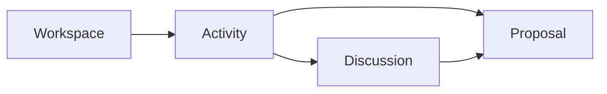
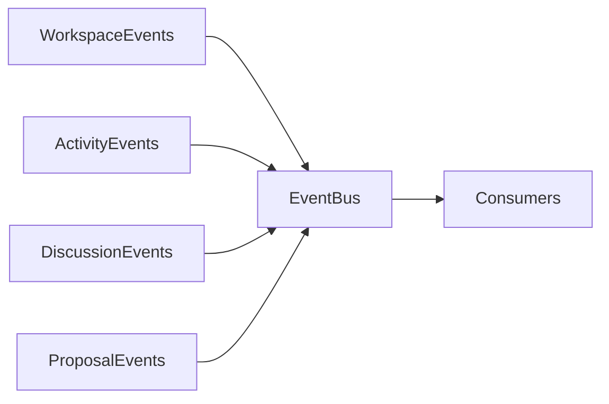
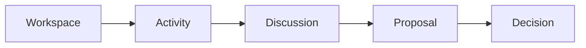
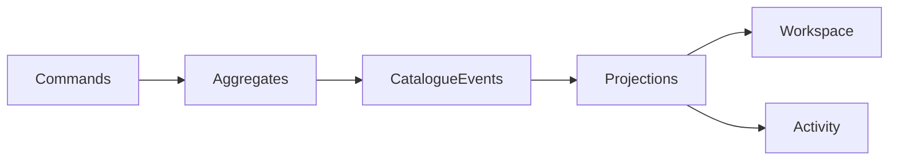

# Humanity Union Implementation Architecture Review

## Review 01

### Workspace → Proposal Architecture Review

## Version 2.0

---

# Document Status

| Field | Value |
|-------|-------|
| **Document Type** | Canonical architecture review |
| **Status** | Approved |
| **Architectural Authority** | Platform Blueprint v2.0 |
| **Review Scope** | MVP Phases 2–5 |
| **Review Target** | Workspace, Activity, Discussion, Proposal implementation specifications |
| **Purpose** | Architecture verification prior to Decision implementation |
| **Non-Scope** | Architecture redesign, implementation refactoring, production code review |

---

# Review Authority

This review SHALL verify that the reviewed implementation specifications conform to:

- Platform Blueprint v2.0;
- Engineering Standards v2.0;
- Domain Model;
- Domain Boundaries;
- Canonical Event Catalogue;
- ADR decisions;
- MVP Strategy.

This review SHALL NOT redefine architecture.

---

# Normative References

This review SHALL be interpreted together with:

- MVP Implementation Strategy;
- Member Journey;
- Workspace Specification;
- Activity Specification;
- Discussion Specification;
- Proposal Specification;
- Platform Blueprint;
- Engineering Standards;
- Canonical Event Catalogue;
- ADR-002;
- ADR-003;
- ADR-009.

---

# Review Scope

This review evaluates:

- bounded contexts;
- aggregate ownership;
- CQRS implementation;
- event ownership;
- navigation;
- Member Journey support;
- implementation readiness.

---

# Review Non-Scope

This review SHALL NOT evaluate:

- UI quality;
- implementation code;
- runtime performance;
- production deployment;
- implementation optimization.

---

# Section 1 — Review Scope

## Review Objective

This review verifies that the first four implementation specifications preserve the approved Humanity Union architecture.

The review SHALL confirm:

- architectural consistency;
- implementation readiness;
- bounded-context integrity;
- aggregate isolation;
- CQRS compliance;
- Catalogue Event compliance.

No redesign SHALL occur.

---

## Reviewed Modules

| Phase | Module | Specification |
|--------|---------|---------------|
| Phase 2 | Workspace | Workspace Specification |
| Phase 3 | Activity | Activity Specification |
| Phase 4 | Discussion | Discussion Specification |
| Phase 5 | Proposal | Proposal Specification |

---

## Primary Review Questions

The review SHALL answer the following questions.

1. Are bounded contexts preserved?
2. Are aggregate ownership rules preserved?
3. Is the civic chain preserved?
4. Are ADR decisions consistently implemented?
5. May implementation proceed to Decision?

---

## Architectural Boundaries

### Included

- Architecture compliance
- Aggregate ownership
- CQRS
- Navigation
- Catalogue Events
- Member Journey
- MVP Scope

---

### Excluded

- UI implementation
- Source code
- Decision module
- Implementation module
- Impact module
- Platform Foundation internals

---

## Review Assumptions

The review assumes:

- Platform Blueprint is approved.
- Engineering Standards are authoritative.
- Catalogue v1.0 remains canonical.
- MVP scope remains fixed.
- Deferred capabilities remain excluded.

---

## Success Criteria

| Criterion | Result |
|-----------|--------|
| No cyclic ownership | PASS |
| Activity remains civic anchor | PASS |
| Catalogue compliance | PASS |
| Navigation integrity | PASS |
| Inbox / Notification separation | PASS |
| MVP scope preserved | PASS |
| Member Journey support | PASS |
| Decision implementation readiness | PASS |

---

## Review Principles

The review SHALL verify:

### Aggregate Ownership

Every aggregate SHALL have exactly one owner.

---

### Context Isolation

Bounded contexts SHALL remain independent.

---

### Catalogue Integrity

Only canonical Catalogue Events SHALL appear.

---

### CQRS Integrity

Commands SHALL mutate aggregates.

Queries SHALL consume projections.

---

### Navigation Integrity

The civic navigation chain SHALL remain uninterrupted.

---

### Architecture Stability

Implementation SHALL preserve the approved architecture.

---

# Section 2 — Module Dependency Review

## Canonical Dependency Chain

```text
Platform Foundation

↓

Workspace

↓

Activity

↓

Discussion

↓

Proposal

↓

Decision
```

Dependencies SHALL remain acyclic.

---

## Dependency Verification

### Cyclic Dependencies

Status:

PASS.

Dependencies remain one-directional.

---

### Aggregate Ownership

Status:

PASS.

No downstream aggregate owns an upstream aggregate.

---

### Hidden Dependencies

Status:

PASS.

Cross-context communication remains:

- references;
- commands;
- projections;
- Catalogue Events.

---

## Dependency Matrix

| Module | Depends On | Provides | Coupling |
|---------|------------|----------|----------|
| Workspace | Platform Foundation | Navigation | Projection |
| Activity | Workspace | ActivityId | Reference |
| Discussion | Activity | Evidence | Reference |
| Proposal | Activity, Discussion | ProposalSubmitted | Reference |

Cross-cutting services remain:

- Event Bus;
- Permissions;
- Notifications;
- Search.

---

## Dependency Principles

The following SHALL remain true.

1. Dependencies remain one-directional.
2. Aggregate ownership never reverses.
3. Read models never introduce ownership.
4. CQRS remains preserved.

---

# Section 3 — Bounded Context Review

## Context Ownership

| Context | Primary Responsibility | Aggregate |
|----------|------------------------|-----------|
| Workspace | Operational home | Workspace |
| Activity | Civic anchor | Activity |
| Discussion | Deliberation | Discussion |
| Proposal | Governance proposal | Proposal |

---

## Published Catalogue Events

Each context SHALL publish only its own Catalogue Events.

Workspace:

- WorkspaceInitialized
- MemberProfileUpdated
- ResponsibilityProfileUpdated
- WorkspacePreferencesUpdated

Activity:

- ActivityCreated
- ActivityRevised
- ActivityClosed

Discussion:

- DiscussionOpened
- DiscussionClosed
- ContributionAdded
- EvidenceContributed

Proposal:

- MemberSignalRecorded
- MemberSignalConsolidated
- ProposalSubmitted
- ProposalRevised
- ProposalWithdrawn

---

## Consumed Events

Each module SHALL consume Catalogue Events through projections or integration handlers only.

No ownership transfer SHALL occur.

---

## Verification

| Validation | Status |
|------------|--------|
| Single responsibility | PASS |
| Aggregate ownership | PASS |
| Business logic duplication | PASS |

---

## Context Principles

Bounded contexts SHALL preserve:

- ownership;
- isolation;
- immutable references;
- projection-based synchronization.

---

# Section 4 — Aggregate Review

## Aggregate Matrix

| Aggregate | Context | Lifecycle | Status |
|-----------|---------|-----------|--------|
| Workspace | Workspace | Initialized | PASS |
| Activity | Activity | Created → Closed | PASS |
| Discussion | Discussion | Draft → Closed | PASS |
| Proposal | Proposal | Draft → Submitted | PASS |
| MemberSignal | Proposal | Recorded | PASS |

---

## Command Ownership

Each command SHALL belong to exactly one aggregate.

| Command | Aggregate | Status |
|----------|-----------|--------|
| CreateActivity | Activity | PASS |
| OpenDiscussion | Discussion | PASS |
| AddContribution | Discussion | PASS |
| SubmitProposal | Proposal | PASS |

Workspace SHALL dispatch commands only.

---

## Event Ownership

The review confirms:

- aggregates publish only their own events;
- draft states remain internal;
- downstream contexts consume events only.

Status:

PASS.

---

## Aggregate Independence

Each aggregate SHALL remain:

- independently testable;
- independently persistent;
- independently versioned.

Shared mutable state SHALL NOT exist.

---

# Section 5 — Canonical Event Catalogue Review

## Catalogue Verification

All published events conform to the Canonical Event Catalogue.

Status:

PASS.

---

## Active Catalogue Events

Workspace:

- WorkspaceInitialized
- MemberProfileUpdated
- ResponsibilityProfileUpdated
- WorkspacePreferencesUpdated

Activity:

- ActivityCreated
- ActivityRevised
- ActivityClosed

Discussion:

- DiscussionOpened
- DiscussionClosed
- ContributionAdded
- EvidenceContributed

Proposal:

- MemberSignalRecorded
- MemberSignalConsolidated
- ProposalSubmitted
- ProposalRevised
- ProposalWithdrawn

---

## Deprecated Events

The following names remain prohibited.

| Deprecated | Canonical |
|------------|-----------|
| ActivityUpdated | ActivityRevised |
| ActivityArchived | ActivityClosed |
| DiscussionCreated | DiscussionOpened |
| EvidenceSubmitted | EvidenceContributed |
| ContributionEdited | Append-only |
| ProposalCreated | Internal Draft |

No deprecated event SHALL appear in production specifications.

---

## Event Verification

The review confirms:

- no duplicated semantics;
- no ownership conflicts;
- no missing event ownership.

Status:

PASS.

---

## Event Principles

The following SHALL remain permanently true.

1. Every Catalogue Event has exactly one publisher.
2. Aggregate ownership remains unique.
3. Cross-context synchronization occurs only through Catalogue Events.
4. Internal aggregate state SHALL NOT publish Catalogue Events.
5. Deprecated event names SHALL NEVER be reintroduced.

# Section 6 — Navigation Review

The review verifies that every reviewed module preserves the canonical civic navigation model.

Navigation SHALL remain Activity-centered.

---

## Canonical Navigation Chain

```text
Workspace

↓

Activity Thread

↓

Discussion Panel

↓

Proposal Panel
```

This chain SHALL remain mandatory.

---

## Navigation Verification

| Navigation Rule | Workspace | Activity | Discussion | Proposal | Status |
|-----------------|-----------|----------|------------|----------|--------|
| Activity-centered navigation | ✓ | ✓ | ✓ | ✓ | PASS |
| No standalone Discussion | ✓ | ✓ | ✓ | ✓ | PASS |
| No standalone Proposal | ✓ | ✓ | ✓ | ✓ | PASS |
| Return to Workspace | ✓ | ✓ | ✓ | ✓ | PASS |
| Guest boundaries | ✓ | ✓ | ✓ | ✓ | PASS |

---

## Orphan Navigation

Review Result:

PASS.

No orphan entry points exist.

Every civic route SHALL preserve ActivityId.

---

## Parallel Civic Flows

Review Result:

PASS.

No competing navigation chains exist.

Inbox SHALL NOT become a civic workflow.

Notifications SHALL remain alerts.

---

## Navigation Matrix

| From | To | Allowed |
|------|----|----------|
| Workspace Inbox | Activity Thread | ✓ |
| My Activities | Activity Thread | ✓ |
| My Discussions | Discussion Panel | ✓ |
| My Proposals | Proposal Panel | ✓ |
| Activity | Discussion | ✓ |
| Activity | Proposal | ✓ |
| Discussion | Proposal | ✓ |
| Workspace → Proposal | ✗ |
| Inbox → Proposal | ✗ |
| Notification → Decision | ✗ |

---

## Navigation Principles

Navigation SHALL preserve:

- Activity continuity;
- civic traceability;
- Member Journey continuity;
- bounded-context isolation.

---

# Section 7 — CQRS Review

The review verifies CQRS implementation across all reviewed modules.

---

## Write Models

| Module | Aggregate Owner | Status |
|----------|----------------|--------|
| Workspace | Workspace | PASS |
| Activity | Activity | PASS |
| Discussion | Discussion | PASS |
| Proposal | Proposal | PASS |

Commands SHALL mutate one aggregate only.

---

## Read Models

| Projection | Status |
|------------|--------|
| Inbox | PASS |
| Workspace Lists | PASS |
| Activity Detail | PASS |
| Discussion Timeline | PASS |
| Proposal Detail | PASS |

Read models SHALL remain passive.

---

## Inbox Review

Review confirms:

- Inbox owns no civic state.
- Inbox publishes no domain events.
- Inbox remains projection-driven.

Status:

PASS.

---

## Notification Review

Notifications SHALL remain independent.

Deep links SHALL target Activity.

Notifications SHALL NEVER own workflow.

Status:

PASS.

---

## Eventual Consistency

All reviewed modules preserve:

- projection rebuilding;
- eventual consistency;
- read-your-writes behavior;
- projection isolation.

Status:

PASS.

---

## CQRS Principles

The following SHALL remain permanently true.

1. Commands mutate aggregates.
2. Queries consume projections.
3. Read models publish no domain events.
4. Projection state never replaces aggregate state.

---

# Section 8 — ADR-002 Compliance Review

The review verifies complete compliance with ADR-002.

---

## ADR Verification Matrix

| Requirement | Status |
|-------------|--------|
| Activity is civic anchor | PASS |
| Workspace does not own Activity | PASS |
| Discussion references Activity | PASS |
| Proposal references Activity | PASS |
| No competing navigation anchor | PASS |
| Activity creation requires MemberRegistered | PASS |

---

## ADR Assessment

Review Result:

PASS.

ADR-002 is fully implemented.

---

## ADR Principles

The following SHALL remain true.

- Activity remains the interaction anchor.
- ActivityId remains mandatory.
- No competing civic anchor SHALL exist.
- Navigation SHALL terminate on Activity.

---

# Section 9 — Member Journey Review

The review verifies Member Journey coverage.

---

## Journey Coverage

| Journey Stage | Module | Status |
|---------------|--------|--------|
| Workspace | Workspace | PASS |
| Profile | Workspace | PASS |
| Responsibility | Workspace | PASS |
| First Activity | Activity | PASS |
| Inbox | Workspace | PASS |
| Discussion | Discussion | PASS |
| Evidence | Discussion | PASS |
| Proposal | Proposal | PASS |
| Decision–Impact | Future | Deferred |
| Workspace Return | Workspace | PASS |

---

## Transition Verification

The following transitions are verified.

Workspace → Activity

PASS.

Activity → Discussion

PASS.

Discussion → Proposal

PASS.

Partial Journey

PASS.

---

## Journey Principles

Member Journey SHALL preserve:

- continuous navigation;
- Activity continuity;
- Workspace return;
- no skipped civic stages.

---

# Section 10 — MVP Strategy Review

The review verifies compliance with MVP Strategy.

---

## Phase Verification

| MVP Phase | Status |
|------------|--------|
| Phase 2 | PASS |
| Phase 3 | PASS |
| Phase 4 | PASS |
| Phase 5 | PASS |

---

## Hard Gates

The review confirms:

- Activity requires MemberRegistered.
- Discussion requires Activity.
- Decision requires Proposal.
- Implementation remains outside review scope.

Status:

PASS.

---

## Deferred Capabilities

The following remain deferred:

- Working Groups;
- AI Facilitator;
- Initiatives;
- Institutional Governance;
- Advanced Search;
- Moderation Catalogue Events.

No deferred capability appears inside MVP implementation.

---

## MVP Principles

The review confirms:

- MVP scope remains unchanged.
- No scope expansion occurred.
- Future capabilities remain isolated.

---

# Section 11 — Architectural Risks

The review identifies architectural observations only.

No redesign recommendations are introduced.

---

## Risk Matrix

| ID | Observation | Severity | Status |
|----|-------------|----------|--------|
| R1 | Projection growth | Medium | Monitor |
| R2 | Proposal read synchronization | Medium | Monitor |
| R3 | Projection quantity | Medium | Expected |
| R4 | Permission complexity | Low | Accept |
| R5 | Blueprint/Catalogue terminology | Low | Monitor |
| R6 | Internal support semantics | Low | Guard |
| R7 | Initiative ADR | Low | Pending |
| R8 | Legacy code divergence | External | Separate Review |

---

## Risk Assessment

No identified risk requires architectural modification.

Review Result:

PASS.

---

## Risk Principles

The review SHALL distinguish between:

- architectural risk;
- implementation risk;
- operational risk.

Only architectural risks are evaluated.

---

# Section 12 — Implementation Readiness

The review evaluates implementation readiness.

---

## Readiness Matrix

| Module | Architecture | Specification | Integration | Status |
|----------|--------------|---------------|-------------|--------|
| Workspace | High | Complete | Ready | READY WITH NOTES |
| Activity | High | Complete | Ready | READY |
| Discussion | High | Complete | Ready | READY |
| Proposal | High | Complete | Ready | READY WITH NOTES |

---

## Review Notes

Workspace

- Future projections remain placeholders.

Activity

- Composite projections remain expected.

Discussion

- Closed state terminology SHALL remain consistent.

Proposal

- Decision synchronization SHALL remain read-only.

---

## Readiness Principles

Implementation SHALL preserve:

- aggregate ownership;
- CQRS;
- Event Catalogue;
- bounded contexts.

---

# Section 13 — Overall Architecture Assessment

Scores represent architectural alignment only.

Implementation code remains outside review scope.

---

## Assessment Matrix

| Dimension | Score |
|-----------|------:|
| Architecture Consistency | 94 |
| DDD Compliance | 93 |
| CQRS Compliance | 95 |
| Catalogue Compliance | 97 |
| Navigation Integrity | 96 |
| Module Isolation | 90 |
| Implementation Readiness | 88 |
| Documentation Alignment | 92 |

---

## Composite Result

Overall Architecture Quality

**93 / 100**

---

## Assessment Principles

The score reflects:

- architecture only;
- specification quality;
- implementation readiness;
- review evidence.

It SHALL NOT be interpreted as:

- code quality;
- production readiness;
- runtime reliability;
- operational maturity.

---

## Overall Findings

The review confirms:

1. Aggregate ownership remains correct.
2. CQRS remains consistent.
3. Event Catalogue compliance is complete.
4. Navigation remains Activity-centered.
5. Member Journey remains continuous.
6. MVP scope remains unchanged.
7. Decision implementation MAY proceed without architectural redesign.

# Section 14 — Review Conclusions

The review confirms that the Workspace, Activity, Discussion, and Proposal implementation specifications remain architecturally consistent with the approved Humanity Union platform.

No architectural redesign is required.

---

## Primary Architectural Strengths

The review confirms the following strengths.

### Activity-Centered Architecture

Activity remains the single civic interaction anchor.

ADR-002 is fully preserved.

---

### CQRS Consistency

All reviewed modules preserve:

- aggregate ownership;
- projection isolation;
- command routing;
- event-driven synchronization.

---

### Catalogue Integrity

All published events conform to the Canonical Event Catalogue.

Deprecated event names remain excluded.

---

### Navigation Consistency

Workspace remains the operational entry point.

Activity remains the civic navigation anchor.

Discussion and Proposal remain Activity-scoped.

---

### MVP Scope Discipline

Deferred capabilities remain excluded.

No unauthorized scope expansion exists.

---

### Architectural Traceability

Every reviewed specification remains traceable to:

- Platform Blueprint;
- Engineering Standards;
- Member Journey;
- MVP Strategy;
- ADR decisions.

---

## Confirmed Architectural Decisions

| Decision | Status |
|----------|--------|
| ADR-002 Activity Anchor | PASS |
| ADR-003 Universal Discussion | PASS |
| ADR-005 Human Governance | PASS |
| ADR-009 Proposal Framework | PASS |
| Discussion-based Conversation | PASS |
| No `ProposalCreated` event | PASS |
| Evidence separated from Support | PASS |

---

## Verified Architectural Constraints

The review confirms:

- one Workspace per Member;
- Activity eligibility via `MemberRegistered`;
- Discussion requires ActivityId;
- Proposal requires ActivityId;
- Decision remains downstream;
- partial civic journeys remain supported.

---

## Monitoring Areas

The following SHALL remain implementation monitoring concerns.

| Area | Monitoring Phase |
|------|------------------|
| Projection growth | Phase 3+ |
| Proposal ↔ Decision synchronization | Phase 6 |
| Support semantics | Phase 5 |
| Initiative ADR | Wave 2 |
| Codebase compliance | Engineering Audit |
| Validation scenarios | Phase 8 |

None require architectural redesign.

---

## Review Decision

The review concludes:

Implementation MAY proceed to the Decision module.

No architectural blockers remain.

---

# Canonical Architecture Diagrams

The following diagrams remain the canonical architectural representation of Review 01.

Implementation technology MAY change.

Architecture SHALL remain unchanged.

---

## Diagram 1 — Module Dependency

```mermaid
flowchart TB

Platform

↓

Workspace

↓

Activity

↓

Discussion

↓

Proposal

↓

Decision
```

Dependencies SHALL remain acyclic.

---

## Diagram 2 — Bounded Context Relationships



Each bounded context SHALL retain aggregate ownership.

---

## Diagram 3 — Catalogue Event Ownership



Every Catalogue Event SHALL have exactly one publisher.

---

## Diagram 4 — Civic Navigation



Navigation SHALL remain Activity-centered.

---

## Diagram 5 — CQRS Architecture



Read models SHALL remain passive.

---

# Appendices

## Appendix A — Module Dependencies

| Module | Depends On | Enables |
|----------|------------|----------|
| Workspace | Platform Foundation | Activity |
| Activity | Workspace | Discussion |
| Discussion | Activity | Proposal |
| Proposal | Discussion | Decision |

---

## Appendix B — Aggregate Ownership

| Aggregate | Context | Catalogue Events |
|-----------|---------|------------------|
| Workspace | Workspace | WorkspaceInitialized |
| Activity | Activity | ActivityCreated, ActivityRevised, ActivityClosed |
| Discussion | Discussion | DiscussionOpened, DiscussionClosed, ContributionAdded, EvidenceContributed |
| Proposal | Proposal | ProposalSubmitted, ProposalRevised, ProposalWithdrawn |
| MemberSignal | Proposal | MemberSignalRecorded, MemberSignalConsolidated |

---

## Appendix C — Catalogue Event Ownership

Every Catalogue Event SHALL remain owned by exactly one aggregate.

No ownership conflicts were identified.

---

## Appendix D — Publisher / Consumer Review

Publisher and consumer relationships remain consistent with the reviewed specifications.

No conflicting publishers exist.

---

## Appendix E — Navigation Review

Navigation SHALL remain exactly as verified in Section 6.

---

## Appendix F — CQRS Review

CQRS SHALL remain exactly as verified in Section 7.

---

## Appendix G — Implementation Readiness

| Review Area | Workspace | Activity | Discussion | Proposal |
|-------------|-----------|----------|------------|----------|
| Architecture | PASS | PASS | PASS | PASS |
| Components | PASS | PASS | PASS | PASS |
| Lifecycle | PASS | PASS | PASS | PASS |
| Catalogue Events | PASS | PASS | PASS | PASS |
| Permissions | PASS | PASS | PASS | PASS |
| CQRS | PASS | PASS | PASS | PASS |
| Navigation | PASS | PASS | PASS | PASS |
| Validation | PASS | PASS | PASS | PASS |
| Phase Readiness | PASS | PASS | PASS | PASS |

---

## Appendix H — Architecture Quality Checklist

| Requirement | Status |
|-------------|--------|
| No additional bounded contexts | PASS |
| No unauthorized Catalogue Events | PASS |
| ADR-002 preserved | PASS |
| ADR-003 preserved | PASS |
| ADR-009 preserved | PASS |
| Deferred scope preserved | PASS |
| Member Journey preserved | PASS |
| MVP Strategy preserved | PASS |
| Aggregate ownership preserved | PASS |
| Decision implementation authorized | PASS |

---

# Section 15 — Final Engineering Assessment

## Architecture Assessment

The review confirms that the first four implementation specifications are fully aligned with the approved Humanity Union architecture.

No architectural inconsistencies requiring redesign were identified.

---

## Implementation Assessment

Workspace, Activity, Discussion, and Proposal are implementation-ready within the approved MVP scope.

Remaining work concerns implementation only.

---

## Decision Readiness

Decision implementation MAY proceed.

The reviewed specifications provide sufficient architectural stability for Phase 6.

---

## Operational Observations

The following SHALL remain implementation concerns.

- projection scalability;
- cross-context synchronization;
- implementation compliance;
- Initiative ADR;
- Phase 8 validation.

These SHALL NOT modify the approved architecture.

---

## Review Scope Closure

This review concludes verification of:

- Workspace;
- Activity;
- Discussion;
- Proposal.

Subsequent reviews SHALL begin with the Decision specification.

---

# Section 16 — Review Authorization

## Overall Decision

**GO WITH OBSERVATIONS**

---

## Authorization Matrix

| Action | Authorization |
|---------|---------------|
| Implement Workspace | Approved |
| Implement Activity | Approved |
| Implement Discussion | Approved |
| Implement Proposal | Approved |
| Begin Decision Specification | Approved |
| Architectural Redesign | Not Required |
| Production Release | Not Authorized |

---

## Review Principles

The following remain authoritative.

1. Aggregate ownership SHALL remain unchanged.
2. Activity SHALL remain the civic interaction anchor.
3. CQRS SHALL remain mandatory.
4. Catalogue Event ownership SHALL remain unique.
5. Navigation SHALL remain Activity-centered.
6. Deferred capabilities SHALL remain excluded.
7. Architecture SHALL NOT change without a future ADR.

---

# Final Verdict

## **GO WITH OBSERVATIONS**

### Engineering Rationale

The reviewed implementation specifications preserve:

- bounded-context integrity;
- aggregate ownership;
- CQRS;
- canonical Catalogue Events;
- Activity-centered navigation;
- Member Journey continuity;
- MVP scope discipline.

No architectural blockers remain.

Decision specification development MAY proceed.

Production readiness remains outside the scope of this review.

---

*Humanity Union Implementation Architecture Review 01 v2.0 — canonical architectural review for MVP Phases 2–5. This document validates architecture only and does not modify implementation specifications.*