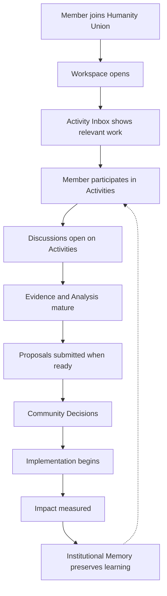
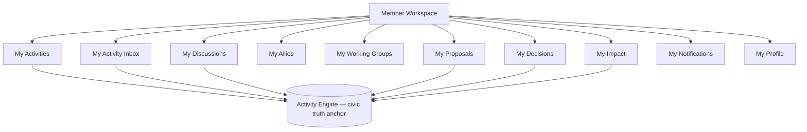
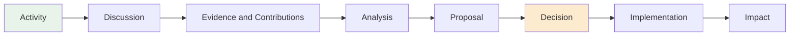
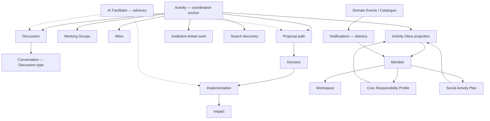
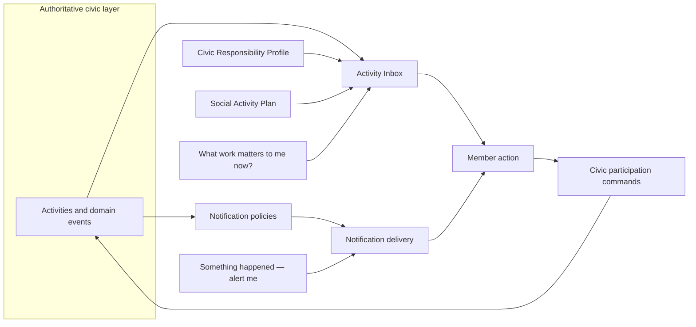

# Humanity Union Activity Integration Blueprint

## Version 1.0

### How Humanity Union Evolves Into a Unified Activity-Centered Platform — Without Replacing Its Architecture

---

# Document Purpose

This blueprint shows how Humanity Union **naturally evolves** into an Activity-centered platform while preserving everything already designed and approved.

It is the bridge between:

- **Existing engineering architecture** (Blueprint, Validation, ADR, Engineering `00`–`11`, Canonical Event Catalogue)
- **Future user experience** (how Members, volunteers, and contributors actually move through civic work)

This is **not** a technical implementation document.  
It is **not** a redesign.  
It is **not** a second platform.

It builds directly on the conclusions of [00_ACTIVITY_ARCHITECTURE_INTEGRATION_REVIEW.md](./00_ACTIVITY_ARCHITECTURE_INTEGRATION_REVIEW.md).

**Authoritative sources:** All approved Humanity Union architecture documents. No prior engineering documents are modified by this blueprint.

---

# Section 1 — The Main Idea

Humanity Union remains **one platform**.

Today, the platform is already architecturally built around Activity as the starting point for meaningful civic participation (ADR-002, Blueprint Activity Engine). What changes in this evolution is primarily **how Members experience the platform** — not what the platform *is* at its core.

## In simple terms

| Before (mental model) | After (mental model) |
|-----------------------|----------------------|
| “I open different tools: initiatives, discussions, proposals, voting…” | “I participate in Activities — the platform guides me from participation to impact” |
| Separate pages and modules | One coherent civic thread anchored on Activity |
| Civic work scattered across features | Civic work organized around what actually happened and what requires attention |

## What stays true

Everything already designed **continues to exist**:

- Members, Identity, Workspace
- Discussions, Working Groups, Allies, Institutions
- Proposals, Decisions, Implementation, Impact
- Notifications, Search, AI Facilitator
- Permissions, verification, security, audit
- All bounded contexts, domain events, and engineering rules

## What evolves

The platform is **reorganized around Activity** as the natural center of user interaction:

- **Activity** is where civic work begins and where traceability lives
- **Workspace** is where the Member organizes their participation
- **Activity Inbox** is where the Member sees what matters *now*
- **Discussion** is how people think together — in public, with Allies, in groups, or in focused Conversations
- **Governance** (Proposal → Decision → Implementation → Impact) unfolds *from* Activities — it does not disappear

Activity organizes the **experience**. It does not replace the **engineering architecture**.

---

# Section 2 — The User Journey

This section describes how a Member naturally experiences Humanity Union after integration.

## The journey

```text
Member joins Humanity Union
        ↓
Workspace opens
        ↓
Activity Inbox shows relevant Activities
        ↓
Member participates in Activities
        ↓
Activities create Discussions
        ↓
Discussions produce Analysis
        ↓
Analysis produces Proposals
        ↓
Community makes Decisions
        ↓
Implementation begins
        ↓
Impact is measured
```

## Step-by-step explanation

### 1. Member joins Humanity Union

A person registers and becomes a **Member** — a registered civic participant. Identity establishes secure access and, when applicable, verification level. This is membership and trust, not yet civic action.

### 2. Workspace opens

The Member enters their **Workspace** — a private operational environment for civic work. It is not a social feed or a profile page. It is where the Member returns daily to understand *what civic work requires their participation*.

### 3. Activity Inbox shows relevant Activities

The **Activity Inbox** presents Activities that may require awareness, participation, or action — filtered by the Member’s Civic Responsibility Profile and Social Activity Plan. The Inbox reduces noise; it does not show everything on the platform.

### 4. Member participates in Activities

The Member engages in meaningful civic participation: joining a local campaign, contributing to research, volunteering, signing support for a petition-like Proposal path, or opening a new civic thread. Each meaningful act creates or connects to an **Activity** — the permanent record of *who did what, in what context*.

### 5. Activities create Discussions

When deliberation is needed, a **Discussion** opens from the Activity. Discussion is structured collaboration — not casual chat. Comments, questions, evidence, and suggestions are Contribution types with civic purpose.

### 6. Discussions produce Analysis

As deliberation matures, Members contribute **Evidence** and **Analysis** (structured interpretation of facts and trade-offs). This is the “Analysis” phase in product language — in the architecture, it lives inside Discussion Contributions and, when ready, Member Signals — not in a separate communication system.

### 7. Analysis produces Proposals

When civic work is ready for formal review, a **Proposal** is submitted. Proposals are governed requests for change — not Discussion posts. They enter the Decision Lifecycle with preserved history.

### 8. Community makes Decisions

Authorized humans **Decide** — approve, reject, or return for revision. Voting, where applicable, is part of governed Decision processes. No algorithm and no AI substitutes for this authority.

### 9. Implementation begins

Approved Decisions trigger **Implementation** — coordinated execution with tasks, commitments, and accountability.

### 10. Impact is measured

**Impact** documents what happened as a result — findings, consequences, lessons. Impact closes the loop and feeds Institutional Memory and future Activities.

Not every Activity travels the full path. A volunteer shift may remain an Activity with Discussion but never become a Proposal. A policy Proposal may move quickly from Analysis to Decision. The platform supports partial journeys without forcing every thread through every stage.

---

# Section 3 — The Role of Workspace

**Workspace is NOT replaced.**

Workspace remains the Member’s **personal working environment** — the place to organize, coordinate, and execute meaningful civic participation.

Blueprint principle: Workspace sits **above** collaboration systems as a **lens on civic responsibility**, not as the owner of civic truth.

## Inside Workspace

| Area | Purpose |
|------|---------|
| **My Activity Inbox** | What requires my attention now — Activities and related civic work filtered for relevance and responsibility |
| **My Activities** | Activities I created, joined, or am accountable for — the trace of my civic participation |
| **My Discussions** | Deliberation I am part of — public, allied, group, or private Conversations |
| **My Allies** | Trusted collaborators I work with — requests, active relationships, recent shared work |
| **My Working Groups** | Temporary teams organized around defined objectives |
| **My Proposals** | Formal civic requests I steward, co-sponsor, or follow |
| **My Decisions** | Decisions awaiting my review, vote, or acknowledgment (where authorized) |
| **My Impact** | Impact assessments and outcomes linked to work I participated in |
| **My Notifications** | Alerts that something happened — delivery across channels; may point me back to Inbox or an Activity |
| **My Profile** | Public presentation, Civic Responsibility Profile, Social Activity Plan, verification status |

## How Workspace relates to Activity

Workspace **does not own** Activities. It **surfaces** them.

Every area in Workspace is a window into Activity-anchored civic work — grouped and filtered for the Member’s operational needs. When a Member clicks “My Proposals,” they see Proposal-linked Activities and governance state. When they open the Inbox, they see the same underlying civic world organized for **attention**, not for browsing.

---

# Section 4 — The Role of Activity

## What Activity becomes

**Activity is the central coordination object** for Member experience.

In engineering terms, Activity is the **immutable civic trace anchor** (ADR-002). In human terms, Activity answers:

- *What civic work is this?*
- *Who participated?*
- *What happened?*
- *Where does it stand in the civic lifecycle?*

Everything important **starts from** an Activity — or connects to one.

## Examples

| Civic work | How Activity coordinates it |
|------------|------------------------------|
| **Community initiative** | Activity records the initiative’s public presence; Discussions, Groups, and Proposals link to it |
| **Petition-like civic request** | Activity anchors participation; formal path may mature into Member Signal → Proposal |
| **Volunteer action** | Activity records meaningful participation; may not require Proposal |
| **Research project** | Activity + Evidence-rich Discussion; Analysis Contributions accumulate |
| **Local event** | Activity records the event as civic participation; Working Groups may coordinate |
| **Emergency response** | Activity with appropriate visibility; rapid Discussion and Implementation paths |
| **Environmental campaign** | Activity thread linking Discussions, Proposals, and Impact over time |
| **Educational campaign** | Activity with public Discussion and Media references |
| **Policy discussion** | Activity → Discussion → Analysis → Proposal → Decision |

## What Activity does NOT do

Activity **coordinates** work. It does **not replace**:

- **Discussion** (deliberation still lives in Discussion)
- **Proposal** (formal governance still requires Proposal submission)
- **Decision** (human authority still decides)
- **Institution** (continuing structures remain Institutions)
- **Notification** (alerts remain derived communication)
- **AI** (AI advises; Activity records what Members did)

Activity is the **spine** of the civic story — not a substitute for every other concept.

---

# Section 5 — How Existing Components Fit Into the New Model

For each major component: purpose, whether it stays unchanged, and how it connects to Activity.

| Component | Purpose | Stays unchanged? | Connection to Activity |
|-----------|---------|------------------|------------------------|
| **Workspace** | Member’s private operational civic environment | **Yes** — presentation evolves, ownership does not | Surfaces Activity-anchored work; routes to Activity detail |
| **Member** | Registered civic participant | **Yes** | Creates and participates in Activities; owns Civic Responsibility Profile |
| **Identity** | Session access and verification | **Yes** | Enables participation; distinct from Activity (`MemberRegistered` vs `MemberAuthenticated`) |
| **Initiatives** | Civic workstream the Member stewards or supports (Blueprint product grouping) | **Concept preserved** — mapped as Activity graph grouping until product ADR finalizes detail | Initiatives **group** related Activities, Discussions, and Proposals; trace remains on Activity Engine |
| **Institutions** | Continuing civic structures for persistent responsibility | **Yes** | Institution-related Activities link to institutional mandate and review |
| **Working Groups** | Temporary objective-bound collaboration | **Yes** | Group Activities and restricted Discussions attach to group context |
| **Discussion** | Universal deliberation framework | **Yes** — becomes more visible in UX | Opens from Activity (`ActivityCreated` → `DiscussionOpened`); Contributions create Activities |
| **Conversation** | Focused collaborative dialogue | **Specialization of Discussion** — not independent | Working/Private Conversation Discussion types; Inbox “Conversations” category |
| **Proposal** | Formal governed request for change | **Yes** | Originates from mature Activity-linked deliberation; references Activity context |
| **Decision** | Human governance authority | **Yes** | Reviews Proposals linked to Activity threads; voting stays here |
| **Implementation** | Execution of approved Decisions | **Yes** | Implementation progress visible on Activity thread |
| **Impact** | Documented consequences (ImpactAssessment) | **Yes** | `ImpactRecorded` closes Activity-linked civic loop |
| **Notifications** | Derived alerts that something happened | **Yes** | Triggered by domain events on Activities and related objects; points to Inbox/Activity |
| **Search** | Permission-aware discovery | **Yes** | Finds public Activities and linked civic records |
| **AI Facilitator** | Advisory assistance | **Yes** — invoked in Activity context | Summarizes, discovers, organizes — never approves or decides |
| **Civic Responsibility Profile** | Private scope, priorities, capacity | **Yes** | Filters which Activities appear in Inbox |
| **Social Activity Plan** | Declared participation intent | **Yes** | Routes attention; aligns with Inbox and Notification policies |

**Integration principle:** No component loses its architectural role. Activity becomes the **visible center of navigation** — not a replacement owner for other domains.

---

# Section 6 — Discussion Model

**Discussion becomes the universal collaboration model** — not one feature among many parallel communication tools.

All deliberation — public debate, ally collaboration, group work, focused exchange — converges on **Discussion**.

## Discussion types (product view)

| Type | Who it is for | Visibility (typical) |
|------|---------------|----------------------|
| **Public** | Open civic dialogue | Public — authorized observers may read |
| **Allies** | Trusted collaborators | Allies — accepted collaborative relationships |
| **Private Group** | Working Group or explicitly authorized set | Working Group or Private |
| **Conversation** | Focused exchange on active collaborative work | Often Allies or Private — task-oriented |

Blueprint also defines specialized types (Initiative Discussion, Proposal Discussion, Evidence Review, Decision Meeting, AI Review Session). These are **Discussion types**, not separate products.

## Conversation is a specialized Discussion

**Conversation is NOT an independent communication subsystem.**

In the approved architecture:

- *Working Conversation* and *Private Conversation* are **Discussion types** (Blueprint 06)
- Activity Inbox category *Conversations* is a **filter** over Activity-grounded dialogue — not a new domain module

Product may label an experience “Conversation” for clarity. Engineering still records deliberation through Discussion and Activity.

---

# Section 7 — Allies

## Purpose

**Allies** are bounded trusted collaborative relationships between Members — enabling coordinated work within agreed boundaries.

Allies may include:

- trusted collaborators on a shared civic goal
- friends working on local issues
- subject-matter experts contributing Evidence
- local teams coordinating response
- organizations participating within visibility rules (where policy permits)

Allies are **not** popularity metrics, follower counts, or implicit authority transfers.

## How Allies influence the platform

| Dimension | Effect |
|-----------|--------|
| **Visibility** | Ally-visible Discussions inherit Allies visibility; content does not leak to public surfaces |
| **Collaboration** | Ally acceptance enables restricted Working Conversations and shared Activities |
| **Discussion** | Private and Working Conversation types open within ally boundaries |
| **Activity participation** | Alliance acceptance and collaborative acts generate Activities per Activity Engine rules |

Allies provide **trusted participation structure**. Discussion provides the **deliberation environment**. Activity preserves **what happened**.

---

# Section 8 — Activity Inbox

## What Activity Inbox is

**Activity Inbox is NOT another notification system.**

It is the Member’s **working feed** — a personal attention-management surface built entirely on the Activity Engine and filtered by civic responsibility.

Blueprint principle: *Every Inbox item originates from one or more Activities.*

## What the Inbox contains

| Content | Meaning for the Member |
|---------|------------------------|
| **Activities requiring attention** | Civic work needing awareness or action |
| **Discussion updates** | New Contributions or threads on Activities I follow |
| **Invitations** | Working Group, Ally, or participation requests |
| **Proposal reviews** | Proposals awaiting my support, objection, or review role |
| **Decision requests** | Decisions requiring my vote, review, or acknowledgment |
| **Implementation tasks** | Execution items linked to approved work I am part of |
| **Impact reports** | New impact findings on work I participated in |

## Inbox categories (Blueprint)

All · Unread · Work · Conversations · Comments · System — a **small, stable set** to prevent feed sprawl.

## Architectural note (for implementers reading this blueprint)

Activity Inbox is a **read projection** — not a write-owning domain module. It organizes attention; Activity aggregate owns civic truth.

---

# Section 9 — Notifications

## The difference in one sentence

| System | Message to the Member |
|--------|----------------------|
| **Notification** | *“Something happened.”* |
| **Activity Inbox** | *“Here is the work that currently matters to you.”* |

## Notifications

- Derived from domain events (Activity created, Proposal submitted, Decision approved, etc.)
- Delivered through channels (in-app, email, push — per Member preferences)
- May alert the Member that Inbox-worthy attention exists
- **Never** create civic authority — accepting a notification does not approve a Proposal

## Activity Inbox

- Built on Activities and civic responsibility filtering
- Prioritizes **relevance and responsibility**, not raw event volume
- Broader and calmer than a notification stream
- The place to **decide what to work on**, not merely what pinged

## Why both exist

A Member may receive a Notification (“Proposal you follow was revised”) while the Inbox presents the fuller context (“This Proposal in your water policy initiative requires review by Friday”). Conversely, an Inbox-worthy item may exist without an immediate multi-channel notification.

**Unified experience is possible in the UI. Separate domain roles are not optional in the architecture.**

---

# Section 10 — AI Facilitator

## Role

AI **helps Members**. It **never governs**.

| AI does | AI never does |
|---------|---------------|
| Summarize Discussions | Vote |
| Suggest related Activities | Approve Proposals or Decisions |
| Find duplicate or related Proposals | Create Institutions |
| Help collect and organize Evidence | Replace human accountability |
| Highlight risks and gaps in reasoning | Send mandatory governance notifications |
| Track Implementation progress (advisory) | Mutate domain state autonomously |
| Summarize Impact findings | Encode civic authority |

ADR-005 and Engineering `09` enforce these boundaries.

## AI across the lifecycle

AI may accompany every stage **as advisory context**:

```text
Activity context        → related work discovery, classification assistance
Discussion              → summarization, consensus mapping, dissent visibility
Evidence & Analysis     → source organization, gap highlighting (not certification)
Proposal                → duplication detection, affected-community prompts
Decision preparation    → structured review aids (not recommendations to approve)
Implementation          → progress summaries, blocker visibility
Impact                  → finding consolidation, lesson surfacing
```

AI output is recorded as **FacilitationOutput** — visibly non-authoritative. Members remain responsible for actions taken.

---

# Section 11 — The Complete Lifecycle

## The Humanity Union civic lifecycle

```text
Activity
   ↓
Discussion
   ↓
Evidence & Contributions
   ↓
Analysis
   ↓
Proposal
   ↓
Decision
   ↓
Implementation
   ↓
Impact
```

## Transitions explained

| Transition | What happens | Who owns it (architecture) |
|------------|--------------|----------------------------|
| **→ Discussion** | Deliberation opens on an Activity | Discussion context — `DiscussionOpened` |
| **→ Evidence & Contributions** | Members add Comments, Questions, Evidence, Suggestions | Discussion — `ContributionAdded`, `EvidenceContributed` |
| **→ Analysis** | Structured interpretation matures (Analysis Contribution type; Member Signals may form) | Discussion + Proposal (MemberSignal) — product phase, not separate aggregate |
| **→ Proposal** | Formal civic request submitted for review | Proposal — `ProposalSubmitted` |
| **→ Decision** | Human authority approves, rejects, or returns | Decision — `DecisionApproved` / `DecisionRejected` |
| **→ Implementation** | Approved work executes | Implementation — `ImplementationStarted` |
| **→ Impact** | Consequences documented | ImpactAssessment — `ImpactRecorded` |

**Institutional Memory** preserves reasoning across the lifecycle — especially Decisions, dissent, and Impact — without replacing any stage.

**Not every Activity completes every transition.** Stages are **available paths**, not mandatory gates.

---

# Section 12 — What the Member Sees

From the Member’s perspective — no engineering vocabulary required:

> *“I don’t need to know which module I’m using.*
>
> *I open my Workspace and see what matters in my Activity Inbox.*
>
> *I participate in Activities — local issues, campaigns, volunteer work, policy ideas.*
>
> *When people need to think together, Discussion opens naturally.*
>
> *When ideas mature, Proposals and Decisions follow the community’s rules.*
>
> *When something is approved, I can see Implementation progress and later Impact.*
>
> *AI helps me understand long threads and find related work — but people decide.*
>
> *The platform guides me from idea to real impact — one thread at a time.”*

The Member experiences **one platform, one civic journey**. Behind that experience, the approved architecture continues to enforce ownership, permissions, audit, and human authority.

---

# Section 13 — What Does Not Change

The Activity-centered evolution **organizes experience**. It does **not** replace engineering architecture.

## Preserved in full

| Area | Status |
|------|--------|
| **Engineering Architecture (`00`–`11`)** | Normative — unchanged |
| **Domain-Driven Design (DDD)** | Bounded contexts and aggregate ownership — unchanged |
| **Bounded Contexts** | 17 contexts — unchanged |
| **Permission Model (`06`)** | Human authority, Vote vs Support — unchanged |
| **Domain Events** | 50 canonical events — Catalogue governs |
| **Institutions** | Formation, review, suspension, closure — unchanged |
| **Working Groups** | Temporary objective-bound collaboration — unchanged |
| **Verification & Identity** | Session vs registration vs verification — unchanged |
| **Security & audit** | Traceability, immutability, ADR-006 Memory — unchanged |
| **Search (`08`)** | Discovery projection — unchanged |
| **Canonical Event Catalogue** | Single source of truth — unchanged |
| **AI governance (ADR-005)** | Advisory only — unchanged |
| **Notification architecture (`07`)** | Derived delivery — unchanged |
| **Blueprint authority** | When code and Blueprint conflict, Blueprint governs |

Activity becomes the **center of participation** in the product. The **engineering foundation** remains the floor everything stands on.

---

# Section 14 — Final Conclusion

**Humanity Union remains one platform.**

**Activity becomes the center of participation.**

**Existing architecture is preserved.**

**No parallel systems are introduced.**

**No duplicate modules are created.**

The Activity-centered vision is an **evolution** of Humanity Union — not a replacement.

Integration succeeds when:

1. Every meaningful civic act still creates an Activity (ADR-002)
2. Discussion absorbs Conversation — no parallel messaging domain
3. Activity Inbox remains a responsibility-filtered working feed — not a notification clone
4. Initiatives group Activity-linked work — not compete with Activity as truth anchor
5. AI advises at every stage — never governs
6. Workspace routes; aggregates own; Catalogue names events

---

# Architecture Diagrams

## Diagram 1 — Member Journey



## Diagram 2 — Workspace Structure



## Diagram 3 — Activity Lifecycle



## Diagram 4 — Activity and Existing Components



## Diagram 5 — Activity Inbox vs Notifications



---

# Executive Summary

Humanity Union evolves into an Activity-centered platform **without becoming a second system**. The approved architecture already designates Activity as the universal civic trace anchor (ADR-002). This blueprint describes how **Member experience** reorganizes around that truth:

- **Workspace** remains the personal operational environment
- **Activity Inbox** becomes the primary attention surface — a working feed, not a notification clone
- **Discussion** (including Conversation as a type) becomes the universal collaboration model
- **Governance** (Proposal → Decision → Implementation → Impact) unfolds from Activity-linked threads
- **AI** accompanies the lifecycle advisorially — never with authority

All engineering artefacts — bounded contexts, permissions, 50 canonical events, Institutions, Working Groups, Search, Notifications — **remain valid**. Activity organizes participation; architecture organizes integrity.

---

# Architecture Preservation Assessment

| Criterion | Assessment |
|-----------|------------|
| Single platform | ✓ Preserved |
| No parallel domain modules | ✓ Preserved — Conversation and Inbox stay specializations/projections |
| ADR-002 Activity anchor | ✓ Strengthened in UX, unchanged in domain |
| Bounded context ownership | ✓ Preserved |
| Canonical Event Catalogue | ✓ Preserved — no new events required for integration |
| AI non-authority (ADR-005) | ✓ Preserved |
| Notification vs Inbox separation | ✓ Preserved — unified UI allowed, separate roles required |
| Blueprint authority | ✓ Preserved |

**Overall preservation: High.** Integration is experiential reorganization aligned with existing design intent.

---

# Components Preserved

- Identity, Member, Workspace aggregates
- Activity, Discussion, Working Groups, AllyRelationship
- Proposal, MemberSignal, Decision, Implementation, ImpactAssessment
- Institution, Institutional Memory, Governance
- Notification delivery architecture
- Search and Analytics projections
- AI Facilitation (advisory)
- Civic Responsibility Profile, Social Activity Plan
- Permission Model and verification
- Engineering `00`–`11`, Validation, ADR registry
- Canonical Event Catalogue (50 events)

---

# Components Integrated (Experience Layer)

| Component | Integration form |
|-----------|------------------|
| **Activity** | Central navigation and coordination anchor in UX |
| **Activity Inbox** | Primary Workspace entry / working feed |
| **Discussion** | Universal collaboration surface (all dialogue types) |
| **Conversation** | Discussion type + Inbox category — not new module |
| **Analysis** | Lifecycle phase label → Evidence Contributions + MemberSignal path |
| **Initiatives** | Activity graph grouping in Workspace (product ADR recommended before write model) |
| **AI Facilitator** | Contextual panels across lifecycle stages |
| **Lifecycle visualization** | Read-model progress on Activity threads |

---

# Potential Future Improvements

| Improvement | Trigger | Notes |
|-------------|---------|-------|
| **Initiative product ADR** | Before Initiative write-owning code | Resolve Blueprint grouping vs Activity-first hierarchy |
| **Social Activity Plan domain event** | If routing complexity requires it | Release Readiness OQ-3 — optional future ADR |
| **Combined Inbox + Notification UI** | UX research | Allowed if projections remain separate |
| **Initiative Search facets** | Discovery maturity | Projection-only per Search architecture |
| **Moderation domain events** | Policy maturity | Explicitly excluded Catalogue v1.0 |

None of these require architectural redesign to begin Activity-centered integration.

---

# Final Recommendation

## **GO**

Proceed with Activity-centered product integration as described in this blueprint.

**Conditions:**

1. Complete **Initiative mapping ADR** before implementing Initiative as anything other than Activity graph grouping
2. Implement **Conversation** only as Discussion type — never as standalone messaging domain
3. Keep **Activity Inbox** as projection; **Notifications** as delivery
4. Anchor implementation to **Canonical Event Catalogue** and **Application Workflows (`11`)**

## **REVIEW AGAIN** only if product requirements demand:

- A second civic truth anchor besides Activity
- AI with approve/vote/lifecycle-transition authority
- Conversation or Inbox as new write-owning bounded contexts with parallel event vocabulary

Those would be architectural scope changes — not this integration path.

---

**Document:** Activity Integration Blueprint  
**Version:** 1.0  
**Status:** Architectural Integration Blueprint  
**Date:** 2026-07-21  
**Builds on:** [00_ACTIVITY_ARCHITECTURE_INTEGRATION_REVIEW.md](./00_ACTIVITY_ARCHITECTURE_INTEGRATION_REVIEW.md)  
**Does not modify:** Blueprint, Validation, ADR, Engineering `00`–`11`, Canonical Event Catalogue  
**Audience:** Founders, designers, volunteers, contributors, architects, implementers  
**Next recommended artefact:** ADR — Initiative Product Mapping (Activity graph grouping)
