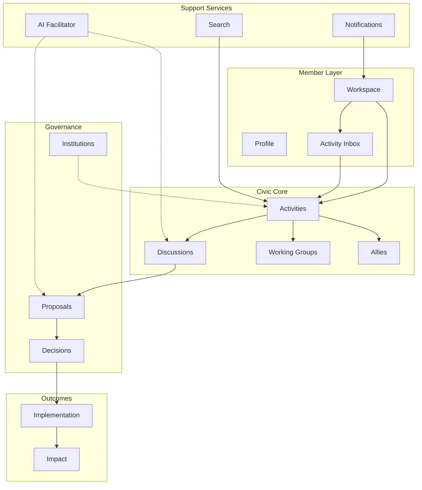
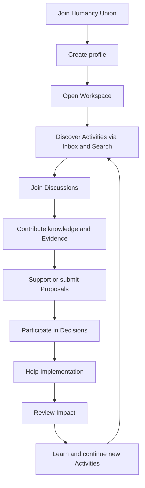
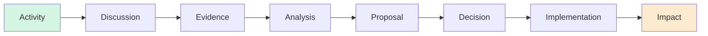
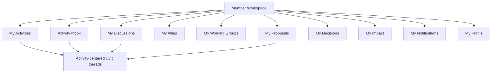
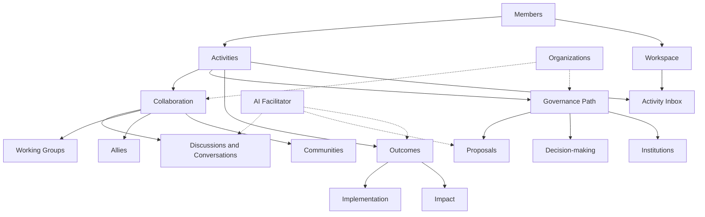

# Humanity Union Platform Overview

## Version 1.0

### Official Product Description of the Humanity Union Digital Platform

---

# About This Document

Humanity Union has completed its architectural design. Engineering architecture has been approved. Integration review confirmed that the Activity-centered vision is fully compatible with the approved architecture.

This document is the **official product overview** of Humanity Union.

| This document **is** | This document **is not** |
|----------------------|--------------------------|
| A human-readable description of the platform | An engineering specification |
| For founders, volunteers, designers, partners, and contributors | An implementation guide |
| Consistent with approved Blueprint and architecture | A legal document |

**References (not modified by this document):** Blueprint, Engineering Architecture (`00`–`11`), Integration Review, Activity Integration Blueprint, Validation, and Architecture Decision Records.

---

# Section 1 — What Is Humanity Union?

**Humanity Union is a global civic collaboration platform** where people, communities, and organizations work together to solve real-world problems.

It is not designed as passive social media — a place to scroll, react, and forget. It is designed for **meaningful participation**: joining civic work, contributing knowledge, making decisions together, carrying out agreed actions, and measuring what changed as a result.

Humanity Union helps people move from **concern** to **conversation**, from **ideas** to **decisions**, and from **decisions** to **measurable impact** — with transparency, accountability, and respect for human dignity throughout.

The platform serves local communities and global cooperation alike: neighborhood clean-ups, research collaborations, policy discussions, humanitarian response, educational campaigns, and institutional governance can all live on the same foundation — organized around what people actually *do*, not merely what they *view*.

---

# Section 2 — The Main Idea

## Core philosophy

**People do not come merely to consume information. People come to participate.**

Humanity Union is built on a simple civic chain:

```text
Everything begins with an Activity.
        ↓
Activities generate collaboration.
        ↓
Collaboration produces solutions.
        ↓
Solutions become real-world impact.
```

An **Activity** is a meaningful act of civic participation — recorded permanently so that civic work remains traceable, accountable, and learnable over time. Activities are not notifications, likes, or casual messages. They are the starting point for serious cooperative work.

When people participate in Activities, they naturally need to **think together** (Discussions), **organize** (Working Groups and Allies), **formalize change** (Proposals and Decisions), **carry out agreed work** (Implementation), and **understand results** (Impact).

The platform exists to support that full journey — peacefully, transparently, and democratically.

---

# Section 3 — The Member Experience

This section describes the journey of a **Member** — a registered participant in Humanity Union — in plain language.

## The complete journey

```text
Joining Humanity Union
        ↓
Creating a profile
        ↓
Receiving a personal Workspace
        ↓
Discovering relevant Activities
        ↓
Joining Discussions
        ↓
Contributing knowledge
        ↓
Supporting Proposals
        ↓
Participating in Decisions
        ↓
Helping Implementation
        ↓
Measuring Impact
```

## Every stage explained

### Joining Humanity Union

A person creates an account and becomes a Member — a participant with the ability to join civic work according to platform rules. Guests may observe public content; Members may act.

### Creating a profile

Members present themselves and configure how they participate: public information, areas of civic responsibility, and preferences for what kind of work deserves their attention. Trust and verification may strengthen identity over time — verification supports trust; it does not by itself grant governance authority.

### Receiving a personal Workspace

Each Member receives a **Workspace** — a private home for civic work. It is not a social feed or a vanity profile. It is where the Member returns to see what matters, what requires action, and what they are responsible for.

### Discovering relevant Activities

Through the **Activity Inbox**, Search, and Workspace overview, Members find Activities aligned with their interests and declared civic responsibility — local issues, campaigns, volunteer opportunities, research, policy work, and more.

### Joining Discussions

When civic work requires collective thinking, **Discussions** open. Members contribute comments, questions, evidence, and suggestions in structured deliberation — not unstructured chat.

### Contributing knowledge

Members share **Evidence** (sources and findings), **Analysis** (interpretation of facts and trade-offs), and reasoned perspectives. Good civic work grounds decisions in reviewable information.

### Supporting Proposals

When ideas mature, a **Proposal** formalizes a request for change — policy, resource allocation, institutional action, or community initiative. Members may support, object, co-sponsor, or refine Proposals through governed processes.

### Participating in Decisions

Communities and authorized bodies **Decide** — approve, reject, or return work for revision. Decision-making belongs to people and governed processes, not algorithms.

### Helping Implementation

Approved Decisions lead to **Implementation** — coordinated execution with tasks, commitments, and accountability.

### Measuring Impact

**Impact** documents what actually changed: outcomes, consequences, lessons learned. Impact closes the loop and informs future civic work and institutional memory.

Not every Activity travels the full path. A one-day volunteer action may stop after participation and a short Discussion. A major policy initiative may traverse every stage. The platform supports both.

---

# Section 4 — The Platform Structure

Humanity Union is one unified platform made of cooperating parts. Each part has a clear purpose.

| Part | Purpose (in plain language) |
|------|------------------------------|
| **Workspace** | The Member’s personal home for organizing civic participation |
| **Activities** | Permanent records of meaningful civic acts — the center of the platform |
| **Discussions** | Structured spaces where people deliberate, share evidence, and refine understanding |
| **Institutions** | Formal civic structures for continuing responsibility when temporary groups are not enough |
| **Working Groups** | Temporary teams organized around a specific objective |
| **Proposals** | Formal requests for governed change, prepared for review and decision |
| **Decision Making** | Human authority processes that approve, reject, or return Proposals |
| **Implementation** | Carrying out what was decided — tasks, coordination, accountability |
| **Impact** | Measuring and documenting real-world results |
| **Profile** | Who the Member is, how they present themselves, and how they configure participation |
| **Search** | Finding public civic work, people, and institutions the Member is authorized to discover |
| **Notifications** | Alerts that something happened — delivered through chosen channels |
| **Activity Inbox** | The Member’s working feed — what civic work deserves attention *now* |
| **AI Facilitator** | Intelligent assistance that helps Members understand and organize work — never decides for them |

Together, these parts form one ecosystem. They are not separate products bolted together.

---

# Section 5 — Activity as the Platform Center

## Why Activity is the natural starting point

Every important civic story on Humanity Union begins with an **Activity**: someone did something meaningful in a civic context. Activities answer the questions that matter for accountability:

- Who participated?
- What happened?
- In what context?
- What visibility and responsibility apply?

Activities **connect** Discussions, Groups, Proposals, Decisions, Implementation, and Impact into one traceable thread. When a Member opens an Activity, they see where civic work stands and what may come next.

## Examples

| Real-world work | How Activity connects the platform |
|-----------------|-------------------------------------|
| **Community project** | Activity anchors the project; Discussions refine it; Groups may coordinate; Proposals may seek resources |
| **Volunteer campaign** | Activity records participation; Inbox surfaces shifts and tasks |
| **Petition-like civic request** | Activity tracks participation; may mature into formal Proposal |
| **Research initiative** | Activity + Evidence-rich Discussion; Analysis contributions accumulate |
| **Environmental action** | Activity links campaigns, Decisions, Implementation, and Impact over time |
| **Educational program** | Activity records program participation; public Discussion and Search support outreach |
| **Emergency response** | Activity with appropriate visibility; rapid collaboration and Implementation paths |

Activity **coordinates** the platform experience. It does not replace Discussions, Institutions, or Decisions — it **links** them into one coherent civic narrative.

---

# Section 6 — Collaboration

Humanity Union is built for **how people work together** — openly, respectfully, and with clear boundaries.

## Discussions

The universal model for deliberation. Public debate, group review, evidence examination, and proposal refinement all happen in Discussions — with typed contributions (comments, questions, evidence, suggestions, analysis) rather than unstructured messaging.

## Conversations

Focused collaborative dialogue — often among Allies or within a Working Group on an active task. **Conversations are a form of Discussion**, not a separate messaging product. They support practical cooperation without losing accountability.

## Allies

Trusted collaborative relationships between Members — friends, experts, local teammates, or partners working within agreed boundaries. Allies enable restricted collaboration and visibility without turning civic work into a popularity contest.

## Working Groups

Temporary teams with a defined objective: draft a proposal, coordinate a campaign, respond to an emergency, prepare an institution review. Groups close when their objective is met; history is preserved.

## Communities

Groups of people affected by or concerned with an issue — neighborhoods, regions, identity communities, stakeholder groups. Communities participate through Activities and Discussions; affected perspectives inform legitimacy of Proposals and Decisions.

## Organizations

NGOs, institutions, businesses, and international bodies may participate as organizational actors within platform rules — contributing evidence, joining Working Groups, supporting Implementation, or operating Institutions where appropriate — without replacing Member agency or democratic process.

---

# Section 7 — Decision Making

Ideas on Humanity Union evolve through a **governed civic path**. Not every thread follows every step, but the platform supports the full journey:

```text
Discussion
    ↓
Evidence
    ↓
Analysis
    ↓
Proposal
    ↓
Decision
    ↓
Implementation
    ↓
Impact
```

## Every stage

| Stage | What happens |
|-------|--------------|
| **Discussion** | People explore the issue, ask questions, and surface disagreement constructively |
| **Evidence** | Verifiable information, sources, and findings are shared and challenged |
| **Analysis** | Participants interpret facts, trade-offs, and implications — structured reasoning, not opinion alone |
| **Proposal** | A formal request for change is submitted for governed review |
| **Decision** | Authorized humans approve, reject, or return the Proposal — voting where rules require it |
| **Implementation** | Approved work is executed with clear responsibility |
| **Impact** | Results and consequences are documented — what worked, what did not, what was learned |

This path protects against **conversation without action** and **action without accountability**. Reasoning is preserved; outcomes are attributable; impact is measurable.

---

# Section 8 — The Role of AI

Artificial intelligence on Humanity Union is a **helper**, not a ruler.

## What AI does

AI assists Members throughout civic work, for example:

- **Summaries** of long Discussions
- **Finding related Activities** and prior civic work
- **Duplicate detection** among similar Proposals
- **Translation** and multilingual access
- **Knowledge assistance** — organizing evidence, highlighting gaps
- **Impact reporting** support — consolidating findings for human review

## What AI never does

AI **never**:

- votes or approves on behalf of Members
- creates Institutions or Decisions autonomously
- replaces human accountability
- hides that it is assisting (transparency is required)
- optimize for engagement or outrage over civic purpose

**AI helps Members. AI never replaces Members.**

---

# Section 9 — Personal Workspace

## Purpose of Workspace

The **Workspace** is the Member’s home on Humanity Union — one place to organize participation instead of hunting across disconnected pages.

Blueprint principle: Workspace helps Members **act on responsibility**, not accumulate information.

## What lives in Workspace

| Area | What it gives the Member |
|------|---------------------------|
| **Activity Inbox** | What requires attention now — filtered for relevance and responsibility |
| **My Activities** | Civic work I created, joined, or am accountable for |
| **My Discussions** | Deliberation I participate in |
| **My Allies** | Trusted collaborators and pending requests |
| **My Working Groups** | Teams I belong to and their recent work |
| **My Proposals** | Formal requests I steward, support, or follow |
| **My Decisions** | Decisions awaiting my review or participation (where authorized) |
| **My Impact** | Outcomes linked to work I was part of |
| **My Notifications** | Alerts that something happened |
| **My Profile** | Presentation, responsibility settings, and participation preferences |

## Why everything is in one place

Civic work is interconnected. A local water initiative may involve a Discussion, a Working Group, a Proposal, a Decision, volunteer Implementation, and an Impact report. Gathering these in Workspace lets Members **see the whole story** without losing the thread — while Activity remains the anchor that ties it together.

---

# Section 10 — The Values of Humanity Union

Platform design reflects civic values. These principles influence what Humanity Union enables — and what it refuses to optimize for.

| Value | How it shapes the platform |
|-------|----------------------------|
| **Participation** | Meaningful action is recorded and valued over passive consumption |
| **Transparency** | Civic reasoning and outcomes remain examinable by default |
| **Responsibility** | Members declare scope and capacity; attention routing respects declared responsibility |
| **Respect** | Dissent is preserved; disagreement is structured, not erased |
| **Evidence** | Deliberation can be grounded in reviewable information |
| **Constructive dialogue** | Communication serves cooperation and decision-making — not outrage |
| **Democratic collaboration** | Authority follows governed process; humans decide |
| **Human dignity** | No dehumanizing metrics; no popularity contests as civic authority |
| **Peaceful cooperation** | The platform supports non-violent civic problem-solving at scale |

Humanity Union does not promise perfect outcomes. It promises **honest process**, **traceable participation**, and **room for diverse voices** within shared rules.

---

# Section 11 — Who the Platform Is For

Humanity Union is for anyone committed to **cooperative civic problem-solving** within platform principles.

| Audience | How they participate |
|----------|----------------------|
| **Citizens** | Join Activities, Discussions, Proposals, and Decisions on issues they care about |
| **Communities** | Coordinate local initiatives, surface affected perspectives, measure Impact |
| **NGOs** | Contribute evidence, join Working Groups, support Implementation, operate within mandates |
| **Researchers** | Share findings as Evidence, participate in Analysis, link research to civic questions |
| **Educators** | Run educational Activities and programs; facilitate informed Discussions |
| **Volunteers** | Record meaningful participation; join campaigns and Implementation tasks |
| **Governments** | Participate where policy permits — transparency, consultation, institutional interfaces |
| **Businesses** | Contribute within ethical boundaries — not as replacement for democratic process |
| **International organizations** | Coordinate cross-border civic work, humanitarian response, and shared standards |

Guests may observe public civic content. Members act. Institutions and organizations participate within defined roles and permissions — **without** replacing individual Member agency at the core.

---

# Section 12 — The Humanity Union Ecosystem

Everything on Humanity Union belongs to **one unified ecosystem** — not a collection of unrelated apps.

```text
                    ┌─────────────────────────────────┐
                    │         MEMBERS                  │
                    │  (people who participate)          │
                    └───────────────┬─────────────────┘
                                    │
                    ┌───────────────▼─────────────────┐
                    │         ACTIVITIES               │
                    │  (center of civic participation) │
                    └───────────────┬─────────────────┘
                                    │
        ┌───────────────────────────┼───────────────────────────┐
        │                           │                           │
        ▼                           ▼                           ▼
  DISCUSSIONS              WORKING GROUPS              INSTITUTIONS
  ALLIES                   COMMUNITIES                 ORGANIZATIONS
        │                           │                           │
        └───────────────────────────┼───────────────────────────┘
                                    │
                    ┌───────────────▼─────────────────┐
                    │   PROPOSALS → DECISIONS          │
                    │   IMPLEMENTATION → IMPACT        │
                    └───────────────┬─────────────────┘
                                    │
                    ┌───────────────▼─────────────────┐
                    │   AI (assistance)                │
                    │   SEARCH · INBOX · NOTIFICATIONS │
                    └─────────────────────────────────┘
```

**Members** participate in **Activities**. Activities spark **Discussions** and **collaboration** (Allies, Working Groups, communities, organizations). Mature work enters **Proposals** and **Decisions**. Approved work moves to **Implementation** and **Impact**. **AI**, **Search**, **Inbox**, and **Notifications** support the journey — they do not replace human judgment.

Institutions provide **continuing governance** when temporary groups are insufficient. Communities and organizations enrich participation — they do not split the platform into competing silos.

---

# Section 13 — Platform Principles

These principles define what Humanity Union **is**:

1. **There is only one Humanity Union Platform.**  
   No parallel systems. No duplicate civic worlds. One architecture, one civic foundation.

2. **Activity is the center of participation.**  
   Meaningful civic work starts with Activities and remains traceable through them.

3. **Workspace is the Member’s home.**  
   Personal organization, attention, and navigation live here.

4. **Discussions connect people.**  
   Universal deliberation — public, allied, group, or focused Conversation — replaces fragmented messaging.

5. **Institutions provide governance.**  
   Continuing structures when persistent responsibility exceeds temporary collaboration.

6. **AI provides assistance.**  
   Intelligent help at every stage — never authority, never replacement for human decision.

7. **Impact is the final goal.**  
   Civic work should lead to measurable positive change — and honest learning when results differ from hopes.

---

# Section 14 — Final Summary

**Humanity Union is a global civic collaboration platform where people transform ideas into measurable positive impact through organized Activities, open collaboration, and democratic decision-making.**

Members do not need to master a maze of separate tools. They participate in Activities. The platform guides them — with transparency, evidence, and respect — from first engagement to real-world results.

One platform. One civic journey. One commitment to peaceful, responsible cooperation.

---

# Platform Diagrams

## Diagram 1 — Complete Platform Structure



## Diagram 2 — Member Journey



## Diagram 3 — Activity Lifecycle



## Diagram 4 — Workspace Structure



## Diagram 5 — Humanity Union Ecosystem



---

# Executive Summary

Humanity Union is a **global civic collaboration platform** designed for meaningful participation — not passive social networking. Approved engineering architecture and integration review confirm that the platform evolves around **Activity** as the natural center of user experience while preserving all existing design: Workspace, Discussions, Institutions, Working Groups, Proposals, Decisions, Implementation, Impact, Notifications, Search, and advisory AI.

Members receive a personal **Workspace** and **Activity Inbox** to focus on civic work that matters. They collaborate through **Discussions** (including focused **Conversations**), **Allies**, and **Working Groups**. Ideas mature through **Evidence** and **Analysis** into **Proposals** and **Decisions**, then **Implementation** and **Impact**. **AI** assists throughout but never governs.

There is **one platform**, one ecosystem, one commitment to transparency, responsibility, and democratic collaboration.

---

# Key Platform Principles

| # | Principle |
|---|-----------|
| 1 | One Humanity Union Platform — no parallel civic systems |
| 2 | Participation over passive consumption |
| 3 | Activity as the center of civic participation |
| 4 | Workspace as the Member’s operational home |
| 5 | Discussion as universal collaboration — Conversation included |
| 6 | Governed path from idea to Decision to Implementation |
| 7 | Impact as the measure of real-world change |
| 8 | AI assists — humans decide |
| 9 | Transparency, evidence, and preserved dissent |
| 10 | Peaceful, dignified, democratic cooperation |

---

# Target Audiences

| Audience | Primary value |
|----------|---------------|
| **Founders & leaders** | One coherent civic platform vision aligned with approved architecture |
| **Volunteers & citizens** | Clear path from joining to impact |
| **Designers & UX contributors** | Activity-centered experience map without engineering jargon |
| **Partners & NGOs** | Defined roles in collaboration and governance |
| **Organizations & institutions** | Continuing governance within platform principles |
| **Developers & contributors** | Product context before implementation — engineering docs remain authoritative for build |
| **Educators & researchers** | Evidence-based deliberation and measurable outcomes |

---

# Core Components

| Component | Role in one sentence |
|-----------|----------------------|
| **Activity** | Records meaningful civic participation — the platform’s starting point |
| **Workspace** | Member’s private home for organizing civic work |
| **Activity Inbox** | Working feed of what deserves attention now |
| **Discussion** | Structured deliberation including Conversations |
| **Allies & Working Groups** | Trusted and team-based collaboration |
| **Proposal & Decision** | Formal change and human authority |
| **Implementation & Impact** | Execution and documented results |
| **Institution** | Continuing civic structures for persistent responsibility |
| **Notification** | Alerts that something happened |
| **Search** | Discovery of authorized public civic content |
| **AI Facilitator** | Advisory assistance across the lifecycle |
| **Profile & responsibility settings** | How the Member participates and what they prioritize |

---

# Platform Philosophy

Humanity Union believes that **global problems require cooperative civic action at scale** — and that such action requires more than comments and clicks. It requires **traceable participation**, **open deliberation**, **governed decisions**, **accountable execution**, and **honest measurement of impact**.

The platform refuses to optimize for outrage, virality, or anonymous mob rule. It optimizes for **purpose**, **evidence**, **responsibility**, and **peaceful progress**.

Activity-centered design makes this philosophy **visible** to every Member: you are not lost in modules — you are on a civic journey with a clear thread from participation to impact.

---

# Future Evolution

Humanity Union’s architecture is **approved and release-ready**. Future evolution will occur through **controlled improvement** — not platform replacement:

| Direction | Nature |
|-----------|--------|
| **Activity-centered UX** | Deeper Workspace and Inbox integration — experience evolution per Integration Blueprint |
| **Initiative presentation** | Clearer grouping of related civic work — product mapping, not new platform |
| **Richer AI assistance** | More contextual facilitation — always advisory (ADR-005) |
| **Broader discovery & translation** | Search and multilingual access for global cooperation |
| **Institutional maturity** | More institutions operating within governed mandates |
| **Impact learning** | Stronger feedback from Impact into future Activities and Institutional Memory |

Engineering changes follow Architecture Decision Records. Product evolution follows Blueprint authority. **The foundation remains one platform, Activity-centered, democratically governed.**

---

**Document:** Platform Overview  
**Version:** 1.0  
**Status:** Official Product Description  
**Date:** 2026-07-21  
**Audience:** All stakeholders — no engineering knowledge required  
**Consistency:** Blueprint, Engineering Architecture, Integration Review, Activity Integration Blueprint  
**Does not modify:** Any approved architecture or engineering document
