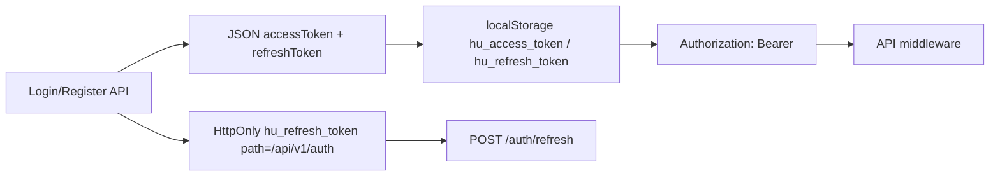
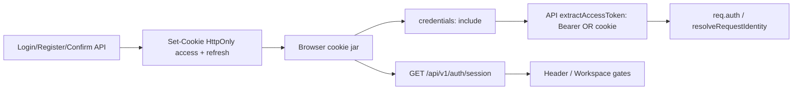

# Launch Readiness Pack 07 — Authentication & Session Hardening

**Status:** Complete (auth transport hardening; no identity/authorization redesign; no PWA)  
**Date:** 2026-08-12  
**Scope:** Move browser auth credentials out of `localStorage` into HttpOnly cookies; CORS/CSRF/origin alignment; session probe; Web client credentials model  
**Non-goals:** New IdP, capability redesign, Admin Console, PWA, full Security Pack (CSP/HSTS audit)

---

## 1. Previous flow (BEFORE)



- Access JWT was **JS-readable** in `localStorage` (XSS-exfiltratable).
- Refresh existed both as localStorage **and** HttpOnly cookie.
- Web `useClientAuthStatus` inferred auth from token presence.
- Pending confirmation / login two-step tokens also lived in `sessionStorage`.
- API tests used Bearer; CORS already `credentials: true` with configured origin.

---

## 2. New canonical session architecture (AFTER)



- **Browser normal operation:** no JS-readable auth JWT.
- **Compatibility:** JSON `tokens` still returned for non-browser clients/tests; Web **ignores** and does not persist.
- **Bearer still accepted** for API tests and non-browser clients.

---

## 3. Cookie name / attributes

| Cookie | Name | HttpOnly | Secure | SameSite | Path | Max-Age |
|---|---|---|---|---|---|---|
| Access | `hu_access_token` (override `AUTH_ACCESS_COOKIE_NAME`) | yes | production only | `Lax` | `/` | access JWT TTL (default 15m) |
| Refresh | `hu_refresh_token` (override `AUTH_REFRESH_COOKIE_NAME`) | yes | production only | `Lax` | `/` | refresh JWT TTL (default 7d) |
| Pending confirmation | `hu_pending_confirmation` | yes | production | `Lax` | `/api/v1/auth` | pending TTL |
| Pending login 2FA | `hu_pending_login_two_step` | yes | production | `Lax` | `/api/v1/auth` | challenge TTL |

- **No `Domain` attribute** (host-only) — API host owns cookies (`api.huws.org` / `localhost:4000`).
- **`__Host-` prefix not forced** — requires `Secure` + path `/` + no Domain; local http://localhost cannot use `__Host-` without breaking dev. Documented for future same-origin HTTPS termination.

---

## 4. Login / logout / lifetime

**Login:** credentials → server issues JWT pair → `Set-Cookie` access+refresh → Web calls `acceptBrowserSession()` (clears legacy storage, dispatches auth event) → Workspace redirect unchanged.

**Logout:** revoke refresh session when possible → clear access+refresh (+ legacy refresh path) + pending cookies → Web clears legacy keys + auth event.

**Lifetime:**

| Kind | Value |
|---|---|
| Access absolute | JWT `JWT_ACCESS_EXPIRES_IN` (default 15m) + cookie Max-Age |
| Refresh absolute | JWT `JWT_REFRESH_EXPIRES_IN` (default 7d) + cookie Max-Age + Mongo session hash |
| Idle lifetime | Not separately implemented (refresh rotation on use) |
| Refresh rotation | Existing Mongo hash rotation retained |

---

## 5. JWT / refresh decision

- JWT access + rotating refresh **retained** (no new session DB rewrite).
- Browser stores both only in HttpOnly cookies.
- Claims unchanged: `sub`, `memberId`, `role`, `displayName`, `email`, `type`.
- Revocation: refresh session revoke on logout / password reset / revoke-all; access JWT remains short-lived (stateless limitation documented).

---

## 6. Server identity / API client / SSR

- Identity: `extractAccessToken` → Bearer **or** access cookie → `verifyAccessToken` → `req.auth`. `resolveRequestIdentity` unchanged.
- Web `apiRequest`: always `credentials: "include"`; **no** Authorization from storage.
- Media upload / shared document download: cookie credentials.
- SSR: no new RSC cookie-forwarding layer this Pack (Workspace gates remain client UX + API authority). Authenticated RSC reads remain guest unless cookies are forwarded in a future Pack.

---

## 7. Session endpoint

`GET /api/v1/auth/session` (optional auth):

```json
{ "authenticated": true|false, "user": AuthUserPublic|null, "authSource": "cookie_or_bearer"|"none" }
```

Never returns JWT/cookie values. `GET /auth/me` remains for authenticated profile load.

---

## 8. CSRF / Origin / CORS / topology

| Control | Decision |
|---|---|
| SameSite | `Lax` — appropriate for same-site Web↔API (`huws.org` + `api.huws.org`, or `localhost:3000` + `localhost:4000`) |
| CORS | `origin: CORS_ORIGIN|WEB_ORIGIN` (exact), `credentials: true` — never `*` |
| Origin guard | State-changing requests with `Origin` header must match configured Web origin (`AUTH_ORIGIN_FORBIDDEN`) |
| CSRF token library | Not added — SameSite+Origin+CORS suffice for current topology |

**Recommended production topology:**

- `https://huws.org` (Web)
- `https://api.huws.org` (API)
- Configure `CORS_ORIGIN=https://huws.org`, `WEB_ORIGIN=https://huws.org`
- Host-only cookies on API host; browser sends them on credentialed API calls

Cross-site embedding of the API with credentials is intentionally blocked.

---

## 9. XSS impact

HttpOnly prevents `document.cookie` / JS from reading auth JWTs — XSS can no longer trivially exfiltrate tokens from `localStorage`.

XSS can still cause **authenticated actions** in the victim browser. CSP and broader XSS hardening remain for the Security & Privacy Pre-Launch Audit.

---

## 10. Legacy localStorage migration

On any token-store touch / login / logout / refresh failure:

- Remove `hu_access_token`, `hu_refresh_token`
- Remove legacy pending token keys from sessionStorage
- Do **not** convert old tokens into cookies client-side

Users with only old localStorage sessions must **log in again** after deploy (acceptable).

---

## 11. Logging / errors

- No new logging of cookies, Authorization, passwords, or reset tokens.
- Auth failures remain calm 401/403 envelopes without JWT internals.

---

## 12. Feature compatibility

| Surface | Result |
|---|---|
| Registration / email confirmation | Cookie pending session; Web ignores JSON pending token |
| Password reset | Clears session cookies; policy unchanged |
| Assistant | Cookie identity via `apiRequest`; transcript stays sessionStorage (non-credential) |
| Messages / Notifications | Cookie auth; no storage gates |
| Publishing / Editorial | Capability resolver unchanged; cookie identifies Participant |
| Admin Foundation Pack 02 | Unchanged |
| Uploads / downloads | Cookie credentials |
| WebSocket / SSE | N/A (polling only) |
| Rate limits | Retained on login/register/reset/confirmation; refresh still without IP limiter (documented residual) |

---

## 13. Development mode

- Local `http://localhost`: cookies without `Secure`
- Production: `Secure` required
- Do not weaken production Secure for local convenience

---

## 14. Remaining security work (out of Pack)

| ID | Severity | Item |
|---|---|---|
| S-01 | MEDIUM | Forward cookies on authenticated Next RSC fetches where needed |
| S-02 | MEDIUM | Rate-limit `/auth/refresh` |
| S-03 | MEDIUM | Full CSP / HSTS / frame / referrer Security Pack |
| S-04 | LOW | Consider `__Host-` prefix under pure HTTPS same-host reverse proxy |
| S-05 | LOW | Stop returning JSON tokens entirely once non-browser clients migrate |

**BLOCKER for Pack completion:** active localStorage auth credentials — **resolved**.

---

## 15. Validation

| Gate | Result |
|---|---|
| `pnpm typecheck` | PASS |
| `pnpm lint` | PASS |
| `pnpm build` | PASS |
| Pack 07 API unit tests | **15/15** PASS |
| Pack 07 Web tests | **5/5** PASS |
| Full Web regression | **273/273** PASS |
| Full API regression | **1644/1644** PASS |
| `git diff --check` | PASS |
| Isolated DB leftovers | **0** |
| Staged / committed | **None** |
| Production bundle | legacy keys only via `localStorage.removeItem` (cleanup), not `setItem` |
| Browser smoke | Login page guest; no `hu_access_token` / `hu_refresh_token` in localStorage |
